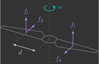
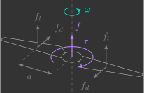
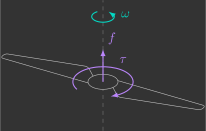

# Aerodinâmica

Para conseguir controlar um drone, é essencial primeiro entender a física por trás dele. Aqui, você vai aprender os conceitos básicos de aerodinâmica que explicam como o drone se mantém no ar.

---
    
## Aerofólio

O modelo matemático de um drone, qualquer que seja seu tipo, contém diversos parâmetros aerodinâmicos. No entanto, para obter o conhecimento necessário, começaremos examinando as forças aerodinâmicas em um aerofólio.

### Forças aerodinâmicas

A figura abaixo mostra a secção transversal de um aerofólio, um corpo teórico moldado para produzir sustentação quando colocado em um fluxo de ar.

{: width="400" style="display: block; margin: auto;" }

Apesar de um aerofólio ser projetado para produzir uma força desejada de sustentação $f_l$ (perpendicular à velocidade $v$), ele também produz uma força indesejada de arrasto $f_d$ (paralela à velocidade $v$):
$$
    f_l = \frac{1}{2} \rho A C_l v^2 
    \qquad
    f_d = \frac{1}{2} \rho A C_d v^2 
$$

Onde:

- $\rho$ - Densidade do ar ($kg/m^3$)
- $A$ - Área de superfície ($m^2$)
- $C_l$ - Coeficiente de sustentação (adimensional)
- $C_d$ - Coeficiente de arrasto (adimensional)
- $v$ - Velocidade linear do aerofólio ($m/s$)

### Coeficientes aerodinâmicos

Os coeficientes de sustentação e arrasto não são constantes, eles variam conforme as seguintes condições aerodinâmicas:

- Ângulo de ataque ($\alpha$), que é o ângulo que a linha média do aerofólio (também chamada de ``corda'') faz com o vetor velocidade
- Número de Reynolds ($\frac{\rho v D}{\mu}$), que é uma medida adimensional e define o regime de escoamento do ar (laminar ou turbulento)
- Número Mach ($\frac{v}{v_s}$), que é a razão entre a velocidade e a velocidade do som e define o regime de velocidade (subsônica, supersônica e hipersônica)

Para aerofólios que se movem a velocidades subsônicas ($<1.000km/h$), apenas o ângulo de ataque $\alpha$, representado na figura abaixo, acaba apresentando uma influência significativa.

{: width="400" style="display: block; margin: auto;" }

Há diversos perfils diferentes para um aerfofólio. Um bastante conhecido e utilizado é o perfil Clark Y, cujos coeficientes de arrasto e sustentação em função do ângulo de ataque são bem conhecidos e dados[^1] pelo gráfico abaixo.

[^1]: Assumindo que o número de Reynolds e o número Mach permaneçam dentro de uma determinada faixa de valores.

{: width=100% style="display: block; margin: auto;" }

Enquanto o coeficiente de arrasto só aumenta com o ângulo de ataque, o coeficiente de sustentação tem um ponto máximo ($\alpha=18^{\circ}$). Esse ponto é conhecido como "estol" ou simplesmente "perda de sustentação", e ele ocorre quando o fluxo de ar descola da asa (deixa de seguir o contorno superior da asa gerando uma turbulência). Note que o coeficiente de sustentação é nulo com uma leve inclinação negativa ($\alpha=-5^{\circ}$), e negativo abaixo disso.

!!! question "Exercício 1"

    Para consolidar esses conceitos, considere um drone de asas fixas (asa voadora) em cruzeiro, isto é, voando no plano com velocidade constante e as seguintes características[^2]:
    
    [^2]: Considere $g = 9,81\text{m/s}^2$ e $\rho = 1,225\text{kg/m}^3$
    
    - Massa de $40g$ e comprimento de $10cm$
    - Asas perfil Clark Y com $10cm$ de envergadura
    - Propulsores com $60\%$ de eficiência 
    - Bateria de $3,7V$ e $350mAh$
        
    ??? info "a) Desenhe o diagrama de corpo livre das forças que atuam nesse drone"

    ??? info "b) Determine a área total das asas do drone assumindo que seu corpo é triangular"
        $$
        \begin{align*}
            A &= \frac{10 \cdot 10}{2} \\
            A &= 50 \text{cm}^2
        \end{align*}
        $$

    ??? info "c) Determine os coeficientes de arrasto e sustentação das asas do drone"
        $$
        \begin{align*}
            C_l &= 0,35 \\
            C_d &= 0,02
        \end{align*}
        $$

    ??? info "d) Determine a velocidade do drone"
        $$
        \begin{align*}
            \sum f_y &= 0 \\
            f_l - f_p &= 0 \\
            \frac{1}{2} \rho A C_l v^2 - mg &= 0 \\
            v &= \sqrt{\frac{2mg}{\rho AC_l}} \\
            v &= \sqrt{\frac{2 \cdot 0,04 \cdot 9,81}{1,225 \cdot 50 \times 10^{-4} \cdot 0,35}} \\
            v &= 19,13 \text{m/s} \quad (\approx 69\text{km/h})
        \end{align*}
        $$

    ??? info "e) Determine a força de empuxo dos propulsores do drone"
        $$
        \begin{align*}
            \sum f_x &= 0 \\
            f_e - f_d &= 0 \\
            f_e - \frac{1}{2} \rho A C_d v^2  &= 0 \\
            f_e &= \frac{1}{2} \rho A C_d v^2 \\
            f_e &= \frac{1}{2} 1,225 \cdot 50 \times 10^{-4} \cdot 0,02 \cdot 19,13^2 \\
            f_e &= 0,0224 \text{N}
        \end{align*}
        $$
    
    ??? info "f) Determine o consumo energético do drone"
        $$
        \begin{align*}
            P_m &= f_e v \\
            P_m &= 0,0224 \cdot 19,13 \\
            P_m &= 0,429 \text{W}
        \end{align*}
        $$

        $$
        \begin{align*}
            \eta &= \frac{P_m}{P_e} \\
            P_e &= \frac{P_m}{\eta} \\
            P_e &= \frac{0,429}{0,6} \\
            P_e &= 0,715 \text{W}
        \end{align*}
        $$

    ??? info "g) Determine quanto tempo que o drone consegue permanecer no ar"
        $$
        \begin{align*}
            E &= P_e \Delta t \\
            e_s i_s &= P_e \Delta t \\
            \Delta t &= \frac{e_s i_s}{P_e} \\
            \Delta t &= \frac{3,7 \cdot ( 0,35 \cdot 3600)}{0,715} \\
            \Delta t &= 6.519 \text{s} \quad (\approx 1\text{h}49\text{min})
        \end{align*}
        $$
 
---

## Hélice

Uma hélice é composta por $n$ pás, onde cada pá pode ser interpretada como um aerofólio.

### Forças e torques aerodinâmicos

Quando a hélice rotaciona, surgem forças de sustentação e arrasto em cada uma de suas pás, conforme a figura abaixo.

{: width=400" style="display: block; margin: auto;" }

Onde:

- $d$ - Distância do centro de pressão ao eixo de rotação ($m$)
- $\omega$ - Velocidade angular da hélice ($rad/s$)

!!! question "Exercício 2"
    Determine as forças de sustentação $f_l$ e arrasto $f_d$ nas pás da hélice em função de sua velocidade angular
    ??? info "Resposta"
        $$
        \begin{align*}
            f_l &= \frac{1}{2} \rho A C_l v^2 \\ 
            f_l &= \frac{1}{2} \rho A C_l (\omega d )^2 \\
            f_l &= \frac{1}{2} \rho A C_l d^2 \omega^2 
        \end{align*}
        $$

        $$
        \begin{align*}
            f_d &= \frac{1}{2} \rho A C_d v^2 \\ 
            f_d &= \frac{1}{2} \rho A C_d (\omega d )^2 \\
            f_d &= \frac{1}{2} \rho A C_d d^2 \omega^2 
        \end{align*}
        $$

As forças de sustentação e arrasto em cada uma das pás podem ser representadas por uma única força de sustentação e torque de arrasto da hélice, conforme a figura abaixo.

{: width="400" style="display: block; margin: auto;" }

!!! question "Exercício 3"
    Determine a força de sustentação $f$ e torque de arrasto $\tau$ da hélice
    ??? info "Resposta"
        $$
        \begin{align*}
            f &= 2 f_l \\
            f &= 2 \left( \frac{1}{2} \rho A C_l d^2 \omega^2  \right) \\
            f &= \rho A C_l d^2 \omega^2 
        \end{align*}
        $$

        $$
        \begin{align*}
            \tau &= 2 \left( d f_d \right) \\ 
            \tau &= 2 \left( d \left( \frac{1}{2} \rho A C_d d^2 \omega^2 \right) \right) \\
            \tau &= \rho A C_d d^3 \omega^2 
        \end{align*}
        $$

Como todos os parâmetros são constantes e apenas a velocidade angular $\omega$ varia, a força de sustentação e torque de arrasto de uma hélice podem ser simplificados por:

$$
f = \underbrace{\rho A C_l d^2}_{k_l} \omega^2 
\qquad
\tau = \underbrace{\rho A C_d d^3}_{k_d} \omega^2 
$$

Onde:

- $k_l$ - Coeficiente de sustentação da hélice ($N.s^2/rad^2$)
- $k_d$ - Coeficiente de arrasto da hélice ($N.m.s^2/rad^2$)

### Constantes aerodinâmicas

Ou seja, apenas dois parâmetros definem a força e o torque que uma hélice produz, que dependem do quadrado de sua velocidade angular:

{: width="350" style="display: block; margin: auto;" }

$$
f = k_l \omega^2 
\qquad
\tau = k_d \omega^2 
$$

!!! question "Exercício 4"
    Com o auxílio de uma régua, estime[^3] as constantes aerodinâmicas das hélices do Bitcraze Crazyflie e anote elas abaixo. Assuma que a hélice pode ser aproximada a um perfil Clark Y com ângulo de ataque $\alpha = 5^\circ$, sendo a constante de sustentação igual, porém a constante de arrasto 10x maior[^4]. 

    [^3]: Estamos preocupados apenas com a ordem de grandeza dos resultados.
    [^4]: Devido à turbulência gerada pela hélice.

    ??? info "Resposta"
        $$
        \left\{
            \begin{align*}
                \rho &= 1,225 kg/m^3 \\
                A &= 2,5 \cdot 0,5 = 1,25 cm^2 \\
                d &= 1,5 cm \\
                C_l &= 0,7 \\
                C_d &= 0,04 \cdot 10 = 0,4 
            \end{align*}
        \right.
        $$
        
        $$
        \begin{align*}
            k_l &= \rho A C_l d^2\\
            k_l &= 1,225 \cdot (1,25 \cdot 10^{-4}) \cdot 0,7 \cdot (1,5 \times 10^{-2})^2 \\
            k_l &= 2,41 \times10^{-8} \text{N.s}^2\text{/rad}^2
        \end{align*}
        $$

        $$
        \begin{align*}
            k_d &= \rho A C_d d^3 \\
            k_d &= 1,225 \cdot (1,25 \cdot 10^{-4}) \cdot 0,4 \cdot (1,5 \times 10^{-2})^3 \\
            k_d &= 2,07 \times10^{-10} \text{N.m.s}^2\text{/rad}^2
        \end{align*}
        $$

Esses dois parâmetros serão determinados experimentalmente ([$k_l$](../identification/lift_constant.md) e [$k_d$](../identification/drag_constant.md)), e você verá que a chegará em valores muito próximos aos estimados acima.

!!! question "Exercício 5"

    Para consolidar esses conceitos, considere um drone multi-rotor (quadricoptero) pairando no ar, isto é, parado no espaço com as seguintes características[^2]:
        
    - Massa de $40g$
    - Hélices com constante de sustentação de $2,0\times10^{-8} \text{N}.\text{s}^2/\text{rad}^2$ e constante de arrasto de $2,0\times10^{-10} \text{N}.\text{m}.\text{s}^2\text{/rad}^2$
    - Motores elétricos com $90\%$ de eficiência 
    - Bateria de $3,7V$ e $350mAh$
        
    ??? info "a) Desenhe o diagrama de corpo livre das forças que atuam nesse drone"

    ??? info "b) Determine a velocidade angular das hélices do drone"
        $$
        \begin{align*}
            \sum f_y &= 0 \\
            4 f - f_w &= 0 \\
            4 k_l \omega^2 - mg &= 0 \\
            \omega &= \sqrt{\frac{mg}{4 k_l}} \\
            \omega &= \sqrt{\frac{0,04 \cdot 9,81}{4 \cdot (2,0\times10^{-8})}} \\
            \omega &= 2.215 \text{rad/s} \quad (\approx 21.149\text{rpm})
        \end{align*}
        $$

    ??? info "c) Determine o torque dos motores do drone"
        $$
        \begin{align*}
            \sum \tau &= 0 \\
            \tau_m - \tau_d &= 0 \\
            \tau_m - k_d \omega^2 &= 0 \\
            \tau_m &= k_d \omega^2 \\
            \tau_m &= 2,0 \times 10 ^{-10} \cdot 2215^2 \\
            \tau_m &= 0,000981 \text{N.m} \\
        \end{align*}
        $$
    
    ??? info "d) Determine o consumo energético do drone"
        $$
        \begin{align*}
            P_m &= 4 \tau_m \omega \\
            P_m &= 4 \cdot 0,000981 \cdot 2215 \\
            P_m &= 8,69 \text{W}
        \end{align*}   
        $$

        $$
        \begin{align*}
            \eta &= \frac{P_m}{P_e} \\
            P_e &= \frac{P_m}{\eta} \\
            P_e &= \frac{8,69}{0,9} \\
            P_e &= 9,66 \text{W}
        \end{align*}
        $$

    ??? info "e) Determine quanto tempo que o drone consegue permanecer no ar"
        $$
        \begin{align*}
            E &= P_e \Delta t \\
            e_s i_s &= P_e \Delta t \\
            \Delta t &= \frac{e_s i_s}{P_e} \\
            \Delta t &= \frac{3,7 (\cdot 0,35 \cdot 3600)}{9,66} \\
            \Delta t &= 483\text{s} \quad (\approx 8\text{min})
        \end{align*}
        $$

Compare este resultado, do drone multi rotor, com o anterior, do drone de asas fixa. Note como o drone de asa fixa consegue permanecer muito mais tempo no ar (>10x), com a desvatagem de não conseguir permanecer parado e nem decolar/pousar na vertical como um drone multi-rotor.