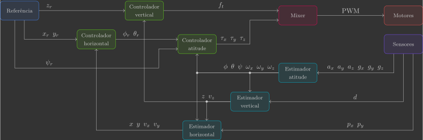

# :material-sitemap-outline: Arquitetura

Para controlar um drone, precisamos de uma arquitetura bem definida. Essa arquitetura estabelece como as informações dos sensores são processadas por estimadores, comparadas com as referências pelos controladores e, por fim, enviadas como comandos aos atuadores.

O diagrama abaixo resume essa sequência em blocos:

{: width=100% style="display: block; margin: auto;" }

No diagrama:

- Os blocos representam as funções que serão chamadas no loop principal.
- As setas representam as variáveis que fluem de um bloco a outro.

A passagem dessas informações entre as funções será feita por meio de variáveis globais(1), que atuarão como o “fio” que conecta os módulos do sistema.
{ .annotate }

1. Embora variáveis globais não sejam a melhor prática em programação, aqui adotamos essa solução para manter o código em C mais direto, evitando o excesso de ponteiros e semáforos. Como o foco do curso está na teoria de controle — e não em engenharia de software — essa escolha facilita a compreensão sem comprometer o aprendizado.

---

## Código base

### Bibliotecas

### Parâmetros e constantes

### Variáveis globais

Logo no início do código, declararemos as variáveis que representam os atuadores, sensores, entradas, estados e referências — espelhando o diagrama.

```c
// Actuators
float pwm1, pwm2, pwm3, pwm4; // Motors PWM

// Sensors
float ax, ay, az;             // Accelerometer [m/s^2]
float gx, gy, gz;             // Gyroscope [rad/s]
float d;                      // Range [m]
float px, py;                 // Optical flow [pixels]

// System inputs
float ft;                     // Thrust force [N]
float tx, ty, tz;             // Roll, pitch and yaw torques [N.m]

// System states
float phi, theta, psi;        // Euler angles [rad]
float wx, wy, wz;             // Angular velocities [rad/s]
float x, y, z;                // Positions [m]
float vx, vy, vz;             // Velocities [m/s]

// System references
float phi_r, theta_r, psi_r; // Euler angles reference [rad]
float x_r, y_r, z_r;         // Positions reference [m]
```

### Variáveis de registro

### Funções

### Loop principal

Toda a lógica de controle será implementada dentro de um loop que roda a 200 Hz (ou seja, a cada 5 ms). Dentro desse loop, chamamos as funções na sequência do diagrama: referências → sensores → estimadores → controladores → atuadores.

```c
// Main application task
void appMain(void *param)
{
    // Infinite loop (runs at 200Hz)
    while (true)
    {
        reference();                  // Read reference setpoints (from Crazyflie Client)
        sensors();                    // Read raw sensor measurements
        attitudeEstimator();          // Estimate orientation (roll/pitch/yaw) from IMU sensor
        verticalEstimator();          // Estimate vertical position/velocity from range sensor
        horizontalEstimator();        // Estimate horizontal positions/velocities from optical flow sensor
        horizontalController();       // Compute desired roll/pitch angles
        verticalController();         // Compute desired thrust force
        attitudeController();         // Compute desired roll/pitch/yaw torques
        mixer();                      // Convert desired force/torques into motor PWM
        motors();                     // Send commands to motors
        vTaskDelay(pdMS_TO_TICKS(5)); // Loop delay (5 ms)
    }
}
```

---

## Funções

### Referências

### Sensores

### Atuadores

### Estabilização

A implementação das demais funções será feita passo a passo, uma função por vez. Dessa forma, você poderá entender o papel de cada uma isoladamente antes de ver o sistema completo em ação.

{: width=100% style="display: block; margin: auto;" }

Nos próximas secções, começaremos pelo mixer e, em seguida, avançaremos para os estimadores e controladores. Cada subsistema será estudado aos pares — estimador e controlador de atitude, vertical (altura) e horizontal (posição no plano) - abrangendo diferentes conceitos da teoria de controle clássico e moderno numa sequência didática.

<div class="grid cards" markdown>

-   :material-power:{ .lg .middle } **Mixer**

    ---

    Implementamos uma transformação de coordenadas para trabalharmos com forças e torques aerodinâmicos como entrada do sistema ao invês de sinais PWM dos motores.

-   :material-rotate-orbit:{ .lg .middle } **Atitude**

    ---

    Estudamos filtros passa-baixa, passa-alta e o filtro complementar para fusão sensorial. A estabilização é feita com um controlador P–P em cascata, que atua sobre velocidade e ângulo, formando a base da malha mais rápida do sistema.

-   :material-pan-vertical:{ .lg .middle } **Vertical**

    ---

    Introduzimos o uso de observadores de estados de 1ª e 2ª ordem para estimar velocidade e posição vertical. Partimos de um controlador PD, que se transforma naturalmente em um PID ao lidar com o erro em regime permanente causado por distúrbios constantes, como a gravidade.

-   :material-pan-horizontal:{ .lg .middle } **Horizontal**

    ---

    Avançamos para um observador e regulador de estados ótimo. Mostramos que o LQE nada mais é do que um filtro de Kalman linear, enquanto o LQR equivale a um controlador PD com ganhos ideais. Quando utilizado em conjunto, integrando estimação e controle de maneira otimizada, temos o famoso LQG.

</div>
