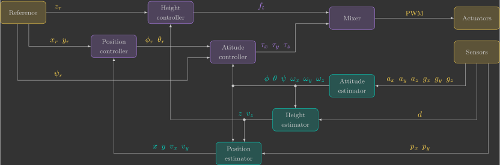
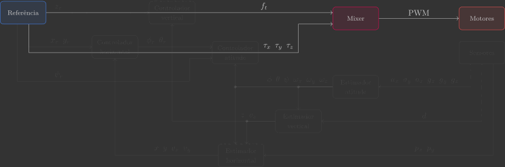

# :material-sitemap-outline: Architecture

To control a quadcopter, we need a well-defined architecture. This architecture specifies how sensor measurements are processed by estimators, compared with reference signals by controllers, and finally converted into commands sent to the actuators.

The diagram below summarizes this sequence using block representation:

{: width=100% style="display: block; margin: auto;" }

In the diagram:

- The blocks represent the functions that will be called inside the main loop.
- The arrows represent the variables flowing from one block to another.

The information exchange between these functions will be handled through global variables(1), which act as the “wires” connecting the system modules.
{ .annotate }

1. Although global variables are generally not considered best practice in software engineering, we adopt this approach here to keep the C code straightforward and avoid excessive pointers and semaphores. Since the focus of this course is control theory — not software architecture — this decision improves clarity without compromising learning.

---

## Source Code

To get started, create a file called `main.c` inside the `src/control` folder.  This file will be organized into three major parts, described below.

### Definitions

The first part contains all libraries, parameters, constants, and variables.

#### Libraries

At the top of the file, import all(1) required libraries:
{ .annotate }

1. Some of these libraries will only be used later, but we include them now to avoid revisiting this section repeatedly.

```c linenums="1"
#include "math.h"       // Math functions (e.g., sqrtf, roundf, powf)
#include "FreeRTOS.h"   // FreeRTOS core definitions (needed for task handling and timing)
#include "task.h"       // FreeRTOS task functions (e.g., vTaskDelay)
#include "supervisor.h" // Functions to check flight status (e.g., supervisorIsArmed)
#include "commander.h"  // Access to commanded setpoints (e.g., commanderGetSetpoint)
#include "estimator.h"  // Estimation framework for sensor fusion
#include "motors.h"     // Low-level motor control interface (e.g., motorsSetRatio)
#include "debug.h"      // Debug printing functions (e.g., DEBUG_PRINT)
#include "log.h"        // Logging utilities to send data to the CFClient
```

#### Parameters and Constants

Next, declare(1) the physical constants and quadcopter parameters:
{ .annotate }

1. We use `const` to ensure the value does not change at runtime. The `static` keyword restricts the variable’s visibility to the current file, preventing name conflicts in other compilation units. Together, `static const` defines immutable, file-scoped constants.

```c linenums="11"
// Physical constants
static const float pi = 3.1416f; // Mathematical constant
static const float g = 9.81f;    // Gravitational acceleration [m/s^2]
static const float dt = 0.005f;  // Loop time step [s] (5 ms -> 200 Hz)

// Quadcopter parameters
static const float l = 35.0e-3f;   // Distance from motor to quadcopter center of mass [m]
static const float m = 38.6e-3f;   // Mass [kg]
static const float Ixx = 20.0e-6f; // Moment of inertia around x-axis [kg.m^2]
static const float Iyy = 20.0e-6f; // Moment of inertia around y-axis [kg.m^2]
static const float Izz = 40.0e-6f; // Moment of inertia around z-axis [kg.m^2]
```

#### Global Variables

Then, declare the variables that flow from one block to another, mirroring the architecture diagram.

```c linenums="23"
// Actuators
float pwm1, pwm2, pwm3, pwm4; // Motors PWM

// Sensors
float ax, ay, az;             // Accelerometer [m/s^2]
float gx, gy, gz;             // Gyroscope [rad/s]
float d;                      // Range [m]
float px, py;                 // Optical flow [pixels]

// System inputs
float ft;                     // Thrust force [N]
float tx, ty, tz;             // Roll, pitch and yaw torques [N.m]

// System states
float phi, theta, psi;        // Euler angles [rad]
float wx, wy, wz;             // Angular velocities [rad/s]
float x, y, z;                // Positions [m]
float vx, vy, vz;             // Velocities [m/s]

// System references
float phi_r, theta_r, psi_r; // Euler angles reference [rad]
float x_r, y_r, z_r;         // Positions reference [m]
```

#### Logging Variables

Finally, define which of these variables will be logged so they can be sent to the Crazyflie Client and visualized in real time(1).
{ .annotate }

1. We use auxiliary variables for Euler angles because the Crazyflie Client expects angles in degrees rather than radians.

```c linenums="46"
// Auxiliary variables for logging Euler angles (CFClient uses degrees and not radians)
float log_phi, log_theta, log_psi;

// Logging group that stream variables to CFClient.
LOG_GROUP_START(stateEstimate)
LOG_ADD_CORE(LOG_FLOAT, roll, &log_phi)
LOG_ADD_CORE(LOG_FLOAT, pitch, &log_theta)
LOG_ADD_CORE(LOG_FLOAT, yaw, &log_psi)
LOG_ADD_CORE(LOG_FLOAT, x, &x)
LOG_ADD_CORE(LOG_FLOAT, y, &y)
LOG_ADD_CORE(LOG_FLOAT, z, &z)
LOG_ADD_CORE(LOG_FLOAT, vx, &vx)
LOG_ADD_CORE(LOG_FLOAT, vy, &vy)
LOG_ADD_CORE(LOG_FLOAT, vz, &vz)
LOG_GROUP_STOP(stateEstimate)
```

### Functions

The second part consists of the functions that will be called inside the main loop:

```c linenums="62"
// Send commands to motors
void actuators()
{
}

// Read raw sensor measurements
void sensors()
{
}

// Read reference setpoints (from Crazyflie Client)
void reference()
{
}

// Convert desired force/torques into motor PWM
void mixer()
{
}

// Estimate orientation (roll/pitch/yaw) from IMU sensor
void attitudeEstimator()
{
}

// Compute desired roll/pitch/yaw torques
void attitudeController()
{
}

// Estimate height (z) from range sensor
void heightEstimator()
{
}

// Compute desired thrust force
void heightController()
{
}

// Estimate position (x/y) from optical flow sensor
void positionEstimator()
{
}

// Compute desired roll/pitch angles
void positionController()
{
}
```

Notice that all functions are currently declared but left empty. This is intentional: we will implement them step by step, one function at a time. This approach allows you to clearly understand the role of each component before seeing the complete system running.

{: width=100% style="display: block; margin: auto;" }

#### Interface functions

In the next sections, we will begin by implementing the actuators, sensors and references functions, which form the interface between our code and the physical world. 

<div class="grid cards" markdown>

-   :material-fan:{ .lg .middle } **Actuators**

    ---

    We send PWM commands to the BLDC motor drivers and study safety mechanisms used to arm and disarm the motors.

-   :material-compass-outline:{ .lg .middle } **Sensors**

    ---

    We read raw measurements from the IMU, range sensor and optical flow sensor by consuming data from the firmware's internal sensor pipeline.


-   :material-knob:{ .lg .middle } **References**

    ---

    We send and receive setpoints transmitted wirelessly from the Crazyflie Client and learn how to access them from the firmware.

</div>


#### Stabilization functions

After that, we introduce the mixer and then move on to estimators and controllers, which are the core stabilization funcions. Each subsystem will be studied in pairs — attitude (orientation), height (altitude) and position (planar) — combining estimation and control concepts from both classical and modern control theory in a structured and pedagogically progressive sequence.

<div class="grid cards" markdown>

-   :material-equalizer:{ .lg .middle } **Mixer**

    ---

    We implement a coordinate transformation that allows us to work with aerodynamic forces and torques as system inputs instead of raw motor PWM signals.

-   :material-rotate-orbit:{ .lg .middle } **Attitude**

    ---

    We study low-pass filters, high-pass filters, and the complementary filter for sensor fusion. Stabilization is achieved using a cascaded P–P controller acting on angular velocity and angle, forming the fastest control loop in the system.

-   :material-altimeter:{ .lg .middle } **Height**

    ---

    We introduce first and second-order state observers to estimate it height. We start with a PD controller, which naturally evolves into a PID when compensating for steady-state error caused by constant disturbances such as gravity.

-   :material-crosshairs-gps:{ .lg .middle } **Position**

    ---

    We advance to optimal state estimation and regulation. We show that the LQE is simply a linear Kalman filter, while the LQR corresponds to a PD controller with optimal gains. When estimation and control are optimally integrated, we obtain the well-known LQG framework.

</div>

---

### Main Loop

The third and final part contains the main loop. All control logic is implemented inside a loop running at 200 Hz (i.e., every 5 ms(1)). Inside this loop, we call the functions following the architecture diagram sequence: reference → sensors → estimators → controllers → mixer → actuators.
{ .annotate }

1. In FreeRTOS, delays are implemented using the `vTaskDelay(pdMS_TO_TICKS(xTimeInMs))` function, which receives a time value in milliseconds and converts it to system ticks.

```c linenums="112"
// Main application task
void appMain(void *param)
{
    // Infinite loop (runs at 200Hz)
    while (true)
    {
        reference();                  // Read reference setpoints (from Crazyflie Client)
        sensors();                    // Read raw sensor measurements
        attitudeEstimator();          // Estimate orientation (roll/pitch/yaw) from IMU sensor
        heightEstimator();            // Estimate height (z) from range sensor
        positionEstimator();          // Estimate position (x/y) from optical flow sensor
        positionController();         // Compute desired roll/pitch angles
        heightController();           // Compute desired thrust force
        attitudeController();         // Compute desired roll/pitch/yaw torques
        mixer();                      // Convert desired force/torques into motor PWM
        actuators();                  // Send commands to motors
        vTaskDelay(pdMS_TO_TICKS(5)); // Loop delay (5 ms)
    }
}
```