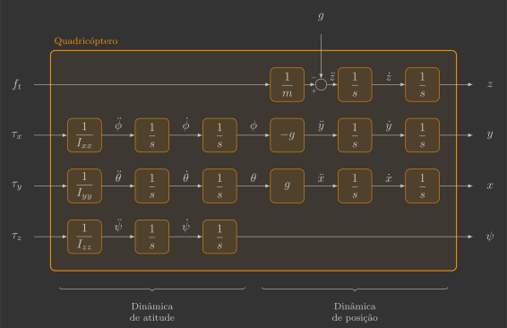

# Controlador de atitude

Nesta secção você irá implementar o controlador de atitude, que comanda os torques $\tau_x$, $\tau_y$ e $\tau_z$ a partir da diferença entre os ângulos de Euler de referência $\phi_r$, $\theta_r$ e $\psi_r$ e estimados $\phi$, $\theta$ e $\psi$.

{: width=100% style="display: block; margin: auto;" }

Para isto, será implementada uma nova função:

- `attitudeController()`

Além de uma alteração em uma função já previamente implementada:

- `reference()`

---

## Implementação

Para começar, copie e cole o arquivo `attitude_estimator.c` e renomeie ele para `attitude_controller.c`.

### Definições

#### Variáveis globais

Declare mais algumas variáveis globais, que são as referências dos ângulos de Euler que entram na função do controlador de atitude.

```c
// System references
float phi_r, theta_r, psi_r; // Euler angles reference [rad]
```

### Loop principal

Inclua no seu loop principal a chamada da função `attitudeController()` entre as funções `attitudeEstimator()` e `mixer()`.

```c hl_lines="10"
// Main application task
void appMain(void *param)
{
    // Infinite loop (runs at 200Hz)
    while (true)
    {
        reference();                  // Read reference setpoints (from Crazyflie Client)
        sensors();                    // Read raw sensor measurements
        attitudeEstimator();          // Estimate orientation (roll/pitch/yaw) from IMU sensor
        attitudeController();         // Compute desired roll/pitch/yaw torques
        mixer();                      // Convert desired force/torques into motor PWM
        actuators();                  // Send commands to motors
        vTaskDelay(pdMS_TO_TICKS(5)); // Loop delay (5 ms)
    }
}
```

### Funções

#### Referência

Os ângulos de Euler de referência $\phi_r$ e $\theta_r$ serão comandados pelo Command Based Flight Control do Crazyflie Client.

{: width=100% style="display: block; margin: auto;" }

Conforme vimos anteriormente: 

- Os botões `Up` / `Down` alteram a variável `setpoint.position.z` em incrementos de $0,5$
- Os botões `←` / `→` alteram a variável `setpoint.position.y` em incrementos de $0,5$
- Os botões `↑` / `↓` alteram a variável `setpoint.position.x` em incrementos de $0,5$

Vamos continuar utilizando os botões `Up` / `Down` para comandar a força total $f_t$ em incrementos de $0,01\,N$, mas agora os botões `↑` / `↓` e `←` / `→` vão comandar, respectivamente, os ângulos de Euler de referência $\theta_r$ e $\phi_r$ em incrementos de $\frac{\pi}{4} \text{rad}$ ($45^{\circ}$). Para tal, precisamos ajustar as escalas da seguinte forma:

[Figura]

Abaixo temos um exemplo de função `reference()` que faz isso:

```c
// Get reference setpoints from commander module
void reference()
{
    // Declare variables that store the most recent setpoint and state from commander
    static setpoint_t setpoint;
    static state_t state;

    // Retrieve the current commanded setpoints and state from commander module
    commanderGetSetpoint(&setpoint, &state);

    // Extract position references from the received setpoint
    ft =  (setpoint.position.z * 2.0f) / 100.0f;      // Thrust force command [N] (maps 0.5m -> 0.01N)
    phi_r = (setpoint.position.y * 2.0f) * pi/4.0f;   // Roll reference command [rad] (maps 0.5m -> pi/4 rad)
    theta_r = (setpoint.position.y * 2.0f) * pi/4.0f; // Pitch reference command [rad] (maps 0.5m -> pi/4 rad)
    psi_r = 0.0f;                                     // Yaw reference command [rad]
}
```

#### Controlador de atitude

A função `attitudeController()`, é quem comanda os torques a partir da diferença entre os ângulos de Euler de referência e estimados.

```c
// Compute desired torques
void attitudeController()
{ 
}
```

Assim como fizemos para o estimador de atitude, você começará implementando um controlador para apenas um ângulo e depois replicará o raciocínio para os demais. Já vimos que a dinâmica linearizada de um quadricóptero pode ser representada pelo diagrama de blocos abaixo:
    
{: width=100% style="display: block; margin: auto;" }

Como a dinâmica de atitude de cada eixo está desacoplada, é possível controlar cada uma delas individualmente com um controlador SISO (``Single-Input Single-Output''). Toda a técnica de controle explorada aqui será realizada para um único eixo, mas a mesma pode ser replicada para os demais eixos.
    
A dinâmica de atitude em torno do eixo $x$ pode ser representada pelas funções de transferência abaixo:

{: width=55% style="display: block; margin: auto;" }


Podemos cancelar o momento de inércia da planta de modo que a variável de controle seja a aceleração angular e não mais o torque, conforme abaixo:

{: width=67.5% style="display: block; margin: auto;" }
Isso reduz o sistema a ser controlado a um integrador duplo. Vamos detalhar três possíveis controladores para um sistema como esse, ficando a seu critério qual utilizar.

=== "Controlador PD"

    O controlador PD combina ações proporcional e derivativa para reagir tanto ao erro quanto à sua variação, oferecendo boa resposta e bom amortecimento. É simples de implementar e eficaz para o integrador duplo, mas sua sensibilidade ao ruído na derivada pode limitar o desempenho.


    {: width=100% style="display: block; margin: auto;" }

    XXX

    {: width=95% style="display: block; margin: auto;" }

=== "Controlador P em cascata"

    O controlador P em cascata utiliza duas malhas hierárquicas — uma interna e outra externa — o que melhora a estabilidade e o tempo de resposta. É intuitivo e robusto, mas requer ajuste cuidadoso entre as duas malhas para evitar oscilações.

    {: width=100% style="display: block; margin: auto;" }

    XXX

    {: width=95% style="display: block; margin: auto;" }

=== "Regulador de estados"

    O regulador de estados realimenta todas as variáveis do sistema e permite posicionar os polos em locais desejados do plano complexo, atendendo diretamente aos requisitos dinâmicos de desempenho. É o mais simples e preciso dos três em termos de sintonia e resposta, mas exige domínio do formalismo de espaço de estados.


    {: width=100% style="display: block; margin: auto;" }

    A dinâmica de atitude pode ser representada pelo seguinte sistema de equações diferenciais:

    $$
    \left\{
    \begin{array}{l}
        \begin{bmatrix}
        \dot{\phi} \\
        \ddot{\phi}
        \end{bmatrix}
        =
        \begin{bmatrix}
            0 & 1 \\
            0 & 0 
        \end{bmatrix}
        \begin{bmatrix}
            \phi \\
            \dot{\phi}
        \end{bmatrix}
        +
        \begin{bmatrix}
            0 \\
            \frac{1}{I_{xx}}
        \end{bmatrix}
        \tau_{\phi} \\ \\
        \phi = 
        \begin{bmatrix}
            1 & 0
        \end{bmatrix}
        \begin{bmatrix}
            \phi \\
            \dot{\phi}
        \end{bmatrix}
    \end{array}
    \right.
    $$

    Ou através da representação no espaço dos estados:
    
    {: width=90% style="display: block; margin: auto;" }
   
    Onde: 
    
    $$
    u = \tau_{\phi}
    \qquad
    x = 
    \begin{bmatrix}
        \phi \\
        \dot{\phi}
    \end{bmatrix}
    \qquad
    y = \phi
    \qquad
    A = 
    \begin{bmatrix}
        0 & 1 \\
        0 & 0 
    \end{bmatrix}
    \qquad
    B = 
    \begin{bmatrix}
        0 \\
        \frac{1}{I_{xx}}
    \end{bmatrix}
    \qquad
    C = 
    \begin{bmatrix}
        1 & 0 
    \end{bmatrix}
    $$

    Um regulador de estados consiste em realimentar todos os estados do sistema simultaneamente (ao invés de apenas a saída), conforme o diagrama de blocos abaixo:

    {: width=90% style="display: block; margin: auto;" }

    Onde:

    $$
    x_r = 
    \begin{bmatrix}
        \phi_r \\
        \dot{\phi}_r
    \end{bmatrix}
    \qquad
    K = I_{xx}
    \begin{bmatrix}
        k_p & k_d 
    \end{bmatrix}
    $$

    Para fazer uma analogia entre controle por realimentação do estados (controle moderno) e controle por realimentação da saída (controle clássico), vamos considerar um médico tratando um doente com febre alta:
       
    - Se o médico tratar o doente segundo os conceitos de controle clássico, ele vai medir a temperatura do paciente e vai dar um remédio para abaixar a febre quando ela estiver alta e não fazer nada quando a febre estiver baixa.
    - Se o médico tratar o doente segundo os conceitos de controle moderno, ele vai examinar o paciente, identificar a causa da febre e dar um remédio para a doença e não para a febre (ou seja, o médico vai tratar a doença eliminando a causa da febre e não somente o sintoma da doença).

    O grande problema do controle por realimentação dos estados é exigir que os estados do sistema estejam disponíveis para serem realimentados, ou seja, é necessário medir todos os estados do sistema ou pelo menos estimá-los (observador de estados).

    !!! question "Exercício 1"

        Como estamos aplicando um realimentação de estados do tipo:

        $$
            u = K \left( x_r - x \right)
        $$

        A dinâmica em malha fechada fica:

        $$
        \begin{align}
            \dot{x} &= Ax + Bu \\
            \dot{x} &= Ax + BK(x_r - x) \\
            \dot{x} &= \underbrace{(A-BK)}_{A_{mf}}x + \underbrace{BK}_{B_{mf}}x_r
        \end{align}
        $$
            
        ??? info "a) Determine a matriz de transmissão dos estados em malha fechada $A_{mf}$."
            $$
            \begin{align}
                A_{mf} &= A - BK \\
                A_{mf} &= 
                \begin{bmatrix}
                    0 & 1 \\
                    0 & 0 
                \end{bmatrix}
                - 
                \begin{bmatrix}
                    0 \\
                    \frac{1}{\cancel{I_{xx}}}
                \end{bmatrix}
                \cancel{I_{xx}}
                \begin{bmatrix}
                    k_p & k_d
                \end{bmatrix} \\
                A_{mf} &= 
                \begin{bmatrix}
                    0 & 1 \\
                    0 & 0 
                \end{bmatrix}
                - 
                \begin{bmatrix}
                    0 & 0 \\
                    k_p & k_d 
                \end{bmatrix} \\
                A_{mf} &= 
                \begin{bmatrix}
                    0 & 1 \\
                    -k_p & -k_d 
                \end{bmatrix}
            \end{align} 
            $$

        ??? info "b) Determine o polinômio característica do sistema em malha fechada $p(s) = \det \left( sI - A_{mf} \right)$."
            $$
            \begin{align}
                p(s) &= \det \left( sI - A_{mf} \right) \\
                p(s) &=  \det \left( s
                \begin{bmatrix}
                    1 & 0 \\
                    0 & 1 
                \end{bmatrix}
                - 
                \begin{bmatrix}
                    0 & 1 \\
                    -k_p & -k_d 
                \end{bmatrix}
                \right) \\
                p(s) &=  \det
                \begin{bmatrix}
                    s & -1 \\
                    k_p & s+k_d 
                \end{bmatrix} \\
                p(s) &=  s \left( s + K_k \right) - k_p \left( -1 \right) \\
                p(s) &= s^2 + k_d s + k_p 
            \end{align} 
            $$

        ??? info "c) Escreva os ganhos $k_p$ e $k_d$ em função da frequência natural $\omega_n$ e do fator de amortecimento $\zeta$ do sistema em malha fechada."
            $$
            p(s) = s^2 + 2 \zeta \omega_n s + \omega_n^2 
            \quad \longrightarrow \quad
            \left\{
            \begin{array}{l}
                    k_p = \omega_n^2 \\ \\
                    k_d = 2 \zeta \omega_n 
            \end{array}
            \right.
            $$

        ??? info "d) Calcule os ganhos $k_p$ e $k_d$ de um controlador proporcional derivativo para que a dinâmica de atitude do quadricóptero tenha um tempo de acomodação de $0,3$s e uma ultrapassagem percentual de $0,5\%$"
            $$
            \begin{align}
                \zeta &= \dfrac{|\ln(OS)|}{\sqrt{\ln^2(OS)+\pi^2}} \\
                \zeta &= \dfrac{|\ln(0,005)|}{\sqrt{\ln^2(0,005)+\pi^2}} \\
                \zeta &= 0,86
            \end{align} 
            $$

            $$
            \begin{align}
                k_p &= \omega_n^2 \\
                k_p &= 15,50^2 \\
                k_p &= 240,28
            \end{align}
            $$

            $$
            \begin{align}
                \omega_n &= \dfrac{4}{\zeta T_s} \\
                \omega_n &= \dfrac{4}{0,86 \cdot 0,3} \\
                \omega_n &= 15,50 \text{rad/s}
            \end{align} 
            $$

            $$
            \begin{align}
                k_d &= 2 \zeta \omega_n \\
                k_d &= 2 \cdot 0,86 \cdot 15,50 \\
                k_d &= 26,67
            \end{align}
            $$
            
    XXX

    $$
    \left\{
    \begin{array}{l}
        \ddot{\phi}_r = I_xx \left( k_p ( \phi_r - \phi ) + k_d ( \dot{\phi}_r - \dot{\phi} ) \right)
    \end{array}
    \right.
    $$

    XXX

    ```c hl_lines="5 6 9"
    // Compute desired torques
    void attitudeController()
    {
        // Controller parameters (settling time of 0.3s and overshoot of 0,05%)
        float kp = 
        float kd = 

        // Compute torques required
        ty = 
    }
    ```

        

---

## Validação

