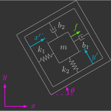
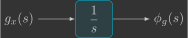
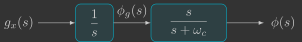
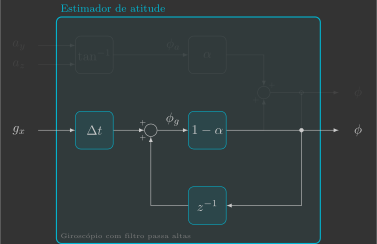

# Estimador de atitude

Nesta secção você irá implementar o estimador de atitude, que estima os ângulos de Euler $\phi$, $\theta$ e $\psi$ e velocidades angulares $\omega_x$, $\omega_y$ e $\omega_z$ a partir das leituras do acelerômetro $a_x$, $a_y$ e $a_z$ e do giroscópio $g_x$, $g_y$ e $g_z$.

{: width=100% style="display: block; margin: auto;" }

Para isto, serão implementadas duas novas funções:

- `sensors()`
- `attitudeEstimator()`

---

## Implementação

Para começar, copie e cole o arquivo `mixer.c` e renomeie ele para `attitude_estimator.c`.

### Variáveis globais

Declare mais algumas variáveis globais, que são as variáveis que entram e saem da função do estimador de atitude.

```c
// Sensors
float ax, ay, az;             // Accelerometer [m/s^2]
float gx, gy, gz;             // Gyroscope [rad/s]

// System states
float phi, theta, psi;        // Euler angles [rad]
float wx, wy, wz;             // Angular velocities [rad/s]
```

### Variáveis de registro

Declare também algumas variáveis que serão utilizados para registrar os valores dos ângulos de Euler e enviar eles ao Crazyflie Client, para que seja possível visualizar nossa estimativa em tempo real(1).
{.annotate}

1. Nós não utilizamos as próprias variáveis declaradas anteriormente pois o Crazyflie Client trabalha com ângulos em graus e não em radianos.

```c
// Auxiliary variables for logging Euler angles (CFClient uses degrees and not radians)
float log_phi, log_theta, log_psi;

// Logging group that stream variables to CFClient.
LOG_GROUP_START(stateEstimate)
LOG_ADD_CORE(LOG_FLOAT, roll, &log_phi)
LOG_ADD_CORE(LOG_FLOAT, pitch, &log_theta)
LOG_ADD_CORE(LOG_FLOAT, yaw, &log_psi)
LOG_GROUP_STOP(stateEstimate)
```

### Sensores

A função `sensors()` pega as leituras do acelerômetro e giroscópio e armazena elas nas variáveis globais previamente declaradas.

```c
// Get sensor readings from estimator module
void sensors()
{
    // Declare variable that store the most recent measurement from estimator
    static measurement_t measurement;

    // Retrieve the current measurement from estimator module
    while (estimatorDequeue(&measurement))
    {
        switch (measurement.type)
        {
        // Get accelerometer sensor readings and convert [G's -> m/s^2]
        case MeasurementTypeAcceleration:
            ax = -measurement.data.acceleration.acc.x * g;
            ay = -measurement.data.acceleration.acc.y * g;
            az = -measurement.data.acceleration.acc.z * g;
            break;
        // Get gyroscope sensor readings and convert [deg/s -> rad/s]
        case MeasurementTypeGyroscope:
            gx = measurement.data.gyroscope.gyro.x * pi / 180.0f;
            gy = measurement.data.gyroscope.gyro.y * pi / 180.0f;
            gz = measurement.data.gyroscope.gyro.z * pi / 180.0f;
            break;
        default:
            break;
        }
    }
}
```

Você pode simplesmente copiar e colar o código acima. Se quiser entender ele melhor, volte na secção dos [sensores](../../../sensors_and_actuators/sensors.md).

### Estimador de atitude

Já a função `attitudeEstimator()`, é quem estima os ângulos de Euler e velocidades angulares a partir das leituras do acelerômetro e do giroscópio.

```c
// Estimate orientation from IMU sensor
void attitudeEstimator()
{ 
}
```

Ela está em branco pois será implementada em etapas a seguir. Inicialmente, você irá considerar apenas a dinâmica 2D e estimar um único ângulo de Euler e velocidade angular. Você começará implementando um estimador que utiliza só o acelerômetro e em seguida um que utiliza só o giroscópio. Após terem sido verificado os prós e contras de cada sensor, ambos serão utilizados em conjunto de uma maneira inteligente. Por fim, você irá considerar a dinâmica 3D e estimar todos os ângulos de Euler e velocidades angulares.

### Loop principal

Inclua no seu loop principal a chamada das funções `sensors()` e `attitudeEstimator()`.

```c hl_lines="8 9"
// Main application task
void appMain(void *param)
{
    // Infinite loop (runs at 200Hz)
    while (true)
    {
        reference();                  // Read reference setpoints (from Crazyflie Client)
        sensors();                    // Read raw sensor measurements
        attitudeEstimator();          // Estimate orientation (roll/pitch/yaw) from IMU sensor
        mixer();                      // Convert desired force/torques into motor PWM
        actuators();                  // Send commands to motors
        vTaskDelay(pdMS_TO_TICKS(5)); // Loop delay (5 ms)
    }
}
```

---

## Acelerômetro

Acelerômetros inerciais são sensores que medem aceleração linear. Eles são compostos por um corpo de prova conectada a um invólucro através de uma mola e um amortecedor:

{: width=300 style="display: block; margin: auto;" }

Quando o invólucro sofre uma aceleração ${\color{magenta}\ddot{x}}$, o corpo dentro do invólucro sofre um deslocamento ${\color{cyan}x'}$. Medindo o deslocamento do corpo ${\color{cyan}x'}$, é possível inferir a aceleração sofrida pelo invólucro ${\color{magenta}\ddot{x}}$. 

{: width=300 style="display: block; margin: auto;" }

Ao montarmos três acelerômetros perpendiculares entre si, ou seja, um alinhado com cada eixo, temos o que é chamado de acelerômetro de 3 eixos, que consegue medir a aceleração linear em todas as direções.

### Trigonometria

O acelerômetro está fixo no sistema de coordenadas móvel do drone. Como há sempre a aceleração da gravidade apontando para baixo no sistema de coordenadas inercial, as acelerações $a_y$ e $a_z$ em função da gravidade $g$ e do ângulo $\phi$ são dadas por:
{.annotate}

{: width=250 style="display: block; margin: auto;" }

$$
\begin{align}
    \begin{bmatrix}
        a_y \\
        a_z 
    \end{bmatrix} &= R \vec{g} \\
    \begin{bmatrix}
        a_y \\
        a_z 
    \end{bmatrix}
    &=
    \begin{bmatrix} 
        \cos \phi & \sin \phi \\
        -\sin \phi & \cos \phi
    \end{bmatrix}
    \begin{bmatrix}
        0 \\
        -g
    \end{bmatrix} \\
    \begin{bmatrix}
        a_y \\
        a_z 
    \end{bmatrix}
    &=
    \begin{bmatrix}
        -g\sin\phi	\\
        -g\cos\phi
    \end{bmatrix}
\end{align}
$$

Dividindo uma equação pela outra, podemos medir o ângulo $\phi_a$(1) em função das leituras do acelerômetro $a_y$ e $a_z$(2):
{.annotate}

1. Usamos o subescrito $_a$ para deixar claro que esse ângulo foi medido a partir das leituras do acelerômetro. 
2. Os sinais negativos não foram cortados pois você deverá utilizar a função `atan2f` em seu código, para saber em qual quadrante está o seu ângulo. 

$$
\begin{align}
    \frac{a_y}{a_z} &= \frac{-\cancel{g}\sin\phi_a}{-\cancel{g}\cos\phi_a} \\
    \frac{-a_y}{-a_z} &= \tan\phi_a \\
    \phi_a &= \tan^{-1} \left( \dfrac{-a_y}{-a_z} \right)
\end{align}
$$

Vamos começar implementando um estimador de atitude bem simples, cujo ângulo estimado $\phi$ é dado simplesmente pelo ângulo $\phi_a$ medido a partir das leituras do acelerômetro $a_y$ e $a_z$, conforme o diagrama de blocos abaixo:

{: width=600 style="display: block; margin: auto;" }

Inclua na função `attitudeEstimator()` uma variável local $\phi_a$, que corresponde ao ângulo medido a partir das leituras do acelerômetro $a_y$ e $a_z$ e, em seguida, atribua ela ao ângulo estimado $\phi$. Também vamos armazenar o valor dessa estimativa numa variável de registro, para que seja possível visualizá-la no Crazyflie Client.


```c hl_lines="5 8"
// Estimate orientation from IMU sensor
void attitudeEstimator()
{
    // Measured angle from accelerometer
    float phi_a = 

    // Estimated angle (accelerometer)
    phi = 

    // Auxiliary variables for logging Euler angles (CFClient uses degrees and not radians)
    log_phi = phi * 180.0f / pi;
}
```   
        
Verifique como está sua estimativa, para isso carregue esse programa no drone e utilize o Crazyflie Client para visualizar o resultado.

!!! example "Resultado esperado"        
    Você deve notar que o estimador implementado é adequado somente para condições estáticas (baixas frequências). Isso se deve ao fato de que, ao movimentar o drone, surgem outras acelerações além da aceleração da gravidade. Essas acelerações acabam sendo um ruído para o nosso estimador, e uma forma de removê-las é através de um filtro passa-baixas.

### Filtro passa-baixas

Um filtro passa-baixas é um filtro que atenua sinais superiores a uma determinada frequência de corte $\omega_c$. Ele é muito utilizado para filtrar ruídos, dado que os mesmos geralmente possuem uma frequência superior ao sinal que está sendo medido. 
        
Dessa forma, para obtermos um ângulo estimado $\phi$ sem ruídos, vamos passar o ângulo medido pelo acelerômetro $\phi_a$ por um filtro passa-baixas. No domínino da frequência, isso pode ser representado pelo seguinte diagrama de blocos:
        
{: width=350 style="display: block; margin: auto;" }
        
Dado que vamos implementar este filtro em um microcontrolador, torna-se necessário determinar o equivalente discreto do mesmo. Primeiro, vamos obter a equação diferencial correspondente, utilizando a transformada inversa de Laplace:
        
$$
\begin{align*}
    \frac{\phi(s)}{\phi_a(s)} &= \frac{\omega_c}{s+\omega_c} \\
    \left( s + \omega_c \right) \phi(s) &= \omega_c\phi_a(s) \\
    s\phi(s) + \omega_c\phi(s) &= \omega_c\phi_a(s) \\
    &\Downarrow ^\text{Transformada inversa}_\text{de Laplace} \\
    \frac{d}{dt}{\phi}(t) + \omega_c\phi(t) &= \omega_c\phi_a(t)
\end{align*}
$$
        
Em seguida, vamos discretizar a equação diferencial, utilizando o método de Euler implícito(1):
{.annotate}

1. O método de Euler explícito ("pra frente") utiliza a aproximação $\frac{d}{dt}x(t) \approx \frac{x(t+\Delta t)-x(t)}{\Delta t}$, equanto que o método de Euler implícito ("pra trás") utiliza a aproximação $\frac{d}{dt}x(t) \approx \frac{x(t)-x(t-\Delta t)}{\Delta t}$
    
$$
\begin{align*}
    \frac{d}{dt}{\phi}(t) + \omega_c\phi(t) &= \omega_c\phi_a(t) \\
    &\Downarrow ^\text{Euler}_\text{implícito} \\
    \frac{\phi[k]-\phi[k-1]}{\Delta t} + \omega_c\phi[k] &= \omega_c\phi_a[k] \\
    \phi[k]-\phi[k-1] + \omega_c\Delta t\phi[k] &= \omega_c\Delta t\phi_a[k] \\
    \left( 1+\omega_c\Delta t\right) \phi[k] &= \phi[k-1] + \omega_c\Delta t\phi_a[k] \\
    \phi[k] &= \underbrace{\frac{1}{1+\omega_c\Delta t}}_{\left(1-\alpha\right)} \phi[k-1] + \underbrace{\frac{\omega_c\Delta t}{1+\omega_c\Delta t}}_{\alpha} \phi_a[k] \\
    \phi[k] &= \left( 1-\alpha \right)\phi[k-1]+\alpha\phi_a[k]
\end{align*}
$$
        
Note que um filtro passa-baixas discretizado nada mais é do que uma média ponderada entre o valor antigo de $\phi$ e o valor medido $\phi_a$, e a variável $\alpha$ é exatamente esse fator de ponderação. O mesmo pode ser representado pelo seguinte diagrama de blocos:

{: width=600 style="display: block; margin: auto;" }
        
A variável $\alpha$ é chamada de fator de suavização, ela depende da frequência de corte $\omega_c$ e do intervalo de tempo $\Delta t$ entre medições:
        
$$
\alpha = \frac{\omega_c\Delta t}{1+\omega_c\Delta t}
$$


- Quanto maior for a frequência de corte $\omega_c$, mais próximo de 1 estará o fator de suavização $\alpha$ e, consequentemente, mais peso será dado aos valores medidos. Isso é vantajoso pois garante que o sinal estimado convirja mais rápido, no entanto, também deixa passar mais ruído.
- Quanto menor for a frequência de corte $\omega_c$, mais próximo de 0 estará o fator de suavização $\alpha$ e, consequentemente, mais peso será dado aos valores antigos. Isso é vantajoso pois deixa passar menos ruído, no entanto, faz com que o sinal estimado convirja mais devagar.

Determinar a frequência de corte $\omega_c$ ideal, que garante um bom compromisso entre redução de ruído e atraso, é o maior desafio na implementação de um filtro passa-baixas.

<!-- [Figura] -->
        
Modifique a sua função `attitudeEstimator()` de modo que agora o ângulo estimado $\phi$ seja dado por um filtro passa-baixas da medida do acelerômetro $\phi_a$.
        
```c hl_lines="5 6 9 12"
// Estimate orientation from IMU sensor
void attitudeEstimator()
{
    // Estimator parameters
    static const float wc = 
    static const float alpha = 

    // Measured angle from accelerometer
    float phi_a = 

    // Estimated angle (accelerometer with low pass filter)
    phi = 

    // Auxiliary variables for logging Euler angles (CFClient uses degrees and not radians)
    log_phi = phi * 180.0f / pi;
}
```   
        
Experimente valores de 1rad/s, 10rad/s e 100rad/s para a frequência de corte $\omega_c$ e verifique como isso influencia na sua estimativa. Para isso, carregue esse programa no drone e utilize o Crazyflie Client para visualizar o resultado.

!!! example "Resultado esperado"    
    Você deve notar que, mesmo no melhor dos casos, o estimador implementado não é adequado para condições dinâmicas (altas frequências). Vamos agora esquecer o acelerômetro por um instante e utilizar apenas o giroscópio para estimação de atitude.

---

## Giroscópio

Giroscópios inericiais são sensores que medem velocidade angular. Eles são compostos por um corpo de prova conectada a um invólucro através de duas molas e dois amortecedores:

{: width=300 style="display: block; margin: auto;" }

No eixo ${\color{cyan}x'}$ é forçada uma vibração ${\color{#65DD18}f}=f_0\sin(\omega_0t)$. Quando o invólucro possui uma velocidade angular ${\color{magenta}\dot{\theta}}$, devido à aceleração de Coriolis, é induzida uma vibração no eixo ${\color{cyan}y'}$. Medindo a amplitude da vibração em ${\color{cyan}y'}$ é possível inferir a velocidade angular do invólucro ${\color{magenta}\dot{\theta}}$.

{: width=300 style="display: block; margin: auto;" }

Ao montarmos três giroscópios perpendiculares entre si, ou seja, um alinhado com cada eixo, temos o que é chamado de giroscópio de 3 eixos, que consegue medir a velocidade angular em todas as direções.

### Integração

O giroscópio está fixo no sistema de coordenadas móvel drone e mede a velocidade angular, portanto o deslocamento angular pode ser obtido simplesmente integrando sua leitura(1):
{.annotate}

1. Usamos o subescrito $_g$ para deixar claro que esse ângulo foi medido a partir das leituras do giroscópio. 

{: width=250 style="display: block; margin: auto;" }

$$
\phi_g(t) = \int g_x(t) dt \\
$$

No domínio da frequência, isso pode ser representado pelo seguinte diagrama de blocos:

{: width=300 style="display: block; margin: auto;" }

Novamente, para determinar o correspondente discreto, primeiro obtemos a equação diferencial correspondente:

$$    
\begin{align*}
    \frac{\phi_g(s)}{g_x(s)} &= \frac{1}{s} \\
    s \phi_g(s) &= g_x(s) \\
    &\Downarrow ^\text{Transformada inversa}_\text{de Laplace} \\
    \frac{d}{dt} \phi_g(t) &= g_x(t)
\end{align*}
$$

E em seguida discretizamos a equação diferencial:

$$
\begin{align*}
    \frac{d}{dt} \phi_g(t) &= g_x(t) \\
    &\Downarrow ^\text{Euler}_\text{implícito} \\
    \frac{\phi_g[k]-\phi_g[k-1]}{\Delta t} &= g_x[k] \\
    \phi_g[k]-\phi_g[k-1] &= g_x[k] \Delta t \\ 
    \phi_g[k] &= \phi_g[k-1] + g_x[k] \Delta t 
\end{align*}
$$

Vamos implementar agora um estimador de atitude cujo ângulo estimado $\phi$ é dado pelo ângulo medido a partir das leituras do giroscópio $\phi_g$, que por sua vez é dado pela integração da leitura do giroscópio $g_x$, conforme o diagrama de blocos abaixo:

{: width=600 style="display: block; margin: auto;" }

Inclua na função `attitudeEstimator()` uma variável local $\phi_g$, que corresponde ao ângulo medido a partir da integração da leitura do giroscópio $g_x$ e, em seguida, atribua ela ao ângulo estimado $\phi$.
        
```c hl_lines="5 8"
// Estimate orientation from IMU sensor
void attitudeEstimator()
{
    // Measured angle from gyroscope
    float phi_g =

    // Estimated angle (gyroscope)
    phi =

    // Auxiliary variables for logging Euler angles (CFClient uses degrees and not radians)
    log_phi = phi * 180.0f / pi;
}
```   

Verifique como está sua estimativa, para isso carregue esse programa no drone e utilize o Crazyflie Client para visualizar o resultado.

!!! example "Resultado esperado"        
    Você deve notar que o estimador implementado é adequado somente para condições dinâmicas (altas frequências). Isso se deve ao fato de que, em condições estáticas (baixas frequências), o giroscópio possui erros sistemáticos constantes (*"bias"*), que, mesmo pequenos, acabam sendo integrados e fazendo com que a atitude divirja ao longo do tempo. É o problema inverso do acelerômetro, e uma forma de removê-lo é através de um filtro passa-altas.

### Filtro passa-altas

Um filtro passa-altas é um filtro que atenua sinais inferiores a uma determinada frequência de corte $\omega_c$. Ou seja, ele faz o inverso de um filtro passa-baixas.
        
Para se obter o ângulo estimado $\phi$, basta passar o ângulo medido $\phi_g$ por um filtro passa-altas. No domínio da frequência, isso pode ser representado pelo seguinte diagrama de blocos:

{: width=450 style="display: block; margin: auto;" }

Note que, como a velocidade angular está sendo integrada antes de passar pelo filtro, o diagrama de blocos pode ser reduzido:

{: width=350 style="display: block; margin: auto;" }

Novamente, primeiro obtemos a equação diferencial:
        
$$
\begin{align}
    \frac{\phi(s)}{g_x(s)} &= \frac{1}{s+\omega_c} \\
    s\phi(s) + \omega_c\phi(s) &= g_x(s) \\
    &\Downarrow ^\text{Transformada inversa}_\text{de Laplace} \\
    \frac{d}{dt}{\phi}(t) + \omega_c\phi(t) &= g_x(t)
\end{align}
$$

E, em seguida, realizamos a discretização:

$$
\begin{align}
    \frac{d}{dt}{\phi}(t) + \omega_c\phi(t) &= g_x(t) \\
    &\Downarrow ^\text{Euler}_\text{implícito} \\
    \frac{\phi[k]-\phi[k-1]}{\Delta t} + \omega_c\phi[k] &= g_x[k] \\
    \phi[k]-\phi[k-1] - \omega_c\Delta t\phi[k] &= g_x[k]\Delta t \\
    \left( 1+\omega_c\Delta t \right) \phi[k] &= \phi[k-1] + g_x[k]\Delta t \\
    \phi[k] &= \underbrace{\frac{1}{1+\omega_c\Delta t}}_{\left(1-\alpha\right)} \underbrace{\left(\phi[k-1] + g_x[k]\Delta t\right)}_{\phi_g[k]} \\
    \phi[k] &= \left(1-\alpha\right) \phi_g[k]
\end{align}
$$

Dessa forma, a integração do giroscópio com um filtro passa-altas pode ser representado pelo diagrama de blocos abaixo:

{: width=600 style="display: block; margin: auto;" }

Modifique a sua função `attitudeEstimator()` de modo que agora o ângulo estimado $\phi$ seja dado por um filtro passa-altas da medida do giroscópio $\phi_g$.

```c hl_lines="5 6 9 12"
// Estimate orientation from IMU sensor
void attitudeEstimator()
{
    // Estimator parameters
    static const float wc = 
    static const float alpha = 

    // Measured angle from gyroscope
    float phi_g = 

    // Estimated angle (gyroscope with high pass filter)
    phi = 

    // Auxiliary variables for logging Euler angles (CFClient uses degrees and not radians)
    log_phi = phi * 180.0f / pi;
}
```  

Experimente valores de 0,1rad/s, 1rad/s e 10rad/s para a frequência de corte $\omega_c$ e verifique como isso influencia na sua estimativa. Para isso, carregue esse programa no drone e utilize o Crazyflie Client para visualizar o resultado.

!!! example "Resultado esperado"   
    Você deve notar que a atitude do drone sempre converge para zero, o que é bom pois não estamos mais integrando os erros sistemáticos, mas ruim quando o drone fica parado em uma atitude que não seja zero.

---

## Acelerômetro + Giroscópio

Conforme vimos, o acelerômetro nos fornece boas estimativas para condições estáticas (baixas frequências), enquanto o giroscópio nos fornece boas estimativas para condições dinâmicas (altas frequências). Um tem sucesso exatamente onde o outro falha. Por que então não combinar os dois para ter boas estimativas durante condições estáticas e dinâmicas? Essa é a ideia por trás de um filtro complementar!

### Filtro complementar

A ideia desse filtro é passar o ângulo medido pelo acelerômetro por um filtro passa-baixas e o ângulo medido pelo giroscópio por um filtro passa-altas, conforme a o diagrama de blocos abaixo:

{: width=500 style="display: block; margin: auto;" }

Como a somatória desses dois filtros gera um ganho unitário, eles podem simplesmente ser somados(1):
{.annotate}

1. É daí que vem o nome "complementar"
        
$$
    \underbrace{\frac{\omega_c}{s+\omega_c}}_{\begin{array}{c} \text{ Filtro} \\ \text{passa-baixas} \end{array}} + \underbrace{\frac{s}{s+\omega_c}}_{\begin{array}{c} \text{Filtro} \\ \text{passa-altas} \end{array}} = 1
$$

Dado que a velocidade angular está sendo integrada antes de passar pelo filtro passa-altas e, tanto o filtro passa-baixas como o filtro passa-altas possuem o mesmo denominador da função de transferência, o diagrama de blocos pode ser reduzido:


{: width=500 style="display: block; margin: auto;" }

Note que agora nós só temos uma única função de transferência, que é a função de transferência de um filtro passa-baixas. Como já deduzimos o correspondente discreto deste filtro, tem-se que:

$$
\begin{align}
    \phi[k] &= \left( 1-\alpha \right)\phi[k-1]+\alpha \left( \frac{1}{\omega_c} g_x[k] + \phi_a[k] \right) \\
    \phi[k] &= \left( 1-\alpha \right)\phi[k-1]+ \underbrace{\alpha\frac{1}{\omega_c}}_{(1-\alpha)\Delta t} g_x[k] + \alpha \phi_a[k]  \\
    \phi[k] &= \left( 1-\alpha \right)\phi[k-1]+ (1-\alpha) g_x[k]\Delta t + \alpha \phi_a[k]  \\
    \phi[k] &= \left( 1-\alpha \right)\underbrace{\left(\phi[k-1]+g_x[k] \Delta t \right)}_{\phi_g[k]} + \alpha \phi_a[k] \\
    \phi[k] &= \left( 1-\alpha \right)\phi_g[k] + \alpha \phi_a[k] 
\end{align}
$$

Ou seja, um filtro complementar discretizado nada mais é do que uma média ponderada entre o ângulo medido pelo giroscópio $\phi_g$ e o ângulo medido pelo acelerômetro $\phi_a$. Isso pode ser representando pelo seguinte diagrama de blocos:

{: width=600 style="display: block; margin: auto;" }

Modifique a sua função `attitudeEstimator()` de modo que agora o ângulo estimado $\phi$ seja dado por um filtro complementar das medidas do acelerômetro $\phi_a$ e giroscópio $\phi_g$.

```c hl_lines="5 6 9 12 15"
// Estimate orientation from IMU sensor
void attitudeEstimator()
{
    // Estimator parameters
    static const float wc = 
    static const float alpha = 

    // Measured angle from accelerometer
    float phi_a = 

    // Measured angle from gyroscope
    float phi_g = 

    // Estimated angle (accelerometer and gyroscope with complementary filter)
    phi = 

    // Auxiliary variables for logging Euler angles (CFClient uses degrees and not radians)
    log_phi = phi * 180.0f / pi;
}
```  

Experimente valores de 0,1rad/s, 1rad/s e 10rad/s para a frequência de corte $\omega_c$ e verifique como isso influencia na sua estimativa. Para isso, carregue esse programa no drone e utilize o Crazyflie Client para visualizar o resultado.

!!! example "Resultado esperado"   
    Agora sim a estimativa ficou legal!

---

## Attitude 3D

Por fim, você deve replicar o estimador de atitude desenvolvido para os demais ângulos de Euler e também velocidades angulares:
    
$$
\left\{
\begin{array}{l}
    \phi =  \left( 1 - \alpha \right) \phi_g + \alpha \phi_a \\ 
    \theta = \left( 1 - \alpha \right) \theta_g + \alpha \theta_a  \\
    \psi = \psi_g 
\end{array}
\right.
\qquad \qquad \qquad
\left\{
\begin{array}{l}
    \omega_x = g_x \\ 
    \omega_y = g_y \\
    \omega_z = g_z 
\end{array}
\right.
$$

Note que não conseguimos estimar o ângulo de guinagem $\psi$ a partir das leituras do acelerômetro, portanto, neste caso, utilizaremos apenas o giroscópio. Ou seja, é esperado que o ângulo de guinagem $\psi$ divirja com o tempo, mas esse ângulo não é essencial para garantir a estabilidade do drone(1).
{.annotate}

1. Sistemas de referência de atitude e direção (AHRS) utilizam um magnetômetro para complementar a estimativa de guinagem $\psi$ do giroscópio, dessa forma evitando que esse ângulo também divirja.

### Acelerômetro

Os ângulos de Euler $\phi_a$ e $\theta_a$ medidos a partir das leituras do acelerômetro $a_x$, $a_y$ e $a_z$ são dados por:

{: width=250 style="display: block; margin: auto;" }

$$
\left\{
\begin{array}{l}
    \phi_a = \tan^{-1} \left( \dfrac{-a_y}{-a_z} \right) \\
    \theta_a = \tan^{-1} \left( \dfrac{a_x}{\sqrt{a_y^2+a_z^2}} \right)
\end{array}
\right.
$$

??? info "Dedução"

    As acelerações $a_x$, $a_y$ e $a_z$ em função da gravidade $g$ e dos ângulo $\phi$ e $\theta$ são dadas por:
            
    $$
    \begin{align}
        \begin{bmatrix}
            a_x \\
            a_y \\
            a_z \\
        \end{bmatrix} &= R \vec{g} \\
        \begin{bmatrix}
            a_x \\
            a_y \\
            a_z \\
        \end{bmatrix}
        &=
        \begin{bmatrix} 
            \cos\theta\cos\psi & \cos\theta\sin\psi & -\sin\theta \\ 
            - \cos\phi\sin\psi + \sin\phi\sin\theta\cos\psi  & \cos\phi\cos\psi + \sin\phi\sin\theta\sin\psi & \sin\phi\cos\theta \\ 
            \sin\phi\sin\psi + \cos\phi\sin\theta\cos\psi & - \sin\phi\cos\psi + \cos\phi\sin\theta\sin\psi  & \cos\phi\cos\theta 
        \end{bmatrix}
        \begin{bmatrix}
            0 \\
            0 \\
            -g \\
        \end{bmatrix} \\
        \begin{bmatrix}
            a_x \\
            a_y \\
            a_z \\
        \end{bmatrix}
        &=
        \begin{bmatrix}
            g\sin\theta	\\
            -g\sin\phi\cos\theta \\
            -g\cos\phi\cos\theta
        \end{bmatrix}
    \end{align}
    $$

    Dividindo a segunda equação pela terceira, podemos medir o ângulo $\phi_a$ em função das leituras do acelerômetro $a_y$ e $a_z$:

    $$
    \begin{align}
        \frac{a_y}{a_z} &= \frac{-\cancel{g}\sin\phi_a\cancel{\cos\theta}}{-\cancel{g}\cos\phi_a\cancel{\cos\theta}} \\
        \frac{-a_y}{-a_z} &= \tan\phi_a \\
        \phi_a &= \tan^{-1} \left( \dfrac{-a_y}{-a_z} \right)
    \end{align}
    $$

    Já a medição do ângulo $\theta_a$ depende das leituras do acelerômetro $a_x$, $a_y$ e $a_z$, e a dedução é um pouco mais complexa:

    $$
    \begin{align}
        \frac{a_x^2}{a_y^2+a_z^2} &= \frac{(g\sin\theta_a)^2}{(-g\sin\phi_a\cos\theta_a)^2+(-g\cos\phi_a\cos\theta_a)^2} \\
        \frac{a_x^2}{a_y^2+a_z^2} &= \frac{g^2\sin^2\theta_a}{g^2\sin^2\phi_a\cos^2\theta_a+g^2\cos^2\phi_a\cos^2\theta_a} \\
        \frac{a_x^2}{a_y^2+a_z^2} &= \frac{\cancel{g^2}\sin^2\theta_a}{\cancel{g^2}\cos^2\cancelto{1}{(\sin^2\phi_a+\cos^2\phi_a)}} \\
        \frac{a_x^2}{a_y^2+a_z^2} &= \frac{\sin^2\theta_a}{\cos^2\theta_a} \\
        \frac{a_x^2}{a_y^2+a_z^2} &= \tan^2\theta_a \\
        \sqrt{\frac{a_x^2}{a_y^2+a_z^2}} &= \tan\theta_a \\
        \frac{a_x}{\sqrt{a_y^2+a_z^2}} &= \tan\theta_a \\
        \theta_a &= \tan^{-1} \left( \frac{a_x}{\sqrt{a_y^2+a_z^2}} \right)
    \end{align}
    $$

### Giroscópio

Os ângulos de Euler $\phi_g$, $\theta_g$ e $\psi_g$ medidos a partir das leituras do giroscópio $g_x$, $g_y$ e $g_z$ são dados por:

{: width=250 style="display: block; margin: auto;" }

$$
\left\{
\begin{array}{l}
    \phi_g = \phi + \left( g_x + g_y \sin\phi\tan\theta + g_z \cos\phi\tan\theta \right) \Delta t \\
    \theta_g = \theta + \left( g_y \cos\phi - g_z \sin\phi \right) \Delta t \\
    \psi_g = \psi + \left( g_y \sin\phi\sec\theta + g_z \cos\phi\sec\theta \right) \Delta t
\end{array}
\right.
$$

??? info "Dedução"

    As derivadas dos ângulos de Euler em função das velocidades angulares são dadas pela equação cinemática de rotação:

    $$
    \begin{bmatrix}
        \dot{\phi} \\
        \dot{\theta} \\
        \dot{\psi}
    \end{bmatrix}
    = 
    \begin{bmatrix} 
        1 & \sin\phi\tan\theta & \cos\phi\tan\theta \\
        0 & \cos\phi & - \sin\phi\\
        0 & \sin\phi\sec\theta & \cos\phi\sec\theta 
    \end{bmatrix}
    \begin{bmatrix}
        \omega_x \\
        \omega_z \\
        \omega_y
    \end{bmatrix}
    $$

    Como:

    $$
    \begin{bmatrix}
        g_x \\
        g_z \\
        g_y
    \end{bmatrix}
    =
    \begin{bmatrix}
        \omega_x \\
        \omega_z \\
        \omega_y
    \end{bmatrix}
    $$

    Logo, substituindo e integrando ao longo do tempo:

    $$
    \begin{align*}
        \begin{bmatrix}
            \phi_g \\
            \theta_g \\
            \psi_g
        \end{bmatrix}
        &=
        \begin{bmatrix}
            \phi \\
            \theta \\
            \psi
        \end{bmatrix}
        +
        \begin{bmatrix}
            \dot{\phi}  \\
            \dot{\theta} \\
            \dot{\psi}
        \end{bmatrix} \Delta t \\
        \begin{bmatrix}
            \phi_g  \\
            \theta_g  \\
            \psi_g 
        \end{bmatrix}
        &=
        \begin{bmatrix}
            \phi \\
            \theta \\
            \psi
        \end{bmatrix}
        +
        \begin{bmatrix}
            1 & \sin\phi\tan\theta & \cos\phi\tan\theta \\
            0 & \cos\phi & -\sin\phi \\
            0 & \sin\phi\sec\theta & \cos\phi\sec\theta
        \end{bmatrix}
        \begin{bmatrix}
            g_x  \\
            g_y  \\
            g_z 
        \end{bmatrix} \Delta t
    \end{align*} 
    $$


### Implementação

Modifique a sua função `attitudeEstimator()` de modo que agora os ângulos estimados $\phi$, $\theta$ e $\psi$ sejam dados por um filtro complementar entre as medidas do acelerômetro $\phi_a$ e $\theta_a$ e giroscópio $\phi_g$, $\theta_g$ e $\psi_g$.

```c hl_lines="5 6 9 10 13-15 18-20 23-25"
// Estimate orientation from IMU sensor
void attitudeEstimator()
{
    // Estimator parameters
    static const float wc = 
    static const float alpha = 

    // Measured angles from accelerometer
    float phi_a = 
    float theta_a = 

    // Measured angles from gyroscope
    float phi_g = 
    float theta_g = 
    float psi_g = 

    // Estimated angles (accelerometer and gyroscope with complementary filter)
    phi = 
    theta = 
    psi = 

    // Angular velocities estimation (gyroscope)
    wx = 
    wy = 
    wz = 

    // Auxiliary variables for logging Euler angles (CFClient uses degrees and not radians)
    log_phi = phi * 180.0f / pi;
    log_theta = -theta * 180.0f / pi;
    log_psi = psi * 180.0f / pi;
}
```  

Carregue esse programa no drone e utilize o Crazyflie Client para visualizar o resultado de um estimador de atitude completo!