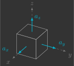

# Estimador de atitude

Nesta secção você irá implementar o estimador de atitude, que estima os ângulos de Euler $\phi$, $\theta$ e $\psi$ e velocidades angulares $\omega_x$, $\omega_y$ e $\omega_z$ a partir das leituras do acelerômetro $a_x$, $a_y$ e $a_z$ e do giroscópio $g_x$, $g_y$ e $g_z$.

{: width=100% style="display: block; margin: auto;" }

Para isto, serão implementadas duas novas funções:

- `sensors()`
- `attitudeEstimator()`

---

## Implementação

Para começar, copie e cole o arquivo `mixer.c` e renomeie ele para `attitude_estimator.c`.

### Variáveis globais

Declare mais algumas variáveis globais, que são as variáveis que entram e saem da função do estimador de atitude.

```c hl_lines="4 5 6 12 13 14"
// Actuators
float pwm1, pwm2, pwm3, pwm4; // Motors PWM

// Sensors
float ax, ay, az;             // Accelerometer [m/s^2]
float gx, gy, gz;             // Gyroscope [rad/s]

// System inputs
float ft;                     // Thrust force [N]
float tx, ty, tz;             // Roll, pitch and yaw torques [N.m]

// System states
float phi, theta, psi;        // Euler angles [rad]
float wx, wy, wz;             // Angular velocities [rad/s]
```

### Variáveis de registro

Logo abaixo no código, declare também algumas variáveis que serão utilizados para registrar os valores dos ângulos de Euler e enviar eles ao Crazyflie Client, para que seja possível visualizar nossa estimativa em tempo real(1).
{.annotate}

1. Nós não utilizamos as próprias variáveis declaradas anteriormente pois o Crazyflie Client trabalha com ângulos em graus e não em radianos.

```c
// Auxiliary variables for logging Euler angles (CFClient uses degrees and not radians)
float log_phi, log_theta, log_psi;

// Logging group that stream variables to CFClient.
LOG_GROUP_START(stateEstimate)
LOG_ADD_CORE(LOG_FLOAT, roll, &log_phi)
LOG_ADD_CORE(LOG_FLOAT, pitch, &log_theta)
LOG_ADD_CORE(LOG_FLOAT, yaw, &log_psi)
LOG_GROUP_STOP(stateEstimate)
```

### Sensores

A função `sensors()` pega as leituras do acelerômetro e giroscópio e armazena elas nas variáveis globais previamente declaradas.

```c
// Get sensor readings from estimator module
void sensors()
{
    // Declare variable that store the most recent measurement from estimator
    static measurement_t measurement;

    // Retrieve the current measurement from estimator module
    while (estimatorDequeue(&measurement))
    {
        switch (measurement.type)
        {
        // Get accelerometer sensor readings and convert [G's -> m/s^2]
        case MeasurementTypeAcceleration:
            ax = -measurement.data.acceleration.acc.x * g;
            ay = -measurement.data.acceleration.acc.y * g;
            az = -measurement.data.acceleration.acc.z * g;
            break;
        // Get gyroscope sensor readings and convert [deg/s -> rad/s]
        case MeasurementTypeGyroscope:
            gx = measurement.data.gyroscope.gyro.x * pi / 180.0f;
            gy = measurement.data.gyroscope.gyro.y * pi / 180.0f;
            gz = measurement.data.gyroscope.gyro.z * pi / 180.0f;
            break;
        default:
            break;
        }
    }
}
```

Você pode simplesmente copiar e colar o código acima. Se quiser entender ele melhor, volte na secção dos [sensores](../../../sensors_and_actuators/sensors.md).

### Estimador de atitude

Já a função `attitudeEstimator()`, é quem estima os ângulos de Euler e velocidades angulares a partir das leituras do acelerômetro e do giroscópio.

```c
// Estimate orientation from IMU sensor
void attitudeEstimator()
{ 
}
```

Ela está em branco pois será implementada em etapas a seguir. Inicialmente, você irá considerar apenas a dinâmica 2D e estimar um único ângulo de Euler e velocidade angular. Você começará implementando um estimador que utiliza só o acelerômetro e em seguida um que utiliza só o giroscópio. Após terem sido verificado os prós e contras de cada sensor, ambos serão utilizados em conjunto de uma maneira inteligente. Por fim, você irá considerar a dinâmica 3D e estimar todos os ângulos de Euler e velocidades angulares.

### Loop principal

Inclua no seu loop principal a chamada das funções `sensors()` e `attitudeEstimator()`.

```c hl_lines="8 9"
// Main application task
void appMain(void *param)
{
    // Infinite loop (runs at 200Hz)
    while (true)
    {
        reference();                  // Read reference setpoints (from Crazyflie Client)
        sensors();                    // Read raw sensor measurements
        attitudeEstimator();          // Estimate orientation (roll/pitch/yaw) from IMU sensor
        mixer();                      // Convert desired force/torques into motor PWM
        motors();                     // Send commands to motors
        vTaskDelay(pdMS_TO_TICKS(5)); // Loop delay (5 ms)
    }
}
```

---

## Acelerômetro

Acelerômetros inerciais são sensores que medem aceleração linear. Eles são compostos por um corpo de prova conectada a um invólucro através de uma mola e um amortecedor.

{: width=300 style="display: block; margin: auto;" }

Quando o invólucro sofre uma aceleração ${\color{magenta}\ddot{x}}$, o corpo dentro do invólucro sofre um deslocamento ${\color{cyan}x'}$. Medindo o deslocamento do corpo ${\color{cyan}x'}$, é possível inferir a aceleração sofrida pelo invólucro ${\color{magenta}\ddot{x}}$. 

{: width=300 style="display: block; margin: auto;" }

Ao montarmos três acelerômetros perpendiculares entre si, ou seja, um alinhado com cada eixo, temos o que é chamado de acelerômetro de 3 eixos, que consegue medir a aceleração linear em todas as direções.

### Trigonometria

O acelerômetro está fixo no sistema de coordenadas móvel drone. Como há sempre a aceleração da gravidade apontando para baixo no sistema de coordenadas inercial, com um pouco de trigonometria é possível obter o deslocamento angular(1).
{.annotate}

1. O subescrito $_a$ quer dizer que esse valor foi obtido a partir das leituras do acelerômetro. Além disso, os sinais negativos não foram cortados pois você deverá utilizar a função `atan2f` em seu código, para saber em qual quadrante está o seu ângulo. 

[Figura]

$$
\phi_a = \tan^{-1} \left( \frac{- a_y}{- a_z} \right) \\
$$

Inclua na função `attitudeEstimator()` uma variável local $\phi_a$, que corresponde ao ângulo medido a partir das leituras do acelerômetro $a_y$ e $a_z$ e, em seguida, atribua ela ao ângulo estimado $\phi$.


```c hl_lines="4-11"
// Estimate orientation from IMU sensor
void attitudeEstimator()
{
    // Measured angle from accelerometer
    float phi_a = atan2f(-ay, -az);

    // Estimated angle is given purely from accelerometer measurement
    phi = phi_a;

    // Auxiliary variables for logging Euler angles (CFClient uses degrees and not radians)
    log_phi = phi * 180.0f / pi;
}
```   
        
Verifique como está sua estimativa, para isso carregue esse programa no drone e utilize o Crazyflie Client para visualizar o resultado.

!!! example "Resultado esperado"        
    Você deve notar que o estimador implementado é adequado somente para condições estáticas (baixas frequências). Isso se deve ao fato de que, ao movimentar o drone, surgem outras acelerações além da aceleração da gravidade. Essas acelerações acabam sendo um ruído para o nosso estimador, e uma forma de removê-las é através de um filtro passa-baixas.

### Filtro passa-baixas

Um filtro passa-baixas é um filtro que atenua sinais superiores a uma determinada frequência de corte $\omega_c$. Ele é muito utilizado para filtrar ruídos, dado que os mesmos geralmente possuem uma frequência superior ao sinal que está sendo medido. 
        
Dessa forma, para obtermos um ângulo estimado $\phi$ sem ruídos, vamos passar o ângulo medido pelo acelerômetro $\phi_a$ por um filtro passa-baixas. No domínino da frequência, isso pode ser representado pelo seguinte diagrama de blocos.
        
[Figura]
        
Dado que vamos implementar este filtro em um microcontrolador, torna-se necessário determinar o correspondente discreto do mesmo. Primeiro, vamos obter a equação diferencial correspondente, utilizando a transformada inversa de Laplace.
        
$$
\begin{align*}
    \frac{\phi(s)}{\phi_a(s)} &= \frac{\omega_c}{s+\omega_c} \\
    \left( s + \omega_c \right) \phi(s) &= \omega_c\phi_a(s) \\
    s\phi(s) + \omega_c\phi(s) &= \omega_c\phi_a(s) \\
    &\downarrow \mathcal{L}^{-1} \\
    \frac{d}{dt}{\phi}(t) + \omega_c\phi(t) &= \omega_c\phi_a(t)
\end{align*}
$$
        
Em seguida, vamos discretizar a equação diferencial, utilizando o método de Euler implícito(1).
{.annotate}

1. O método de Euler explícito ("pra frente") utiliza a aproximação $\frac{d}{dt}x(t) \approx \frac{x(t+\Delta t)-x(t)}{\Delta t}$, equanto que o método de Euler implícito ("pra trás") utiliza a aproximação $\frac{d}{dt}x(t) \approx \frac{x(t)-x(t-\Delta t)}{\Delta t}$}
    
$$
\begin{align*}
    \frac{\phi(t)-\phi(t-\Delta t)}{\Delta t} + \omega_c\phi(t) &= \omega_c\phi_{a}(t) \\
    \phi(t)-\phi(t-\Delta t) + \omega_c\Delta t\phi(t) &= \omega_c\Delta t\phi_{a}(t) \\
    \left( 1+\omega_c\Delta \right) \phi(t) &= \phi(t-\Delta t) + \omega_c\Delta t\phi_{a}(t) \\
    \phi(t) &= \underbrace{\frac{1}{1+\omega_c\Delta t}}_{\left(1-\alpha\right)} \phi(t-\Delta t) + \underbrace{\frac{\omega_c\Delta t}{1+\omega_c\Delta t}}_{\alpha} \phi_{a}(t) \\
    \phi(t) &= \left( 1-\alpha \right)\phi(t-\Delta t)+\alpha\phi_{a}(t)
\end{align*}
$$
        
Note que um filtro passa-baixas discretizado nada mais é do que uma média ponderada entre o valor antigo e o valor medido, e a variável $\alpha$ é exatamente esse fator de ponderação. O mesmo pode ser representado pelo seguinte diagrama de blocos:

[Figura]
        
A variável $\alpha$ é chamada de fator de suavização, ela depende da frequência de corte $\omega_c$ e do intervalo de tempo $\Delta t$ entre medições:
        
$$
\alpha = \frac{\omega_c\Delta t}{1+\omega_c\Delta t}
$$


- Quanto maior for a frequência de corte $\omega_c$, mais próximo de 1 estará o fator de suavização $\alpha$ e, consequentemente, mais peso será dado aos valores medidos. Isso é vantajoso pois garante que o sinal estimado convirja mais rápido, no entanto, também deixa passar mais ruído.
- Quanto menor for a frequência de corte $\omega_c$, mais próximo de 0 estará o fator de suavização $\alpha$ e, consequentemente, mais peso será dado aos valores antigos. Isso é vantajoso pois deixa passar menos ruído, no entanto, faz com que o sinal estimado convirja mais devagar.

Determinar a frequência de corte $\omega_c$ ideal, que garante um bom compromisso entre redução de ruído e atraso, é o maior desafio na implementação de um filtro passa-baixas.

[Figura]
        
Modifique a sua função `attitudeEstimator()` de modo que agora o ângulo estimado $\phi$ possua um filtro passa-baixas.
        
```c hl_lines="4-6 11-12"
// Estimate orientation from IMU sensor
void attitudeEstimator()
{
    // Estimator parameters
    static const float wc = 1.0f;                    // Cutoff frequency of filter [rad/s]
    static const float alpha = (wc*dt)/(1.0f+wc*dt); // Weighting factor of filter

    // Measured angle from accelerometer
    float phi_a = atan2f(-ay, -az);

    // Low-pass filter accelerometer estimation
    phi = (1.0f - alpha) * phi + alpha * phi_a;

    // Auxiliary variables for logging Euler angles (CFClient uses degrees and not radians)
    log_phi = phi * 180.0f / pi;
}
```   
        
Experimente valores de 1rad/s, 10rad/s e 100rad/s para a frequência de corte $\omega_c$ e verifique como isso influencia na sua estimativa. Para isso, carregue esse programa no drone e utilize o Crazyflie Client para visualizar o resultado.

!!! example "Resultado esperado"    
    Você deve notar que, mesmo no melhor dos casos, o estimador implementado não é adequado para condições dinâmicas (altas frequências).  

 Vamos agora esquecer o acelerômetro por um instante e utilizar apenas o giroscópio para estimação de atitude. Não delete o código que você escreveu até agora, apenas comente ele (o mesmo será útil adiante).  

---

## Giroscópio

Giroscópios inericiais são sensores que medem velocidade angular. Eles são compostos por um corpo de prova conectada a um invólucro através de duas mola e dois amortecedores. 

{: width=300 style="display: block; margin: auto;" }

No eixo ${\color{cyan}x'}$ é forçada uma vibração ${\color{#65DD18}f}=f_0\sin(\omega_0t)$. Quando o invólucro possui uma velocidade angular ${\color{magenta}\dot{\theta}}$, devido à aceleração de Coriolis, é induzida uma vibração no eixo ${\color{cyan}y'}$. Medindo a amplitude da vibração em ${\color{cyan}y'}$ é possível inferir a velocidade angular do invólucro ${\color{magenta}\dot{\theta}}$.

{: width=300 style="display: block; margin: auto;" }

Ao montarmos três giroscópios perpendiculares entre si, ou seja, um alinhado com cada eixo, temos o que é chamado de giroscópio de 3 eixos, que consegue medir a velocidade angular em todas as direções.

### Integração

O giroscópio está fixo no sistema de coordenadas móvel drone, portanto o deslocamento angular pode ser obtido integrando esse valor (1).
{.annotate}

1. O subescrito $_g$ quer dizer que esse valor foi obtido a partir das leituras do giroscópio.

[Figura]

$$
\phi_g = \int g_x dt \\
$$

No domínio da frequência, isso pode ser representado pelo seguinte diagrama de blocos.

[Figura]

Novamente, para determinar o correspondente discreto, primeiro obtemos a equação diferencial correspondente:

Novamente, para determinar o correspondente discreto, primeiro obtemos a equação diferencial correspondente:

$$    
\begin{align*}
    \frac{\phi_g(s)}{g_x(s)} &= \frac{1}{s} \\
    s \phi_g(s) &= g_x(s) \\
    &\downarrow \mathcal{L}^{-1} \\
    \frac{d}{dt} \phi_g(t) &= g_x(t)
\end{align*}
$$

E em seguida discretizamos a equação diferencial:

$$
\begin{align*}
    \frac{\phi_g(t)-\phi_g(t-\Delta t)}{\Delta t} &= g_x(t) \\
    \phi_g(t)-\phi_g(t-\Delta t) &= g_x(t) \Delta t \\ 
    \phi_g(t) &= \phi_g(t-\Delta t) + g_x(t) \Delta t 
\end{align*}
$$

Dessa forma, podemos representar um integrador pelo seguinte diagrama de blocos.

[Figura]

Inclua na função `attitudeEstimator()` uma variável local $\phi_g$, que corresponde ao ângulo medido a partir da integração da leitura do giroscópio $g_x$ e, em seguida, atribua ela ao ângulo estimado $\phi$.
        
```c hl_lines="4-8"
// Estimate orientation from IMU sensor
void attitudeEstimator()
{
    // Measured angle from gyroscope
    float phi_g = phi + gx * dt;

    // Estimated angle is given purely from gyroscope measurement
    phi = phi_g;

    // Auxiliary variables for logging Euler angles (CFClient uses degrees and not radians)
    log_phi = phi * 180.0f / pi;
}
```   

### Filtro passa-altas

```c hl_lines="4-6 11-12"
// Estimate orientation from IMU sensor
void attitudeEstimator()
{
    // Estimator parameters
    static const float wc = 1.0f;                    // Cutoff frequency of filter [rad/s]
    static const float alpha = (wc*dt)/(1.0f+wc*dt); // Weighting factor of filter

    // Measured angle from gyroscope
    float phi_g = phi + gx * dt;

    // High-pass filter gyroscope estimation
    phi = (1.0f - alpha) * phi_g;

    // Auxiliary variables for logging Euler angles (CFClient uses degrees and not radians)
    log_phi = phi * 180.0f / pi;
}
```  

---

## Acelerômetro + Giroscópio

### Filtro complementar

```c hl_lines="8-9 14-15"
// Estimate orientation from IMU sensor
void attitudeEstimator()
{
    // Estimator parameters
    static const float wc = 1.0f;                    // Cutoff frequency of filter [rad/s]
    static const float alpha = (wc*dt)/(1.0f+wc*dt); // Weighting factor of filter

    // Measured angle from accelerometer
    float phi_a = atan2f(-ay, -az);

    // Measured angle from gyroscope
    float phi_g = phi + gx * dt;

    // Complementary filter of gyroscope and accelerometer estimations
    phi = (1.0f - alpha) * phi_g + alpha * phi_a;

    // Auxiliary variables for logging Euler angles (CFClient uses degrees and not radians)
    log_phi = phi * 180.0f / pi;
}
```  

---