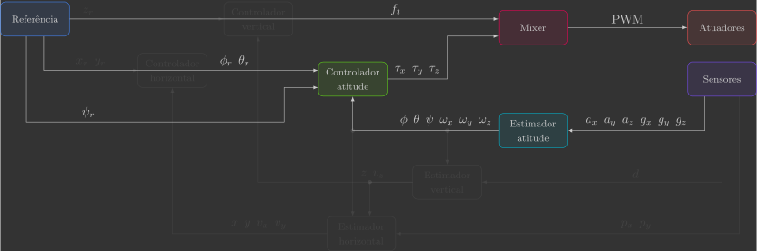

# Controlador de atitude

Nesta secção você irá implementar o controlador de atitude, que comanda os torques $\tau_x$, $\tau_y$ e $\tau_z$ a partir da diferença entre os ângulos de Euler de referência $\phi_r$, $\theta_r$ e $\psi_r$ e estimados $\phi$, $\theta$ e $\psi$.

{: width=100% style="display: block; margin: auto;" }

Para isto, será implementada uma nova função:

- `attitudeController()`

Além de uma alteração em uma função já previamente implementada:

- `reference()`

