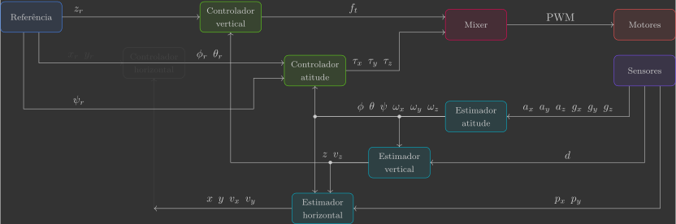
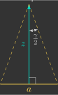

# :material-pan-horizontal: Estimador horizontal

Nesta secção você irá implementar o estimador horizontal, que estima as posições ${\color{var(--c1)}x}$ e ${\color{var(--c1)}y}$ e velocidades ${\color{var(--c1)}v_x}$ e ${\color{var(--c1)}v_y}$ a partir das leituras do sensor de fluxo óptico ${\color{var(--c3)}p_x}$ e ${\color{var(--c3)}p_y}$.

{: width=100% style="display: block; margin: auto;" }

Para isto, será implementada uma nova função:

- `horizontalEstimator()`

Além de uma alteração em uma função já previamente implementada:

- `sensors()`

---

## Implementação

Para começar, copie e cole o arquivo `vertical_controller.c` e renomeie ele para `horizontal_estimator.c`.

### Definições

#### Variáveis globais

Declare mais algumas variáveis globais, que correspondem às posições ${\color{var(--c1)}x}$ e ${\color{var(--c1)}y}$, velocidades ${\color{var(--c1)}v_x}$ e ${\color{var(--c1)}v_y}$ e leituras do sensor de fluxo óptico ${\color{var(--c3)}p_x}$ e ${\color{var(--c3)}p_y}$.

```c hl_lines="8 17 18"
// Actuators
float pwm1, pwm2, pwm3, pwm4; // Motors PWM

// Sensors
float ax, ay, az;             // Accelerometer [m/s^2]
float gx, gy, gz;             // Gyroscope [rad/s]
float d;                      // Range [m]
float px, py;                 // Optical flow [m]

// System inputs
float ft;                    // Thrust force [N]
float tx, ty, tz;            // Roll, pitch and yaw torques [N.m]

// System states
float phi, theta, psi;       // Euler angles [rad]
float wx, wy, wz;            // Angular velocities [rad/s]
float x, y, z;               // Positions [m]
float vx, vy, vz;            // Velocities [m/s]

// System references
float phi_r, theta_r, psi_r; // Euler angles reference [rad]
float z_r                    // Vertical position reference [m]
```

#### Variáveis de registro

Adicione as variáveis criadas ao grupo de registro previamente definido, para que seja possível visualizar nossa estimativa em tempo real no Crazyflie Client.

```c hl_lines="6 7 9 10"
// Logging group that stream variables to CFClient.
LOG_GROUP_START(stateEstimate)
LOG_ADD_CORE(LOG_FLOAT, roll, &log_phi)
LOG_ADD_CORE(LOG_FLOAT, pitch, &log_theta)
LOG_ADD_CORE(LOG_FLOAT, yaw, &log_psi)
LOG_ADD_CORE(LOG_FLOAT, x, &z)
LOG_ADD_CORE(LOG_FLOAT, y, &z)
LOG_ADD_CORE(LOG_FLOAT, z, &z)
LOG_ADD_CORE(LOG_FLOAT, vx, &vx)
LOG_ADD_CORE(LOG_FLOAT, vy, &vy)
LOG_ADD_CORE(LOG_FLOAT, vz, &vz)
LOG_GROUP_STOP(stateEstimate)
```

### Loop principal

Inclua a chamada da função `horizontalEstimator()` no loop principal.

```c hl_lines="10"
// Main application task
void appMain(void *param)
{
    // Infinite loop (runs at 200Hz)
    while (true)
    {
        reference();                  // Read reference setpoints (from Crazyflie Client)
        sensors();                    // Read raw sensor measurements
        attitudeEstimator();          // Estimate orientation (roll/pitch/yaw) from IMU sensor
        horizontalEstimator();        // Estimate horizontal positions/velocities from optical flow sensor
        verticalEstimator();          // Estimate vertical position/velocity from range sensor
        verticalController();         // Compute desired thrust force
        attitudeController();         // Compute desired roll/pitch/yaw torques
        mixer();                      // Convert desired force/torques into motor PWM
        actuators();                  // Send commands to motors
        vTaskDelay(pdMS_TO_TICKS(5)); // Loop delay (5 ms)
    }
}
```

### Funções

#### Sensores

Inclua na função `sensors()` um código adicional que pega as leituras do sensor de fluxo ópico e armazena elas nas variáveis globais previamente declaradas.

```c hl_lines="28-32"
// Get sensor readings from estimator module
void sensors()
{
    // Declare variable that store the most recent measurement from estimator
    static measurement_t measurement;

    // Retrieve the current measurement from estimator module
    while (estimatorDequeue(&measurement))
    {
        switch (measurement.type)
        {
        // Get accelerometer sensor readings and convert [G's -> m/s^2]
        case MeasurementTypeAcceleration:
            ax = -measurement.data.acceleration.acc.x * g;
            ay = -measurement.data.acceleration.acc.y * g;
            az = -measurement.data.acceleration.acc.z * g;
            break;
        // Get gyroscope sensor readings and convert [deg/s -> rad/s]
        case MeasurementTypeGyroscope:
            gx = measurement.data.gyroscope.gyro.x * pi / 180.0f;
            gy = measurement.data.gyroscope.gyro.y * pi / 180.0f;
            gz = measurement.data.gyroscope.gyro.z * pi / 180.0f;
            break;
        // Get flow sensor readings [m]
        case MeasurementTypeTOF:
            d = measurement.data.tof.distance;
            break;
        // Get optical flow sensor readings and convert [10px -> px]
        case MeasurementTypeFlow:
            px = measurement.data.flow.dpixelx * 0.1f;
            py = measurement.data.flow.dpixely * 0.1f;
            break;
        default:
            break;
        }
    }
}
```

#### Estimador vertical

A função `horizontalEstimator()` é quem estima as posições e velocidades horizontais a partir da leitura do sensor de proximidade.

```c
// Estimate horizontal positions and velocities from optical flow sensor
void horizontalEstimator()
{
}
```

O sensor de proximidade utilizado é o [PMW3901](https://www.pixart.com/products-detail/44/PMW3901MB-TXQT){target=_blank}, da PixArt Imaging Inc., localizado no Flow Deck v2.

{: width=30% style="display: block; margin: auto;" }

Esse sensor utiliza tecnologia de fluxo óptico (*"Optical flow"*), que mede a distância percorrida pelos pixeis de uma imagem em uma sequência de quadros. Ele possui um alcance de aproximadamente 8 cm até infinito e uma taxa de amostragem máxima de 500 Hz.

Sensores de fluxo óptico medem a velocidade de objetos dentro de seu feixe de visão.  conforme a Figura 

Sensores de fluxo óptico são dispositivos capazes de medir a velocidade de objetos dentro de seu feixe de visão sem contato físico, geralmente por uso de câmeras e processamento de imagem. Caso os objetos dentro do feixe de visão estejam parados, pode ser utilizado para medir a velocidade do dispositivo ao qual o sensor está preso. Isso é muito utilizado como uma alternativa ao GPS em locais internos.

##### Valor medido

Embora o sensor de fluxo óptico meça a velocidade do solo no referencial do drone, o que realmente nos interessa é a velocidade em relação ao sistema inercial. Para isso, precisamos corrigir a medida levando em conta a posição vertical e velocidade angular do drone.

!!! question "2D"    
    
    Determine a velocidade horizontal medida ${\color{var(--c3)}v_{y_m}}$ a partir do número de pixels lido pelo sensor fluxo óptico ${\color{var(--c3)}p_y}$ em um intervalo de tempo $\Delta t$ (sabe-se que o sensor tem um ângulo de visão $\gamma$ e resolução de $W$ pixels). Considere a posição vertical ${\color{var(--c1)}z}$ e velocidade angular ${\color{var(--c1)}\omega_x}$ já obtidos pelos outros estimadores.

    {: width=60% style="display: block; margin: auto;" }

    ??? info "Resposta"

        {: width=15% style="display: block; margin: auto;" }

        A distância $a$ pode ser determinada a partir da posição vertical ${\color{var(--c1)}z}$ e do ângulo de visão $\gamma$:

        $$
        \begin{align}
            \tan \left( \dfrac{\gamma}{2} \right) &= \dfrac{^a/_2}{{\color{var(--c1)}z}} \\
            a &= 2 {\color{var(--c1)}z} \tan \left( \dfrac{\gamma}{2} \right)
        \end{align}
        $$

        Como sabemos a resolução do sensor, podemos calcular o comprimento de cada pixel da imagem e usar esse fator para converter a leitura do sensor de fluxo óptico. Além disso, caso o drone apresente um movimento de rotação pura, o sensor iria detectar erroneamente uma velocidade que precisa ser desconsiderada.

        $$
        \begin{align}
            \color{var(--c3)}v_{y_m} &= \overbrace{\dfrac{a}{W}}^{\text{m/px}} \cdot \overbrace{\dfrac{{\color{var(--c3)}p_y}}{\Delta t}}^{\text{px/s}} - {\color{var(--c1)}\omega_x} {\color{var(--c1)}z} \\
            \color{var(--c3)}v_{y_m} &= \dfrac{2 {\color{var(--c1)}z} \tan \left( \frac{\gamma}{2} \right)}{W} \cdot \dfrac{{\color{var(--c3)}p_y}}{\Delta t} - {\color{var(--c1)}\omega_x} {\color{var(--c1)}z} \\
            \color{var(--c3)}v_{y_m} &= \underbrace{\dfrac{2 \tan \left( \frac{\gamma}{2} \right)}{W \Delta t}}_{\sigma} {\color{var(--c3)}p_y} {\color{var(--c1)}z} - {\color{var(--c1)}\omega_x} {\color{var(--c1)}z} \\
            \color{var(--c3)}v_{y_m} &= \left( \sigma {\color{var(--c3)}p_y} - {\color{var(--c1)}\omega_x} \right) {\color{var(--c1)}z}
        \end{align}
        $$

        O parâmetro $\sigma$ é uma constante.
        

!!! question "3D"    
    
    Determine as velocidades horizontais medidas ${\color{var(--c3)}v_{x_m}}$ e ${\color{var(--c3)}v_{y_m}}$ a partir do número de pixels lido pelo sensor fluxo óptico ${\color{var(--c3)}p_x}$ e ${\color{var(--c3)}p_y}$ em um intervalo de tempo $\Delta t$ (sabe-se que o sensor tem um ângulo de visão $\gamma$ e resolução de $W$ pixels). Considere a posição vertical ${\color{var(--c1)}z}$ e velocidades angulares ${\color{var(--c1)}\omega_x}$ e ${\color{var(--c1)}\omega_y}$ já obtidos pelos outros estimadores.

    {: width=60% style="display: block; margin: auto;" }

    ??? info "Resposta"
        
        Utilizando o mesmo racional do caso 2D, temos que:

        $$
        \left\{
        \begin{array}{l}
            {\color{var(--c3)}v_{x_m}} = \left( \sigma {\color{var(--c3)}p_x} + {\color{var(--c1)}\omega_y} \right) {\color{var(--c1)}z} \\
            {\color{var(--c3)}v_{y_m}} = \left( \sigma {\color{var(--c3)}p_y} - {\color{var(--c1)}\omega_x} \right) {\color{var(--c1)}z}
        \end{array}
        \right. 
        $$

        Onde:

        $$
        \sigma = \dfrac{2 \tan \left( \frac{\gamma}{2} \right)}{W \Delta t}
        $$
        
        
Inclua na função `horizontalEstimator()` duas variáveis locais ${\color{var(--c3)}v_{x_m}}$ e ${\color{var(--c3)}v_{y_m}}$, que correspondem aos valores medidos a partir das leituras do sensor de fluxo óptico ${\color{var(--c3)}p_x}$ e ${\color{var(--c3)}p_y}$, da posição vertical ${\color{var(--c1)}z}$ e das velocidades angulares ${\color{var(--c1)}\omega_x}$ e ${\color{var(--c1)}\omega_y}$(1). Em seguida, atribua essas variáveis as velocidades horizontais estimadas ${\color{var(--c1)}v_x}$ e ${\color{var(--c1)}v_y}$ e integre esses valores para obter as posições horizontais estimadas ${\color{var(--c1)}x}$ e ${\color{var(--c1)}y}$.
{.annotate}

1. Você precisará definir a constante $\sigma$, para isso considere $\gamma=42^{\circ}$ e $W=35\text{px}$.

```c hl_lines="5 8 9 12-15"
// Estimate horizontal position/velocity from optical flow sensor
void horizontalEstimator()
{
    // Estimator parameters
    static const float sigma = 

    // Measured velocities from optical flow
    float vx_m =
    float vy_m =

    // Estimated positions and velocities
    vx =
    vy =
    x =
    y =
}
```

Verifique como está sua estimativa, para isso carregue esse programa no drone e utilize o Crazyflie Client para visualizar o resultado.

!!! info "Resultado esperado"        
    Você deve notar que estamos compensando corretamente movimentos de rotação do drone. No entanto, a estimativa possui muito ruído. Para resolver isso, vamos implementar um observador de estados.

##### Observador de estados

Já vimos que um observador de estados é modelo que, a partir das entradas e saídas do sistema real (planta), estima internamente os seus estados. Como a dinâmica horizontal do drone é desacoplada, vamos projetar dois observadores de estados, um para cada eixo:

- O primeiro é um sistema cujas entradas são o ângulo de inclinação ${\color{var(--c1)}\theta}$ e a velocidade horizontal medida ${\color{var(--c3)}v_{x_m}}$, e as saídas são a posição e velocidade horizontais estimadas ${\color{var(--c1)}x}$ e ${\color{var(--c1)}v_x}$.

{: width=75% style="display: block; margin: auto;" }

- O segundo é um sistema cujas entradas são o ângulo de rolagem ${\color{var(--c1)}\phi}$ e a velocidade horizontal medida ${\color{var(--c3)}v_{y_m}}$, e as saídas são a posição e velocidade horizontais estimadas ${\color{var(--c1)}y}$ e ${\color{var(--c1)}v_y}$.

{: width=75% style="display: block; margin: auto;" }

Note que em ambos os casos estamos realimentando a diferença entre a velocidade horizontal medida e estimada, garantindo assim que a velocidade horizontal estimada convirja exponencialmente à velocidade horizontal medida, desde que o ganho do observador $l$ seja positivo(1). No entanto, como não estamos realimentando a posição (pois não temos sensor para isso), nossa estimativa de posição irá divergir com o tempo, algo que só seria possível de evitar com um sensor adicional(2).
{.annotate} 

1. Lembre-se que o ganho do estimador $l$ equivale à frequência de corte $\omega_c$}.
2. Por exemplo, um GPS.

As etapas de predição e e correção correspondentes ao diagrama de blocos acima são as seguintes:

$$
\begin{align}
    \text{Predição:} &\quad 
    \left\{
    \begin{array}{l}
        {\color{var(--c1)}x[k+1]} = {\color{var(--c1)}x[k]} + {\color{var(--c1)}v_x[k]} \Delta t \\
        {\color{var(--c1)}y[k+1]} = {\color{var(--c1)}y[k]} + {\color{var(--c1)}v_y[k]} \Delta t \\
        {\color{var(--c1)}v_x[k+1]} = {\color{var(--c1)}v_x[k]} + g {\color{var(--c1)}\theta[k]} \Delta t \\
        {\color{var(--c1)}v_y[k+1]} = {\color{var(--c1)}v_y[k]} - g {\color{var(--c1)}\phi[k]} \Delta t
    \end{array}
    \right.  \\ \\
    \text{Correção:} &\quad 
    \left\{
    \begin{array}{l}
        {\color{var(--c1)}v_x[k+1]} = {\color{var(--c1)}v_x[k+1]} + l \Delta t \left({\color{var(--c3)}v_{x_m}[k]} - {\color{var(--c1)}v_x[k+1]}\right) \\
        {\color{var(--c1)}v_y[k+1]} = {\color{var(--c1)}v_y[k+1]} + l \Delta t \left({\color{var(--c3)}v_{y_m}[k]} - {\color{var(--c1)}v_y[k+1]}\right)
    \end{array}
    \right.
\end{align}
$$

Modifique a etapa de predição de $v_z$ na sua função `verticalEstimator()` para que ela leve em consideração também as entradas do sistema.

Modifique sua função `horizontalEstimator()` para que as posições horizontais ${\color{var(--c1)}x}$ e ${\color{var(--c1)}y}$ e velocidades horizontais ${\color{var(--c1)}v_x}$ e ${\color{var(--c1)}v_y}$ sejam estimadas através de um observador de estados com as etapas de predição e correção.

```c hl_lines="6 13-16 19-20"
// Estimate horizontal position/velocity from optical flow sensor
void horizontalEstimator()
{
    // Estimator parameters
    static const float sigma = 
    static const float wc = 

    // Measured velocities from optical flow
    float vx_m =
    float vy_m =

    // Prediction step (model)
    x =
    y =
    vx =
    vy =

    // Correction step (measurement)
    vx =
    vy = 
}
```

Experimente uma frequência de corte $\omega_c = 50$rad/s e verifique como isso influencia na sua estimativa.

!!! info "Resultado esperado"        
    Sua estimativa deve estar muito melhor, filtrando ruídos adequadamente.


