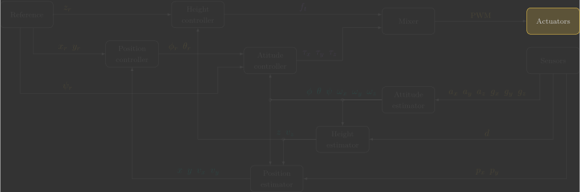
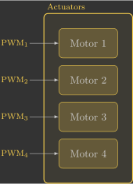

# :material-fan: Actuators

In this section, you will implement the actuators function, which receives the PWM commands and sends them to the BLDC motor drivers.

{: width=100% style="display: block; margin: auto;" }

---

## Overview

The following diagram illustrates the internal structure of the reference function:

{: width=25% style="display: block; margin: auto;" }

Before we begin, it is important to understand a few concepts:

- Arming the quadcopter means enabling the motors to operate. This is done manually by the operator through the Crazyflie Client and can be checked in the firmware using the `supervisorIsArmed()` function.
- The motors are controlled using the `motorsSetRatio(id, ratio)` function, where `id` specifies the motor and `ratio` specifies its power level:
    - The Crazyflie has four motors, identified as `MOTOR_M1`, `MOTOR_M2`, `MOTOR_M3`, and `MOTOR_M4`.
    - The power level ranges from `0` (off) to `UINT16_MAX` (maximum power).

---

## Implementation

The first step in our function is to check whether the quadcopter is armed. If it is not, all motors must be commanded to stop.

If the quadcopter is armed, we perform a second check: whether the height reference $z_r$ is greater than zero. In other words, we check if the quadcopter has been instructed to take off.

If the height reference greater than zero, the PWM values stored in the global variables are applied to each of the four motors. Otherwise, all four motors are commanded to a fixed PWM value of 10%.

This constant 10% duty cycle is known as the idle PWM. It keeps the BLDC motors spinning at a low speed so they are already running when takeoff is commanded, allowing them to respond immediately and reliably.

The code below implements this logic.

```c linenums="62"
// Send commands to motors
void actuators()
{
    // Check is quadcopter is armed or disarmed
    if (supervisorIsArmed())
    {
        // Check if quadcopter has been commanded to take-off or land
        if (z_r > 0.0f)
        {
            // Apply calculated PWM values if is commanded to take-off
            motorsSetRatio(MOTOR_M1, pwm1 * UINT16_MAX);
            motorsSetRatio(MOTOR_M2, pwm2 * UINT16_MAX);
            motorsSetRatio(MOTOR_M3, pwm3 * UINT16_MAX);
            motorsSetRatio(MOTOR_M4, pwm4 * UINT16_MAX);
        }
        else
        {
            // Apply idle PWM value if is commanded to land
            motorsSetRatio(MOTOR_M1, 0.1f * UINT16_MAX);
            motorsSetRatio(MOTOR_M2, 0.1f * UINT16_MAX);
            motorsSetRatio(MOTOR_M3, 0.1f * UINT16_MAX);
            motorsSetRatio(MOTOR_M4, 0.1f * UINT16_MAX);
        }
    }
    else
    {
        // Turn-off all motor if disarmed
        motorsStop();
    }
}

```

You can simply copy and paste the code above. However, take some time to understand what each line does (the comments are there to guide you).