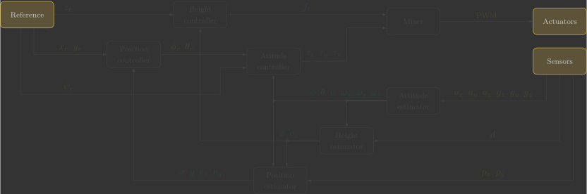
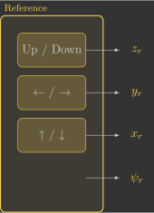
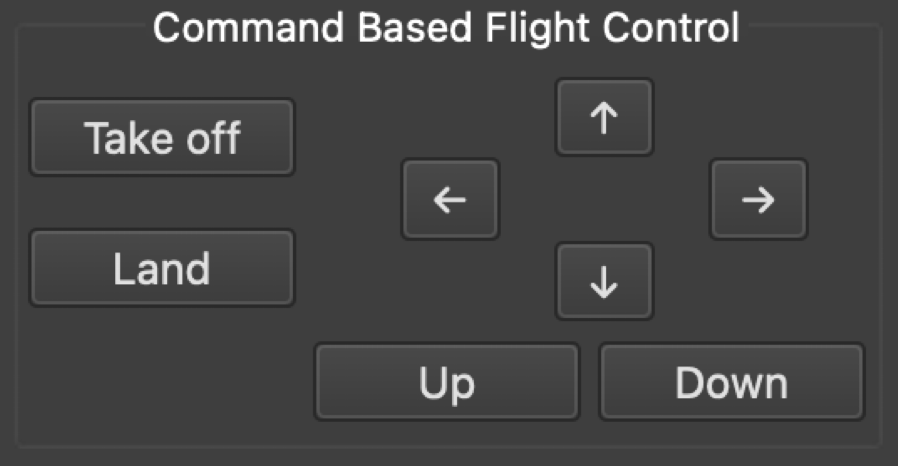

# :material-knob: Reference

In this section, you will implement the reference function, which retrieves the desired flight references transmitted wirelessly from the Crazyflie Client.

{: width=100% style="display: block; margin: auto;" }

---

## Overview

The following diagram illustrates the internal structure of the reference function:

{: width=25% style="display: block; margin: auto;" }

Before we begin, it is important to understand a few key concepts:

- The reference commands are sent wirelessly by the Command-Based Flight Control interface in the Crazyflie Client:
    - The ++"↑"++ and ++"↓"++ buttons change `setpoint.position.x` in increments of $0.5$
    - The ++"←"++ and ++"→"++ buttons change `setpoint.position.y` in increments of $0.5$
    - The ++"Up"++ and ++"Down"++ buttons change `setpoint.position.z` in increments of $0.5$
    - The ++"Take off"++ button sets `setpoint.position.z` to $0.5$, while the ++"Land"++ button sets it to $0$

{: width=50% style="display: block; margin: auto;" }

- The commander module stores the latest reference commands in a setpoint_t structure. These values can be retrieved using the `commanderGetSetpoint()` function.

---

## Implementation

The first step is to retrieve the most recent setpoint from the commander module. The returned structure contains several reference variables. We extract these values and store them in the global variables used by the controller.

The code below implements this logic.

```c linenums="72"
 // Read reference setpoints (from Crazyflie Client)
void reference()
{
    // Declare variables that store the most recent setpoint and state from commander
    static setpoint_t setpoint;
    static state_t state;

    // Retrieve the current commanded setpoints and state from commander module
    commanderGetSetpoint(&setpoint, &state);

    // Extract position references from the received setpoint
    x_r = setpoint.position.x;   // X position reference [m]
    y_r = setpoint.position.y;   // Y position reference [m]
    z_r = setpoint.position.z;   // Z position reference [m]
    psi_r = 0.0f;                // Yaw angle reference [rad]
}
```

!!! warning "Important"
    The Command-Based Flight Control interface does not provide a yaw reference, therefore it is fixed at $\psi_r=0$. However, it is possible to map `setpoint.position.y` to the yaw reference and keep the lateral position reference fixed at $y_r = 0$:
    
    ```c linenums="82"
    // Extract position references from the received setpoint
    x_r = setpoint.position.x;               // X position reference [m]
    y_r = 0.0f;                              // Y position reference [m]
    z_r = setpoint.position.z;               // Z position reference [m]
    psi_r = setpoint.position.y * pi / 2.0f; // Yaw angle reference [rad] (maps 0.5m -> 45º)
    ```
    
    This allows the ++"←"++ and ++"→"++ buttons to rotate the quadcopter about its vertical axis rather than translate it sideways.

You can simply copy and paste the code above. However, take some time to understand what each line does (the comments are there to guide you).

