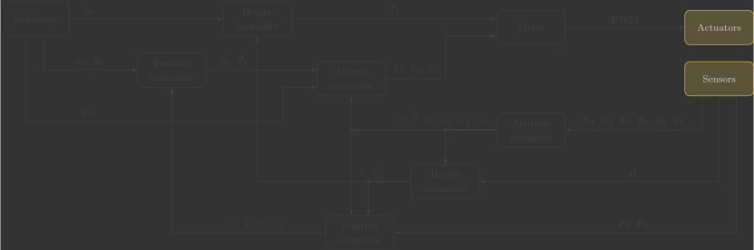
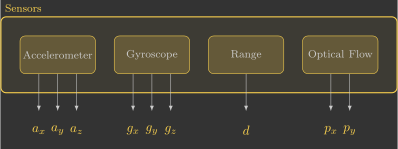

# :material-compass-outline: Sensors

In this section, you will implement the sensors function, which reads raw measurements from the accelerometer (${\color{var(--c3)}a_x}$, ${\color{var(--c3)}a_y}$ and ${\color{var(--c3)}a_z}$), gyroscope (${\color{var(--c3)}g_x}$, ${\color{var(--c3)}g_y}$ and ${\color{var(--c3)}g_z}$), range sensor (${\color{var(--c3)}d}$) and optical flow sensor (${\color{var(--c3)}p_x}$ and ${\color{var(--c3)}p_y}$) by retrieving data from the firmware's internal sensor pipeline.

{: width=100% style="display: block; margin: auto;" }

---

## Overview

The following diagram illustrates the internal structure of the sensors function:

{: width=60% style="display: block; margin: auto;" }

Before we begin, it is important to understand a few key concepts:

- Sensor measurements in the Crazyflie are processed by the state estimation system and delivered through an internal queue. We use the `estimatorDequeue(&m)` function to retrieve the next measurement and store it in the `measurement_t m` structure. The type of measurement is identified by `m.type`.
- The estimator continuously receives high-frequency data from the IMU (accelerometer and gyroscope), the range sensor (ToF lidar), and the optical flow camera.

---

## Implementation

The estimator continuously receives measurements from all onboard sensors and stores them in an internal queue. Our task is to retrieve these measurements one by one.

Each measurement contains a type identifier, which tells us which sensor produced the data. We use a switch statement to process each measurement accordingly.

For the accelerometer and gyroscope, the readings are converted to SI units ($\text{m/s}^2$ and $\text{rad/s}$, respectively). The range sensor already provides measurements in $\text{m}$, while the optical flow sensor values are scaled from tenths of a pixel to pixels.

The code below implements this logic.

```c linenums="67"
// Read raw sensor measurements
void sensors()
{
    // Declare a variable that stores the most recent measurement from the estimator
    static measurement_t measurement;

    // Retrieve the current measurement from estimator module
    while (estimatorDequeue(&measurement))
    {
        switch (measurement.type)
        {
        // Get accelerometer sensor readings and convert [G's -> m/s^2]
        case MeasurementTypeAcceleration:
            ax = -measurement.data.acceleration.acc.x * g;
            ay = -measurement.data.acceleration.acc.y * g;
            az = -measurement.data.acceleration.acc.z * g;
            break;
        // Get gyroscope sensor readings and convert [deg/s -> rad/s]
        case MeasurementTypeGyroscope:
            gx = measurement.data.gyroscope.gyro.x * pi / 180.0f;
            gy = measurement.data.gyroscope.gyro.y * pi / 180.0f;
            gz = measurement.data.gyroscope.gyro.z * pi / 180.0f;
            break;
        // Get flow sensor readings [m]
        case MeasurementTypeTOF:
            d = measurement.data.tof.distance;
            break;
        // Get optical flow sensor readings and convert [10.px -> px]
        case MeasurementTypeFlow:
            px = measurement.data.flow.dpixelx * 0.1f;
            py = measurement.data.flow.dpixely * 0.1f;
            break;
        default:
            break;
        }
    }
}
```

You can simply copy and paste the code above. However, take some time to understand what each line does (the comments are there to guide you).