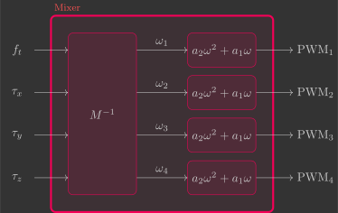

# Mixer

Nesta secção você irá implementar o mixer, que converte a força de propulsão total $f_t$ e torques $\tau_x$, $\tau_y$ e $\tau_z$ comandados nos sinais PWM correspondentes dos motores.

{: width=100% style="display: block; margin: auto;" }

Para isto, serão implementadas três funções:

- `reference()`
- `mixer()`
- `motors()`

---

## Fundamentos

Já [deduzimos](../basic_concepts/mixer.md) a matriz $M^{-1}$ que converte as força e torques totais $f_t$, $\tau_x$, $\tau_y$ e $\tau_z$ produzidos pelas hélices no quadrado das velocidades angulares $\omega_1$, $\omega_2$, $\omega_3$ e $\omega_4$ dos motores:

$$
\begin{bmatrix}
    \omega_1^2 \\
    \omega_2^2 \\
    \omega_3^2 \\
    \omega_4^2
\end{bmatrix}
= 
\underbrace{
\begin{bmatrix} 
    \frac{1}{4 k_l} & - \frac{1}{4 k_l l} & - \frac{1}{4 k_l l} & - \frac{1}{4 k_d}  \\ 
    \frac{1}{4 k_l} & - \frac{1}{4 k_l l} & \frac{1}{4 k_l l} & \frac{1}{4 k_d} \\ 
    \frac{1}{4 k_l} & \frac{1}{4 k_l l} & \frac{1}{4 k_l l} & - \frac{1}{4 k_d} \\ 
    \frac{1}{4 k_l} & \frac{1}{4 k_l l} & - \frac{1}{4 k_l l} & \frac{1}{4 k_d} 
\end{bmatrix}
}_{M^{-1}}
\begin{bmatrix}
    f_t \\
    \tau_x \\
    \tau_y \\
    \tau_z
\end{bmatrix}
$$

Além disso, também já [determinanos](../identification/motor_coeficients.md) os coeficientes do motor $a_2$ e $a_1$ que convertem a velocidade angular $\omega$ do motor no sinal PWM correspondente:

$$
    PWM = a_2 \omega^2 + a_1 \omega
$$

Se justarmos essas duas funções, temos a lógica do mixer:

{: width=50% style="display: block; margin: auto;" }


---

## Algoritmo

Crie um arquivo chamado `mixer.c` dentro da pasta `src/control`.

### Bibliotecas necessárias

Logo no início desse arquivo, importe todas as bibliotecas que serão utilizadas.

```c
#include "math.h"       // Math functions (e.g., sqrtf, roundf, powf)
#include "FreeRTOS.h"   // FreeRTOS core definitions (needed for task handling and timing)
#include "task.h"       // FreeRTOS task functions (e.g., vTaskDelay)
#include "supervisor.h" // Functions to check flight status (e.g., supervisorIsArmed)
#include "commander.h"  // Access to commanded setpoints (e.g., commanderGetSetpoint)
#include "estimator.h"  // Estimation framework for sensor fusion
#include "motors.h"     // Low-level motor control interface (e.g., motorsSetRatio)
#include "debug.h"      // Debug printing functions (e.g., DEBUG_PRINT)
#include "log.h"        // Logging utilities to send data to the CFClient
```

### Variáveis globais

Na sequência, declare(1) algumas constantes físicas e parâmetros do quadricoptero que serão bastante utilizados.
{ .annotate }

1. Usamos `const` para garantir que o valor não muda em tempo de execução. Já o `static` limita a visibilidade da variável ao arquivo atual, evitando conflitos de nomes em outros arquivos. Assim, `static const` cria constantes imutáveis e restritas ao arquivo.

```c
// Physical constants
static const float pi = 3.1416f; // Mathematical constant
static const float g = 9.81f;    // Gravitational acceleration [m/s^2]
static const float dt = 0.005f;  // Loop time step [s] (5 ms -> 200 Hz)

// Quadcopter parameters
static const float l = 35.0e-3f;   // Distance from motor to quadcopter center of mass [m]
static const float m = 37.0e-3f;   // Mass [kg]
static const float Ixx = 20.0e-6f; // Moment of inertia around x-axis [kg.m^2]
static const float Iyy = 20.0e-6f; // Moment of inertia around y-axis [kg.m^2]
static const float Izz = 40.0e-6f; // Moment of inertia around z-axis [kg.m^2]
```

### Variáveis globais

Em seguida, declare as variáveis globais que serão utilizadas no Mixer.

```c
// System inputs
float ft;                     // Thrust force [N]
float tx, ty, tz;             // Torques [N.m]

// Motors
float pwm1, pwm2, pwm3, pwm4; // PWM
```

### Funções

#### Referência

```c
// Get reference setpoints from commander module
void reference()
{
    // Declare variables that store the most recent setpoint and state from commander
    static setpoint_t setpoint;
    static state_t state;

    // Retrieve the current commanded setpoints and state from commander module
    commanderGetSetpoint(&setpoint, &state);

    // Extract position references from the received setpoint
    ft = roundf((setpoint.position.z) * 2.0f) / 100.0f;     // Thrust command [N] (maps 0.5m -> 0.01N)
    tx = -roundf((setpoint.position.y) * 2.0f) / 1000.0f;   // Roll torque command [N.m] (maps 0.5m -> 0.001N.m)
    ty = roundf((setpoint.position.x) * 2.0f) / 1000.0f;    // Pitch torque command [N.m] (maps 0.5m -> 0.001N.m)
    tz = 0.0f;                                              // Yaw torque command [N.m]

    // Print debug info for the control efforts
    DEBUG_PRINT("Ft (N): %.2f | Tx (N.m): %.3f | Ty (N.m): %.3f  | Tz (N.m): %.3f \n", (double)ft, (double)tx, (double)ty, (double)tz);
}
```

#### Mixer

```c
// Compute motor commands
void mixer()
{
    // Quadcopter parameters
    static const float l = 0.0f;   // Distance from motor to quadcopter center of mass [m]
    static const float a2 = 0.0f;  // Quadratic motor model gain [s^2/rad^2]
    static const float a1 = 0.0f;  // Linear motor model gain [s/rad]
    static const float kl = 0.0f; // Lift constant [N.s^2]
    static const float kd = 0.0f; // Drag constant [N.m.s^2]

    // Compute required motor angular velocities squared (omega^2)
    float omega1 = 0.0f;
    float omega2 = 0.0f;
    float omega3 = 0.0f;
    float omega4 = 0.0f;

    // Clamp to non-negative and take square root
    omega1 = 0.0f;
    omega2 = 0.0f;
    omega3 = 0.0f;
    omega4 = 0.0f;

    // Compute motor PWM using motor model
    pwm1 = 0.0f;
    pwm2 = 0.0f;
    pwm3 = 0.0f;
    pwm4 = 0.0f;
}
```

#### Motores

```c
// Apply motor commands
void motors()
{
    // Check is quadcopter is armed or disarmed
    if (supervisorIsArmed())
    {
        // Apply calculated PWM values if is commanded to take-off
        motorsSetRatio(MOTOR_M1, pwm1 * UINT16_MAX);
        motorsSetRatio(MOTOR_M2, pwm2 * UINT16_MAX);
        motorsSetRatio(MOTOR_M3, pwm3 * UINT16_MAX);
        motorsSetRatio(MOTOR_M4, pwm4 * UINT16_MAX);
    }
    else
    {
        // Turn-off all motor if disarmed
        motorsStop();
    }
}
```

### Loop principal

```c
// Main application task
void appMain(void *param)
{
    // Infinite loop (runs at 200Hz)
    while (true)
    {
        reference();                  // Get reference setpoints from commander module
        mixer();                      // Compute motor commands
        motors();                     // Apply motor commands
        vTaskDelay(pdMS_TO_TICKS(5)); // Wait 5 ms
    }
}
```

---

## Validação
