# :material-rotate-orbit: Attitude Estimator

In this section, you will implement the `attitudeEstimator()` function, which estimates the Euler angles ${\color{var(--c1)}\phi}$, ${\color{var(--c1)}\theta}$, and ${\color{var(--c1)}\psi}$, as well as the angular velocities ${\color{var(--c1)}\omega_x}$, ${\color{var(--c1)}\omega_y}$, and ${\color{var(--c1)}\omega_z}$, from the accelerometer measurements ${\color{var(--c3)}a_x}$, ${\color{var(--c3)}a_y}$ and ${\color{var(--c3)}a_z}$ and the gyroscope measurements ${\color{var(--c3)}g_x}$, ${\color{var(--c3)}g_y}$ and ${\color{var(--c3)}g_z}$.

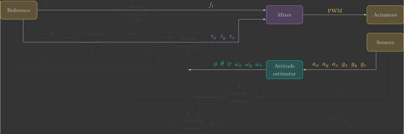{: width=100% style="display: block; margin: auto;" }
---

## Overview

The Crazyflie 2.1 Brushless IMU(1) is the [BMI088](https://www.bosch-sensortec.com/en/products/motion-sensors/imus/bmi088){target=_blank} from Bosch. It is located on the top side of the quadcopter, underneath the battery.
{.annotate}

1. Inertial Measurement Unit

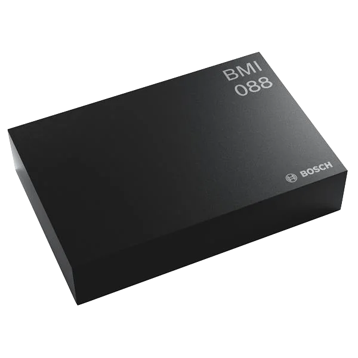{: width=30% style="display: block; margin: auto;" }

This sensor uses MEMS(1) technology to measure linear acceleration and angular velocity through the motion of microscopic mechanical structures integrated into the chip. These measurements are acquired entirely electronically at a high sampling rate, making it possible to estimate the quadcopter's attitude in real time.
{.annotate}

1. Micro-Electro-Mechanical Systems

For didactic purposes, we begin with the 2D dynamics, where you will estimate a single Euler angle. You will first implement an estimator based solely on the accelerometer, followed by one that relies only on the gyroscope. After understanding the strengths and limitations of each sensor individually, you will combine their measurements in a way that leverages the strengths of both sensors to produce a more robust and accurate attitude estimate. Finally, you will extend the estimator to the full 3D dynamics, estimating all Euler angles and angular velocities using the same approach.


## Accelerometer

Inertial accelerometers are sensors that measure linear acceleration. They consist of a proof mass suspended inside a housing by a spring and a damper:

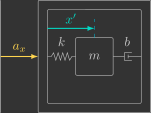{: width=300 style="display: block; margin: auto;" }

When the housing experiences a linear acceleration ${\color{var(--c3)}a_x}$, the proof mass lags behind due to its inertia, causing a relative displacement ${\color{var(--c1)}x'}$ with respect to the housing. By measuring this displacement, the sensor can infer the linear acceleration acting on the housing.

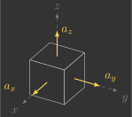{: width=300 style="display: block; margin: auto;" }

By mounting three accelerometers orthogonally (one aligned with each axis), we obtain a three-axis accelerometer, capable of measuring linear acceleration along the $x$, $y$, and $z$ axes.


### Computing angle from linear acceleration

The accelerometer is fixed to the quadcopter's body-fixed reference frame. When the quadcopter is stationary or moving at approximately constant velocity, the only acceleration measured by the accelerometer is gravity. Since the gravity vector always points downward in the inertial reference frame, the accelerometer readings ${\color{var(--c3)}a_y}$ and ${\color{var(--c3)}a_z}$ are related to the roll angle ${\color{var(--c1)}\phi}$ as follows:
{.annotate}


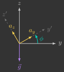{: width=250 style="display: block; margin: auto;" }

$$
\begin{align}
    \begin{bmatrix}
        {\color{var(--c3)}a_y} \\
        {\color{var(--c3)}a_z} 
    \end{bmatrix} &= R {\color{var(--c2)}\vec{g}} \\
    \begin{bmatrix}
        {\color{var(--c3)}a_y} \\
        {\color{var(--c3)}a_z} 
    \end{bmatrix}
    &=
    \begin{bmatrix} 
        \cos {\color{var(--c1)}\phi} & \sin {\color{var(--c1)}\phi} \\
        -\sin {\color{var(--c1)}\phi} & \cos {\color{var(--c1)}\phi}
    \end{bmatrix}
    \begin{bmatrix}
        0 \\
        -{\color{var(--c2)}g}
    \end{bmatrix} \\
    \begin{bmatrix}
        {\color{var(--c3)}a_y} \\
        {\color{var(--c3)}a_z} 
    \end{bmatrix}
    &=
    \begin{bmatrix}
        -{\color{var(--c2)}g}\sin{\color{var(--c1)}\phi}	\\
        -{\color{var(--c2)}g}\cos{\color{var(--c1)}\phi}
    \end{bmatrix}
\end{align}
$$

By dividing the two equations, the gravitational acceleration ${\color{var(--c2)}g}$ cancels out, allowing the roll angle ${\color{var(--c1)}\phi}$ to be computed directly from the accelerometer measurements ${\color{var(--c3)}a_y}$ and ${\color{var(--c3)}a_z}$(1):
{.annotate}

1. The negative signs are intentionally kept, since you will use the `atan2f` function in your code to correctly determine the quadrant of the angle.

$$
\begin{align}
    \frac{{\color{var(--c3)}a_y}}{{\color{var(--c3)}a_z}} &= \frac{-\cancel{{\color{var(--c2)}g}}\sin{\color{var(--c1)}\phi}}{-\cancel{{\color{var(--c2)}g}}\cos{\color{var(--c1)}\phi}} \\
    \frac{-{\color{var(--c3)}a_y}}{-{\color{var(--c3)}a_z}} &= \tan{\color{var(--c1)}\phi} \\
    {\color{var(--c1)}\phi} &= \tan^{-1} \left( \dfrac{-{\color{var(--c3)}a_y}}{-{\color{var(--c3)}a_z}} \right)
\end{align}
$$

Since this angle is computed directly from the accelerometer measurements, we will denote it by ${\color{var(--c3)}\phi_a}$ to distinguish it from the estimated angle ${\color{var(--c1)}\phi}$:

$$
    {\color{var(--c3)}\phi_a} = \tan^{-1} \left( \dfrac{-{\color{var(--c3)}a_y}}{-{\color{var(--c3)}a_z}} \right)
$$

Initially, the estimated angle ${\color{var(--c1)}\phi}$ is simply set equal to the accelerometer-based angle ${\color{var(--c3)}\phi_a}$, as illustrated in the block diagram below:

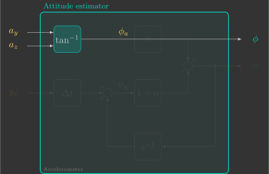{: width=600 style="display: block; margin: auto;" }

In the `attitudeEstimator()` function, compute the accelerometer-based angle ${\color{var(--c3)}\phi_a}$ from the accelerometer measurements ${\color{var(--c3)}a_y}$ and ${\color{var(--c3)}a_z}$, then assign it to the estimated angle ${\color{var(--c1)}\phi}$(1).
{.annotate}

1. The result is also stored in a logging variable in degrees (rather than radians) so it can be visualized in the Crazyflie Client.


```c hl_lines="5 8"
// Estimate orientation from IMU sensor
void attitudeEstimator()
{
    // Computed angle from accelerometer
    float phi_a = 

    // Estimated angle (accelerometer)
    phi = 

    // Auxiliary variables for logging Euler angles (CFClient uses degrees instead of radians)
    log_phi = phi * 180.0f / pi;
}
```

Verify how your estimator performs by uploading the program to the quadcopter and visualizing the result in the Crazyflie Client.

!!! info "Expected result"
    You should notice that this estimator performs well only under static or slow-motion conditions. During dynamic maneuvers, the accelerometer measures not only gravity but also the quadcopter's translational acceleration. These additional accelerations introduce errors in the computed angle. One way to reduce this effect is to apply a low-pass filter, which attenuates high-frequency accelerations while preserving the gravity component.

### Low-pass filter

A low-pass filter attenuates signals above a given cutoff frequency $\omega_c$. It is commonly used to reduce noise, since noise typically contains higher-frequency components than the signal of interest.

To reduce the noise in the accelerometer-based angle ${\color{var(--c3)}\phi_a}$, we pass it through a low-pass filter. The resulting output becomes the estimated angle ${\color{var(--c1)}\phi}$, as illustrated in the block diagram below:

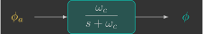{: width=350 style="display: block; margin: auto;" }

Since this filter will be implemented on a microcontroller, we first derive its discrete-time equivalent. We begin by obtaining the corresponding differential equation using the inverse Laplace transform:

$$
\begin{align*}
    \frac{{\color{var(--c1)}\phi(s)}}{{\color{var(--c3)}\phi_a(s)}} &= \frac{\omega_c}{s+\omega_c} \\
    \left( s + \omega_c \right) {\color{var(--c1)}\phi(s)} &= \omega_c{\color{var(--c3)}\phi_a(s)} \\
    s{\color{var(--c1)}\phi(s)} + \omega_c{\color{var(--c1)}\phi(s)} &= \omega_c{\color{var(--c3)}\phi_a(s)} \\
    &\Downarrow ^\text{Inverse Laplace}_\text{transform} \\
    \frac{d}{dt}{\color{var(--c1)}\phi(t)} + \omega_c{\color{var(--c1)}\phi(t)} &= \omega_c{\color{var(--c3)}\phi_a(t)}
\end{align*}
$$

Next, we discretize the differential equation using the implicit Euler method(1):
{.annotate}

1. The explicit (forward) Euler method approximates $\frac{d}{dt}x(t)$ as $\frac{x(t+\Delta t)-x(t)}{\Delta t}$, whereas the implicit (backward) Euler method approximates it as $\frac{x(t)-x(t-\Delta t)}{\Delta t}$.

$$
\begin{align*}
    \frac{d}{dt}{\color{var(--c1)}\phi(t)} + \omega_c\phi(t) &= \omega_c{\color{var(--c3)}\phi_a(t)} \\
    &\Downarrow ^\text{Implicit}_\text{Euler} \\
    \frac{{\color{var(--c1)}\phi[k]}-{\color{var(--c1)}\phi[k-1]}}{\Delta t} + \omega_c{\color{var(--c1)}\phi[k]} &= \omega_c{\color{var(--c3)}\phi_a[k]} \\
    {\color{var(--c1)}\phi[k]}-{\color{var(--c1)}\phi[k-1]} + \omega_c\Delta t{\color{var(--c1)}\phi[k]} &= \omega_c\Delta t{\color{var(--c3)}\phi_a[k]} \\
    \left( 1+\omega_c\Delta t\right) {\color{var(--c1)}\phi[k]} &= {\color{var(--c1)}\phi[k-1]} + \omega_c\Delta t{\color{var(--c3)}\phi_a[k]} \\
    {\color{var(--c1)}\phi[k]} &= \underbrace{\frac{1}{1+\omega_c\Delta t}}_{\left(1-\alpha\right)} {\color{var(--c1)}\phi[k-1]} + \underbrace{\frac{\omega_c\Delta t}{1+\omega_c\Delta t}}_{\alpha} {\color{var(--c3)}\phi_a[k]} \\
    {\color{var(--c1)}\phi[k]} &= \left( 1-\alpha \right){\color{var(--c1)}\phi[k-1]}+\alpha{\color{var(--c3)}\phi_a[k]}
\end{align*}
$$

Notice that the discrete-time low-pass filter is simply a weighted average between the previous estimate ${\color{var(--c1)}\phi}$ and the newly computed accelerometer-based angle ${\color{var(--c3)}\phi_a}$, where $\alpha$ is the weighting factor. This is illustrated in the block diagram below:

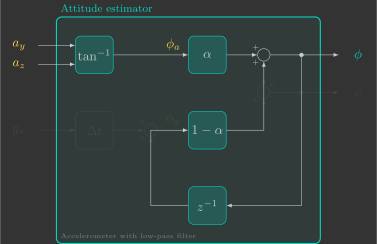{: width=600 style="display: block; margin: auto;" }

The parameter $\alpha$, known as the smoothing factor, depends on the cutoff frequency $\omega_c$ and the sampling interval $\Delta t$:

$$
\alpha = \frac{\omega_c\Delta t}{1+\omega_c\Delta t}
$$

- A higher cutoff frequency $\omega_c$ makes $\alpha$ closer to $1$, giving more weight to the accelerometer-based angle ${\color{var(--c3)}\phi_a}$. This allows the estimate to respond more quickly, but also passes more noise.
- A lower cutoff frequency $\omega_c$ makes $\alpha$ closer to $0$, giving more weight to the previous estimate ${\color{var(--c1)}\phi}$. This reduces noise, but increases the response time.

Choosing the cutoff frequency $\omega_c$ therefore involves balancing noise reduction against estimation delay.

<!-- [Figure] -->

Modify your `attitudeEstimator()` function so that the estimated angle ${\color{var(--c1)}\phi}$ is obtained by applying a low-pass filter to the accelerometer-based angle ${\color{var(--c3)}\phi_a}$.

```c hl_lines="5 6 12"
// Estimate orientation from IMU sensor
void attitudeEstimator()
{
    // Estimator parameters
    static const float wc = 
    static const float alpha = 

    // Computed angle from accelerometer
    float phi_a = 

    // Estimated angle (accelerometer with low-pass filter)
    phi = 

    // Auxiliary variables for logging Euler angles (CFClient uses degrees instead of radians)
    log_phi = phi * 180.0f / pi;
}
```

Try cutoff frequencies of $1~\text{rad/s}$, $10~\text{rad/s}$ and $100~\text{rad/s}$, and observe how they affect the estimated angle. Upload the program to the quadcopter and visualize the result in the Crazyflie Client.

!!! info "Expected result"
    You should notice that, even with an appropriately chosen cutoff frequency, this estimator is still unsuitable for dynamic conditions. During rapid maneuvers, the accelerometer measures both gravity and translational acceleration, making it impossible for a low-pass filter alone to recover the correct attitude. In the next section, we will set the accelerometer aside and estimate the attitude using only the gyroscope.

## Gyroscope

Inertial gyroscopes are sensors that measure angular velocity. They consist of a proof mass suspended inside a housing by springs and dampers:

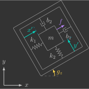{: width=300 style="display: block; margin: auto;" }

The proof mass is driven to oscillate along the ${\color{var(--c1)}x'}$ axis by a periodic force ${\color{var(--c2)}f}=f_0\sin(\omega_0t)$. When the housing rotates with an angular velocity ${\color{var(--c3)}g_z}$, the resulting Coriolis force causes the proof mass to oscillate along the ${\color{var(--c1)}y'}$ axis. By measuring the amplitude of this secondary oscillation, the sensor can infer the angular velocity acting on the housing.

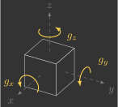{: width=300 style="display: block; margin: auto;" }

By mounting three gyroscopes orthogonally (one aligned with each axis), we obtain a three-axis gyroscope, capable of measuring angular velocity about the $x$, $y$, and $z$ axes.

### Computing angle from angular velocity

The gyroscope is fixed to the quadcopter's body-fixed reference frame and measures angular velocity. Therefore, the angular displacement can be obtained simply by integrating its measurements:

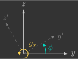{: width=250 style="display: block; margin: auto;" }

$$
{\color{var(--c1)}\phi} = \int {\color{var(--c3)}g_x}\,dt
$$

Since this angle is computed directly from the gyroscope measurements, we will denote it by ${\color{var(--c3)}\phi_g}$ to distinguish it from the estimated angle ${\color{var(--c1)}\phi}$:

$$
{\color{var(--c3)}\phi_g} = \int {\color{var(--c3)}g_x}\,dt
$$

In the frequency domain, this can be represented by the following block diagram:

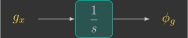{: width=300 style="display: block; margin: auto;" }

Once again, to obtain the discrete-time equivalent, we first derive the corresponding differential equation:

$$
\begin{align*}
    \frac{{\color{var(--c3)}\phi_g(s)}}{{\color{var(--c3)}g_x(s)}} &= \frac{1}{s} \\
    s {\color{var(--c3)}\phi_g(s)} &= {\color{var(--c3)}g_x(s)} \\
    &\Downarrow ^\text{Inverse Laplace}_\text{transform} \\
    \frac{d}{dt} {\color{var(--c3)}\phi_g(t)} &= {\color{var(--c3)}g_x(t)}
\end{align*}
$$

Next, we discretize the differential equation:

$$
\begin{align*}
    \frac{d}{dt} {\color{var(--c3)}\phi_g(t)} &= {\color{var(--c3)}g_x(t)} \\
    &\Downarrow ^\text{Implicit}_\text{Euler} \\
    \frac{{\color{var(--c3)}\phi_g[k]}-{\color{var(--c3)}\phi_g[k-1]}}{\Delta t} &= {\color{var(--c3)}g_x[k]} \\
    {\color{var(--c3)}\phi_g[k]}-{\color{var(--c3)}\phi_g[k-1]} &= {\color{var(--c3)}g_x[k]} \Delta t \\ 
    {\color{var(--c3)}\phi_g[k]} &= {\color{var(--c3)}\phi_g[k-1]} + {\color{var(--c3)}g_x[k]} \Delta t
\end{align*}
$$

Now implement an attitude estimator in which the estimated angle ${\color{var(--c1)}\phi}$ is simply the angle obtained by integrating the gyroscope measurement ${\color{var(--c3)}g_x}$, as illustrated below:


Now let's implement an attitude estimator in which the estimated angle ${\color{var(--c1)}\phi}$ is simply the angle obtained by integrating the gyroscope measurement ${\color{var(--c3)}g_x}$, as illustrated below:

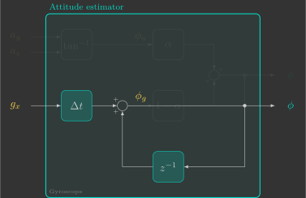{: width=600 style="display: block; margin: auto;" }

In the `attitudeEstimator()` function, compute the gyroscope-based angle ${\color{var(--c3)}\phi_g}$ integrating the gyroscope measurement ${\color{var(--c3)}g_x}$, then assign it to the estimated angle ${\color{var(--c1)}\phi}$.


```c hl_lines="5 8"
// Estimate orientation from IMU sensor
void attitudeEstimator()
{
    // Computed angle from gyroscope
    float phi_g =

    // Estimated angle (gyroscope)
    phi =

    // Auxiliary variables for logging Euler angles (CFClient uses degrees instead of radians)
    log_phi = phi * 180.0f / pi;
}
```

Upload the program to the quadcopter and visualize the estimated angle in the Crazyflie Client.

!!! example "Expected result"
    You should notice that this estimator performs well during rapid motions but gradually drifts while the quadcopter is stationary. The reason is that the gyroscope is affected by small but nearly constant systematic errors (*bias*). Although these errors are tiny, they are continuously integrated over time, causing the estimated angle to drift. This behavior is essentially the opposite of what we observed with the accelerometer. One way to mitigate this problem is by applying a high-pass filter.

### High-pass filter

A high-pass filter attenuates signals below a given cutoff frequency $\omega_c$. In other words, it performs the opposite operation of a low-pass filter.

To estimate the angle ${\color{var(--c1)}\phi}$, we pass the gyroscope-based angle ${\color{var(--c3)}\phi_g}$ through a high-pass filter. In the frequency domain, this relationship is represented by the following block diagram:

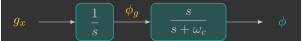{: width=450 style="display: block; margin: auto;" }

Since the gyroscope measurement is first integrated and then passed through the high-pass filter, the two blocks can be combined into a single transfer function:

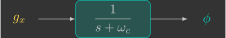{: width=350 style="display: block; margin: auto;" }

To obtain the discrete-time implementation, we first derive the corresponding differential equation:

$$
\begin{align}
    \frac{{\color{var(--c1)}\phi(s)}}{{\color{var(--c3)}g_x(s)}} &= \frac{1}{s+\omega_c} \\
    s{\color{var(--c1)}\phi(s)} + \omega_c{\color{var(--c1)}\phi(s)} &= {\color{var(--c3)}g_x(s)} \\
    &\Downarrow ^\text{Inverse Laplace}_\text{transform} \\
    \frac{d}{dt}{\color{var(--c1)}\phi(t)} + \omega_c{\color{var(--c1)}\phi(s)} &= {\color{var(--c3)}g_x(t)}
\end{align}
$$

Next, we discretize the differential equation:

$$
\begin{align}
    \frac{d}{dt}{\color{var(--c1)}\phi(t)} + \omega_c{\color{var(--c1)}\phi(s)} &= {\color{var(--c3)}g_x(t)} \\
    &\Downarrow ^\text{Implicit}_\text{Euler} \\
    \frac{{\color{var(--c1)}\phi[k]}-{\color{var(--c1)}\phi[k-1]}}{\Delta t} + \omega_c{\color{var(--c1)}\phi[k]} &= {\color{var(--c3)}g_x[k]} \\
    {\color{var(--c1)}\phi[k]}-{\color{var(--c1)}\phi[k-1]} + \omega_c\Delta t{\color{var(--c1)}\phi[k]} &= {\color{var(--c3)}g_x[k]}\Delta t \\
    \left( 1+\omega_c\Delta t \right) {\color{var(--c1)}\phi[k]} &= {\color{var(--c1)}\phi[k-1]} + {\color{var(--c3)}g_x[k]}\Delta t \\
    {\color{var(--c1)}\phi[k]} &= \underbrace{\frac{1}{1+\omega_c\Delta t}}_{\left(1-\alpha\right)} \underbrace{\left({\color{var(--c1)}\phi[k-1]} + {\color{var(--c3)}g_x[k]}\Delta t\right)}_{{\color{var(--c3)}\phi_g[k]}} \\
    {\color{var(--c1)}\phi[k]} &= \left(1-\alpha\right) {\color{var(--c3)}\phi_g[k]}
\end{align}
$$

The resulting attitude estimator is shown below:

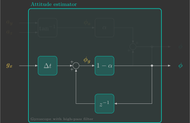{: width=600 style="display: block; margin: auto;" }

Modify your `attitudeEstimator()` function so that the estimated angle ${\color{var(--c1)}\phi}$ is obtained by applying a high-pass filter to the gyroscope-based angle ${\color{var(--c3)}\phi_g}$.

```c hl_lines="5 6 9 12"
// Estimate orientation from IMU sensor
void attitudeEstimator()
{
    // Estimator parameters
    static const float wc =
    static const float alpha =

    // Computed angle from gyroscope
    float phi_g =

    // Estimated angle (gyroscope with high-pass filter)
    phi =

    // Auxiliary variables for logging Euler angles (CFClient uses degrees instead of radians)
    log_phi = phi * 180.0f / pi;
}
```

Try cutoff frequencies of $0.1~\text{rad/s}$, $1~\text{rad/s}$, and $10~\text{rad/s}$, then upload the program to the quadcopter and visualize the estimated angle in the Crazyflie Client.

!!! example "Expected result"
    You should notice that the estimated attitude always converges to zero. This eliminates the long-term drift caused by integrating the gyroscope bias, but it also prevents the estimator from maintaining a non-zero attitude while the quadcopter is stationary.

## Accelerometer and gyroscope

As we have seen, the accelerometer provides reliable attitude estimates under static conditions (low-frequency motion), whereas the gyroscope performs better under dynamic conditions (high-frequency motion). In other words, each sensor performs well precisely where the other falls short. By combining the strengths of both sensors, it is possible to obtain accurate attitude estimates under both static and dynamic conditions. This is the idea behind a complementary filter.

### Complementary filter

The idea behind a complementary filter is to pass the accelerometer-based angle through a low-pass filter while passing the gyroscope-based angle through a high-pass filter, as illustrated in the block diagram below:

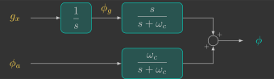{: width=500 style="display: block; margin: auto;" }

The outputs of these two filters can then be added together because the sum of theirs transfer functions has unity gain(1):
{.annotate}

1. This is where the term *complementary* comes from.


$$
    \underbrace{\frac{\omega_c}{s+\omega_c}}_{\begin{array}{c} \text{Low-pass} \\ \text{filter} \end{array}} + \underbrace{\frac{s}{s+\omega_c}}_{\begin{array}{c} \text{High-pass} \\ \text{filter} \end{array}} = 1
$$

A closer look at the block diagram reveals that the angular velocity is first integrated before being passed through the high-pass filter. Moreover, both filters share the same denominator. This allows the diagram to be simplified into the equivalent form shown below:

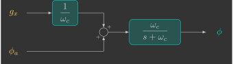{: width=500 style="display: block; margin: auto;" }

The simplified diagram contains only a single transfer function, namely a low-pass filter. Its discrete-time implementation has already been derived in the previous section, leading to:

$$
\begin{align}
    {\color{var(--c1)}\phi[k]} &= \left( 1-\alpha \right){\color{var(--c1)}\phi[k-1]}+\alpha \left( \frac{1}{\omega_c} {\color{var(--c3)}g_x[k]} + {\color{var(--c3)}\phi_a[k]} \right) \\
    {\color{var(--c1)}\phi[k]} &= \left( 1-\alpha \right){\color{var(--c1)}\phi[k-1]}+ \underbrace{\alpha\frac{1}{\omega_c}}_{(1-\alpha)\Delta t} {\color{var(--c3)}g_x[k]} + \alpha {\color{var(--c3)}\phi_a[k]} \\
    {\color{var(--c1)}\phi[k]} &= \left( 1-\alpha \right){\color{var(--c1)}\phi[k-1]}+ (1-\alpha) {\color{var(--c3)}g_x[k]}\Delta t + \alpha {\color{var(--c3)}\phi_a[k]} \\
    {\color{var(--c1)}\phi[k]} &= \left( 1-\alpha \right)\underbrace{\left({\color{var(--c1)}\phi[k-1]}+{\color{var(--c3)}g_x[k]} \Delta t \right)}_{{\color{var(--c3)}\phi_g[k]}} + \alpha {\color{var(--c3)}\phi_a[k]} \\
    {\color{var(--c1)}\phi[k]} &= \left( 1-\alpha \right){\color{var(--c3)}\phi_g[k]} + \alpha {\color{var(--c3)}\phi_a[k]}
\end{align}
$$

In other words, the complementary filter reduces to a simple weighted average of the gyroscope-based angle ${\color{var(--c3)}\phi_g}$ and the accelerometer-based angle ${\color{var(--c3)}\phi_a}$:

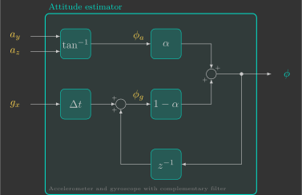{: width=600 style="display: block; margin: auto;" }

Modify your `attitudeEstimator()` function so that the estimated angle ${\color{var(--c1)}\phi}$ is obtained using the complementary filter above.

```c hl_lines="5 6 9 12 15"
// Estimate orientation from IMU sensor
void attitudeEstimator()
{
    // Estimator parameters
    static const float wc =
    static const float alpha =

    // Computed angle from accelerometer
    float phi_a =

    // Computed angle from gyroscope
    float phi_g =

    // Estimated angle (accelerometer and gyroscope with complementary filter)
    phi =

    // Auxiliary variables for logging Euler angles (CFClient uses degrees instead of radians)
    log_phi = phi * 180.0f / pi;
}
```

Try cutoff frequencies of $0.1~\text{rad/s}$, $1~\text{rad/s}$ and $10~\text{rad/s}$, and observe how they affect the estimated angle. To do so, upload the program to the quadcopter and visualize the result in the Crazyflie Client.

!!! example "Expected result"
    This time, the estimated attitude should behave much better!

### Full dynamics

Finally, extend the complementary filter to estimate all three Euler angles together with the angular velocities:

$$
\left\{
\begin{array}{l}
    {\color{var(--c1)}\phi} =  \left( 1 - \alpha \right) {\color{var(--c3)}\phi_g} + \alpha {\color{var(--c3)}\phi_a} \\ 
    {\color{var(--c1)}\theta} = \left( 1 - \alpha \right) {\color{var(--c3)}\theta_g} + \alpha {\color{var(--c3)}\theta_a}  \\
    {\color{var(--c1)}\psi} = {\color{var(--c3)}\psi_g}
\end{array}
\right.
\qquad \qquad \qquad
\left\{
\begin{array}{l}
    {\color{var(--c1)}\omega_x} = {\color{var(--c3)}g_x} \\ 
    {\color{var(--c1)}\omega_y} = {\color{var(--c3)}g_y} \\
    {\color{var(--c1)}\omega_z} = {\color{var(--c3)}g_z}
\end{array}
\right.
$$

The yaw angle ${\color{var(--c1)}\psi}$ cannot be estimated from accelerometer measurements because gravity provides no information about rotation around the vertical axis. Consequently, the yaw estimate relies exclusively on the gyroscope and is therefore expected to drift over time (1). Fortunately, an accurate yaw estimate is not required to stabilize the quadcopter.
{.annotate}

1. Attitude and Heading Reference Systems (AHRS) use a magnetometer to correct the gyroscope-based yaw estimate ${\color{var(--c1)}\psi}$, preventing long-term drift.

!!! question "Exercise 1"

    Show that the roll and pitch angles computed from the accelerometer measurements, denoted by ${\color{var(--c3)}\phi_a}$ and ${\color{var(--c3)}\theta_a}$, are given by:

    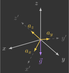{: width=250 style="display: block; margin: auto;" }

    $$
    \left\{
    \begin{array}{l}
        {\color{var(--c3)}\phi_a} = \tan^{-1} \left( \dfrac{-{\color{var(--c3)}a_y}}{-{\color{var(--c3)}a_z}} \right) \\
        {\color{var(--c3)}\theta_a} = \tan^{-1} \left( \dfrac{{\color{var(--c3)}a_x}}{\sqrt{{\color{var(--c3)}a_y}^2+{\color{var(--c3)}a_z}^2}} \right)
    \end{array}
    \right.
    $$

    ??? info "Solution"

        Assuming the quadcopter is stationary (or moving with negligible linear acceleration), the accelerometer measures only the gravity vector expressed in the body frame. Therefore, the accelerometer measurements are given by:

        $$
        \begin{align}
            \begin{bmatrix}
                {\color{var(--c3)}a_x} \\
                {\color{var(--c3)}a_y} \\
                {\color{var(--c3)}a_z} \\
            \end{bmatrix} &= R {\color{var(--c2)}\vec{g}} \\
            \begin{bmatrix}
                {\color{var(--c3)}a_x} \\
                {\color{var(--c3)}a_y} \\
                {\color{var(--c3)}a_z} \\
            \end{bmatrix}
            &=
            \begin{bmatrix}
                \cos{\color{var(--c1)}\theta}\cos{\color{var(--c1)}\psi} & \cos{\color{var(--c1)}\theta}\sin{\color{var(--c1)}\psi} & -\sin{\color{var(--c1)}\theta} \\
                - \cos{\color{var(--c1)}\phi}\sin{\color{var(--c1)}\psi} + \sin{\color{var(--c1)}\phi}\sin{\color{var(--c1)}\theta}\cos{\color{var(--c1)}\psi}  & \cos{\color{var(--c1)}\phi}\cos{\color{var(--c1)}\psi} + \sin{\color{var(--c1)}\phi}\sin{\color{var(--c1)}\theta}\sin{\color{var(--c1)}\psi} & \sin{\color{var(--c1)}\phi}\cos{\color{var(--c1)}\theta} \\
                \sin{\color{var(--c1)}\phi}\sin{\color{var(--c1)}\psi} + \cos{\color{var(--c1)}\phi}\sin{\color{var(--c1)}\theta}\cos{\color{var(--c1)}\psi} & - \sin{\color{var(--c1)}\phi}\cos{\color{var(--c1)}\psi} + \cos{\color{var(--c1)}\phi}\sin{\color{var(--c1)}\theta}\sin{\color{var(--c1)}\psi}  & \cos{\color{var(--c1)}\phi}\cos{\color{var(--c1)}\theta}
            \end{bmatrix}
            \begin{bmatrix}
                0 \\
                0 \\
                -{\color{var(--c2)}g} \\
            \end{bmatrix} \\
            \begin{bmatrix}
                {\color{var(--c3)}a_x} \\
                {\color{var(--c3)}a_y} \\
                {\color{var(--c3)}a_z} \\
            \end{bmatrix}
            &=
            \begin{bmatrix}
                {\color{var(--c2)}g}\sin{\color{var(--c1)}\theta} \\
                -{\color{var(--c2)}g}\sin{\color{var(--c1)}\phi}\cos{\color{var(--c1)}\theta} \\
                -{\color{var(--c2)}g}\cos{\color{var(--c1)}\phi}\cos{\color{var(--c1)}\theta}
            \end{bmatrix}
        \end{align}
        $$

        Taking the ratio between the second and third equations eliminates both the gravitational acceleration ${\color{var(--c2)}g}$ and the term $\cos{\color{var(--c1)}\theta}$, yielding:

        $$
        \begin{align}
            \frac{{\color{var(--c3)}a_y}}{{\color{var(--c3)}a_z}} &= \frac{-\cancel{{\color{var(--c2)}g}}\sin{\color{var(--c1)}\phi}\cancel{\cos{\color{var(--c1)}\theta}}}{-\cancel{{\color{var(--c2)}g}}\cos{\color{var(--c1)}\phi}\cancel{\cos{\color{var(--c1)}\theta}}} \\
            \frac{-{\color{var(--c3)}a_y}}{-{\color{var(--c3)}a_z}} &= \tan{\color{var(--c1)}\phi} \\
            {\color{var(--c1)}\phi} &= \tan^{-1} \left( \dfrac{-{\color{var(--c3)}a_y}}{-{\color{var(--c3)}a_z}} \right)
        \end{align}
        $$

        Deriving the pitch angle ${\color{var(--c1)}\theta}$ is slightly more involved because both ${\color{var(--c3)}a_y}$ and ${\color{var(--c3)}a_z}$ depend on the unknown roll angle ${\color{var(--c1)}\phi}$. To eliminate this dependency, we combine all three accelerometer measurements:

        $$
        \begin{align}
            \frac{{\color{var(--c3)}a_x}^2}{{\color{var(--c3)}a_y}^2+{\color{var(--c3)}a_z}^2} &= \frac{({\color{var(--c2)}g}\sin{\color{var(--c1)}\theta})^2}{(-{\color{var(--c2)}g}\sin{\color{var(--c1)}\phi}\cos{\color{var(--c1)}\theta})^2+(-{\color{var(--c2)}g}\cos{\color{var(--c1)}\phi}\cos{\color{var(--c1)}\theta})^2} \\
            \frac{{\color{var(--c3)}a_x}^2}{{\color{var(--c3)}a_y}^2+{\color{var(--c3)}a_z}^2} &= \frac{{\color{var(--c2)}g}^2\sin^2{\color{var(--c1)}\theta}}{{\color{var(--c2)}g}^2\sin^2{\color{var(--c1)}\phi}\cos^2{\color{var(--c1)}\theta}+{\color{var(--c2)}g}^2\cos^2{\color{var(--c1)}\phi}\cos^2{\color{var(--c1)}\theta}} \\
            \frac{{\color{var(--c3)}a_x}^2}{{\color{var(--c3)}a_y}^2+{\color{var(--c3)}a_z}^2} &= \frac{\cancel{{\color{var(--c2)}g}^2}\sin^2{\color{var(--c1)}\theta}}{\cancel{{\color{var(--c2)}g}^2}\cos^2\cancelto{1}{(\sin^2{\color{var(--c1)}\phi}+\cos^2{\color{var(--c1)}\phi})}} \\
            \frac{{\color{var(--c3)}a_x}^2}{{\color{var(--c3)}a_y}^2+{\color{var(--c3)}a_z}^2} &= \frac{\sin^2{\color{var(--c1)}\theta}}{\cos^2{\color{var(--c1)}\theta}} \\
            \frac{{\color{var(--c3)}a_x}^2}{{\color{var(--c3)}a_y}^2+{\color{var(--c3)}a_z}^2} &= \tan^2{\color{var(--c1)}\theta} \\
            \sqrt{\frac{{\color{var(--c3)}a_x}^2}{{\color{var(--c3)}a_y}^2+{\color{var(--c3)}a_z}^2}} &= \tan{\color{var(--c1)}\theta} \\
            \frac{{\color{var(--c3)}a_x}}{\sqrt{{\color{var(--c3)}a_y}^2+{\color{var(--c3)}a_z}^2}} &= \tan{\color{var(--c1)}\theta} \\
            {\color{var(--c1)}\theta} &= \tan^{-1} \left( \frac{{\color{var(--c3)}a_x}}{\sqrt{{\color{var(--c3)}a_y}^2+{\color{var(--c3)}a_z}^2}} \right)
        \end{align}
        $$

!!! question "Exercise 2"

    Show that the roll, pitch, and yaw angles computed from the gyroscope measurements, denoted by ${\color{var(--c3)}\phi_g}$, ${\color{var(--c3)}\theta_g}$ and ${\color{var(--c3)}\psi_g}$, are given by:

    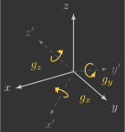{: width=250 style="display: block; margin: auto;" }

    $$
    \left\{
    \begin{array}{l}
        {\color{var(--c3)}\phi_g} = {\color{var(--c1)}\phi} + \left( {\color{var(--c3)}g_x} + {\color{var(--c3)}g_y} \sin{\color{var(--c1)}\phi}\tan{\color{var(--c1)}\theta} + {\color{var(--c3)}g_z} \cos{\color{var(--c1)}\phi}\tan{\color{var(--c1)}\theta} \right) \Delta t \\
        {\color{var(--c3)}\theta_g} = {\color{var(--c1)}\theta} + \left( {\color{var(--c3)}g_y} \cos{\color{var(--c1)}\phi} - {\color{var(--c3)}g_z} \sin{\color{var(--c1)}\phi} \right) \Delta t \\
        {\color{var(--c3)}\psi_g} = {\color{var(--c1)}\psi} + \left( {\color{var(--c3)}g_y} \sin{\color{var(--c1)}\phi}\sec{\color{var(--c1)}\theta} + {\color{var(--c3)}g_z} \cos{\color{var(--c1)}\phi}\sec{\color{var(--c1)}\theta} \right) \Delta t
    \end{array}
    \right.
    $$

    ??? info "Solution"

        The Euler angle rates are related to the body angular velocities through the rotational kinematic equation:

        $$
        \begin{bmatrix}
            {\color{var(--c1)}\dot{\phi}} \\
            {\color{var(--c1)}\dot{\theta}} \\
            {\color{var(--c1)}\dot{\psi}}
        \end{bmatrix}
        =
        \begin{bmatrix}
            1 & \sin{\color{var(--c1)}\phi}\tan{\color{var(--c1)}\theta} & \cos{\color{var(--c1)}\phi}\tan{\color{var(--c1)}\theta} \\
            0 & \cos{\color{var(--c1)}\phi} & - \sin{\color{var(--c1)}\phi}\\
            0 & \sin{\color{var(--c1)}\phi}\sec{\color{var(--c1)}\theta} & \cos{\color{var(--c1)}\phi}\sec{\color{var(--c1)}\theta}
        \end{bmatrix}
        \begin{bmatrix}
            {\color{var(--c1)}\omega_x} \\
            {\color{var(--c1)}\omega_y} \\
            {\color{var(--c1)}\omega_z}
        \end{bmatrix}
        $$

        Since the gyroscope directly measures the body angular velocities,

        $$
        \begin{bmatrix}
            {\color{var(--c3)}g_x} \\
            {\color{var(--c3)}g_y} \\
            {\color{var(--c3)}g_z}
        \end{bmatrix}
        =
        \begin{bmatrix}
            {\color{var(--c1)}\omega_x} \\
            {\color{var(--c1)}\omega_y} \\
            {\color{var(--c1)}\omega_z}
        \end{bmatrix}
        $$

        the Euler angle rates can be written directly in terms of the gyroscope measurements.

        Assuming the angular velocities remain approximately constant during one sampling interval $\Delta t$, a first-order (forward Euler) integration gives:

        $$
        \begin{align*}
            \begin{bmatrix}
                {\color{var(--c3)}\phi_g} \\
                {\color{var(--c3)}\theta_g} \\
                {\color{var(--c3)}\psi_g}
            \end{bmatrix}
            &=
            \begin{bmatrix}
                {\color{var(--c1)}\phi} \\
                {\color{var(--c1)}\theta} \\
                {\color{var(--c1)}\psi}
            \end{bmatrix}
            +
            \begin{bmatrix}
                {\color{var(--c1)}\dot{\phi}} \\
                {\color{var(--c1)}\dot{\theta}} \\
                {\color{var(--c1)}\dot{\psi}}
            \end{bmatrix}\Delta t \\
            \begin{bmatrix}
                {\color{var(--c3)}\phi_g} \\
                {\color{var(--c3)}\theta_g} \\
                {\color{var(--c3)}\psi_g}
            \end{bmatrix}
            &=
            \begin{bmatrix}
                {\color{var(--c1)}\phi} \\
                {\color{var(--c1)}\theta} \\
                {\color{var(--c1)}\psi}
            \end{bmatrix}
            +
            \begin{bmatrix}
                1 & \sin{\color{var(--c1)}\phi}\tan{\color{var(--c1)}\theta} & \cos{\color{var(--c1)}\phi}\tan{\color{var(--c1)}\theta} \\
                0 & \cos{\color{var(--c1)}\phi} & -\sin{\color{var(--c1)}\phi} \\
                0 & \sin{\color{var(--c1)}\phi}\sec{\color{var(--c1)}\theta} & \cos{\color{var(--c1)}\phi}\sec{\color{var(--c1)}\theta}
            \end{bmatrix}
            \begin{bmatrix}
                {\color{var(--c3)}g_x} \\
                {\color{var(--c3)}g_y} \\
                {\color{var(--c3)}g_z}
            \end{bmatrix}\Delta t \\
            \begin{bmatrix}
                {\color{var(--c3)}\phi_g} \\
                {\color{var(--c3)}\theta_g} \\
                {\color{var(--c3)}\psi_g}
            \end{bmatrix}
            &=
            \begin{bmatrix}
                {\color{var(--c1)}\phi} + \left( {\color{var(--c3)}g_x} + {\color{var(--c3)}g_y} \sin{\color{var(--c1)}\phi}\tan{\color{var(--c1)}\theta} + {\color{var(--c3)}g_z} \cos{\color{var(--c1)}\phi}\tan{\color{var(--c1)}\theta} \right) \Delta t \\
                {\color{var(--c1)}\theta} + \left( {\color{var(--c3)}g_y} \cos{\color{var(--c1)}\phi} - {\color{var(--c3)}g_z} \sin{\color{var(--c1)}\phi} \right) \Delta t \\
                {\color{var(--c1)}\psi} + \left( {\color{var(--c3)}g_y} \sin{\color{var(--c1)}\phi}\sec{\color{var(--c1)}\theta} + {\color{var(--c3)}g_z} \cos{\color{var(--c1)}\phi}\sec{\color{var(--c1)}\theta} \right) \Delta t
            \end{bmatrix}
        \end{align*}
        $$

Modify your `attitudeEstimator()` function so that the estimated Euler angles ${\color{var(--c1)}\phi}$, ${\color{var(--c1)}\theta}$, and ${\color{var(--c1)}\psi}$ are computed using a complementary filter that combines the accelerometer-based angles ${\color{var(--c3)}\phi_a}$ and ${\color{var(--c3)}\theta_a}$ with the gyroscope-based angles ${\color{var(--c3)}\phi_g}$, ${\color{var(--c3)}\theta_g}$, and ${\color{var(--c3)}\psi_g}$.

```c hl_lines="5 6 9 10 13-15 18-20 23-25"
// Estimate orientation from IMU sensor
void attitudeEstimator()
{
    // Estimator parameters
    static const float wc =
    static const float alpha =

    // Computed angles from accelerometer
    float phi_a =
    float theta_a =

    // Computed angles from gyroscope
    float phi_g =
    float theta_g =
    float psi_g =

    // Estimated angles (accelerometer and gyroscope with complementary filter)
    phi =
    theta =
    psi =

    // Estimated angular velocities (gyroscope)
    wx =
    wy =
    wz =

    // Auxiliary variables for logging Euler angles (CFClient uses degrees instead of radians)
    log_phi = phi * 180.0f / pi;
    log_theta = -theta * 180.0f / pi;
    log_psi = psi * 180.0f / pi;
}
```

Upload the program to the quadcopter and use the Crazyflie Client to visualize the output of your complete attitude estimator.