# :material-altimeter: Height Estimator

In this section, you will implement the `heightEstimator()` function, which estimates position ${\color{var(--c1)}z}$ and velocity ${\color{var(--c1)}v_z}$ from the range sensor measurement ${\color{var(--c3)}d}$.

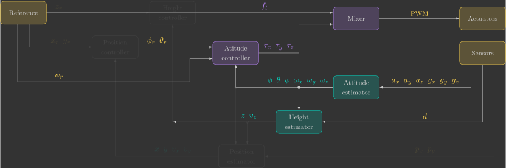{: width=100% style="display: block; margin: auto;" }

## Overview

The range sensor used by the Crazyflie 2.1 Brushless is the [VL53L1X](https://www.st.com/en/imaging-and-photonics-solutions/vl53l1x.html){target=_blank} from STMicroelectronics. It is located on the Flow Deck v2.

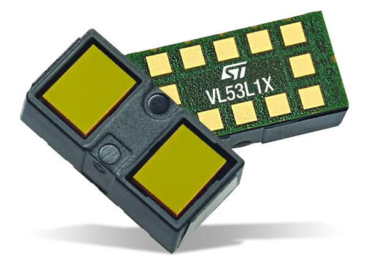{: width=30% style="display: block; margin: auto;" }

The sensor uses VCSEL(1) technology to measure distance using the ToF(2) of emitted photons. It has an operating range of $4~\text{cm} - 4~\text{m}$ and a maximum sampling rate of $50~\text{Hz}$.
{.annotate}

1. Vertical Cavity Surface Emitting Laser
2. Time-of-Flight 

Range sensors measure the distance to an object without physical contact by transmitting a wave and analyzing its reflection. Although the underlying principle is the same, different technologies use different types of waves and extract different information from the returned signal, such as time of flight, intensity, or phase shift.

Range sensors can be divided into three main categories:

- Radar(1) uses radio waves.
    {.annotate}

    1. **RA**dio **D**etection **A**nd **R**anging

- Sonar(1) uses ultrasonic waves.
    {.annotate}

    1. **So**und **N**avigation **A**nd **R**anging

- Lidar(1) uses infrared or laser light.
    {.annotate}

    1. **LI**ght **D**etection **A**nd **R**anging

The VL53L1X is therefore a short-range infrared lidar based on VCSEL technology.

## Measuring height with a range sensor

Although the range sensor measures the distance to the ground in the quadcopter's body frame, the controller requires  its height in the inertial frame. Therefore, the measurement must be compensated for the quadcopter's orientation. To better understand this compensation, let us first consider the 2D case, which is simpler and more intuitive. We will then extend the same reasoning to the 3D case.

!!! question "2D"

    Determine the measured height ${\color{var(--c3)}z_m}$ from the range measurement ${\color{var(--c3)}d}$ and the estimated roll angle ${\color{var(--c1)}\phi}$.

    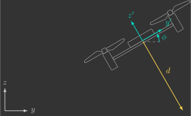{: width=60% style="display: block; margin: auto;" }

    ??? info "Solution"

        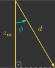{: width=20% style="display: block; margin: auto;" }

        $$
        \begin{align}
            \cos{\color{var(--c1)}\phi} &= \dfrac{{\color{var(--c3)}z_m}}{{\color{var(--c3)}d}} \\
            {\color{var(--c3)}z_m} &= {\color{var(--c3)}d} \cos{\color{var(--c1)}\phi}
        \end{align}
        $$

!!! question "3D"

    Determine the measured height ${\color{var(--c3)}z_m}$ from the range measurement ${\color{var(--c3)}d}$ and the estimated roll and pitch angles ${\color{var(--c1)}\phi}$ and ${\color{var(--c1)}\theta}$.

    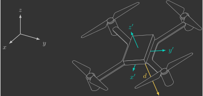{: width=80% style="display: block; margin: auto;" }

    ??? info "Solution"

        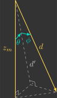{: width=20% style="display: block; margin: auto;" }

        $$
        \begin{align}
            \cos{\color{var(--c1)}\theta} &= \dfrac{{\color{var(--c3)}z_m}}{d'} \\
            {\color{var(--c3)}z_m} &= d' \cos{\color{var(--c1)}\theta}
        \end{align}
        $$

        $$
        \begin{align}
            \cos{\color{var(--c1)}\phi} &= \dfrac{d'}{{\color{var(--c3)}d}} \\
            d' &= {\color{var(--c3)}d} \cos{\color{var(--c1)}\phi}
        \end{align}
        $$

        $$
        \begin{align}
            {\color{var(--c3)}z_m} &= {\color{var(--c3)}d}\cos{\color{var(--c1)}\phi}\cos{\color{var(--c1)}\theta}
        \end{align}
        $$

Add a local variable ${\color{var(--c3)}z_m}$ to the `heightEstimator()` function to compute the measured height from the range measurement ${\color{var(--c3)}d}$ together with the estimated roll and pitch angles ${\color{var(--c1)}\phi}$ and ${\color{var(--c1)}\theta}$. Then assign this value to the estimated height ${\color{var(--c1)}z}$.

```c hl_lines="5 8"
// Estimate height (z) from range sensor
void heightEstimator()
{
    // Measured height from range sensor
    float z_m =

    // Estimated height
    z =
}
```

Build and flash the firmware, then use the Crazyflie Client to visualize the estimated height. 

!!! info "Expected result" 
    The estimated height should remain nearly constant while the quadcopter is tilted. However, the estimate is still quite noisy. Instead of applying a low-pass filter (as we did for the attitude estimator), we will now use a state observer.

## State observer

A state observer is a mathematical model that estimates the internal states of a system using its inputs and outputs.

In our case, the plant is the quadcopter's vertical dynamics. The observer receives the total thrust ${\color{var(--c2)}f_t}$ and the measured vertical position ${\color{var(--c3)}z_m}$ as inputs, and estimates the vertical position ${\color{var(--c1)}z}$ and vertical velocity ${\color{var(--c1)}v_z}$, as illustrated below.

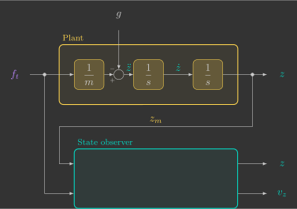{: width=70% style="display: block; margin: auto;" }

We will progressively design three state observers.

- A first-order observer.
- A second-order observer.
- A second-order observer that also incorporates the control input.

### First-order observer

We begin with the simplest possible model by assuming that the quadcopter remains stationary, meaning that its vertical position is constant:

$$
{\color{var(--c1)}z} = \text{constant}
$$

This is called a first-order observer, since the plant is described by a first-order differential equation:

$$
{\color{var(--c1)}\dot{z}} = 0
$$

If we feedback the estimation error, the observer becomes

$$
{\color{var(--c1)}\dot{z}} = 0 + l\left({\color{var(--c3)}z_m}-{\color{var(--c1)}z}\right)
$$

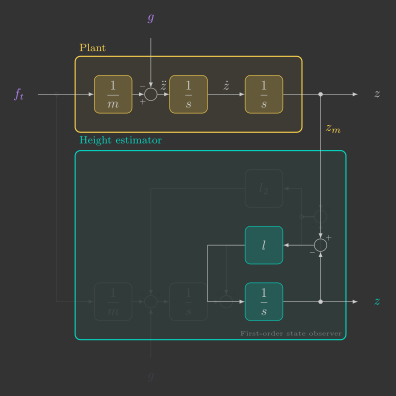{: width=70% style="display: block; margin: auto;" }

As long as the observer gain $l$ is positive, the estimate converges exponentially to the measured position.

This block diagram can be simplified into the following transfer function:

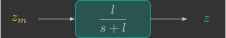{: width=40% style="display: block; margin: auto;" }

Notice that this transfer function is identical to that of a first-order low-pass filter, with the observer gain playing the role of the cutoff frequency:

$$
l=\omega_c
$$

In other words, a first-order observer behaves exactly like a first-order low-pass filter: it attenuates high-frequency measurement noise while preserving the slow variations of the true height.

Since the observer will run on a microcontroller, we must discretize it. Previously, we discretized the low-pass filter using the implicit Euler method. This time, we will use the explicit Euler method.(1)
{.annotate}

1. The resulting expression is very similar to the one derived previously:

    $$
    {\color{var(--c1)}z[k+1]}=
    \underbrace{\left(1-l\Delta t\right)}_{\left(1-\alpha\right)}
    {\color{var(--c1)}z[k]}
    +
    \underbrace{l\Delta t}_{\alpha}
    {\color{var(--c3)}z_m[k]}
    $$

    However, the parameter $\alpha$ is now given by

    $$
    \alpha=l\Delta t
    $$

    which means it can become greater than one if $l$ is chosen too large, making the system unstable. This is the main drawback of the explicit Euler method compared to the implicit one. Fortunately, stability is guaranteed as long as

    $$
    l<\frac{1}{\Delta t}.
    $$

$$
\begin{align*}
\frac{{\color{var(--c1)}z[k+1]}-{\color{var(--c1)}z[k]}}{\Delta t}
+l{\color{var(--c1)}z[k]}
&=
l{\color{var(--c3)}z_m[k]} \\
{\color{var(--c1)}z[k+1]}-{\color{var(--c1)}z[k]}
+l\Delta t{\color{var(--c1)}z[k]}
&=
l\Delta t{\color{var(--c3)}z_m[k]} \\
{\color{var(--c1)}z[k+1]}
-\left(1-l\Delta t\right)
{\color{var(--c1)}z[k]}
&=
l\Delta t{\color{var(--c3)}z_m[k]} \\
{\color{var(--c1)}z[k+1]}
&=
\left(1-l\Delta t\right)
{\color{var(--c1)}z[k]}
+l\Delta t
{\color{var(--c3)}z_m[k]}
\end{align*}
$$

The discrete equation can be rewritten to explicitly separate the prediction and correction terms:

$$
{\color{var(--c1)}z[k+1]}
=
\underbrace{{\color{var(--c1)}z[k]}}_{\text{Prediction}}
+
\underbrace{
l\Delta t
\left[
{\color{var(--c3)}z_m[k]}
-
{\color{var(--c1)}z[k]}
\right]
}_{\text{Correction}}
$$

- The prediction step propagates the state according to the model.
- The correction step updates the prediction using the measurement.

Equivalently, the observer can be implemented as two sequential steps.(1)
{.annotate}

1. In this case, the prediction step is redundant because the model assumes that the height remains constant. Nevertheless, we keep it to preserve the same observer structure (prediction followed by correction), which will also be used for the second-order observers.

$$
\begin{align}
\text{Prediction:}
&\quad
{\color{var(--c1)}z[k+1]}
=
{\color{var(--c1)}z[k]}
\\[10pt]
\text{Correction:}
&\quad
{\color{var(--c1)}z[k+1]}
=
{\color{var(--c1)}z[k+1]}
+
l\Delta t
\left(
{\color{var(--c3)}z_m[k]}
-
{\color{var(--c1)}z[k+1]}
\right)
\end{align}
$$

Modify the `heightEstimator()` function so that the vertical position is estimated using a first-order state observer with separate prediction and correction steps.

```c hl_lines="5 6 12 15"
// Estimate vertical position/velocity from range sensor
void heightEstimator()
{
    // Estimator parameters
    static const float wc =
    static const float l =

    // Measured distance from range sensor
    float z_m =

    // Prediction step (model)
    z =

    // Correction step (measurement)
    z =
}
```

Try using a cutoff frequency of $\omega_c=10$ rad/s and observe how it affects the estimate.

!!! info "Expected result"

    The estimate should now be much smoother, but it will respond more slowly when the quadcopter moves. This happens because our model assumes that the quadcopter is always stationary. To improve the response, we need a more realistic model.


### Second-order observer

We now assume that the quadcopter is moving, but with constant vertical velocity:

$$
{\color{var(--c1)}\dot{z}} = \text{constant}
$$

This leads to a second-order observer, since the plant is described by a second-order differential equation, or equivalently, by two coupled first-order differential equations:

$$
{\color{var(--c1)}\ddot{z}} = 0
\qquad
\Longrightarrow
\qquad
\left\{
\begin{array}{l}
{\color{var(--c1)}\dot{z}} = {\color{var(--c1)}v_z} \\
{\color{var(--c1)}\dot{v}_z} = 0
\end{array}
\right.
$$

As before, we feed back the estimation error into the observer model. The resulting observer is

$$
\left\{
\begin{array}{l}
{\color{var(--c1)}\dot{z}}
=
{\color{var(--c1)}v_z}
+
l_1
\left(
{\color{var(--c3)}z_m}
-
{\color{var(--c1)}z}
\right)
\\
{\color{var(--c1)}\dot{v}_z}
=
0
+
l_2
\left(
{\color{var(--c3)}z_m}
-
{\color{var(--c1)}z}
\right)
\end{array}
\right.
$$

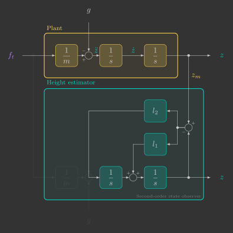{: width=70% style="display: block; margin: auto;" }

Provided that the observer gains $l_1$ and $l_2$ are positive, the estimated states converge exponentially to the measured position.

This block diagram can be reduced to the following transfer function:

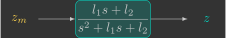{: width=40% style="display: block; margin: auto;" }

Unlike the first-order observer, the transfer function is now equivalent to that of a second-order low-pass filter. The observer gains depend not only on the cutoff frequency $\omega_c$, but also on the damping ratio $\zeta$:

$$
\left\{
\begin{array}{l}
l_1 = 2\zeta\omega_c \\
l_2 = \omega_c^2
\end{array}
\right.
$$

Signals with frequencies well below the cutoff frequency pass through almost unchanged, while higher-frequency components are attenuated. Compared to a first-order observer, a second-order observer provides a much steeper transition between the passband and the stopband.

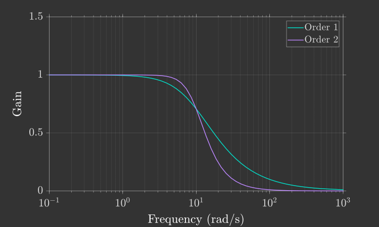{: width=70% style="display: block; margin: auto;" }

Reducing the damping ratio $\zeta$ makes this transition even steeper. However, if

$$
\zeta < \frac{\sqrt{2}}{2},
$$

the frequency response begins to exhibit a resonant peak near the cutoff frequency:

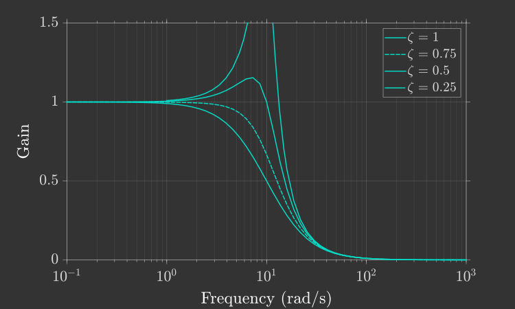{: width=70% style="display: block; margin: auto;" }

Ideally, we would like the transition to be as sharp as possible without introducing resonance. A common design choice is therefore

$$
\zeta = \frac{\sqrt{2}}{2},
$$

which provides the steepest response without overshoot in the frequency domain.

Applying the Euler method once again yields the following discrete-time equations:

$$
\left\{
\begin{array}{rll}
{\color{var(--c1)}z[k+1]}
=&
\overbrace{
{\color{var(--c1)}z[k]}
+
{\color{var(--c1)}v_z[k]}\Delta t
}^{\text{Prediction}}
&
+
\overbrace{
l_1\Delta t
\left(
{\color{var(--c3)}z_m[k]}
-
{\color{var(--c1)}z[k]}
\right)
}^{\text{Correction}}
\\
{\color{var(--c1)}v_z[k+1]}
=&
\underbrace{
{\color{var(--c1)}v_z[k]}
\qquad \qquad
}_{\text{Prediction}}
&
+
\underbrace{
l_2\Delta t
\left(
{\color{var(--c3)}z_m[k]}
-
{\color{var(--c1)}z[k]}
\right)
}_{\text{Correction}}
\end{array}
\right.
$$

As before, the implementation can be separated into a prediction step followed by a correction step:

$$
\begin{align}
\text{Prediction:}
&\quad
\left\{
\begin{array}{l}
{\color{var(--c1)}z[k+1]}
=
{\color{var(--c1)}z[k]}
+
{\color{var(--c1)}v_z[k]}
\Delta t
\\
{\color{var(--c1)}v_z[k+1]}
=
{\color{var(--c1)}v_z[k]}
\end{array}
\right.
\\[12pt]
\text{Correction:}
&\quad
\left\{
\begin{array}{l}
{\color{var(--c1)}z[k+1]}
=
{\color{var(--c1)}z[k+1]}
+
l_1\Delta t
\left(
{\color{var(--c3)}z_m[k]}
-
{\color{var(--c1)}z[k+1]}
\right)
\\
{\color{var(--c1)}v_z[k+1]}
=
{\color{var(--c1)}v_z[k+1]}
+
l_2\Delta t
\left(
{\color{var(--c3)}z_m[k]}
-
{\color{var(--c1)}z[k+1]}
\right)
\end{array}
\right.
\end{align}
$$

Modify the `heightEstimator()` function so that both the vertical position $z$ and the vertical velocity $v_z$ are estimated using a second-order state observer with separate prediction and correction steps.(1)
{.annotate}

1. During the correction step, update $v_z$ before updating $z$. This ensures that both correction equations use the same predicted value of $z$.

```c hl_lines="5-8 14-15 18-19"
// Estimate vertical position/velocity from range sensor
void heightEstimator()
{
    // Estimator parameters
    static const float wc =
    static const float zeta =
    static const float l1 =
    static const float l2 =

    // Measured distance from range sensor
    float z_m =

    // Prediction step (model)
    z =
    vz =

    // Correction step (measurement)
    vz =
    z =
}
```

Flash the firmware and use the Crazyflie Client to evaluate the new estimates.

!!! info "Expected result"

    The estimated height should now respond much faster to motion while still effectively filtering measurement noise. In addition, the observer now estimates the vertical velocity, which will be required by the vertical controller.

### Second-order observer with control input

So far, we have assumed that the quadcopter's vertical acceleration is zero. A more realistic model accounts for the forces acting on the quadcopter: gravity and the total thrust generated by the propellers.

$$
{\color{var(--c1)}\ddot{z}}
=
-g
+
\dfrac{{\color{var(--c2)}f_t}}{m}
$$

The observer remains second-order, but now incorporates the control input:

$$
\left\{
\begin{array}{l}
{\color{var(--c1)}\dot{z}}={\color{var(--c1)}v_z} \\
{\color{var(--c1)}\dot{v}_z}=-g+\dfrac{{\color{var(--c2)}f_t}}{m}
\end{array}
\right.
$$

The observer model now matches the plant dynamics much more closely, as illustrated in the block diagram below.

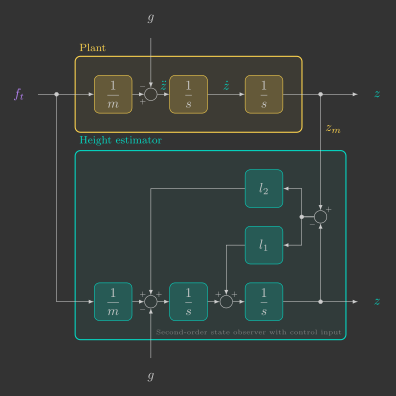{: width=70% style="display: block; margin: auto;" }

Compared with the previous observer, only the prediction of the vertical velocity changes. The prediction and correction steps become

$$
\begin{align}
\text{Prediction:}
&\quad
\left\{
\begin{array}{l}
{\color{var(--c1)}z[k+1]}
=
{\color{var(--c1)}z[k]}
+
{\color{var(--c1)}v_z[k]}
\Delta t
\\
{\color{var(--c1)}v_z[k+1]}
=
{\color{var(--c1)}v_z[k]}
+
\left(
-g
+
\dfrac{{\color{var(--c2)}f_t[k]}}{m}
\right)
\Delta t
\end{array}
\right.
\\[12pt]
\text{Correction:}
&\quad
\left\{
\begin{array}{l}
{\color{var(--c1)}z[k+1]}
=
{\color{var(--c1)}z[k+1]}
+
l_1\Delta t
\left(
{\color{var(--c3)}z_m[k]}
-
{\color{var(--c1)}z[k+1]}
\right)
\\
{\color{var(--c1)}v_z[k+1]}
=
{\color{var(--c1)}v_z[k+1]}
+
l_2\Delta t
\left(
{\color{var(--c3)}z_m[k]}
-
{\color{var(--c1)}z[k+1]}
\right)
\end{array}
\right.
\end{align}
$$

Modify the prediction step for $v_z$ in the `heightEstimator()` function so that it also accounts for the system input.

```c hl_lines="15"
// Estimate vertical position/velocity from range sensor
void heightEstimator()
{
    // Estimator parameters
    static const float wc =
    static const float zeta =
    static const float l1 =
    static const float l2 =

    // Measured distance from range sensor
    float z_m =

    // Prediction step (model)
    z =
    vz =

    // Correction step (measurement)
    vz =
    z =
}
```

This final version cannot be tested by simply holding the quadcopter in your hand, since the contact force applied by your hand is not included in the model and therefore violates the assumptions of the observer.

Nevertheless, if your second-order observer without the control input behaved as expected, this version should also perform correctly.

Save this implementation—it will become essential in the next section, where you will implement the vertical controller and finally fly the quadcopter autonomously.