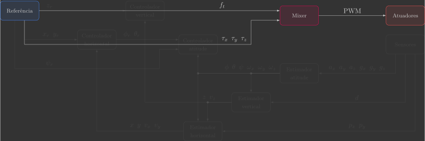
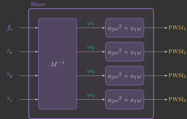
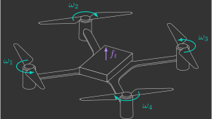
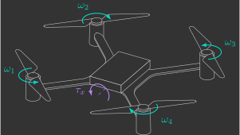
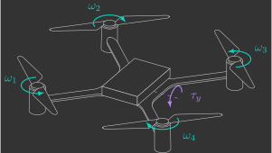
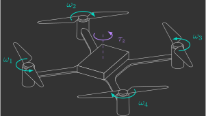

# :material-equalizer: Mixer

In this section, you will implement the mixer function, which converts the total thrust and torques generated by the propellers ${\color{var(--c2)}f_t}$, ${\color{var(--c2)}\tau_x}$, ${\color{var(--c2)}\tau_y}$, and ${\color{var(--c2)}\tau_z}$, into the corresponding motor ${\color{var(--c3)}\text{PWM}}$ commands.

{: width=100% style="display: block; margin: auto;" }

---

## Overview

Previously, we [derived](../../fundamentals/mixer.md) the inverse mixer matrix $M^{-1}$, which converts total thrust and torques generated by the propellers ${\color{var(--c2)}f_t}$, ${\color{var(--c2)}\tau_x}$, ${\color{var(--c2)}\tau_y}$, and ${\color{var(--c2)}\tau_z}$ into the squared angular velocities of the four motors, ${\color{var(--c1)}\omega_1}$, ${\color{var(--c1)}\omega_2}$, ${\color{var(--c1)}\omega_3}$, and ${\color{var(--c1)}\omega_4}$:

$$
\begin{bmatrix}
    {\color{var(--c1)}\omega_1}^2 \\
    {\color{var(--c1)}\omega_2}^2 \\
    {\color{var(--c1)}\omega_3}^2 \\
    {\color{var(--c1)}\omega_4}^2
\end{bmatrix}
=
\underbrace{
\begin{bmatrix}
    \frac{1}{4 k_l} & - \frac{1}{4 k_l l} & - \frac{1}{4 k_l l} & - \frac{1}{4 k_d}  \\
    \frac{1}{4 k_l} & - \frac{1}{4 k_l l} & \frac{1}{4 k_l l} & \frac{1}{4 k_d} \\
    \frac{1}{4 k_l} & \frac{1}{4 k_l l} & \frac{1}{4 k_l l} & - \frac{1}{4 k_d} \\
    \frac{1}{4 k_l} & \frac{1}{4 k_l l} & - \frac{1}{4 k_l l} & \frac{1}{4 k_d}
\end{bmatrix}
}_{M^{-1}}
\begin{bmatrix}
    {\color{var(--c2)}f_t} \\
    {\color{var(--c2)}\tau_x} \\
    {\color{var(--c2)}\tau_y} \\
    {\color{var(--c2)}\tau_z}
\end{bmatrix}
$$

We also [identified](../../identification/motor_coefficients.md) the motor coefficients $a_2$ and $a_1$, which convert the motor angular velocity ${\color{var(--c1)}\omega}$ into the corresponding ${\color{var(--c3)}\text{PWM}}$ command:

$$
    {\color{var(--c3)}\text{PWM}} = \underbrace{a_2 {\color{var(--c1)}\omega}^2 + a_1 {\color{var(--c1)}\omega}}_{f({\color{var(--c1)}\omega})}
$$

Combining these two relationships gives us the complete mixer logic:

{: width=50% style="display: block; margin: auto;" }

## Implementation

Implement this logic in the mixer function(1):
{ .annotate }

1. Declare the previously identified quadcopter parameters as local constants.

```c linenums="77" hl_lines="5-8 11-14 17-20 23-26"
// Compute motor commands
void mixer()
{
    // Quadcopter parameters
    static const float a2 =
    static const float a1 =
    static const float kl =
    static const float kd =

    // Compute required motor angular velocities squared (omega²)
    float omega1 =
    float omega2 =
    float omega3 =
    float omega4 =

    // Clamp to non-negative values and compute angular velocities (omega)
    omega1 =
    omega2 =
    omega3 =
    omega4 =

    // Compute motor PWM commands
    pwm1 =
    pwm2 =
    pwm3 =
    pwm4 =
}
```

!!! warning "Warning"
    Be careful when taking the square root of negative numbers. Check whether each value of $\omega^2$ is non-negative before computing its square root.

---

## Validation

To validate your implementation, perform a few simple tests by verifying that the correct motors increase or decrease their angular velocities.

!!! warning "Warning"
    Since the estimators and controllers have not been implemented yet, we must temporarily modify a few functions (essentially creating a bypass) in order to test the mixer.

    === "Actuators"

        Since the quadcopter is not yet being controlled, comment out the lines that check whether the altitude reference $z_r$ is greater than zero:

        ```c linenums="62" hl_lines="7-9 15-23"
        // Send commands to motors
        void actuators()
        {
            // Check is quadcopter is armed or disarmed
            if (supervisorIsArmed())
            {
                // Check if quadcopter has been commanded to take-off or land
                // // if (z_r > 0.0f)
                // {
                    // Apply calculated PWM values if is commanded to take-off
                    motorsSetRatio(MOTOR_M1, pwm1 * UINT16_MAX);
                    motorsSetRatio(MOTOR_M2, pwm2 * UINT16_MAX);
                    motorsSetRatio(MOTOR_M3, pwm3 * UINT16_MAX);
                    motorsSetRatio(MOTOR_M4, pwm4 * UINT16_MAX);
                // }
                // else
                // {
                //     // Apply idle PWM value if is commanded to land
                //     motorsSetRatio(MOTOR_M1, 0.1f * UINT16_MAX);
                //     motorsSetRatio(MOTOR_M2, 0.1f * UINT16_MAX);
                //     motorsSetRatio(MOTOR_M3, 0.1f * UINT16_MAX);
                //     motorsSetRatio(MOTOR_M4, 0.1f * UINT16_MAX);
                // }
            }
            else
            {
                // Turn off all motors if disarmed
                motorsStop();
            }
        }
        ```

    === "Reference"

        We will use the variables transmitted by the Crazyflie Client's Command-Based Flight Control interface to command the total thrust $f_t$ in increments of $0.01\,N$(1), and the roll torque $\tau_x$(2) and pitch torque $\tau_y$ in increments of $0.001\,N\cdot m$. Modify the code as follows:
        { .annotate }

        1. We first multiply by 2, then round the result, and finally divide by 100 (or 1000). This ensures rounding to two (or three) decimal places.

        2. The roll torque $\tau_x$ requires a sign inversion because the $y$ axis, controlled by the `←` and `→` buttons, is opposite to the positive roll torque direction.

        ```c linenums="72" hl_lines="11-15 17-21"
        // Read reference setpoints (from Crazyflie Client)
        void reference()
        {
            // Declare variables that store the most recent setpoint and state from commander
            static setpoint_t setpoint;
            static state_t state;

            // Retrieve the current commanded setpoints and state from commander module
            commanderGetSetpoint(&setpoint, &state);

            // // Extract position references from the received setpoint
            // x_r = setpoint.position.x;   // X position reference [m]
            // y_r = setpoint.position.y;   // Y position reference [m]
            // z_r = setpoint.position.z;   // Z position reference [m]
            // psi_r = 0.0f;                // Yaw angle reference [rad]

            // Extract commanded forces and torques from the received setpoint
            ft =  roundf((setpoint.position.z) * 2.0f) / 100.0f;    // Thrust command [N] (maps 0.5 m -> 0.01 N)
            tx = -roundf((setpoint.position.y) * 2.0f) / 1000.0f;   // Roll torque command [N·m] (maps 0.5 m -> 0.001 N·m)
            ty =  roundf((setpoint.position.x) * 2.0f) / 1000.0f;   // Pitch torque command [N·m] (maps 0.5 m -> 0.001 N·m)
            tz = 0.0f;                                              // Yaw torque command [N·m]
        }
        ```

### Thrust

Arm the quadcopter and vary the thrust command ${\color{var(--c2)}f_t}$ using the ++"Up"++ and ++"Down"++ buttons. Verify that all four motors increase and decrease their angular velocities accordingly.

{: width=60% style="display: block; margin: auto;" }

### Roll torque

Arm the quadcopter and vary the roll torque ${\color{var(--c2)}\tau_x}$ using the ++"←"++ and ++"→"++ buttons. Verify that only right motors ${\color{var(--c1)}3}$ and ${\color{var(--c1)}4}$ speed up for positive values, while left motors ${\color{var(--c1)}1}$ and ${\color{var(--c1)}2}$ speed up for negative values.

{: width=60% style="display: block; margin: auto;" }

### Pitch torque

Arm the quadcopter and vary the pitch torque ${\color{var(--c2)}\tau_y}$ using the ++"↑"++ and ++"↓"++ buttons. Verify that only back motors ${\color{var(--c1)}2}$ and ${\color{var(--c1)}3}$ speed up for positive values, while front motors ${\color{var(--c1)}1}$ and ${\color{var(--c1)}4}$ speed up for negative values.

{: width=60% style="display: block; margin: auto;" }

### Yaw torque

Arm the quadcopter and vary the yaw torque ${\color{var(--c2)}\tau_z}$ using the ++"←"++ and ++"→"++ buttons(1). Verify that only clockwise motors ${\color{var(--c1)}2}$ and ${\color{var(--c1)}4}$ speed up for positive values, while counter-clockwise motors ${\color{var(--c1)}1}$ and ${\color{var(--c1)}3}$ speed up for negative values.
{ .annotate }

1. Modify the reference function so that the ++"←"++ and ++"→"++ buttons adjust the yaw torque $\tau_z$ in increments of $0.0001\,N\cdot m$. Notice that this uses one additional decimal place.

{: width=60% style="display: block; margin: auto;" }