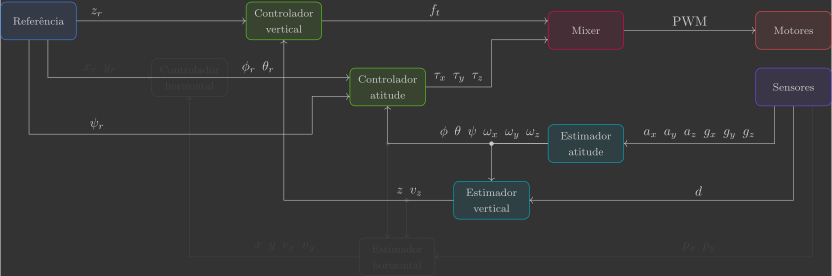
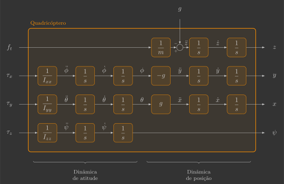

# :material-pan-vertical: Controlador vertical

Nesta secção você irá implementar o controlador vertical, que comanda a força de empuxo ${\color{var(--c2)}f_t}$ a partir da diferença entre a posição vertical de referência ${\color{var(--c3)}z_r}$ e estimada ${\color{var(--c1)}z}$.

{: width=100% style="display: block; margin: auto;" }

Para isto, será implementada uma nova função:

- `verticalController()`

Além de uma alteração em uma função já previamente implementada:

- `reference()`

---

## Implementação

Para começar, copie e cole o arquivo `vertical_estimator.c` e renomeie ele para `vertical_controller.c`.

### Definições

#### Variáveis globais

Declare mais uma variável global, que corresponde à posição vertical de referência ${\color{var(--c3)}z_r}$.

```c hl_lines="21"
// Actuators
float pwm1, pwm2, pwm3, pwm4; // Motors PWM

// Sensors
float ax, ay, az;             // Accelerometer [m/s^2]
float gx, gy, gz;             // Gyroscope [rad/s]
float d;                      // Range [m]

// System inputs
float ft;                    // Thrust force [N]
float tx, ty, tz;            // Roll, pitch and yaw torques [N.m]

// System states
float phi, theta, psi;       // Euler angles [rad]
float wx, wy, wz;            // Angular velocities [rad/s]
float z;                     // Vertical position [m]
float vz;                    // Vertical velocity [m/s]

// System references
float phi_r, theta_r, psi_r; // Euler angles reference [rad]
float z_r                    // Vertical position reference [m]
```

### Loop principal

Inclua a chamada da função `verticalController()` no loop principal.

```c hl_lines="11"
// Main application task
void appMain(void *param)
{
    // Infinite loop (runs at 200Hz)
    while (true)
    {
        reference();                  // Read reference setpoints (from Crazyflie Client)
        sensors();                    // Read raw sensor measurements
        attitudeEstimator();          // Estimate orientation (roll/pitch/yaw) from IMU sensor
        verticalEstimator();          // Estimate vertical position/velocity from range sensor
        verticalController();         // Compute desired thrust force
        attitudeController();         // Compute desired roll/pitch/yaw torques
        mixer();                      // Convert desired force/torques into motor PWM
        actuators();                  // Send commands to motors
        vTaskDelay(pdMS_TO_TICKS(5)); // Loop delay (5 ms)
    }
}
```

### Funções

#### Referência

A posição vertical de referência ${\color{var(--c3)}z_r}$ será comandada pelo Command Based Flight Control do Crazyflie Client utilizando os botões ++"Up"++ e ++"Down"++.

{: width=60% style="display: block; margin: auto;" }

Modifique a função `reference()` para que a posição vertical de referência ${\color{var(--c3)}z_r}$ seja definida pela variável `setpoint.position.z`.

```c hl_lines="12"
// Get reference setpoints from commander module
void reference()
{
    // Declare variables that store the most recent setpoint and state from commander
    static setpoint_t setpoint;
    static state_t state;

    // Retrieve the current commanded setpoints and state from commander module
    commanderGetSetpoint(&setpoint, &state);

    // Extract position references from the received setpoint
    z_r = setpoint.position.z;                        // Z position reference [m]
    phi_r = (setpoint.position.y * 2.0f) * pi/4.0f;   // Roll reference command [rad] (maps 0.5m -> pi/4 rad)
    theta_r = (setpoint.position.y * 2.0f) * pi/4.0f; // Pitch reference command [rad] (maps 0.5m -> pi/4 rad)
    psi_r = 0.0f;                                     // Yaw reference command [rad]
}
```

#### Controlador vertical

A função `verticalController()` é quem comanda a força de empuxo ${\color{var(--c2)}f_t}$ a partir da diferença entre a posição vertical de referência ${\color{var(--c3)}z_r}$ e estimada ${\color{var(--c1)}z}$.

```c
// Compute desired thrust force
void verticalController()
{ 
}
```

Já [vimos](../../../modeling/3d_model.md) que a dinâmica linearizada de um quadricóptero pode ser representada pelo diagrama de blocos abaixo:
    
{: width=100% style="display: block; margin: auto;" }
    
A dinâmica de posição vertical é descrita pelo seguinte trecho:

{: width=65% style="display: block; margin: auto;" }

Podemos cancelar a massa e a aceleração da gravidade de modo que a variável de controle seja a aceleração vertical:

{: width=85% style="display: block; margin: auto;" }

Isso reduz o sistema a ser controlado a um integrador duplo, exatamente como fizemos com o controlador de atitude. No entanto, agora temos um problema adicional: como estamos somando o termo da aceleração da gravidade (diferentemente da massa que está sendo multiplicada), caso ele seja um pouco diferente do real, não acontecerá um cancelamento exato e o sistema possuirá erro em regime permanente. Para resolver esse problema, podemos incluir um integrador no controlador.

=== "PID"

    O controlador proporcional-integral-derivativo (PID) adiciona ao controlador proporcional-derivativo (PD) um termo integral que acumula o erro ao longo do tempo, eliminando o erro estacionário. A ação proporcional e derivativa garantem resposta rápida e amortecida, enquanto a integral corrige desvios persistentes. É versátil e eficaz para o integrador duplo, mas o termo integral exige cuidado para evitar oscilações de baixa frequência (windup) e lentidão na resposta.

    {: width=100% style="display: block; margin: auto;" }

    ??? question "Definição dos ganhos $k_p$, $k_i$ e $k_d$"

    Olhando o controlador isoladamente, temos o seguinte diagrama de blocos:

    {: width=65% style="display: block; margin: auto;" }

    Que se traduz nas equações abaixo:

    $$
    \left\{
    \begin{array}{l}
        z_e = {\color{var(--c3)}z_r} - {\color{var(--c1)}z} \\
        {\color{var(--c2)}f_t} = m \left( g + \left( k_p z_e + k_i \displaystyle\int z_e dt + k_d \dfrac{d z_e}{dt} \right) \right)
    \end{array}
    \right.
    $$

    Inclua na função `attitudeController()` três variáveis locais $k_p$, $k_i$ e $k_d$, que correspondem aos ganhos do controlador, e, em seguida, calcule o torque comandado ${\color{var(--c2)}f_t}$ seguindo as equações acima(1).
    {.annotate}

    1. A integral do erro $\displaystyle\int z_e dt$ pode ser calculada com um termo auxiliar utilizando a seguinte lógica:

        ```c
        // Compute integral term (static to retain value amoung function calls)
        static float z_e_integral;
        z_e_integral += z_e*dt;
        ```

        A derivada do erro $\dfrac{dz_e}{dt}$ pode ser calculada com um termo auxiliar utilizando a seguinte lógica:

        ```c
        // Compute derivative term with auxiliary variable for previous error (static to retain value amoung function calls)
        static float z_e_previous;
        float z_e_derivative = (z_e-z_e_previous)/dt;
        z_e_previous = z_e;
        ```

    ```c hl_lines="5-7 10 13"
    // Compute desired thrust force
    void verticalController()
    {
        // Controller parameters (settling time of 2.0s and overshoot of 0,05%)
        static const float kp = 
        static const float ki = 
        static const float kd = 

        // Compute vertical position error
        float z_e = 

        // Compute desired thrust force
        ft = 
    }
    ```

=== "PI-P"

    O controlador proporcional em cascata com ação integral (PI-P) combina uma malha interna proporcional com uma malha externa proporcional com ação integral. A malha interna garante resposta rápida e amortecida, enquanto o termo integral na malha externa elimina o erro estacionário de posição. Essa configuração equilibra desempenho e simplicidade, oferecendo boa robustez sem exigir integrações redundantes, mas requer sintonia coordenada entre as duas malhas.

    {: width=100% style="display: block; margin: auto;" }

    ??? question "Definição dos ganhos $k_p$, $k_i$ e $k_d$"

    Olhando o controlador isoladamente, temos o seguinte diagrama de blocos:

    {: width=65% style="display: block; margin: auto;" }

    Que se traduz nas equações abaixo:

    $$
    \left\{
    \begin{array}{l}
        z_e = {\color{var(--c3)}z_r} - {\color{var(--c1)}z} \\
        {\color{var(--c2)}f_t} = m \left( g + \left( k_d \left( \left( k_p z_e + k_i \displaystyle\int z_e dt \right) - {\color{var(--c1)}v_z} \right) \right) \right)
    \end{array}
    \right.
    $$

    Inclua na função `attitudeController()` três variáveis locais $k_p$, $k_i$ e $k_d$, que correspondem aos ganhos do controlador, e, em seguida, calcule o torque comandado ${\color{var(--c2)}f_t}$ seguindo as equações acima(1).
    {.annotate}

    1. A integral do erro $\displaystyle\int z_e dt$ pode ser calculada com um termo auxiliar utilizando a seguinte lógica:

        ```c
        // Compute integral term (static to retain value amoung function calls)
        static float z_e_integral;
        z_e_integral += z_e*dt;
        ```

    ```c hl_lines="5-7 10 13"
    // Compute desired thrust force
    void verticalController()
    {
        // Controller parameters (settling time of 2.0s and overshoot of 0,05%)
        static const float kp = 
        static const float ki = 
        static const float kd = 

        // Compute vertical position error
        float z_e = 

        // Compute desired thrust force
        ft = 
    }
    ```

=== "LQI"

    O regulador quadrático com ação integral (LQI) estende o regulador quadrático linear (LQR) adicionando uma variável que integra o erro de saída. Isso permite eliminar o erro estacionário sem perder as vantagens do controle por realimentação completa. A estrutura resultante combina desempenho dinâmico ajustável — por meio do posicionamento dos polos — com precisão em regime permanente. É uma solução elegante e sistemática, mas requer modelagem ampliada e cálculo de ganhos por métodos de espaço de estados.

    {: width=100% style="display: block; margin: auto;" }

    ??? question "Definição dos ganhos $k_p$, $k_i$ e $k_d$"

    Olhando o controlador isoladamente, temos o seguinte diagrama de blocos(1):
    {.annotate}

    1. No sistema linearizado temos que ${\color{var(--c3)}\dot{z}_r} = {\color{var(--c3)}v_{z_r}}$ e ${\color{var(--c1)}\dot{z}} = {\color{var(--c1)}v_z}$.

    {: width=65% style="display: block; margin: auto;" }

    Que se traduz na equação abaixo(1):
    {.annotate}

    1. Como o objetivo é deixar o quadricóptero estacionário, a velocidade angular de referência ${\color{var(--c3)}v_{z_r}}$ pode ser assumida como sendo zero, o que reduz um dos termos:

        $$
        k_d \left( \cancelto{0}{{\color{var(--c3)}v_{z_r}}} - {\color{var(--c1)}v_z} \right) = - k_d  {\color{var(--c1)}v_z}
        $$

    $$
    \left\{
    \begin{array}{l}
        z_e = {\color{var(--c3)}z_r} - {\color{var(--c1)}z} \\
        {\color{var(--c2)}f_t} = m \left( g + \left( k_p z_e + k_i \displaystyle\int z_e dt - k_d {\color{var(--c1)}v_z} \right) \right)
    \end{array}
    \right.
    $$

    Inclua na função `attitudeController()` três variáveis locais $k_p$, $k_i$ e $k_d$, que correspondem aos ganhos do controlador, e, em seguida, calcule o torque comandado ${\color{var(--c2)}f_t}$ seguindo as equações acima(1).
    {.annotate}

    1. A integral do erro $\displaystyle\int z_e dt$ pode ser calculada com um termo auxiliar utilizando a seguinte lógica:

        ```c
        // Compute integral term (static to retain value amoung function calls)
        static float z_e_integral;
        z_e_integral += z_e*dt;
        ```

    ```c hl_lines="5-7 10 13"
    // Compute desired thrust force
    void verticalController()
    {
        // Controller parameters (settling time of 2.0s and overshoot of 0,05%)
        static const float kp = 
        static const float ki = 
        static const float kd = 

        // Compute vertical position error
        float z_e = 

        // Compute desired thrust force
        ft = 
    }
    ```

## Simulação

<div id="pid-mg-mismatch" style="max-width:980px;margin:1rem auto;">

<div style="display:grid;grid-template-columns:repeat(3,minmax(0,1fr));gap:12px;align-items:end;margin-bottom:8px;color:white;">
    <label>Kp
    <input id="kp" type="range" min="0" max="10" step="0.01" value="5.4">
    <div><code id="kpv">5.40</code></div>
    </label>
    <label>Ki
    <input id="ki" type="range" min="0" max="10" step="0.01" value="0">
    <div><code id="kiv">0.00</code></div>
    </label>
    <label>Kd
    <input id="kd" type="range" min="0" max="10" step="0.01" value="4">
    <div><code id="kdv">4.00</code></div>
    </label>
</div>

<fieldset style="border:1px solid #444;border-radius:12px;padding:10px;margin-bottom:10px;color:white;">
    <legend style="padding:0 6px;">Planta</legend>
    <div style="display:grid;grid-template-columns:repeat(2,minmax(0,1fr));gap:12px;">
    <label>m<sub>p</sub> (g)
        <input id="m_p" type="range" min="30" max="50" step="0.1" value="38.6">
        <div><code id="m_pv">38.6</code></div>
    </label>
    <label>g<sub>p</sub> (m/s²)
        <input id="g_p" type="range" min="9" max="10" step="0.001" value="9.81">
        <div><code id="g_pv">9.810</code></div>
    </label>
    </div>
</fieldset>

<fieldset style="border:1px solid #444;border-radius:12px;padding:10px;margin-bottom:12px;color:white;">
    <legend style="padding:0 6px;">Controlador</legend>
    <div style="display:grid;grid-template-columns:repeat(2,minmax(0,1fr));gap:12px;">
    <label>m<sub>c</sub> (g)
        <input id="m_c" type="range" min="30" max="50" step="0.1" value="38.6">
        <div><code id="m_cv">38.6</code></div>
    </label>
    <label>g<sub>c</sub> (m/s²)
        <input id="g_c" type="range" min="9" max="10" step="0.001" value="9.81">
        <div><code id="g_cv">9.810</code></div>
    </label>
    </div>
</fieldset>

<div style="display:flex;gap:10px;align-items:center;margin:6px 0 10px;">
    <button id="reset" style="padding:8px 14px;border-radius:10px;border:none;background:#03dac5;color:black;font-weight:600;cursor:pointer;">
    Reset
    </button>
</div>

<div id="plot" style="height:380px;"></div>
</div>

<script src="https://cdn.plot.ly/plotly-2.32.0.min.js"></script>
<script>
(function(){
const $ = id => document.getElementById(id);
const el = {
    kp:$('kp'), ki:$('ki'), kd:$('kd'),
    kpv:$('kpv'), kiv:$('kiv'), kdv:$('kdv'),
    m_p:$('m_p'), m_pv:$('m_pv'),
    g_p:$('g_p'), g_pv:$('g_pv'),
    m_c:$('m_c'), m_cv:$('m_cv'),
    g_c:$('g_c'), g_cv:$('g_cv'),
    reset:$('reset'), plot:$('plot')
};

const dt = 0.005, T = 10.0, r = 1.0;
const FMAX = 0.5;
const Z_COLOR  = "#03dac5";
const ZR_COLOR = "#ffd54f";
const FT_COLOR = "#bb86fc";

const upd = () => {
    el.kpv.textContent = (+el.kp.value).toFixed(2);
    el.kiv.textContent = (+el.ki.value).toFixed(2);
    el.kdv.textContent = (+el.kd.value).toFixed(2);
    el.m_pv.textContent= (+el.m_p.value).toFixed(1);
    el.g_pv.textContent= (+el.g_p.value).toFixed(3);
    el.m_cv.textContent= (+el.m_c.value).toFixed(1);
    el.g_cv.textContent= (+el.g_c.value).toFixed(3);
};

function simulate(){
    const Kp=+el.kp.value, Ki=+el.ki.value, Kd=+el.kd.value;
    const mp=+el.m_p.value/1000.0, gp=+el.g_p.value;
    const mc=+el.m_c.value/1000.0, gc=+el.g_c.value;

    let z=0, v=0, xi=0;
    const n = Math.max(1, Math.floor(T/dt));
    const t=[], y=[], u=[], u_cap=new Array(n).fill(FMAX);

    for(let k=0;k<n;k++){
    const e = r - z;
    const a_cmd = Kp*e + Ki*xi + Kd*(0 - v);
    let ft_cmd = mc*(a_cmd + gc);
    let ft_sat = Math.max(0, Math.min(FMAX, ft_cmd));
    xi += e*dt;
    const zdd = (ft_sat/mp) - gp;
    z += v*dt;
    v += zdd*dt;
    const time = k*dt;
    t.push(time); y.push(z); u.push(ft_sat);
    }

    const data = [
    {x:t, y:new Array(n).fill(r), name:"z_r", mode:"lines",
        line:{color:ZR_COLOR, dash:"dot", width:2}, yaxis:"y1", hoverinfo:"none"},
    {x:t, y:y, name:"z", mode:"lines",
        line:{color:Z_COLOR, width:2}, yaxis:"y1", hoverinfo:"none"},
    {x:t, y:u, name:"f_t", mode:"lines",
        line:{color:FT_COLOR, width:2}, yaxis:"y2", hoverinfo:"none"},
    {x:t, y:u_cap, name:"f_t_max", mode:"lines",
        line:{color:FT_COLOR, dash:"dot", width:2}, yaxis:"y2", hoverinfo:"none"}
    ];

    const layout = {
    paper_bgcolor:"rgba(0,0,0,0)",
    plot_bgcolor:"rgba(0,0,0,0)",
    margin:{l:55,r:55,t:10,b:40},
    xaxis:{
        title:"t (s)", color:"white", showgrid:false,
        range:[0,10], fixedrange:true,
        showline:true, linecolor:"white", linewidth:1
    },
    yaxis:{
        title:"z (m)", showgrid:false,
        range:[0,1.5], fixedrange:true,
        titlefont:{color:Z_COLOR}, tickfont:{color:Z_COLOR},
        showline:true, linecolor:Z_COLOR, linewidth:1
    },
    yaxis2:{
        title:"f_t (N)", showgrid:false,
        range:[0,0.6], fixedrange:true,
        overlaying:"y", side:"right",
        titlefont:{color:FT_COLOR}, tickfont:{color:FT_COLOR},
        showline:true, linecolor:FT_COLOR, linewidth:1
    },
    legend:{
        orientation:"v",
        x:0.98, y:0.05, xanchor:"right", yanchor:"bottom",
        bgcolor:"rgba(0,0,0,0.4)",
        bordercolor:"rgba(255,255,255,0.2)",
        font:{color:"white"}
    },
    hovermode:false
    };

    Plotly.react(el.plot, data, layout, {displayModeBar:false, responsive:true});
}

['input','change'].forEach(evt=>{
    ['kp','ki','kd','m_p','g_p','m_c','g_c'].forEach(id=>{
    $(id).addEventListener(evt,()=>{upd();simulate();});
    });
});

el.reset.addEventListener('click', ()=>{
    el.kp.value=5.4; el.ki.value=0; el.kd.value=4.0;
    el.m_p.value=38.6; el.g_p.value=9.81;
    el.m_c.value=38.6; el.g_c.value=9.81;
    upd(); simulate();
});

upd(); simulate();
})();
</script>


