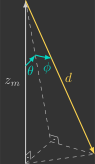

# Estimador vertical

Nesta secção você irá implementar o estimador vertical, que estima a posição $z$ e velocidade $v_z$ a partir da leitura do sensor de proximidade $d$.

{: width=100% style="display: block; margin: auto;" }

Para isto, será implementada uma nova função:

- `verticalEstimator()`

Além de uma alteração em uma função já previamente implementada:

- `sensors()`

---

## Implementação

Para começar, copie e cole o arquivo `attitude_controller.c` e renomeie ele para `vertical_estimator.c`.

### Definições

#### Variáveis globais

Declare mais algumas variáveis globais, que são as variáveis que entram e saem da função do estimador vertical.

```c hl_lines="4 9 10"
// Sensors
float ax, ay, az;             // Accelerometer [m/s^2]
float gx, gy, gz;             // Gyroscope [rad/s]
float d;                      // Range [m]

// System states
float phi, theta, psi;        // Euler angles [rad]
float wx, wy, wz;             // Angular velocities [rad/s]
float z;                      // Vertical position [m]
float vz;                     // Vertical velocity [m/s]
```

#### Variáveis de registro

Adicione as variáveis criadas ao grupo de registro previamente definido, para que seja possível visualizar nossa estimativa em tempo real no Crazyflie Client.

```c hl_lines="6 7"
// Logging group that stream variables to CFClient.
LOG_GROUP_START(stateEstimate)
LOG_ADD_CORE(LOG_FLOAT, roll, &log_phi)
LOG_ADD_CORE(LOG_FLOAT, pitch, &log_theta)
LOG_ADD_CORE(LOG_FLOAT, yaw, &log_psi)
LOG_ADD_CORE(LOG_FLOAT, z, &z)
LOG_ADD_CORE(LOG_FLOAT, vz, &vz)
LOG_GROUP_STOP(stateEstimate)
```

### Loop principal

Inclua no seu loop principal a chamada da função `verticalEstimator()` entre as funções `attitudeEstimator()` e `attitudeController()`.

```c hl_lines="10"
// Main application task
void appMain(void *param)
{
    // Infinite loop (runs at 200Hz)
    while (true)
    {
        reference();                  // Read reference setpoints (from Crazyflie Client)
        sensors();                    // Read raw sensor measurements
        attitudeEstimator();          // Estimate orientation (roll/pitch/yaw) from IMU sensor
        verticalEstimator();          // Estimate vertical position/velocity from range sensor
        attitudeController();         // Compute desired roll/pitch/yaw torques
        mixer();                      // Convert desired force/torques into motor PWM
        actuators();                  // Send commands to motors
        vTaskDelay(pdMS_TO_TICKS(5)); // Loop delay (5 ms)
    }
}
```

### Funções

#### Sensores

Inclue na função `sensors()` um código adicional que pega a leitura do sensor de proximidade e armazena ela na variável global previamente declarada.

```c hl_lines="24-27"
// Get sensor readings from estimator module
void sensors()
{
    // Declare variable that store the most recent measurement from estimator
    static measurement_t measurement;

    // Retrieve the current measurement from estimator module
    while (estimatorDequeue(&measurement))
    {
        switch (measurement.type)
        {
        // Get accelerometer sensor readings and convert [G's -> m/s^2]
        case MeasurementTypeAcceleration:
            ax = -measurement.data.acceleration.acc.x * g;
            ay = -measurement.data.acceleration.acc.y * g;
            az = -measurement.data.acceleration.acc.z * g;
            break;
        // Get gyroscope sensor readings and convert [deg/s -> rad/s]
        case MeasurementTypeGyroscope:
            gx = measurement.data.gyroscope.gyro.x * pi / 180.0f;
            gy = measurement.data.gyroscope.gyro.y * pi / 180.0f;
            gz = measurement.data.gyroscope.gyro.z * pi / 180.0f;
            break;
        // Get flow sensor readings [m]
        case MeasurementTypeTOF:
            d = measurement.data.tof.distance;
            break;
        default:
            break;
        }
    }
}
```

#### Estimador vertical

A função `verticalEstimator()` é quem estima a posição e velocidade vertical a partir da leitura do sensor de proximidade.

```c
// Estimate vertical position/velocity from range sensor
void verticalEstimator()
{
}
```

O sensor de proximidade utilizado é o [VL53L1X](https://www.st.com/en/imaging-and-photonics-solutions/vl53l1x.html){target=_blank}, da STMicroelectronics, localizado no Flow Deck v2.

{: width=30% style="display: block; margin: auto;" }

Esse sensor utiliza tecnologia VCSEL (*"Vertical Cavity Surface Emitting Laser"*), que mede a distância de um objeto com base no tempo de voo -  ToF (*"Time of Flight"*) - dos fótons emitidos. Ele possui um alcance de aproximadamente 4 cm a 4 m e uma taxa de amostragem máxima de 50 Hz.

Sensores de proximidade são dispositivos capazes de medir a distância de um objeto sem contato físico, geralmente por meio da emissão e recepção de ondas refletidas. O princípio é sempre o mesmo — emite-se uma onda, analisa-se o retorno — variando apenas o tipo de onda e a propriedade medida (tempo de retorno, intensidade ou diferença de fase).

Eles podem ser classificados em três categorias principais:

- Radar (*"Radio Detection and Ranging"*) — utilizam ondas eletromagnéticas de rádio
- Sonar (*"Sound Navigation and Ranging"*) — utilizam ondas sonoras (ultrassônicas)
- Lidar (*"Light Detection and Ranging"*) — utilizam ondas eletromagnéticas de luz (infravermelha ou laser)

Sensores VCSEL, como o VL53L1X, são portanto um tipo específico de Lidar, operando no espectro infravermelho próximo e com alta precisão em curtas distâncias.

##### Valor medido

Embora o sensor de proximidade meça a distância ao solo no referencial do drone, o que realmente nos interessa é a altura em relação ao mundo (sistema inercial). Para isso, precisamos corrigir a medida levando em conta a inclinação do drone.

!!! question "2D"    
    
    Determine a posição vertical medida $z_m$ a partir da leitura do sensor de proximidade $d$ e do ângulo de rolagem $\phi$.

    {: width=60% style="display: block; margin: auto;" }

    ??? info "Resposta"

        {: width=20% style="display: block; margin: auto;" }

        $$
        \begin{align}
            \cos\phi &= \dfrac{z_m}{d} \\
            z_m &= d \cos\phi \\
        \end{align}
        $$
        

!!! question "3D"    
    
    Determine a posição vertical medida $z_m$ a partir da leitura do sensor de proximidade $d$ e dos ângulos de rolagem $\phi$ e inclinação $\theta$.

    {: width=80% style="display: block; margin: auto;" }

    ??? info "Resposta"

        {: width=20% style="display: block; margin: auto;" }
        
        $$
        \begin{align}
            \cos\theta &= \dfrac{z_m}{d'} \\
            z_m &= d' \cos\theta
        \end{align}
        $$

        $$
        \begin{align}
            \cos\phi &= \dfrac{d'}{d} \\
            d' &= d \cos\phi
        \end{align}
        $$

        $$
        \begin{align}
            z_m &= d \cos\phi \cos \theta 
        \end{align}
        $$
        
Inclua na função `verticalEstimator()` uma variável local $z_m$, que corresponde ao valor medido a partir da leitura do sensor de proximidade $d$ e dos ângulos de rolagem $\phi$ e inclinação $\theta$ e, em seguida, atribua ela a distância vertical estimada $z$.

```c hl_lines="5 8"
// Estimate vertical position/velocity from range sensor
void verticalEstimator()
{
    // Measured distante from range sensor
    float z_m = 

    // Estimated distance
    z = 
}
```

Verifique como está sua estimativa, para isso carregue esse programa no drone e utilize o Crazyflie Client para visualizar o resultado.

!!! example "Resultado esperado"        
    Você deve notar que estamos compensando corretamente alterações na orientação do drone. No entanto, a estimativa possui muito ruído. Ao invés de utilizarmos um filtro passa-baixas (como no estimador de atitude) para remover esse ruído, vamos utilizar agora um observador de estados.

##### Observador de estados

Um observador de estados é um modelo que, a partir das entradas e saídas do sistema real (planta), estima internamente os seus estados.
    
No nosso caso, a planta é a dinâmica vertical do drone e o observador de estados é um sistema cujas entradas são a força de propulsão total $f_t$ e a posição vertical medida $z_m$, e as saídas são a posição e velocidade verticais estimadas $z$ e $v_z$, conforme diagrama de blocos abaixo:

{: width=70% style="display: block; margin: auto;" }

Vamos projetar três observadores de estados na sequência um do outro. O primeiro será bem simples, de ordem 1. Em seguida, vamos torná-lo mais sofisticado, de ordem 2. Por fim, vamos considerar a entrada da planta em nosso observador.

###### Observador de ordem 1

Vamos começar assumindo que o drone está parado, ou seja, sua posição vertical permanece constante:

$$
z = \text{cte}
$$

Chamamos esse caso de observador de ordem 1, pois o modelo da planta é descrito por uma equação diferencial de primeira ordem:

$$
\dot{z} = 0
$$

Agora, se realimentarmos a diferença entre a posição vertical medida $z_m$ e a estimada $z$, obtemos um sistema cuja estimativa converge exponencialmente para a medida, desde que o ganho do observador $l$ seja positivo:
        
$$
\dot{z} = 0 + l \left( z_m - z \right)
$$

{: width=70% style="display: block; margin: auto;" }

Esse diagrama de blocos pode ser resumido em uma única função de transferência:

[Figura]

Note que esse observador de estados é análogo a um regulador de estados, em que a referência é o estado medido e a saída é o estado estimado. Além disso, essa função de transferência é idêntica à de um filtro passa-baixas de primeira ordem, com o ganho $l$ desempenhando o papel da frequência de corte $\omega_c$:

$$
l = \omega_c
$$

Em outras palavras, um observador de ordem 1 é equivalente exato a um filtro passa-baixas: ele suaviza a medição, filtrando ruídos de alta frequência e preservando a tendência lenta da posição vertical.
        
Como o observador será implementado em um microcontrolador, precisamos encontrar sua forma discreta. Você já fez isso anteriormente para um filtro passa-baixas usando o método de Euler implícito. Desta vez, vamos aplicar o método de Euler explícito(1):
{.annotate}

1. A expressão derivada é idêntica à que você já viu antes:

    $$
    z[k+1] = \underbrace{\left(1-l\Delta t\right)}_{\left(1-\alpha\right)} z[k] + \underbrace{l\Delta t}_{\alpha} z_m[k] 
    $$
 
    No entanto, o valor de $\alpha$ agora é dado por:
        
    $$
    \alpha = l \Delta t
    $$

    Isso significa que ele pode ultrapassar 1 se $l$ for muito alto — o que torna o sistema instável. Essa é a desvantagem do método explícito em relação ao implícito. No entanto, basta garantir que:

    $$
    l < \frac{1}{\Delta t}
    $$

$$
\begin{align*}
    \frac{z[k+1]-z[k]}{\Delta t} + lz[k] &= l z_m[k] \\
    z[k+1]-z[k] + l\Delta tz[k] &= l\Delta t z_m[k] \\
    z[k+1] - \left( 1 - l\Delta t \right) z[k] &= l\Delta t z_m[k] \\
    z[k+1] &= \left(1-l\Delta t\right) z[k] + l\Delta t z_m[k] 
\end{align*}
$$

A equação discretizada pode ser reescrita de modo a evidenciar suas duas partes - uma de predição e outra de correção:

$$
z[k+1] = \underbrace{z[k]}_{\text{Predição}} + \quad  \underbrace{l \Delta t \left[ z_m[k] - z[k] \right]}_{\text{Correção}}
$$

- A parte de predição "prevê" o valor com base no modelo (neste caso, de que a posição vertical permanece constante)
- A parte de correção "corrige" o valor com base na medição (neste caso, a diferença entre a posição medida e prevista)

De forma equivalente, podemos representar o processo em duas etapas sequenciais, como será implementado no código(1):
{.annotate}

1. A etapa de predição é redundante neste caso, pois o modelo é de ordem 1 e não há dinâmica a propagar — o estado simplesmente permanece constante. Ainda assim, mantemos essa etapa para preservar a estrutura geral do observador (predição seguida de correção), que será reutilizada nos casos de ordem 2, onde a predição efetivamente calcula a evolução do estado.

$$
\begin{align}
    \text{Predição:} &\quad z[k+1] = z[k] \\ \\
    \text{Correção:} &\quad z[k+1] = z[k+1] + l \Delta t \left(z_m[k] - z[k+1]\right)
\end{align}
$$

Modifique sua função `verticalEstimator()` para que a distância vertical $z$ seja estimada por um observador de ordem 1 com as etapas de predição e correção.

```c hl_lines="5 6 12 15"
// Estimate vertical position/velocity from range sensor
void verticalEstimator()
{
    // Estimator parameters
    static const float wc =               // Cutoff frequency of filter [rad/s]
    static const float l =                // Observer gain

    // Measured distante from range sensor
    float z_m = 

    // Prediction step (model)
    z = 

    // Correction step (measurement)
    z = 
}
```
Experimente uma frequência de corte $\omega_c = 10$rad/s e verifique como isso influencia na sua estimativa.

!!! example "Resultado esperado"        
    XXX

###### Observador de ordem 2

Agora, vamos considerar que o drone está em movimento mas com velocidade constante:
     
$$
\dot{z} = \text{cte}
$$

Nesse caso, temos um observador de ordem 2, já que a planta é representada por uma equação diferencial de segunda ordem, ou seja, duas equações de primeira ordem encadeadas:

$$
\ddot{z} = 0 
\qquad
\longrightarrow
\qquad
\left\{
\begin{array}{l}
    \dot{z} = v_z \\
    \dot{v}_z = 0
\end{array}{}
\right.
$$

Agora, se realimentarmos a diferença entre a posição vertical medida $z_m$ e a estimada $z$ em ambas as equações diferenciais, obtemos um sistema cuja estimativa converge exponencialmente para a medida, desde que os ganhos do observador $l_1$ e $l_2$ sejam positivos:
        
$$
\left\{
\begin{array}{l}
    \dot{z} = v_z + l_1 \left( z_m - z \right) \\
    \dot{v}_z = 0 + l_2 \left( z_m - z \right)
\end{array}{}
\right.
$$

{: width=70% style="display: block; margin: auto;" }

Esse diagrama de blocos pode ser resumido em uma única função de transferência:

[Figura]

Novamente, fica evidente que um observador de estado é análogo a um regulador de estados, onde a referência é o estado medido e a saída o estado estimado. Porém, agora, a função de transferência é idêntica a de um filtro passa baixas de ordem dois, em que os ganhos $l_1$ e $l_2$ dependem da frequência de corte $\omega_c$ mas também do fator de amortecimento $\zeta$:
        
$$
\left\{
\begin{array}{l}
        l_1 = 2 \zeta \omega_c \\
        l_2 = \omega_c^2
\end{array}
\right.
$$
        
Sinais com frequências inferiores à frequência de corte $\omega_c$ possuem ganho 1 (não são atenuados), enquanto que, sinais com frequências superiores à frequência de corte $\omega_c$ possuem ganho 0 (são atenuados). Essa transição é contínua, podendo ser muito mais acentuada em um observador de ordem dois do que de ordem um, devido a possibilidade de ajustar o fator de amortecimento $\zeta$:

[Figura]

Quanto menor for o fator de amortecimento $\zeta$, mais acentuada será esta transição. No entanto, quando $\zeta < \frac{\sqrt{2}}{2}$, começa a haver um aumento do ganho para frequências próximas à frequência de corte, fenômeno conhecido como ``ressonância'':

[Figura]

Queremos que a curva seja o mais acentuada possível porém sem gerar ressonância. É comum fixarmos o valor de $\zeta$ em $\frac{\sqrt{2}}{2}$, que nos garante isso.

Aplicando novamente o método de Euler, chegamos nas seguintes equações discretizadas:
        
$$
\left\{
\begin{array}{rll}
    z[k+1] =& \overbrace{z[k] + v_z[k] \Delta t}^{\text{Predição}} &+  \quad \overbrace{l_1 \Delta t \left[ z_m[k] - z[k] \right]}^{\text{Correção}} \\
    v_z[k+1] =& \underbrace{v_z[k]\qquad\qquad}_{\text{Predição}} &+  \quad \underbrace{l_2 \Delta t \left[ z_m[k] - z[k] \right]}_{\text{Correção}}
\end{array}
\right.
$$

Que podem ser divididas em duas etapas, uma de predição e outra de correção:

$$
\begin{align}
    \text{Predição:} &\quad 
    \left\{
    \begin{array}{l}
        z[k+1] = z[k] + v_z[k] \Delta t \\
        v_z[k+1] = v_z[k]
    \end{array}
    \right.  \\ \\
    \text{Correção:} &\quad 
    \left\{
    \begin{array}{l}
        z[k+1] = z[k+1] + l_1 \Delta t \left(z_m[k] - z[k+1]\right) \\
        v_z[k+1] = v_z[k+1] + l_2 \Delta t \left(z_m[k] - z[k+1]\right)
    \end{array}
    \right.
\end{align}
$$

Modifique sua função `verticalEstimator()` para que a distância vertical $z$ e velocidade vertical $v_z$ sejam estimados por um observador de ordem 2 com as etapas de predição e correção(1).
{.annotate}

1. Na etapa de correção, primeiro nós corrigimos o valor de $v_z$ e depois de $z$ para garantir que o valor utilizado de $z$ no cáculo da correção seja o mesmo em ambas as equações.


```c hl_lines="5-8 14-15 18-19"
// Estimate vertical position/velocity from range sensor
void verticalEstimator()
{
    // Estimator parameters
    static const float wc = 
    static const float zeta = 
    static const float l1 = 
    static const float l2 = 

    // Measured distante from range sensor
    float z_m = 

    // Prediction step (model)
    z = 
    vz =

    // Correction step (measurement)
    vz =
    z = 
}
```

Experimente uma frequência de corte $\omega_c = 10$rad/s e verifique como isso influencia na sua estimativa.

!!! example "Resultado esperado"        
    XXX

###### Observador de ordem 2 (com entrada)

Por fim, vamos considerar que a aceleração do drone, em vez de ser nula, depende das forças atuantes — o peso e o empuxo gerado pelos motores:

$$
\ddot{z} = - g + \frac{f_t}{m}
$$

O observador permanece de ordem 2, mas inclui a entrada de controle:

$$
\left\{
\begin{array}{l}
    \dot{z} = v_z \\
    \dot{v}_z =  - g + \dfrac{f_t}{m}
\end{array}{}
\right.
$$

Isso significa que agora sua dinâmica é uma cópia fiel da planta, conforme pode ser verificado no diagrama de blocos abaixo:

{: width=70% style="display: block; margin: auto;" }

As 

$$
\begin{align}
    \text{Predição:} &\quad 
    \left\{
    \begin{array}{l}
        z[k+1] = z[k] + v_z[k] \Delta t \\
        v_z[k+1] = v_z[k] + \left( - g + \dfrac{f_t[k]}{m} \right)  \Delta t
    \end{array}
    \right.  \\ \\
    \text{Correção:} &\quad 
    \left\{
    \begin{array}{l}
        z[k+1] = z[k+1] + l_1 \Delta t \left(z_m[k] - z[k+1]\right) \\
        v_z[k+1] = v_z[k+1] + l_2 \Delta t \left(z_m[k] - z[k+1]\right)
    \end{array}
    \right.
\end{align}
$$

Modifique a etapa de predição de $v_z$ na sua função `verticalEstimator()` para que ela leve em consideração também as entradas do sistema.

```c hl_lines="15"
// Estimate vertical position/velocity from range sensor
void verticalEstimator()
{
    // Estimator parameters
    static const float wc = 
    static const float zeta = 
    static const float l1 = 
    static const float l2 = 

    // Measured distante from range sensor
    float z_m = 

    // Prediction step (model)
    z = 
    vz =

    // Correction step (measurement)
    vz =
    z = 
}
```

Não é possível testar essa última versão segurando o drone com a mão, pois a força normal exercida ao segurá-lo não está contemplada no modelo e resultaria em respostas inconsistentes. 

Ainda assim, se o seu observador de estados de ordem 2 sem entrada apresentou bons resultados, é esperado que este, com entradas, também funcione corretamente.

Guarde essa modificação — ela será essencial quando implementarmos o controlador vertical e finalmente colocarmos o drone para voar de forma autônoma.

---

## Validação