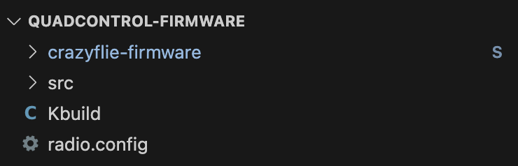

# Firmware

Esta secção contém as instruções para clonar, configurar e compilar o firmware do Crazyflie.

---

## Clonando

### Fork

1. Crie um *fork* do repositório que contém o [firmware](https://github.com/quadcontrol/quadcontrol-firmware) para a sua conta do GitHub.

### Clone

1. Abre o Visual Studio Code

2. Clique em `Clone Git Repository...`

3. Coloque o endereço do repositório *forkado* para sua conta do GitHub:
```bash
https://github.com/username/quadcontrol-firmware.git
```

    !!! warning "Atenção"
        Você deve substituir `username` pelo seu nome de usuário do GitHub

4. Pressione `Enter` e selecione o local onde você quer salvar esse repositório.

5. Quando ele terminar de clonar e perguntar se você gostaria de abrir o repositório clonado, clique em `Open`.

6. Abra uma janela do terminal clicando em `Terminal` > `New Terminal` (ou usando o atalho `Crtl`+`Shift`+`'`).

    !!! warning "Atenção"
        Caso esteja utilizando Windows, ele abre por padrão um terminal do PowerShell, mas você deve alternar para um terminal do WSL (Ubuntu):
        {: width="200" style="display: block; margin: auto;" }

8. Inicialize todos os submódulos pelo terminal:
```bash
git submodule update --init --recursive
```


### Organização

O firmware é composto por 2 pastas e 2 arquivos.

{: width="450" style="display: block; margin: auto;" }

Vamos entender cada um deles:

- `crazyflie-firmware` - Pasta que contém o firmware do Crazyflie, o qual utilizaremos como submódulo
- `src` - Pasta que contém os programas que vamos desenvolver ao longo do curso
- `Kbuild` - Arquivo que define o programa que será compilado
- `radio.config` - Arquivo que define o canal de rádio utilizado para se comunicar com o Crazyflie

---

## Configurando

### Radio

1. Abra o arquivo `radio.config`

2. Altere o canal do rádio conforme a numeração do seu Crazyflie. 
```c title="radio.config"
RADIO_CHANNEL=1
```

### By-pass

1. Navegue até a página `crazyflie-firwmare` > `src` > `modules` > `src` e abra o arquivo `stabilizer.c`.

2. Comente as linhas 220-223, 323 e 353, conforme abaixo:
```c title="stabilizer.c" linenums="218"
static void setMotorRatios(const motors_thrust_pwm_t* motorPwm)
{
  // motorsSetRatio(MOTOR_M1, motorPwm->motors.m1);
  // motorsSetRatio(MOTOR_M2, motorPwm->motors.m2);
  // motorsSetRatio(MOTOR_M3, motorPwm->motors.m3);
  // motorsSetRatio(MOTOR_M4, motorPwm->motors.m4);
}
```
```c title="stabilizer.c" linenums="323"
      //stateEstimator(&state, stabilizerStep);
```
```c title="stabilizer.c" linenums="352"
      } else {
        // motorsStop();
      }
```

!!! info "Informação"
    Fazemos isso para bipassar o algoritmo proprietário do controlador do Crazyflie (ele vai continuar rodando em segundo plano, mas vamos ignorar seus comandos para podermos usar os nossos).

### Plataforma

1. Configure o firmware para a paltaforma do Crazyflie 2.1 Brushless:
```bash
make cf21bl_defconfig
```

---

## Compilando

### Build

1. Compile o firmware:
```bash
make
```

### Flash

1. Programe o firmware no Crazyflie:
```bash
make cload
```

    !!! warning "Atenção"
        - O Crazyflie 2.1 Brushless precisa estar ligado
        - O Crazyradio PA precisa estar conectado na porta USB