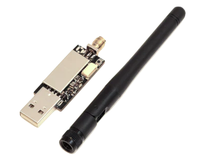
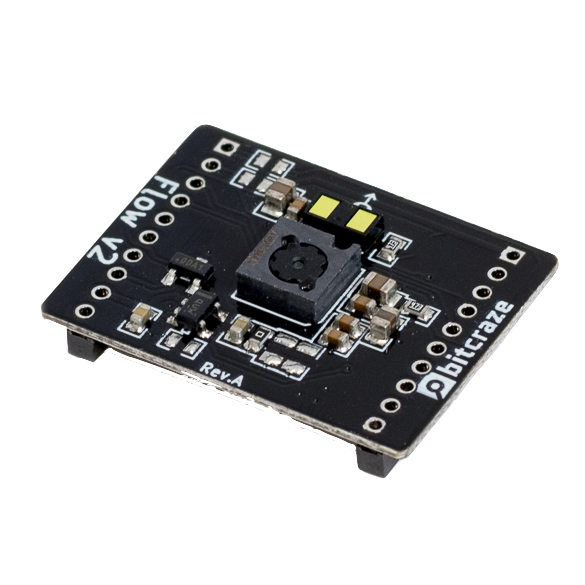

# Hardware

Neste curso, você vai programar um drone real e ver ele voar com os algoritmos que você mesmo desenvolveu. Mas, pra isso, você precisa de um conjunto específico de equipamentos — compactos, mas poderosos.

Se você está matriculado na eletiva, tudo isso será fornecido a você. Mas é importante entender o que é cada componente, por que eles são essenciais e como se conectam.

---

## Crazyflie 2.1 Brushless

{: width="400" style="display: block; margin: auto;" }

O [Crazyflie 2.1 Brushless](https://store.bitcraze.io/products/crazyflie-2-1-brushless){target=_blank} é o coração do sistema: um minidrone *open-source* com a estrutura baseada numa placa de circuito impresso (PCB). Compacto, robusto e com:

- Processador ARM (Cortex-M4 168 MHz)
- Motores BLDC (08028-10000KV)
- Controladores dos motores BLDC (5A ESCs)
- IMU embutida (BMI088)

A versão brushless foi lançada recentemente (2025) e traz mais potência e durabilidade para os motores.

---

## Crazyradio 2.0

{: width="250" style="display: block; margin: auto;" }

O [Crazyradio 2.0](https://store.bitcraze.io/products/crazyradio-2-0){target=_blank} é um *dongle* que permite comunicação sem fio entre o seu computador e o drone. Com ele, você pode:

- Fazer upload de firmware
- Enviar comandos em tempo real
- Receber dados da telemetria

Ele se conecta via USB e funciona com as ferramentas oficiais da Bitcraze.

---

## Flow deck v2

{: width="150" style="display: block; margin: auto;" }

O [Flow deck v2](https://store.bitcraze.io/collections/decks/products/flow-deck-v2){target=_blank} é um pequeno módulo que se encaixa embaixo do drone e adiciona dois sensores fundamentais para o voo autônomo:

- Proximidade (VL53L1x)
- Fluxo óptico (PMW3901)

Com eles, o drone consegue medir a altura em relação ao chão e o deslocamente lateral com base no movimento do solo — o que é essencial para estimar sua posição no espaço.

--- 

## Resumo do kit

Esses componentes também são oferecidos na forma de um kit pela Bitcraze, o [STEM bundle - Crazyflie 2.1 Brushless](https://store.bitcraze.io/collections/bundles/products/stem-bundle-crazyflie-2-1-brushless){target=_blank}. Você receberá exatamente esse kit:

- Crazyflie 2.1 Brushless  
- Crazyradio 2.0  
- Flow Deck v2  

Além de cabos e acessórios, com tudo pronto para transformar código em voo real. 🚀