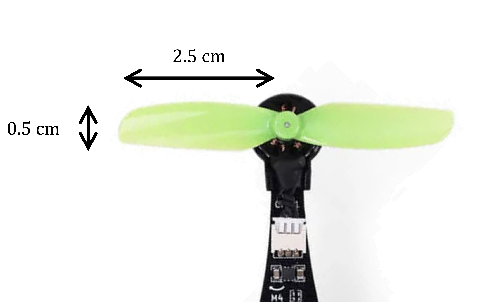

# :material-airplane: Aerodynamics

This section presents basic aerodynamic principles, the forces that explain how a drone generates lift and moves through the air.

---

## Airfoil

Every mathematical model of a drone includes aerodynamic parameters. To understand where they come from, let’s begin by examining the aerodynamic forces acting on an airfoil, the building block of any wing or propeller blade.

### Aerodynamic forces

The figure below shows a cross section of an airfoil, a body shaped to generate lift when placed in an airflow:

{: width=50% style="display: block; margin: auto;" }

While the airfoil is designed to produce a desired lift force ${\color{var(--c2)}f_l}$ (perpendicular to the velocity ${\color{var(--c1)}v}$), it also produces an undesired drag force ${\color{var(--c2)}f_d}$ (parallel to the velocity ${\color{var(--c1)}v}$):

$$
{\color{var(--c2)}f_l} = \frac{1}{2} \rho A C_l {\color{var(--c1)}v}^2 
\qquad \qquad
{\color{var(--c2)}f_d} = \frac{1}{2} \rho A C_d {\color{var(--c1)}v}^2 
$$

Where:

- $\rho$ — Air density ($\text{kg/m}^3$)  
- $A$ — Surface area ($\text{m}^2$)  
- $C_l$ — Lift coefficient (dimensionless)  
- $C_d$ — Drag coefficient (dimensionless)  
- ${\color{var(--c1)}v}$ — Linear velocity of the airfoil ($\text{m/s}$)

### Aerodynamic coefficients

The lift and drag coefficients are not constant.  They vary according to three main aerodynamic conditions:

- Angle of attack ($\alpha$): the angle between the airfoil’s mean line (its *chord line*) and the airflow velocity vector  
- Reynolds number ($Re = \frac{\rho {\color{var(--c1)}v} D}{\mu}$): a dimensionless quantity defining the flow regime, which can be laminar(1) or turbulent(2)  
{.annotate}

    1. $Re<2300$
    3. $Re>4000$

- Mach number ($M = \frac{\color{var(--c1)}v}{v_s}$): the ratio between the airspeed and the speed of sound, which defines whether the flow is subsonic(1), supersonic(2) or hypersonic(3)
{.annotate}

    1. $M<1$
    2. $1<M<5$
    3. $M>5$

For airfoils operating in laminar flow at subsonic speeds, the angle of attack is the dominant factor:

{: width=50% style="display: block; margin: auto;" }

There are many possible airfoil shapes. One of the most widely used profiles is the Clark Y, whose lift and drag coefficients as functions of the angle of attack are well known and shown below(1):
{.annotate}

1. Assuming the Reynolds and Mach numbers remain within typical laminar subsonic ranges.

{: width=80% style="display: block; margin: auto;" }

While the drag coefficient increases monotonically with $\alpha$, the lift coefficient reaches a maximum around $\alpha = 18^{\circ}$. This point is known as the stall, which occurs when the airflow separates from the wing’s upper surface, creating turbulence and loss of lift. Note also that the lift coefficient is zero for a small negative angle and becomes negative only below that.

!!! question "Exercise 1"

    To consolidate these concepts, consider a fixed-wing drone (flying wing) using Clark Y airfoils, flying in level cruise with the following parameters:

    {: width=30% style="display: block; margin: auto;" align=right } 

    - Mass: $m = 40~\text{g}$  
    - Length: $l = 10~\text{cm}$  
    - Wing span: $b = 10~\text{cm}$  
    - Propeller efficiency: $\eta_p = 60~\%$
    - Motor efficiency: $\eta_m = 75~\%$  
    - ESC efficiency: $\eta_e = 95~\%$  
    - Battery efficiency: $\eta_b = 95~\%$  
    - Battery voltage: $e_s = 3.7~\text{V}$  
    - Battery capacity: $q_s = 350~\text{mAh}$  
    - Gravitational acceleration: $g = 9.81~\text{m/s}^2$  
    - Air density: $\rho = 1.225~\text{kg.m}^{-3}$ 

    ??? info "a) Draw the free-body diagram of the forces acting on the drone."

        {: width=50% style="display: block; margin: auto;" }

    ??? info "b) Compute the total wing area assuming the body is triangular."

        Given that it is a flying-wing drone, the wing area can be approximated as a triangle with a base equal to the wing span and a height equal to the length of the drone:

        $$
        \begin{align}
            A &= \frac{b \cdot l}{2} \\
            A &= \frac{10 \cdot 10}{2} \\
            A &= 50~\text{cm}^2
        \end{align}
        $$

    ??? info "c) Determine the lift and drag coefficients of the drone’s wings."

        Since the drone is flying in level cruise with zero angle of attack, we can read the coefficients from the Clark Y airfoil graph:

        $$
        \left\{
        \begin{array}{l}
            C_l = 0.35 \\
            C_d = 0.02
        \end{array}
        \right.
        $$

    ??? info "d) Compute the drone’s cruise speed."

        In level cruise, the net vertical force is zero, allowing us to compute the cruising velocity:

        $$
        \begin{align}
            \sum {\color{var(--c2)}f_y} &= 0 \\
            {\color{var(--c2)}f_l} - {\color{var(--c2)}f_w} &= 0 \\
            \frac{1}{2} \rho A C_l {\color{var(--c1)}v}^2 - mg &= 0 \\
            {\color{var(--c1)}v} &= \sqrt{\frac{2mg}{\rho A C_l}} \\
            {\color{var(--c1)}v} &= \sqrt{\frac{2 \cdot 0.04 \cdot 9.81}{1.225 \cdot 50 \times 10^{-4} \cdot 0.35}} \\
            {\color{var(--c1)}v} &= 19.13~\text{m/s} \quad (\approx 69~\text{km/h})
        \end{align}
        $$

    ??? info "e) Compute the thrust generated by the propellers."

        In level cruise, the net horizontal force is zero, which allows us to compute the thrust force:

        $$
        \begin{align}
            \sum {\color{var(--c2)}f_x} &= 0 \\
            {\color{var(--c2)}f_t} - {\color{var(--c2)}f_d} &= 0 \\
            {\color{var(--c2)}f_t} &= \frac{1}{2} \rho A C_d {\color{var(--c1)}v}^2 \\
            {\color{var(--c2)}f_t} &= \frac{1}{2} \cdot 1.225 \cdot 50 \times 10^{-4} \cdot 0.02 \cdot {\color{var(--c1)}19.13}^2 \\
            {\color{var(--c2)}f_t} &= 2.24 \times 10^{-2}~\text{N}
        \end{align}
        $$

    ??? info "f) Calculate the mechanical and electrical power required."

        Mechanical power is given by the product of thrust and velocity:

        $$
        \begin{align}
            P_m &= {\color{var(--c2)}f_t} {\color{var(--c1)}v} \\
            P_m &= {\color{var(--c2)}2.24 \times 10^{-2}} \cdot {\color{var(--c1)}19.13} \\
            P_m &= 0.43~\text{W}
        \end{align}
        $$

        The electrical power accounts for the propulsion system efficiency:

        $$
        \begin{align}
            P_e &= \frac{P_m}{\eta_p \eta_m \eta_e \eta_b} \\
            P_e &= \frac{0.43}{0.6 \cdot 0.75 \cdot 0.95 \cdot 0.95} \\
            P_e &= 1.06~\text{W}
        \end{align}
        $$

    ??? info "g) Estimate how long the drone can stay airborne."

        The total energy stored in the battery is given by the product of its voltage and capacity:

        $$
        \begin{align}
            E_s &= e_s q_s \\
            E_s &= 3.7 \cdot 0.35 \\
            E_s &= 1.3~\text{Wh}
        \end{align}
        $$

        Dividing this energy by the electrical power consumption gives an estimate of the flight time:

        $$
        \begin{align}
            \Delta t &= \frac{E_s}{P_e} \\
            \Delta t &= \frac{1.3 \cdot 3600}{1.06} \\
            \Delta t &= 4413~\text{s} \quad (\approx 1~\text{h}~14~\text{min})
        \end{align}
        $$

---

## Propeller

A propeller consists of $n$ blades(1), each of which can be treated as an individual airfoil.
{.annotate}

1. Typically 2–4 blades, though certain applications may use 5–6.

### Aerodynamic forces and torques

As the propeller spins, each blade generates lift and drag forces, as illustrated below:

{: width=50% style="display: block; margin: auto;" }

Where:

- $d$ — Distance from the pressure center to the rotation axis ($\text{m}$)  
- ${\color{var(--c1)}\omega}$ — Angular velocity of the propeller ($\text{rad/s}$)

!!! question "Exercise 2"

    Derive the expressions for the lift ${\color{var(--c2)}f_l}$ and drag ${\color{var(--c2)}f_d}$ forces acting on the propeller blades as functions of the angular velocity ${\color{var(--c1)}\omega}$.

    ??? info "Answer"

        Starting from the general lift equation and substituting ${\color{var(--c1)}v} = {\color{var(--c1)}\omega} d$ gives:

        $$
        \begin{align}
            {\color{var(--c2)}f_l} &= \frac{1}{2} \rho A C_l {\color{var(--c1)}v}^2 \\ 
            {\color{var(--c2)}f_l} &= \frac{1}{2} \rho A C_l ({\color{var(--c1)}\omega} d)^2 \\
            {\color{var(--c2)}f_l} &= \frac{1}{2} \rho A C_l d^2 {\color{var(--c1)}\omega}^2 
        \end{align}
        $$

        Repeating the same procedure for the drag force yields:

        $$
        \begin{align}
            {\color{var(--c2)}f_d} &= \frac{1}{2} \rho A C_d {\color{var(--c1)}v}^2 \\ 
            {\color{var(--c2)}f_d} &= \frac{1}{2} \rho A C_d ({\color{var(--c1)}\omega} d)^2 \\
            {\color{var(--c2)}f_d} &= \frac{1}{2} \rho A C_d d^2 {\color{var(--c1)}\omega}^2 
        \end{align}
        $$

The lift and drag forces on each blades can be represented by an equivalent thrust force and drag torque on the propeller, as shown below:

{: width=50% style="display: block; margin: auto;" }

!!! question "Exercise 3"

    Determine the thrust force ${\color{var(--c2)}f}$ and drag torque ${\color{var(--c2)}\tau}$ of the propeller.

    ??? info "Answer"

        The thrust force ${\color{var(--c2)}f}$ of the propeller is simply the sum of each blade lift force ${\color{var(--c2)}f_l}$:

        $$
        \begin{align}
            {\color{var(--c2)}f} &= 2 {\color{var(--c2)}f_l} \\ 
            {\color{var(--c2)}f} &= \cancel{2} \left( \frac{1}{\cancel{2}} \rho A C_l d^2 {\color{var(--c1)}\omega}^2 \right) \\
            {\color{var(--c2)}f} &= \rho A C_l d^2 {\color{var(--c1)}\omega}^2 
        \end{align}
        $$

        Whereas the drag torque ${\color{var(--c2)}\tau}$ is the sum of each blade drag force ${\color{var(--c2)}f_d}$ multiplied by its arm $d$:

        $$
        \begin{align}
            {\color{var(--c2)}\tau} &= 2 {\color{var(--c2)}f_d} d \\ 
            {\color{var(--c2)}\tau} &= \cancel{2} \left( \frac{1}{\cancel{2}} \rho A C_d d^2 {\color{var(--c1)}\omega}^2  \right) d \\
            {\color{var(--c2)}\tau} &= \rho A C_d d^3 {\color{var(--c1)}\omega}^2 
        \end{align}
        $$

Since all other parameters are constant, the thrust and drag torque depend only on the square of the angular velocity:

$$
{\color{var(--c2)}f} = \underbrace{\rho A C_l d^2}_{k_l} {\color{var(--c1)}\omega}^2 
\qquad \qquad
{\color{var(--c2)}\tau} = \underbrace{\rho A C_d d^3}_{k_d} {\color{var(--c1)}\omega}^2 
$$

Where:

- $k_l$ — Lift constant ($\text{N.s}^2\text{/rad}^2$)  
- $k_d$ — Drag constant ($\text{N.m.s}^2\text{/rad}^2$)

### Aerodynamic constants

These two constants fully describe how a propeller converts rotational speed into force and torque:

{: width=50% style="display: block; margin: auto;" }

$$
{\color{var(--c2)}f} = k_l {\color{var(--c1)}\omega}^2 
\qquad \qquad
{\color{var(--c2)}\tau} = k_d {\color{var(--c1)}\omega}^2 
$$

!!! question "Exercise 4"

    {: width=20% style="display: block; margin: auto;" align=right } 

    Using a ruler, roughly estimate(1) the aerodynamic constants of the [Bitcraze Crazyflie 2.1 brushless propellers](https://store.bitcraze.io/collections/spare-parts-crazyflie-brushless/products/propeller-55-35-4ccw-4cw-green){target=_blank}. Assume the blade shape resembles a Clark Y profile with an angle of attack $\alpha = 5^\circ$, where the lift coefficient is similar, but the drag coefficient is eight times larger(2).
    {.annotate}

    1. We are interested only in the order of magnitude.  
    2. Due to additional turbulence generated by the propeller.

    ??? info "Answer"

        The air density can be assumed as:

        $$
        \rho = 1.225~\text{kg/m}^3
        $$

        The surface area can be estimated with a ruler assuming each blade is a rectangle:

        {: width=50% style="display: block; margin: auto;" }

        $$
        A = 2.5 \cdot 0.5 = 1.25~\text{cm}^2 \\    
        $$

        The coefficients can be determined from the Clark Y airfoil graph with an angle of attack $\alpha = 5^\circ$:

        $$
        \left\{
        \begin{array}{l}
            C_l = 0.7 \\
            C_d = 0.04 \cdot 8 = 0.32
        \end{array}
        \right.
        $$

        The  distance from the pressure center to the rotation axis can be estimated with a ruler:

        {: width=40% style="display: block; margin: auto;" }

        $$
            d = 1.5~\text{cm}
        $$

        With all those values, the lift and drag constants can be determined:

        $$
        \begin{align}
        k_l &= \rho A C_l d^2 \\
        k_l &= 1.225 \cdot 1.25\times10^{-4} \cdot 0.7 \cdot {\left( 1.5\times10^{-2} \right)}^2 \\
        k_l &= 2.41\times10^{-8}~\text{N.s}^2/\text{rad}^2
        \end{align}
        $$

        $$
        \begin{align}
        k_d &= \rho A C_d d^3 \\
        k_d &= 1.225 \cdot 1.25\times10^{-4} \cdot 0.32 \cdot {\left( 1.5\times10^{-2} \right)}^3 \\
        k_d &= 1.65\times10^{-10}~\text{N.m.s}^2/\text{rad}^2
        \end{align}
        $$

These two parameters will later be determined experimentally in the indentification section of [lift constant](../identification/lift_constant.md) and [drag constant](../identification/drag_constant.md), and you’ll find that the measured values closely match these estimates.

!!! question "Exercise 5"

    To consolidate these ideas, consider a quadrotor drone hovering in place with the following parameters:

    - Mass: $m = 40~\text{g}$  
    - Lift constant: $k_l = 2.4\times10^{-8}~\text{N·s}^2\text{/rad}^2$  
    - Drag constant: $k_d = 1.6\times10^{-10}~\text{N·m·s}^2\text{/rad}^2$  
    - Motor efficiency: $\eta_m = 75~\%$
    - ESC efficiency: $\eta_e = 95~\%$
    - Battery efficiency: $\eta_b = 95~\%$  
    - Battery voltage: $e_s = 3.7~\text{V}$  
    - Battery capacity: $q_s = 350~\text{mAh}$  
    - Gravitational acceleration: $g = 9.81~\text{m/s}^2$  
    - Air density: $\rho = 1.225~\text{kg·m}^{-3}$  

    ??? info "a) Draw the free-body diagram of the forces acting on the drone."

    ??? info "b) Compute the angular velocity of the propellers."

        In hover, the net vertical force is zero, allowing us to compute the angular velocity of the propellers:

        $$
        \begin{align}
            \sum {\color{var(--c2)}f_y} &= 0 \\
            4 {\color{var(--c2)}f} - {\color{var(--c2)}f_w} &= 0 \\
            4 k_l {\color{var(--c1)}\omega}^2 - mg &= 0 \\
            {\color{var(--c1)}\omega} &= \sqrt{\frac{mg}{4k_l}} \\
            {\color{var(--c1)}\omega} &= \sqrt{\frac{0.04\cdot9.81}{4 \cdot 2.6\times10^{-8}}} \\
            {\color{var(--c1)}\omega} &= 2022~\text{rad/s} \quad (\approx 19306~\text{rpm})
        \end{align}
        $$

    ??? info "c) Compute each motor torque."

        Since the angular velocity of the motors is constant, their net torque is zero, which allows us to compute the motor torque:

        $$
        \begin{align}
            \sum {\color{var(--c2)}\tau_z} &= 0 \\
            {\color{var(--c2)}\tau_m} - {\color{var(--c2)}\tau} &= 0 \\
            {\color{var(--c2)}\tau_m} - k_d {\color{var(--c1)}\omega}^2 &= 0 \\
            {\color{var(--c2)}\tau_m} &= k_d {\color{var(--c1)}\omega}^2 \\
            {\color{var(--c2)}\tau_m} &= 1.4\times10^{-10} \cdot {\color{var(--c1)}2022}^2 \\
            {\color{var(--c2)}\tau_m} &= 6.54\times10^{-4}\text{ N·m}
        \end{align}
        $$

    ??? info "d) Calculate the mechanical and electrical power required."

        Mechanical power is given by the product of torque and angular velocity times the number of motors:

        $$
        \begin{align}
            P_m &= 4 {\color{var(--c2)}\tau} {\color{var(--c1)}\omega} \\
            P_m &= 4 \cdot {\color{var(--c2)}6.54\times10^{-4}} \cdot {\color{var(--c1)}2022} \\
            P_m &= 5.29~\text{W}
        \end{align}
        $$

        The electrical power accounts for the propulsion system efficiency:

        $$
        \begin{align}
            P_e &= \frac{P_m}{\eta_b \eta_e \eta_m} \\
            P_e &= \frac{5.29}{0.95 \cdot 0.95 \cdot 0.7} \\
            P_e &= 7.81~\text{W}
        \end{align}
        $$

    ??? info "e) Estimate how long the drone can stay airborne."

        The total energy stored in the battery is given by the product of its voltage and capacity:

        $$
        \begin{align}
            E_s &= e_s q_s \\
            E_s &= 3.7 \cdot 0.35 \\
            E_s &= 1.30~\text{Wh}
        \end{align}
        $$

        Dividing this energy by the electrical power consumption gives an estimate of the flight time:

        $$
        \begin{align}
            \Delta t &= \frac{E_s}{P_e} \\
            \Delta t &= \frac{1.30 \cdot 3600}{7.81} \\
            \Delta t &= 597~\text{s} \quad (\approx 10~\text{min})
        \end{align}
        $$

Compare this result with the fixed-wing drone from [Exercise 1](#exercise-1). Notice how the fixed-wing configuration can stay airborne nearly eight times longer, though it cannot hover or perform vertical take-off and landing like a multirotor drone. Those are the advantages and disavantages of each configuration

<!-- ---
title: Aerodinâmica
icon: material/airplane
---

# :material-airplane: Aerodinâmica

Para conseguir controlar um drone, é essencial primeiro entender a física por trás dele. Aqui, você vai aprender os conceitos básicos de aerodinâmica que explicam como o drone se mantém no ar.

---
    
## Aerofólio

O modelo matemático de um drone, qualquer que seja seu tipo, contém diversos parâmetros aerodinâmicos. No entanto, para obter o conhecimento necessário, começaremos examinando as forças aerodinâmicas em um aerofólio.

### Forças aerodinâmicas

A figura abaixo mostra a secção transversal de um aerofólio, um corpo teórico moldado para produzir sustentação quando colocado em um fluxo de ar.

{: width=50% style="display: block; margin: auto;" }

Apesar de um aerofólio ser projetado para produzir uma força desejada de sustentação ${\color{var(--c2)}f_l}$ (perpendicular à velocidade ${\color{var(--c1)}v}$), ele também produz uma força indesejada de arrasto ${\color{var(--c2)}f_d}$ (paralela à velocidade ${\color{var(--c1)}v}$):
$$
    {\color{var(--c2)}f_l} = \frac{1}{2} \rho A C_l {\color{var(--c1)}v}^2 
    \qquad
    {\color{var(--c2)}f_d} = \frac{1}{2} \rho A C_d {\color{var(--c1)}v}^2 
$$

Onde:

- $\rho$ - Densidade do ar ($kg/m^3$)
- $A$ - Área de superfície ($m^2$)
- $C_l$ - Coeficiente de sustentação (adimensional)
- $C_d$ - Coeficiente de arrasto (adimensional)
- ${\color{var(--c1)}v}$ - Velocidade linear do aerofólio ($m/s$)

### Coeficientes aerodinâmicos

Os coeficientes de sustentação e arrasto não são constantes, eles variam conforme as seguintes condições aerodinâmicas:

- Ângulo de ataque ($\alpha$), que é o ângulo que a linha média do aerofólio (também chamada de ``corda'') faz com o vetor velocidade
- Número de Reynolds ($\frac{\rho v D}{\mu}$), que é uma medida adimensional e define o regime de escoamento do ar (laminar ou turbulento)
- Número Mach ($\frac{\color{var(--c1)}v}{v_s}$), que é a razão entre a velocidade e a velocidade do som e define o regime de velocidade (subsônica, supersônica e hipersônica)

Para aerofólios que se movem a velocidades subsônicas (${\color{var(--c1)}v}<1.000km/h$), apenas o ângulo de ataque $\alpha$, representado na figura abaixo, acaba apresentando uma influência significativa.

{: width=50% style="display: block; margin: auto;" }

Há diversos perfils diferentes para um aerfofólio. Um bastante conhecido e utilizado é o perfil Clark Y, cujos coeficientes de arrasto e sustentação em função do ângulo de ataque são bem conhecidos e dados(1) pelo gráfico abaixo.
{.annotate}

1. Assumindo que o número de Reynolds e o número Mach permaneçam dentro de uma determinada faixa de valores.

{: width=80% style="display: block; margin: auto;" }

Enquanto o coeficiente de arrasto só aumenta com o ângulo de ataque, o coeficiente de sustentação tem um ponto máximo ($\alpha=18^{\circ}$). Esse ponto é conhecido como "estol" ou simplesmente "perda de sustentação", e ele ocorre quando o fluxo de ar descola da asa (deixa de seguir o contorno superior da asa gerando uma turbulência). Note que o coeficiente de sustentação é nulo com uma leve inclinação negativa ($\alpha=-5^{\circ}$), e negativo abaixo disso.

!!! question "Exercício 1"

    Para consolidar esses conceitos, considere um drone de asas fixas (asa voadora) em cruzeiro, isto é, voando no plano com velocidade constante e as seguintes características:
    
    - Massa de $40g$ e comprimento de $10cm$
    - Asas perfil Clark Y com $10cm$ de envergadura
    - Propulsores com $60\%$ de eficiência 
    - Bateria de $3,7V$ e $350mAh$
    - Adote $g = 9,81\text{m/s}^2$ e $\rho = 1,225\text{kg/m}^3$
        
    ??? info "a) Desenhe o diagrama de corpo livre das forças que atuam nesse drone"

    ??? info "b) Determine a área total das asas do drone assumindo que seu corpo é triangular"
        $$
        \begin{align}
            A &= \frac{10 \cdot 10}{2} \\
            A &= 50 \text{cm}^2
        \end{align}
        $$

    ??? info "c) Determine os coeficientes de arrasto e sustentação das asas do drone"
        $$
        \begin{align}
            C_l &= 0,35 \\
            C_d &= 0,02
        \end{align}
        $$

    ??? info "d) Determine a velocidade do drone"
        $$
        \begin{align}
            \sum f_y &= 0 \\
            f_l - f_p &= 0 \\
            \frac{1}{2} \rho A C_l v^2 - mg &= 0 \\
            v &= \sqrt{\frac{2mg}{\rho AC_l}} \\
            v &= \sqrt{\frac{2 \cdot 0,04 \cdot 9,81}{1,225 \cdot 50 \times 10^{-4} \cdot 0,35}} \\
            v &= 19,13 \text{m/s} \quad (\approx 69\text{km/h})
        \end{align}
        $$

    ??? info "e) Determine a força de empuxo dos propulsores do drone"
        $$
        \begin{align}
            \sum f_x &= 0 \\
            f_e - f_d &= 0 \\
            f_e - \frac{1}{2} \rho A C_d v^2  &= 0 \\
            f_e &= \frac{1}{2} \rho A C_d v^2 \\
            f_e &= \frac{1}{2} 1,225 \cdot 50 \times 10^{-4} \cdot 0,02 \cdot 19,13^2 \\
            f_e &= 0,0224 \text{N}
        \end{align}
        $$
    
    ??? info "f) Determine o consumo energético do drone"
        $$
        \begin{align}
            P_m &= f_e v \\
            P_m &= 0,0224 \cdot 19,13 \\
            P_m &= 0,429 \text{W}
        \end{align}
        $$

        $$
        \begin{align}
            \eta &= \frac{P_m}{P_e} \\
            P_e &= \frac{P_m}{\eta} \\
            P_e &= \frac{0,429}{0,6} \\
            P_e &= 0,715 \text{W}
        \end{align}
        $$

    ??? info "g) Determine quanto tempo que o drone consegue permanecer no ar"
        $$
        \begin{align}
            E &= P_e \Delta t \\
            e_s i_s &= P_e \Delta t \\
            \Delta t &= \frac{e_s i_s}{P_e} \\
            \Delta t &= \frac{3,7 \cdot ( 0,35 \cdot 3600)}{0,715} \\
            \Delta t &= 6.519 \text{s} \quad (\approx 1\text{h}49\text{min})
        \end{align}
        $$
 
---

## Hélice

Uma hélice é composta por $n$ pás, onde cada pá pode ser interpretada como um aerofólio.

### Forças e torques aerodinâmicos

Quando a hélice rotaciona, surgem forças de sustentação e arrasto em cada uma de suas pás, conforme a figura abaixo.

{: width=50% style="display: block; margin: auto;" }

Onde:

- $d$ - Distância do centro de pressão ao eixo de rotação ($m$)
- ${\color{var(--c1)}\omega}$ - Velocidade angular da hélice ($rad/s$)

!!! question "Exercício 2"
    Determine as forças de sustentação ${\color{var(--c2)}f_l}$ e arrasto ${\color{var(--c2)}f_d}$ nas pás da hélice em função de sua velocidade angular ${\color{var(--c1)}\omega}$
    ??? info "Resposta"
        $$
        \begin{align}
            f_l &= \frac{1}{2} \rho A C_l v^2 \\ 
            f_l &= \frac{1}{2} \rho A C_l (\omega d )^2 \\
            f_l &= \frac{1}{2} \rho A C_l d^2 \omega^2 
        \end{align}
        $$

        $$
        \begin{align}
            f_d &= \frac{1}{2} \rho A C_d v^2 \\ 
            f_d &= \frac{1}{2} \rho A C_d (\omega d )^2 \\
            f_d &= \frac{1}{2} \rho A C_d d^2 \omega^2 
        \end{align}
        $$

As forças de sustentação e arrasto em cada uma das pás podem ser representadas por uma única força de sustentação e torque de arrasto da hélice, conforme a figura abaixo.

{: width=50% style="display: block; margin: auto;" }

!!! question "Exercício 3"
    Determine a força de sustentação ${\color{var(--c2)}f}$ e torque de arrasto ${\color{var(--c2)}\tau}$ da hélice
    ??? info "Resposta"
        $$
        \begin{align}
            f &= 2 f_l \\
            f &= 2 \left( \frac{1}{2} \rho A C_l d^2 \omega^2  \right) \\
            f &= \rho A C_l d^2 \omega^2 
        \end{align}
        $$

        $$
        \begin{align}
            \tau &= 2 \left( d f_d \right) \\ 
            \tau &= 2 \left( d \left( \frac{1}{2} \rho A C_d d^2 \omega^2 \right) \right) \\
            \tau &= \rho A C_d d^3 \omega^2 
        \end{align}
        $$

Como todos os parâmetros são constantes e apenas a velocidade angular ${\color{var(--c1)}\omega}$ varia, a força de sustentação e torque de arrasto de uma hélice podem ser simplificados por:

$$
{\color{var(--c2)}f} = \underbrace{\rho A C_l d^2}_{k_l} {\color{var(--c1)}\omega}^2 
\qquad
{\color{var(--c2)}\tau} = \underbrace{\rho A C_d d^3}_{k_d} {\color{var(--c1)}\omega}^2 
$$

Onde:

- $k_l$ - Coeficiente de sustentação da hélice ($N.s^2/rad^2$)
- $k_d$ - Coeficiente de arrasto da hélice ($N.m.s^2/rad^2$)

### Constantes aerodinâmicas

Ou seja, apenas dois parâmetros definem a força e o torque que uma hélice produz, que dependem do quadrado de sua velocidade angular:

{: width=50% style="display: block; margin: auto;" }

$$
{\color{var(--c2)}f} = k_l {\color{var(--c1)}\omega}^2 
\qquad
{\color{var(--c2)}\tau} = k_d {\color{var(--c1)}\omega}^2 
$$

!!! question "Exercício 4"
    Com o auxílio de uma régua, estime(1) as constantes aerodinâmicas das hélices do Bitcraze Crazyflie e anote elas abaixo. Assuma que a hélice pode ser aproximada a um perfil Clark Y com ângulo de ataque $\alpha = 5^\circ$, sendo a constante de sustentação igual, porém a constante de arrasto 10x maior(2).
    {.annotate} 

    1. Estamos preocupados apenas com a ordem de grandeza dos resultados.
    2. Devido à turbulência gerada pela hélice.

    ??? info "Resposta"
        $$
        \left\{
            \begin{align}
                \rho &= 1,225 kg/m^3 \\
                A &= 2,5 \cdot 0,5 = 1,25 cm^2 \\
                d &= 1,5 cm \\
                C_l &= 0,7 \\
                C_d &= 0,04 \cdot 10 = 0,4 
            \end{align}
        \right.
        $$
        
        $$
        \begin{align}
            k_l &= \rho A C_l d^2\\
            k_l &= 1,225 \cdot (1,25 \cdot 10^{-4}) \cdot 0,7 \cdot (1,5 \times 10^{-2})^2 \\
            k_l &= 2,41 \times10^{-8} \text{N.s}^2\text{/rad}^2
        \end{align}
        $$

        $$
        \begin{align}
            k_d &= \rho A C_d d^3 \\
            k_d &= 1,225 \cdot (1,25 \cdot 10^{-4}) \cdot 0,4 \cdot (1,5 \times 10^{-2})^3 \\
            k_d &= 2,07 \times10^{-10} \text{N.m.s}^2\text{/rad}^2
        \end{align}
        $$

Esses dois parâmetros serão determinados experimentalmente ([$k_l$](../identification/lift_constant.md) e [$k_d$](../identification/drag_constant.md)), e você verá que a chegará em valores muito próximos aos estimados acima.

!!! question "Exercício 5"

    Para consolidar esses conceitos, considere um drone multi-rotor (quadricoptero) pairando no ar, isto é, parado no espaço com as seguintes características:
        
    - Massa de $40g$
    - Hélices com constante de sustentação de $2,0\times10^{-8} \text{N}.\text{s}^2/\text{rad}^2$ e constante de arrasto de $2,0\times10^{-10} \text{N}.\text{m}.\text{s}^2\text{/rad}^2$
    - Motores elétricos com $90\%$ de eficiência 
    - Bateria de $3,7V$ e $350mAh$
    - Adote $g = 9,81\text{m/s}^2$ e $\rho = 1,225\text{kg/m}^3$
        
    ??? info "a) Desenhe o diagrama de corpo livre das forças que atuam nesse drone"

    ??? info "b) Determine a velocidade angular das hélices do drone"
        $$
        \begin{align}
            \sum f_y &= 0 \\
            4 f - f_w &= 0 \\
            4 k_l \omega^2 - mg &= 0 \\
            \omega &= \sqrt{\frac{mg}{4 k_l}} \\
            \omega &= \sqrt{\frac{0,04 \cdot 9,81}{4 \cdot (2,0\times10^{-8})}} \\
            \omega &= 2.215 \text{rad/s} \quad (\approx 21.149\text{rpm})
        \end{align}
        $$

    ??? info "c) Determine o torque dos motores do drone"
        $$
        \begin{align}
            \sum \tau &= 0 \\
            \tau_m - \tau_d &= 0 \\
            \tau_m - k_d \omega^2 &= 0 \\
            \tau_m &= k_d \omega^2 \\
            \tau_m &= 2,0 \times 10 ^{-10} \cdot 2215^2 \\
            \tau_m &= 0,000981 \text{N.m} \\
        \end{align}
        $$
    
    ??? info "d) Determine o consumo energético do drone"
        $$
        \begin{align}
            P_m &= 4 \tau_m \omega \\
            P_m &= 4 \cdot 0,000981 \cdot 2215 \\
            P_m &= 8,69 \text{W}
        \end{align}   
        $$

        $$
        \begin{align}
            \eta &= \frac{P_m}{P_e} \\
            P_e &= \frac{P_m}{\eta} \\
            P_e &= \frac{8,69}{0,9} \\
            P_e &= 9,66 \text{W}
        \end{align}
        $$

    ??? info "e) Determine quanto tempo que o drone consegue permanecer no ar"
        $$
        \begin{align}
            E &= P_e \Delta t \\
            e_s i_s &= P_e \Delta t \\
            \Delta t &= \frac{e_s i_s}{P_e} \\
            \Delta t &= \frac{3,7 (\cdot 0,35 \cdot 3600)}{9,66} \\
            \Delta t &= 483\text{s} \quad (\approx 8\text{min})
        \end{align}
        $$

Compare este resultado, do drone multi rotor, com o anterior, do drone de asas fixa. Note como o drone de asa fixa consegue permanecer muito mais tempo no ar (>10x), com a desvatagem de não conseguir permanecer parado e nem decolar/pousar na vertical como um drone multi-rotor. -->