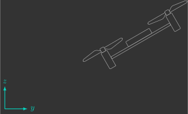
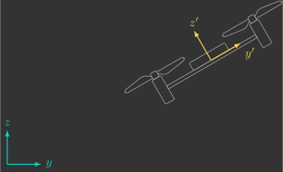
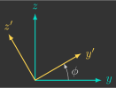
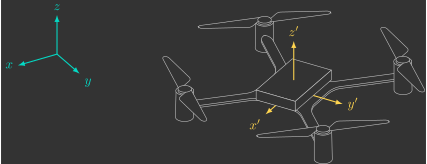
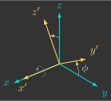
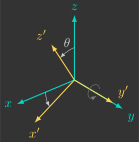
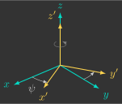
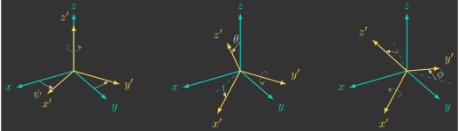

# :material-axis-arrow: Coordinate Systems

In drone control, coordinate systems are essential for describing relative positions and orientations. Common examples include the drone's position relative to the ground, the camera's orientation relative to the drone, and the drone's velocity relative to the surrounding air.

Choosing an appropriate coordinate system greatly simplifies many calculations. For example, aerodynamic forces and torques are most naturally expressed in a moving coordinate system fixed to the drone (the body frame), whereas gravitational acceleration is more conveniently represented in an inertial coordinate system fixed to the Earth (the inertial frame).

---

## Rotation Matrices

When working with multiple coordinate systems, we need a mathematical way to describe the orientation of one frame relative to another. This is accomplished using rotation matrices, which provide a compact and consistent way to represent rotations in both two-dimensional (2D) and three-dimensional (3D) space.

### 2D

To describe a drone's position, we first need to define a reference frame. In general, this is done using an inertial coordinate system ${\color{var(--c1)}yz}$ (1).
{.annotate}

1. Fixed to the Earth, which is assumed to neither accelerate nor rotate.

{: width="600" style="display: block; margin: auto;" }

However, this coordinate system alone is not sufficient to describe the drone's attitude (orientation). We must also introduce a body-fixed coordinate system ${\color{var(--c3)}y'z'}$ (1).
{.annotate}

1. Fixed to the drone, accelerating and rotating together with it.

{: width="600" style="display: block; margin: auto;" }

The drone's attitude is defined by the orientation of the body-fixed coordinate system ${\color{var(--c3)}y'z'}$ relative to the inertial coordinate system ${\color{var(--c1)}yz}$. This relationship can be represented mathematically by a $2 \times 2$ matrix called the rotation matrix $R$:

$$
{\color{var(--c3)}
\begin{bmatrix}
y' \\
z'
\end{bmatrix}
}
=
\underbrace{
\begin{bmatrix}
r_{11} & r_{12} \\
r_{21} & r_{22}
\end{bmatrix}
}_{R}
{\color{var(--c1)}
\begin{bmatrix}
y \\
z
\end{bmatrix}
}
$$

Although it contains four elements, this matrix can be completely described by a single parameter: the rotation angle $\phi$.

$$
R(\phi) =
\begin{bmatrix}
r_{11}(\phi) & r_{12}(\phi) \\
r_{21}(\phi) & r_{22}(\phi)
\end{bmatrix}
$$

!!! question "Exercise 4.1"

    Consider a body-fixed coordinate system ${\color{var(--c3)}y'z'}$ rotated by an angle $\phi$ with respect to the inertial coordinate system ${\color{var(--c1)}yz}$.

    {: width="200" style="display: block; margin: auto;" }

    ??? info "a) Write the rotation matrix as a function of the angle $\phi$."

        $$
        R(\phi)=
        \begin{bmatrix}
            \cos\phi & \sin\phi\\
            -\sin\phi & \cos\phi
        \end{bmatrix}
        $$

    ??? info "b) Compute $R(\phi)$ for $\phi=\frac{\pi}{2}\,\text{rad}$ and interpret the result."

        $$
        R\left(\frac{\pi}{2}\right)
        =
        \begin{bmatrix}
            \cos\frac{\pi}{2} & \sin\frac{\pi}{2}\\
            -\sin\frac{\pi}{2} & \cos\frac{\pi}{2}
        \end{bmatrix}
        =
        \begin{bmatrix}
            0 & 1\\
            -1 & 0
        \end{bmatrix}
        $$

        As expected, after a $90^\circ$ rotation, the ${\color{var(--c3)}y'}$ axis aligns with the ${\color{var(--c1)}z}$ axis, while the ${\color{var(--c3)}z'}$ axis points in the opposite direction of the ${\color{var(--c1)}y}$ axis.

    ??? info "c) Determine the angle $\phi$ corresponding to the rotation matrix   $R(\phi)=\begin{bmatrix}\frac{\sqrt{2}}{2}&\frac{\sqrt{2}}{2}\\-\frac{\sqrt{2}}{2}&\frac{\sqrt{2}}{2}\end{bmatrix}$."

        $$
        \begin{align*}
            \cos \phi &= \frac{\sqrt{2}}{2} \\
            \phi &= \cos^{-1}\!\left(\frac{\sqrt{2}}{2}\right) \\
            \phi &= \frac{\pi}{4}\;\text{rad}\;\;(45^\circ)
        \end{align*}
        $$

### 3D

As in the two-dimensional case, the drone's attitude in three-dimensional space is defined by the orientation of the body-fixed coordinate system ${\color{var(--c3)}x'y'z'}$ relative to the inertial coordinate system ${\color{var(--c1)}xyz}$.

{: width="600" style="display: block; margin: auto;" }

Since we are now working in three dimensions, the rotation matrix $R$ becomes a $3 \times 3$ matrix:

$$
{\color{var(--c3)}
\begin{bmatrix}
x' \\ 
y' \\
z'
\end{bmatrix}
}
=
\underbrace{
\begin{bmatrix}
r_{11} & r_{12} & r_{13} \\
r_{21} & r_{22} & r_{23} \\
r_{31} & r_{32} & r_{33}
\end{bmatrix}
}_{R}
{\color{var(--c1)}
\begin{bmatrix}
x \\
y \\
z
\end{bmatrix}
}
$$

Leonhard Euler showed that any orientation in three-dimensional space can be represented by three successive rotations about predefined, mutually orthogonal axes (1). As a result, the nine elements of the rotation matrix can be expressed in terms of just three parameters: the Euler angles $\phi$, $\theta$, and $\psi$.
{.annotate}

1. That is, the three axes are perpendicular to one another.

\begin{equation*}
R({\phi},{\theta},{\psi})
=
\begin{bmatrix}
r_{11}({\phi},{\theta},{\psi}) & r_{12}({\phi},{\theta},{\psi}) & r_{13}({\phi},{\theta},{\psi}) \\
r_{21}({\phi},{\theta},{\psi}) & r_{22}({\phi},{\theta},{\psi}) & r_{23}({\phi},{\theta},{\psi}) \\
r_{31}({\phi},{\theta},{\psi}) & r_{32}({\phi},{\theta},{\psi}) & r_{33}({\phi},{\theta},{\psi})
\end{bmatrix}
\end{equation*}

!!! question "Exercise 4.2"

    Consider a body-fixed coordinate system ${\color{var(--c3)}x'y'z'}$ rotated by an angle $\phi$ about the ${\color{var(--c1)}x}$ axis with respect to the inertial coordinate system ${\color{var(--c1)}xyz}$.

    {: width="200" style="display: block; margin: auto;" }

    ??? info "a) Write the rotation matrix as a function of the angle $\phi$."

        $$
        R_x(\phi)=
        \begin{bmatrix}
            1 & 0 & 0 \\
            0 & \cos\phi & \sin\phi \\
            0 & -\sin\phi & \cos\phi
        \end{bmatrix}
        $$

    ??? info "b) Compute $R_x(\phi)$ for $\phi=\pi\,\text{rad}$ and interpret the result."

        $$
        \begin{align*}
            R_x(\pi)
            =
            \begin{bmatrix}
                1 & 0 & 0 \\
                0 & \cos\pi & \sin\pi \\
                0 & -\sin\pi & \cos\pi
            \end{bmatrix}
            =
            \begin{bmatrix}
                1 & 0 & 0 \\
                0 & -1 & 0 \\
                0 & 0 & -1
            \end{bmatrix}
        \end{align*}
        $$

        The result is what we would expect. A $180^\circ$ rotation about the ${\color{var(--c1)}x}$ axis reverses the ${\color{var(--c1)}y}$ and ${\color{var(--c1)}z}$ axes. Consequently, the ${\color{var(--c3)}y'}$ and ${\color{var(--c3)}z'}$ axes point in the opposite directions of ${\color{var(--c1)}y}$ and ${\color{var(--c1)}z}$, while the ${\color{var(--c3)}x'}$ axis remains aligned with ${\color{var(--c1)}x}$.

!!! question "Exercise 4.3"

    Consider a body-fixed coordinate system ${\color{var(--c3)}x'y'z'}$ rotated by an angle $\theta$ about the ${\color{var(--c1)}y}$ axis with respect to the inertial coordinate system ${\color{var(--c1)}xyz}$.

    {: width="200" style="display: block; margin: auto;" }

    ??? info "a) Write the rotation matrix as a function of the angle $\theta$."

        $$
        R_y(\theta)=
        \begin{bmatrix}
            \cos\theta & 0 & -\sin\theta \\
            0 & 1 & 0 \\
            \sin\theta & 0 & \cos\theta
        \end{bmatrix}
        $$

    ??? info "b) Compute $R_y(\theta)$ for $\theta=\frac{\pi}{2}\,\text{rad}$ and interpret the result."

        $$
        \begin{align*}
            R_y\left(\frac{\pi}{2}\right)
            =
            \begin{bmatrix}
                \cos\frac{\pi}{2} & 0 & -\sin\frac{\pi}{2} \\
                0 & 1 & 0 \\
                \sin\frac{\pi}{2} & 0 & \cos\frac{\pi}{2}
            \end{bmatrix}
            =
            \begin{bmatrix}
                0 & 0 & -1 \\
                0 & 1 & 0 \\
                1 & 0 & 0
            \end{bmatrix}
        \end{align*}
        $$

        This agrees with the geometric interpretation. After a $90^\circ$ rotation about the ${\color{var(--c1)}y}$ axis, the ${\color{var(--c3)}x'}$ axis points in the opposite direction of ${\color{var(--c1)}z}$, while the ${\color{var(--c3)}z'}$ axis aligns with ${\color{var(--c1)}x}$. The ${\color{var(--c3)}y'}$ axis remains aligned with ${\color{var(--c1)}y}$.

!!! question "Exercise 4.4"

    Consider a body-fixed coordinate system ${\color{var(--c3)}x'y'z'}$ rotated by an angle $\psi$ about the ${\color{var(--c1)}z}$ axis with respect to the inertial coordinate system ${\color{var(--c1)}xyz}$.

    {: width="200" style="display: block; margin: auto;" }

    ??? info "a) Write the rotation matrix as a function of the angle $\psi$."

        $$
        R_z(\psi)=
        \begin{bmatrix}
            \cos\psi & \sin\psi & 0 \\
            -\sin\psi & \cos\psi & 0 \\
            0 & 0 & 1
        \end{bmatrix}
        $$

    ??? info "b) Compute $R_z(\psi)$ for $\psi=2\pi\,\text{rad}$ and interpret the result."

        $$
        \begin{align*}
            R_z(2\pi)
            =
            \begin{bmatrix}
                \cos2\pi & \sin2\pi & 0 \\
                -\sin2\pi & \cos2\pi & 0 \\
                0 & 0 & 1
            \end{bmatrix}
            =
            \begin{bmatrix}
                1 & 0 & 0 \\
                0 & 1 & 0 \\
                0 & 0 & 1
            \end{bmatrix}
        \end{align*}
        $$

        This confirms the expected orientation of the axes. A full $360^\circ$ rotation about the ${\color{var(--c1)}z}$ axis returns the body-fixed coordinate system ${\color{var(--c3)}x'y'z'}$ to exactly the same orientation as the inertial coordinate system ${\color{var(--c1)}xyz}$. In other words, all three axes coincide once again.

### Properties

Rotation matrices satisfy several important properties:

- Each row and each column has unit norm (i.e., a length of 1).
- Rows and columns are mutually orthogonal (their dot product is zero).
- They are orthogonal matrices, meaning that their inverse is equal to their transpose:
  $$
  R^{-1}=R^T
  $$
- Their determinant is equal to one:
  $$
  \det(R)=1
  $$

!!! question "Exercise 4.5"

    Consider the rotation matrix $R$ relating the body-fixed frame ${\color{var(--c3)}x'y'z'}$ to the inertial frame ${\color{var(--c1)}xyz}$:

    $$
    R=
    \begin{bmatrix}
        \frac{\sqrt{2}}{2} & \frac{\sqrt{2}}{2} & 0 \\
        -\frac{\sqrt{2}}{2} & \frac{\sqrt{2}}{2} & 0 \\
        0 & 0 & 1
    \end{bmatrix}
    $$

    Compute the inverse rotation matrix $R^{-1}$, which relates the inertial frame ${\color{var(--c1)}xyz}$ to the body-fixed frame ${\color{var(--c3)}x'y'z'}$.

    ??? info "Solution"

        $$
        R^{-1}
        =
        R^T
        =
        \begin{bmatrix}
            \frac{\sqrt{2}}{2} & -\frac{\sqrt{2}}{2} & 0 \\
            \frac{\sqrt{2}}{2} & \frac{\sqrt{2}}{2} & 0 \\
            0 & 0 & 1
        \end{bmatrix}
        $$

---

## Euler Angles

Euler angles are a set of three successive rotations about distinct axes that transform the inertial frame ${\color{var(--c1)}xyz}$ into the body frame ${\color{var(--c3)}x'y'z'}$.

{: width="800" style="display: block; margin: auto;" }

In this course, we will use what is called the yaw-pitch-roll sequence:

* $\psi$: rotation about the ${\color{var(--c3)}z'}$ axis (yaw)
* $\theta$: rotation about the ${\color{var(--c3)}y'}$ axis (pitch)
* $\phi$: rotation about the ${\color{var(--c3)}x'}$ axis (roll)

The overall rotation matrix is obtained by multiplying(1) the three individual rotation matrices:
{.annotate}

1. Notice that the first rotation applied, $R_z(\psi)$, appears on the right, whereas the last rotation, $R_x(\phi)$, appears on the left. This is because matrix multiplication follows the reverse order of the applied transformations.

$$
R(\phi,\theta,\psi)=
\underbrace{
\begin{bmatrix}
1 & 0 & 0 \\
0 & \cos\phi & \sin\phi \\
0 & -\sin\phi & \cos\phi
\end{bmatrix}
}_{R_x(\phi)}
\underbrace{
\begin{bmatrix}
\cos\theta & 0 & -\sin\theta \\
0 & 1 & 0 \\
\sin\theta & 0 & \cos\theta
\end{bmatrix}
}_{R_y(\theta)}
\underbrace{
\begin{bmatrix}
\cos\psi & \sin\psi & 0 \\
-\sin\psi & \cos\psi & 0 \\
0 & 0 & 1
\end{bmatrix}
}_{R_z(\psi)}
$$

!!! question "Exercise 4.6"

    Determine the overall rotation matrix $R(\phi,\theta,\psi)$ relating the body frame ${\color{var(--c3)}x'y'z'}$ to the inertial frame ${\color{var(--c1)}xyz}$ as a function of the Euler angles $\phi$, $\theta$, and $\psi$.

    **Hint:** Use MATLAB's Symbolic Math Toolbox.

    ??? info "Solution"

        $$
        R(\phi,\theta,\psi)=
        \begin{bmatrix}
        \cos\theta\cos\psi & \cos\theta\sin\psi & -\sin\theta \\
        \sin\phi\sin\theta\cos\psi - \cos\phi\sin\psi & \sin\phi\sin\theta\sin\psi + \cos\phi\cos\psi & \sin\phi\cos\theta \\
        \cos\phi\sin\theta\cos\psi + \sin\phi\sin\psi & \cos\phi\sin\theta\sin\psi - \sin\phi\cos\psi & \cos\phi\cos\theta
        \end{bmatrix}
        $$

### Singularities

A singularity is a configuration in which a mathematical representation becomes undefined or loses a degree of freedom. For Euler angles, this occurs when a single orientation can be represented by more than one combination of rotation angles.

In the yaw-pitch-roll convention, when the second rotation is equal to $\theta=\frac{\pi}{2}~\text{rad}$, the axes of the first and third rotations become aligned, making it impossible to uniquely determine the yaw angle $\psi$ and the roll angle $\phi$. This phenomenon is commonly known as gimbal lock.

There is no single universally accepted Euler-angle convention. In fact, there are twelve possible rotation sequences(1), since each successive rotation must be performed about a different axis from the previous one, as summarized below:
{.annotate}

1. The yaw–pitch–roll convention adopted in this course is only one of them.

<table class="rotacoes">
  <thead>
    <tr>
      <th>Notation</th>
      <th>1st rotation axis</th>
      <th>2nd rotation axis</th>
      <th>3rd rotation axis</th>
    </tr>
  </thead>
  <tbody>
    <tr>
      <td>\( x\!-\!y\!-\!x \)</td>
      <td rowspan="4">\( x' \)</td>
      <td rowspan="2">\( y' \)</td>
      <td>\( x' \)</td>
    </tr>
    <tr>
      <td>\( x\!-\!y\!-\!z \)</td>
      <td>\( z' \)</td>
    </tr>
    <tr>
      <td>\( x\!-\!z\!-\!x \)</td>
      <td rowspan="2">\( z' \)</td>
      <td>\( x' \)</td>
    </tr>
    <tr>
      <td>\( x\!-\!z\!-\!y \)</td>
      <td>\( y' \)</td>
    </tr>
    <tr>
      <td>\( y\!-\!x\!-\!y \)</td>
      <td rowspan="4">\( y' \)</td>
      <td rowspan="2">\( x' \)</td>
      <td>\( y' \)</td>
    </tr>
    <tr>
      <td>\( y\!-\!x\!-\!z \)</td>
      <td>\( z' \)</td>
    </tr>
    <tr>
      <td>\( y\!-\!z\!-\!y \)</td>
      <td rowspan="2">\( z' \)</td>
      <td>\( y' \)</td>
    </tr>
    <tr>
      <td>\( y\!-\!z\!-\!x \)</td>
      <td>\( x' \)</td>
    </tr>
    <tr>
      <td>\( z\!-\!x\!-\!z \)</td>
      <td rowspan="4">\( z' \)</td>
      <td rowspan="2">\( x' \)</td>
      <td>\( z' \)</td>
    </tr>
    <tr>
      <td>\( z\!-\!x\!-\!y \)</td>
      <td>\( y' \)</td>
    </tr>
    <tr>
      <td>\( z\!-\!y\!-\!z \)</td>
      <td rowspan="2">\( y' \)</td>
      <td>\( z' \)</td>
    </tr>
    <tr>
      <td>\( z\!-\!y\!-\!x \)</td>
      <td>\( x' \)</td>
    </tr>
  </tbody>
</table>

Every rotation sequence has singularities, the only difference is the orientation at which they occur.

- When the first and third rotation axes are the same(1), the singularity occurs when the second rotation is equal to $0~\text{rad}$.
{.annotate}
    1. These are known as proper Euler angles.

- When the first and third rotation axes are different(1), the singularity occurs when the second rotation is equal to $\frac{\pi}{2}~\text{rad}$.
{.annotate}
    1. These are technically Tait–Bryan angles, although in practice they are often referred to simply as Euler angles.

Since a drone's nominal hovering attitude corresponds to a second rotation angle of approximately $0~\text{rad}$, conventions in which the first and third rotation axes are different are preferred. This way, the singularity is far from the normal operating region, although it can still occur during aggressive maneuvers.

An alternative orientation representation that avoids singularities is the quaternion representation.