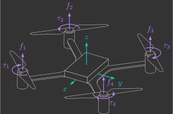

# :material-equalizer: Mixer

The flight of a quadcopter is governed by the thrust forces and drag torques produced by its four propellers. This section explains how these individual effects are combined into total thrust and body torques using a transformation commonly known in multirotor flight controllers as the mixer. By understanding this mapping, and its inverse, you will see how the controller translates desired forces and moments into the motor speeds that actually move the vehicle.

---

## Basic quadcopter motions

A quadcopter has four propellers spinning at angular velocities ${\color{var(--c1)}\omega_1}$, ${\color{var(--c1)}\omega_2}$, ${\color{var(--c1)}\omega_3}$, ${\color{var(--c1)}\omega_4}$. Each propeller generates a thrust force ${\color{var(--c2)}f_1}$, ${\color{var(--c2)}f_2}$, ${\color{var(--c2)}f_3}$, ${\color{var(--c2)}f_4}$ and a drag torque ${\color{var(--c2)}\tau_1}$, ${\color{var(--c2)}\tau_2}$, ${\color{var(--c2)}\tau_3}$, ${\color{var(--c2)}\tau_4}$, as illustrated below.

{: width=60% style="display: block; margin: auto;" }

To move vertically (along $z$ axis), the quadcopter simply changes all four angular velocities simultaneously. To rotate (around the $x$, $y$, and $z$ axes), it varies the speeds of pairs of propellers in coordinated ways.

!!! question "Exercise 1"

    Regarding quadcopter motion, answer the following:

    ??? info "a) How many independent ways can a quadcopter translate?"
        3 (along the $x$, $y$, and $z$ axes)

    ??? info "b) How many independent ways can a quadcopter rotate?"
        3 (around the $x$, $y$, and $z$ axes)

    ??? info "c) How many degrees of freedom does a quadcopter have?"
        6 (3 translational + 3 rotational)

    ??? info "d) How does a quadcopter achieve translation in the horizontal plane ($x$ and $y$ axes)?"
        Through a combination of translation (along $z$ axis) and rotation (around $x$ or $y$ axis), which tilt the thrust vector.

---

## Input transformation

The individual thrust forces and drag torques generated by each propeller can be combined into a single total thrust force and three body-axis torques:

- ${\color{var(--c2)}f_t}$ — Total thrust ($\text{N}$) (1)
{.annotate}

    1. The net upward force generated by all propellers. 

- ${\color{var(--c2)}\tau_x}$ — Roll torque ($\text{N·m}$) (1)
{.annotate}

    1. The net torque around the body $x$ axis, caused by lateral differences in thrust.

- ${\color{var(--c2)}\tau_y}$ — Pitch torque ($\text{N·m}$) (1)
{.annotate}

    1. The net torque around the body $y$ axis, caused by longitudinal differences in thrust.

- ${\color{var(--c2)}\tau_z}$ — Yaw torque ($\text{N·m}$) (1)
{.annotate}

    1. The net torque around the body $z$ axis, caused by differences in drag (clockwise propellers vs. counter-clockwise propellers).

{: width=60% style="display: block; margin: auto;" }

In the [aerodynamics](../basic_concepts/aerodynamics.md) section, we established that thrust and drag torque of a propeller are proportional to the square the angular velocity:

$$
\left\{
\begin{array}{l}
    {\color{var(--c2)}f_i} = k_l\, {\color{var(--c1)}\omega_i}^2 \\
    {\color{var(--c2)}\tau_i} = k_d\, {\color{var(--c1)}\omega_i}^2 \\
\end{array}
\right.
$$

Thus, the relationship between motor speeds and thrust/torques can be written in matrix form:

$$
\begin{bmatrix}
    {\color{var(--c2)}f_t} \\
    {\color{var(--c2)}\tau_x} \\
    {\color{var(--c2)}\tau_y} \\
    {\color{var(--c2)}\tau_z}
\end{bmatrix}
= M 
\begin{bmatrix}
    {\color{var(--c1)}\omega_1}^2 \\
    {\color{var(--c1)}\omega_2}^2 \\
    {\color{var(--c1)}\omega_3}^2 \\
    {\color{var(--c1)}\omega_4}^2
\end{bmatrix}
$$

Where $M$ is the mixer matrix, a $4\times4$ matrix that maps squared motor speeds to thrust/torques.

!!! question "Exercise 2"

    Derive the mixer matrix $M$ in terms of the thrust coefficient $k_l$, drag coefficient $k_d$ and arm length $l$.

    ??? info "Solution"
        $$
        M = 
        \begin{bmatrix} 
            k_l & k_l & k_l & k_l \\[4pt] 
            -k_l l & -k_l l & \;\,k_l l & \;\,k_l l \\[4pt]
            -k_l l & \;\,k_l l & \;\,k_l l & -k_l l \\[4pt]
            -k_d & \;\,k_d & -k_d & \;\,k_d 
        \end{bmatrix}
        $$

To compute the motor speeds required to generate a desired thrust/torques, we multiply by the inverse of the mixer:

$$
\begin{bmatrix}
    {\color{var(--c1)}\omega_1}^2 \\
    {\color{var(--c1)}\omega_2}^2 \\
    {\color{var(--c1)}\omega_3}^2 \\
    {\color{var(--c1)}\omega_4}^2
\end{bmatrix}
= M^{-1} 
\begin{bmatrix}
    {\color{var(--c2)}f_t} \\
    {\color{var(--c2)}\tau_x} \\
    {\color{var(--c2)}\tau_y} \\
    {\color{var(--c2)}\tau_z}
\end{bmatrix}
$$

!!! question "Exercise 3"

    Compute(1) the inverse matrix $M^{-1}$.
    {.annotate} 
    
    1. Hint: use MATLAB’s Symbolic Math Toolbox

    ??? info "Solution"
        $$
        M^{-1} = \dfrac{1}{4}
        \begin{bmatrix} 
            \dfrac{1}{k_l} & - \dfrac{1}{k_l l} & - \dfrac{1}{k_l l} & - \dfrac{1}{k_d}  \\[6pt]
            \dfrac{1}{k_l} & - \dfrac{1}{k_l l} & \;\,\dfrac{1}{k_l l} & \;\,\dfrac{1}{k_d} \\[6pt]
            \dfrac{1}{k_l} & \;\,\dfrac{1}{k_l l} & \;\,\dfrac{1}{k_l l} & - \dfrac{1}{k_d} \\[6pt]
            \dfrac{1}{k_l} & \;\,\dfrac{1}{k_l l} & - \dfrac{1}{k_l l} & \;\,\dfrac{1}{k_d} 
        \end{bmatrix}
        $$