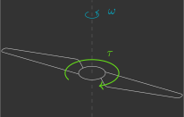
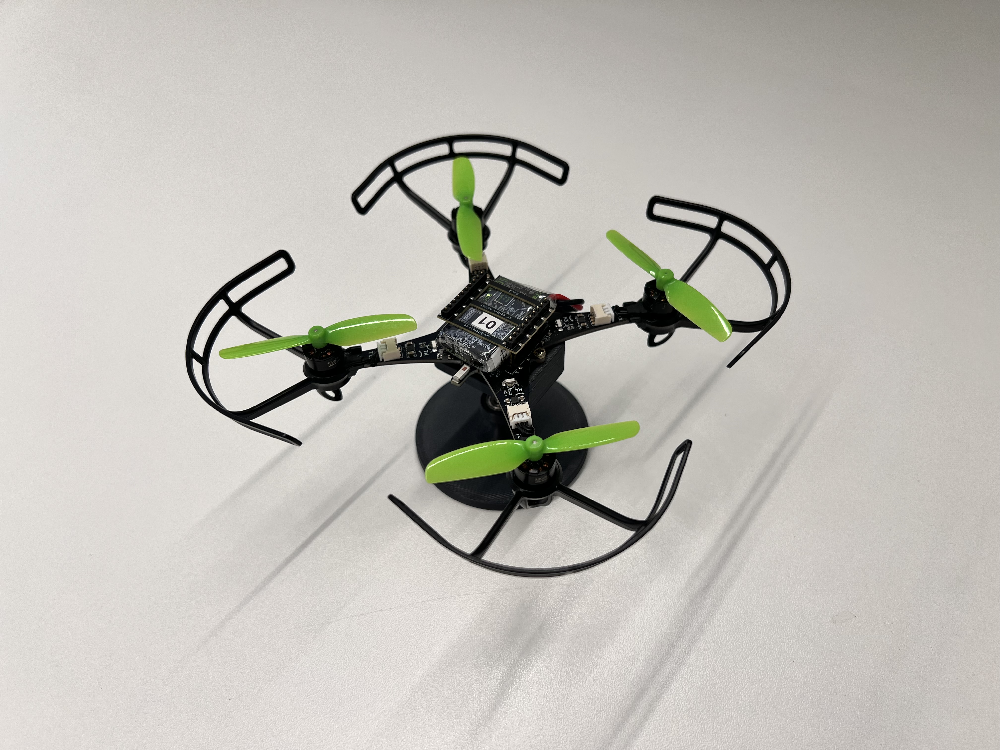
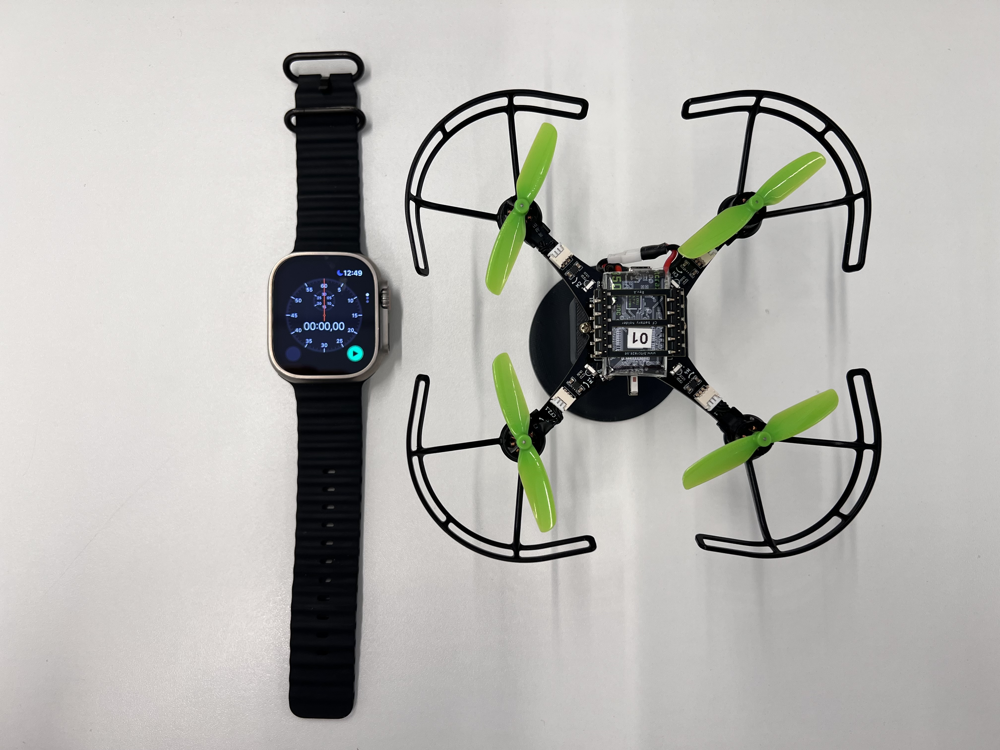
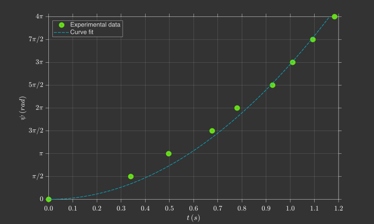

# :material-alpha-d-box-outline: Drag constant

In this section, you will experimentally determine the propeller drag constant $k_d$.

---

## Theoretical background

The propellers of a quadcopter act as aerodynamic surfaces, accelerating the airflow through them. This process consumes energy from the batteries and generates both thrust forces and aerodynamic drag torques on the quadcopter. As [previously derived](../fundamentals/aerodynamics.md/#propeller), the drag torque ${\color{var(--c2)}\tau}$ produced by a propeller is proportional to the square of its angular velocity ${\color{var(--c1)}\omega}$.

{: width="350" style="display: block; margin: auto;" }

$$
    {\color{var(--c2)}\tau} = k_d {\color{var(--c1)}\omega}^2
$$

Where $k_d$ is the drag constant ($\text{N·m·s}^2$).

---

## Experimental procedure

You will measure the propeller drag torque $\tau$ using a mechanical fixture (1) that constrains all degrees of freedom of the drone, leaving only the yaw angle $\psi$ free.  
{ .annotate }

1. To mount the quadcopter on the fixture, insert it from the side and secure it using the two screws.

{: width=60% style="display: block; margin: auto;" }

Knowing the drone yaw moment of inertia $I_{zz}$ and measuring the yaw angle $\psi$ as a function of time, it is possible to determine the total drag torque generated by the propellers, $\tau_z$, through a dynamic analysis. To record the yaw angle over time, you should film the experiment using the slow-motion mode of your smartphone, with a stopwatch visible in the field of view.

{: width=60% style="display: block; margin: auto;" }

Upload to the drone a program that sets propellers $1$ and $3$ to rotate at an angular velocity of $1{,}000\,\text{rad/s}$, and propellers $2$ and $4$ at $2{,}000\,\text{rad/s}$. Since propellers $1$ and $3$ rotate clockwise and propellers $2$ and $4$ rotate counter-clockwise, a net torque will be produced, causing the drone to rotate in the counter-clockwise direction. For each quarter turn ($90^{\circ}$), record the elapsed time. Repeat the experiment three times and compute the average. 

{: width="100%" style="display: block; margin: auto;" }

To simplify the procedure, you may start and stop the propellers using the ++"Take off"++ and ++"Land"++ buttons in the Command Based Flight Control, located at the bottom-right corner of the Crazyflie Client.

{: width=40% style="display: block; margin: auto;" }

Create a file named `drag_constant.c` inside the `src/identification` folder with the following code (1):  
{ .annotate }

1. Do not forget to update the motor model coefficients $a_2$ and $a_1$ (lines 8–9), as estimated [previously](../identifications/motor_coeficientes.md).

The steps to collect the data are:

1. Make sure the drone battery is fully charged  
2. Attach the drone to the fixture and place a stopwatch next to it  
3. Arm the drone by pressing the `Arm` button in the CFClient  
4. Start recording with your smartphone in slow-motion mode  
5. Turn on the motors using the Command-Based Flight Control in the CFClient  
6. Let the drone complete two full rotations and stop recording  

After the experiment, extract the data and fill in the table below.

| $\psi\,(^{\circ})$ | $t_1\,(s)$ | $t_2\,(s)$ | $t_3\,(s)$ |
|-------------------|------------|------------|------------|
| $0$   |            |            |            |
| $90$  |            |            |            |
| $180$ |            |            |            |
| $270$ |            |            |            |
| $360$ |            |            |            |
| $450$ |            |            |            |
| $540$ |            |            |            |
| $630$ |            |            |            |
| $720$ |            |            |            |

---

## Data analysis

Using the collected data, fit a curve relating the yaw angle $\psi$ to time $t$ (remember to convert the yaw angle from degrees to radians).

{: width=100% style="display: block; margin: auto;" }

Under the action of a constant torque, the angular displacement as a function of time is given by:

$$
\psi = \frac{\tau_z}{2 I_{zz}} \, t^2
$$

As [derived earlier](../basic_concepts/mixer.md), this torque corresponds to the sum of the drag torques produced by each propeller $\tau_i$, which are proportional to the square of their angular velocities $\omega_i$:

$$
\tau_z = -k_d \omega_1^2 + k_d \omega_2^2 - k_d \omega_3^2 + k_d \omega_4^2
$$

Given that $\omega_1 = \omega_3 = 1{,}000\,\text{rad/s}$, $\omega_2 = \omega_4 = 2{,}000\,\text{rad/s}$, and $I_{zz} = 4 \times 10^{-5}\,\text{kg·m}^2$, substituting into the previous equation yields:

$$
\begin{align*}
\psi &= \frac{\tau_z}{2I_{zz}} t^2 \\
\psi &= \frac{\left(-k_d \omega_1^2 + k_d \omega_2^2 - k_d \omega_3^2 + k_d \omega_4^2\right)}{2I_{zz}} t^2 \\
\psi &= \frac{\left(-\omega_1^2 + \omega_2^2 - \omega_3^2 + \omega_4^2\right)k_d}{2I_{zz}} t^2 \\
\psi &= \frac{- \cancel{2}\omega_1^2 + \cancel{2} \omega_2^2}{\cancel{2}I_{zz}} k_d t^2 \\
\psi &= \frac{-1000^2 + 2000^2}{4 \times 10^{-5}} k_d t^2 \\
\psi &= \left(75 \times 10^{9}\right) k_d t^2
\end{align*}
$$

Therefore, the most appropriate model for curve fitting is a second-order polynomial whose constant and linear coefficients are zero.

Determine the value of $k_d$ by performing this curve fit (hint: use the Curve Fitting Toolbox in MATLAB). Record the obtained value, as it will be used shortly in subsequent experiments.

---

## Results validation

Compare your experimentally obtained value with the one previously estimated with a ruler in [Exercise 1.4](../fundamentals/aerodynamics.md/#exercise_1_4). The drag constant $k_d$ is expected to be on the order of magnitude of $10^{-10}\,\text{N·s}^2$.

<!-- ---
title: Constante de arrasto
icon: material/alpha-d-box-outline
---

# :material-alpha-d-box-outline: Constante de arrasto

Nesta secção, você irá determinar experimentalmente a constante de arrasto das hélices $k_d$.

---

## Fundamentos teóricos

As hélices de um quadricoptero atuam como superfícies aerodinâmicas, acelerando o fluxo de ar através delas. Isso consome energia das baterias e produz forças de sustentação e torques de arrasto no quadricoptero. Já [deduzimos](../basic_concepts/aerodynamics.md) que o torque de arrasto de uma hélice $\tau$ é proporcional à velocidade angular da hélice $\omega$ ao quadrado.
    
{: width="350" style="display: block; margin: auto;" }

$$
    \tau = k_d \omega^2
$$

Onde:

- $k_d$ - Constante de arrasto ($N.m.s^2$)   

---

## Procedimento experimental

Você vai medir o torque de arrasto $\tau$ das hélices com um suporte(1) que restringe todos os graus de liberdade do drone deixando apenas o ângulo de guinagem $\psi$ livre.  
{ .annotate }

1. Para prender o quadcoptero no suporte, você precisa encaixá-lo pela lateral e depois prender dois parafusos. 

{: width=60% style="display: block; margin: auto;" }

Sabendo o momento de inércia do drone $I_{zz}$ e o ângulo de guinagem ao longo do tempo $\psi$, é possível determinar o torque de arrasto total das hélices $\tau_z$ através de uma análise dinâmica. Para realizar a leitura do ângulo de guinagem ao longo do tempo, você deve filmar o procedimento no modo câmera lenta de seu celular com um cronômetro no campo de visão.

{: width=60% style="display: block; margin: auto;" }

Você deve carregar no drone um programa que faz com que as hélices $1$ e $3$ rotacionem com velocidade angular de $1.000\,\text{rad/s}$ e as hélices $2$ e $4$ com $2.000\,\text{rad/s}$. Como as hélices $1$ e $3$ giram no sentido horário e as hélices $2$ e $4$ no anti-horário, haverá um torque resultante que fará com que o drone rotacione no sentido anti-horário. Para cada quarto de volta ($90^{\circ}$), você deverá anotar o tempo decorrido. Você deverá realizar o experimento três vezes e tirar uma média. Para facilitar o experimento, você pode ligar/desligar as hélices com os botões `Take off` e `Land` do Command Based Flight Control através do CFClient.

{: width=100% style="display: block; margin: auto;" }

Crie um arquivo chamado `drag_constant.c` dentro da pasta `src/identification` com o seguinte código(1):
{ .annotate }

1. Não esqueça de atualizar os valores dos coeficientes dos motores $a_2$ e $a_1$ (linhas 8-9) estimados [anteriormente](../identifications/motor_coeficientes.md).

```c title="drag_constant.c"
#include "FreeRTOS.h"      // FreeRTOS core definitions (needed for task handling and timing)
#include "task.h"          // FreeRTOS task functions (e.g., vTaskDelay)
#include "supervisor.h"    // Functions to check flight status (e.g., supervisorIsArmed)
#include "commander.h"     // Access to commanded setpoints (e.g., commanderGetSetpoint)
#include "motors.h"        // Low-level motor control interface (e.g., motorsSetRatio)

// Motor coefficients of the quadratic model: PWM = a_2 * omega^2 + a_1 * omega
const float a_2 = 0.0f;
const float a_1 = 0.0f;

// Global variables to store the desired setpoint, the current state (not used here),
// and the computed PWM values for different motor speeds
setpoint_t setpoint;
state_t state;
float pwm_1, pwm_2;
float omega_1, omega_2; 

// Main application
void appMain(void *param)
{
    // Infinite loop (runs forever)
    while (true)
    {
        // Check if the drone is armed (i.e., ready to fly)
        if (supervisorIsArmed())
        {
            // Fetch the latest setpoint from the commander
            commanderGetSetpoint(&setpoint, &state);

            if ((setpoint.position.z) > 0)
            {
                // Set two different angular velocities for the motors
                // Motors M1 and M3 will spin at 2000 rad/s
                // Motors M2 and M4 will spin at 1000 rad/s
                // This configuration induces pure yaw rotation (spinning in place)
                omega_1 = 2000.0f;
                omega_2 = 1000.0f;

                // Convert angular velocities to PWM using the motor model
                pwm_1 = a_2 * omega_1 * omega_1 + a_1 * omega_1;
                pwm_2 = a_2 * omega_2 * omega_2 + a_1 * omega_2;
            }
            else
            {
                // If Z setpoint is not positive, apply minimal power to all motors (for idle spin)
                pwm_1 = 0.1f;
                pwm_2 = 0.1f;
            }
        }
        else
        {
            // If not armed, stop all motors
            pwm_1 = 0.0f;
            pwm_2 = 0.0f;
        }
        // Apply PWM to motors:
        // M1 and M3 get pwm_1 (corresponding to 2000 rad/s)
        // M2 and M4 get pwm_2 (corresponding to 1000 rad/s)
        // This asymmetric configuration results in yaw motion
        motorsSetRatio(MOTOR_M1, pwm_1 * UINT16_MAX);
        motorsSetRatio(MOTOR_M2, pwm_2 * UINT16_MAX);
        motorsSetRatio(MOTOR_M3, pwm_1 * UINT16_MAX);
        motorsSetRatio(MOTOR_M4, pwm_2 * UINT16_MAX);
        // Wait for 100 milliseconds before the next iteration (10 Hz control loop)
        vTaskDelay(pdMS_TO_TICKS(100));
    }
}
```

As etapas para coletar os dados são as seguintes:

1. Garanta que a bateria do drone está carregada 
2. Prenda o drone no dispositivo e posicione um cronômetro ao seu lado
3. Arme o drone apertando o botão `Arm` no CFClient
4. Comece a filmar com seu celular no modo câmera lenta
5. Ligue os motores com o Command Based Flight Control do CFClient
6. Espere o drone dar duas voltas e pare de filmar

Após o experimento, você deverá coletar dados para preencher a tabela abaixo.

| $\psi \, (^{\circ})$ | $t_1 \, (s)$ | $t_2 \, (s)$ | $t_3 \, (s)$ |
|-------|----------|----------|----------|
| $0$ |          |          |          |
| $90$ |          |          |          |
| $180$ |          |          |          |
| $270$ |          |          |          |
| $360$ |          |          |          |
| $450$ |          |          |          |
| $540$ |          |          |          |
| $630$ |          |          |          |
| $720$ |          |          |          |


---

## Análise de dados

Utilizando os dados coletados, você deverá ajustar uma curva que correlacione o ângulo de guinagem $\psi$ com o tempo $t$ da hélice (note que você precisa converter o ângulo de guinagem de $^{\circ}$ para $rad$).

{: width=100% style="display: block; margin: auto;" }


Aplicando um torque constante, o deslocamento angular em função do tempo é dado por:
    
$$
    \psi = \frac{\tau_z}{2 I_{zz}} t^2
$$
Já [deduzimos](../basic_concepts/mixer.md) que esse torque é dado pela soma dos torques de arrasto de cada hélice $\tau_i$, que por sua vez são proporcionais às velocidades angulares das hélices $\omega_i$ ao quadrado:

$$
    \tau_z = -k_d \omega_1^2 + k_d \omega_2^2 - k_d \omega_3^2 + k_d \omega_4^2
$$

Como $\omega_1 = \omega_3 = 1.000 \, rad/s$, $\omega_2 = \omega_4 = 2.000 \, rad/s$ e $I_{zz} = 4 \cdot 10^{-5} \, kg.m^2$. substituindo na equação anterior:

$$
\begin{align*}
    \psi &= \frac{\tau_z}{2I_{zz}} t^2 \\
    \psi &= \frac{\left(-k_d \omega_1^2 + k_d \omega_2^2 - k_d \omega_3^2 + k_d \omega_4^2\right)}{2I_{zz}} t^2 \\
    \psi &= \frac{\left(-\omega_1^2 + \omega_2^2 - \omega_3^2 + \omega_4^2\right)k_d}{2I_{zz}} t^2 \\
    \psi &= \frac{- \cancel{2}\omega_1^2 + \cancel{2} \omega_2^2}{\cancel{2}I_{zz}} k_d t^2 \\
    \psi &= \frac{- 1000^2 + 2000^2}{4 \cdot 10^{-5}} k_d t^2 \\
    \psi &= \left( 75 \times 10^{9} \right) k_d t^2 \\
\end{align*}
$$

Ou seja, o tipo de função mais adequado para realizar esse ajuste de curva é uma função polinomial de 2º grau cujos coeficientes de ordem zero e um são nulos.

Determine o valor de $k_d$ fazendo esse ajuste de curva (dica: utilize o Curve Fitting Toolbox do MATLAB). Anote o valor obtido em algum lugar pois ele será utilizado em breve.

---
    
## Validação dos resultados

Compare o resultado obtido com o [estimado anteriormente](../basic_concepts/aerodynamics.md). É esperado que a constante de sustentação $k_d$ seja da ordem de grandeza de $10^{-10}N.s^2$.  -->