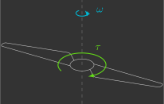

# Identificação da constante de arrasto

Nesta secção, você irá determinar experimentalmente a constante de arrasto das hélices $k_d$.

---

## Fundamentos teóricos

As hélices de um quadricoptero atuam como superfícies aerodinâmicas, acelerando o fluxo de ar através delas. Isso consome energia das baterias e produz forças de sustentação e torques de arrasto no quadricoptero. Já [deduzimos](../basic_concepts/aerodynamics.md) que o torque de arrasto de uma hélice $\tau$ é proporcional à velocidade angular da hélice $\omega$ ao quadrado.
    
{: width="350" style="display: block; margin: auto;" }

$$
    \tau = k_d \omega^2
$$

Onde:

- $k_d$ - Constante de arrasto ($N.m.s^2$)   

---

## Procedimento experimental

Você vai medir o torque de arrasto $\tau$ das hélices com um suporte(1) que restringe todos os graus de liberdade do drone deixando apenas o ângulo de guinagem $\psi$ livre.  
{ .annotate }

1. Para prender o quadcoptero no suporte, você precisa encaixá-lo pela lateral e depois prender dois parafusos. 

{: width=60% style="display: block; margin: auto;" }

Sabendo o momento de inércia do drone $I_{zz}$ e o ângulo de guinagem ao longo do tempo $\psi$, é possível determinar o torque de arrasto total das hélices $\tau_z$ através de uma análise dinâmica. Para realizar a leitura do ângulo de guinagem ao longo do tempo, você deve filmar o procedimento no modo câmera lenta de seu celular com um cronômetro no campo de visão.

{: width=60% style="display: block; margin: auto;" }

Você deve carregar no drone um programa que faz com que as hélices $1$ e $3$ rotacionem com velocidade angular de $1.000\,\text{rad/s}$ e as hélices $2$ e $4$ com $2.000\,\text{rad/s}$. Como as hélices $1$ e $3$ giram no sentido horário e as hélices $2$ e $4$ no anti-horário, haverá um torque resultante que fará com que o drone rotacione no sentido anti-horário. Para cada quarto de volta ($90^{\circ}$), você deverá anotar o tempo decorrido. Você deverá realizar o experimento três vezes e tirar uma média. Para facilitar o experimento, você pode ligar/desligar as hélices com os botões `Take off` e `Land` do Command Based Flight Control através do CFClient.

{: width=100% style="display: block; margin: auto;" }

Crie um arquivo chamado `drag_constant.c` dentro da pasta `src/identification` com o seguinte código(1):
{ .annotate }

1. Não esqueça de atualizar os valores dos coeficientes dos motores $a_2$ e $a_1$ (linhas 8-9) estimados [anteriormente](../identifications/motor_coeficientes.md).

```c title="drag_constant.c"
#include "FreeRTOS.h"      // FreeRTOS core definitions (needed for task handling and timing)
#include "task.h"          // FreeRTOS task functions (e.g., vTaskDelay)
#include "supervisor.h"    // Functions to check flight status (e.g., supervisorIsArmed)
#include "commander.h"     // Access to commanded setpoints (e.g., commanderGetSetpoint)
#include "motors.h"        // Low-level motor control interface (e.g., motorsSetRatio)

// Motor coefficients of the quadratic model: PWM = a_2 * omega^2 + a_1 * omega
const float a_2 = 0.0f;
const float a_1 = 0.0f;

// Global variables to store the desired setpoint, the current state (not used here),
// and the computed PWM values for different motor speeds
setpoint_t setpoint;
state_t state;
float pwm_1, pwm_2;
float omega_1, omega_2; 

// Main application
void appMain(void *param)
{
    // Infinite loop (runs forever)
    while (true)
    {
        // Check if the drone is armed (i.e., ready to fly)
        if (supervisorIsArmed())
        {
            // Fetch the latest setpoint from the commander
            commanderGetSetpoint(&setpoint, &state);

            if ((setpoint.position.z) > 0)
            {
                // Set two different angular velocities for the motors
                // Motors M1 and M3 will spin at 2000 rad/s
                // Motors M2 and M4 will spin at 1000 rad/s
                // This configuration induces pure yaw rotation (spinning in place)
                omega_1 = 2000.0f;
                omega_2 = 1000.0f;

                // Convert angular velocities to PWM using the motor model
                pwm_1 = a_2 * omega_1 * omega_1 + a_1 * omega_1;
                pwm_2 = a_2 * omega_2 * omega_2 + a_1 * omega_2;
            }
            else
            {
                // If Z setpoint is not positive, apply minimal power to all motors (for idle spin)
                pwm_1 = 0.1f;
                pwm_2 = 0.1f;
            }
        }
        else
        {
            // If not armed, stop all motors
            pwm_1 = 0.0f;
            pwm_2 = 0.0f;
        }
        // Apply PWM to motors:
        // M1 and M3 get pwm_1 (corresponding to 2000 rad/s)
        // M2 and M4 get pwm_2 (corresponding to 1000 rad/s)
        // This asymmetric configuration results in yaw motion
        motorsSetRatio(MOTOR_M1, pwm_1 * UINT16_MAX);
        motorsSetRatio(MOTOR_M2, pwm_2 * UINT16_MAX);
        motorsSetRatio(MOTOR_M3, pwm_1 * UINT16_MAX);
        motorsSetRatio(MOTOR_M4, pwm_2 * UINT16_MAX);
        // Wait for 100 milliseconds before the next iteration (10 Hz control loop)
        vTaskDelay(pdMS_TO_TICKS(100));
    }
}
```

As etapas para coletar os dados são as seguintes:

1. Garanta que a bateria do drone está carregada 
2. Prenda o drone no dispositivo e posicione um cronômetro ao seu lado
3. Arme o drone apertando o botão `Arm` no CFClient
4. Comece a filmar com seu celular no modo câmera lenta
5. Ligue os motores com o Command Based Flight Control do CFClient
6. Espere o drone dar duas voltas e pare de filmar

Após o experimento, você deverá coletar dados para preencher a tabela abaixo.

| $\psi \, (^{\circ})$ | $t_1 \, (s)$ | $t_2 \, (s)$ | $t_3 \, (s)$ |
|-------|----------|----------|----------|
| $0$ |          |          |          |
| $90$ |          |          |          |
| $180$ |          |          |          |
| $270$ |          |          |          |
| $360$ |          |          |          |
| $450$ |          |          |          |
| $540$ |          |          |          |
| $630$ |          |          |          |
| $720$ |          |          |          |


---

## Análise de dados

Utilizando os dados coletados, você deverá ajustar uma curva que correlacione o ângulo de guinagem $\psi$ com o tempo $t$ da hélice (note que você precisa converter o ângulo de guinagem de $^{\circ}$ para $rad$).

{: width=100% style="display: block; margin: auto;" }


Aplicando um torque constante, o deslocamento angular em função do tempo é dado por:
    
$$
    \psi = \frac{\tau_z}{I_{zz}} t^2
$$

Já [deduzimos](../basic_concepts/mixer.md) que esse torque é dado pela soma dos torques de arrasto de cada hélice $\tau_i$, que por sua vez são proporcionais às velocidades angulares das hélices $\omega_i$ ao quadrado:

$$
    \tau_z = -k_d \omega_1^2 + k_d \omega_2^2 - k_d \omega_3^2 + k_d \omega_4^2
$$

Como $\omega_1 = \omega_3 = 1.000 \, rad/s$, $\omega_2 = \omega_4 = 2.000 \, rad/s$ e $I_{zz} = 4\times10^{-5} \, kg.m^2$. substituindo na equação anterior:

$$
\begin{align*}
    \psi &= \frac{\tau_z}{I_{zz}} t^2 \\
    \psi &= \frac{\left(-k_d \omega_1^2 + k_d \omega_2^2 - k_d \omega_3^2 + k_d \omega_4^2\right)}{I_{zz}} t^2 \\
    \psi &= k_d \frac{- 2\omega_1^2 + 2 \omega_2^2}{I_{zz}} t^2 \\
    \psi &= k_d \frac{- 2 \cdot 1000^2 + 2 \cdot 2000^2}{4 \times 10^{-4}} t^2 \\
    \psi &= \left( 150 \times 10^{9} \right) k_d t^2 \\
\end{align*}
$$

Ou seja, o tipo de função mais adequado para realizar esse ajuste de curva é uma função polinomial de 2º grau cujos coeficientes de ordem zero e um são nulos.

Determine o valor de $k_d$ fazendo esse ajuste de curva (dica: utilize o Curve Fitting Toolbox do MATLAB). Anote o valor obtido em algum lugar pois ele será utilizado em breve.

---
    
## Validação dos resultados

Compare o resultado obtido com o [estimado anteriormente](../basic_concepts/aerodynamics.md). É esperado que a constante de sustentação $k_d$ seja da ordem de grandeza de $10^{-10}N.s^2$. 