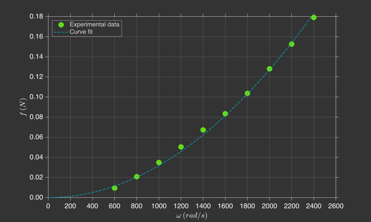

# Identificação da constante de sustentação

Nesta secção, você irá determinar experimentalmente a constante de sustentação das hélices $k_l$.

---

## Fundamentos teóricos

As hélices de um quadricoptero atuam como superfícies aerodinâmicas, acelerando o fluxo de ar através delas. Isso consome energia das baterias e produz forças de sustentação e torques de arrasto no quadricoptero. Já [deduzimos](../basic_concepts/aerodynamics.md) que a força de sustentação de uma hélice $f$ é proporcional à velocidade angular da hélice $\omega$ ao quadrado.
    
{: width="350" style="display: block; margin: auto;" }

$$
    \tau = k_l \omega^2
$$

Onde:

- $k_l$ - Constante de sustentação ($N.s^2$)   

---

## Procedimento experimental

Para medir a força de de sustentação $f$ da hélice, você pode utilizar um suporte e uma balança. Para prender o quadcoptero no suporte, você precisa encaixá-lo pela lateral e depois prender dois parafusos. 


O suporte possui um imã em sua base que deixa ele bem firma na balança. Você pode zerar a balança com o quadcoptero apertando o botão `T`, assim, qualquer força de sustentação que as hélices produzirem vai gerar uma leitura negativa na balança.

Você deve carregar no drone um programa que ligue os quatro motores com um determinado valor de velocidade angular $\omega$. Serão levantados dados de peso na balança para 10 valores distintos de $omega$ ($200rad/s$ até $2.000rad/s$), e, para cada valor de $\omega$, você deverá realizar o experimento 3 vezes e tirar uma média. Para facilitar o experimento, você pode controlar o valor de $\omega$ com os botões `Up` e `Down` do Command Based Flight Control através do CFClient.

{: width=100% style="display: block; margin: auto;" }

O código abaixo possui um exemplo de programa que faz exatamente isso.

```c title="lab3_experiment.c"
#include "FreeRTOS.h"      // FreeRTOS core definitions (needed for task handling and timing)
#include "task.h"          // FreeRTOS task functions (e.g., vTaskDelay)
#include "supervisor.h"    // Functions to check flight status (e.g., supervisorIsArmed)
#include "commander.h"     // Access to commanded setpoints (e.g., commanderGetSetpoint)
#include "motors.h"        // Low-level motor control interface (e.g., motorsSetRatio)
#include "debug.h"         // Debug printing functions (e.g., DEBUG_PRINT)

// Motor constants (derived in Lab 2)
// These represent coefficients of the quadratic model: PWM = a_2 * omega^2 + a_1 * omega
const float a_2 = 6.18e-8;
const float a_1 = 2.34e-4;

// Global variables to store the desired setpoint, the current state (not used here), 
// the computed PWM value, and the desired angular velocity (omega)
setpoint_t setpoint;
state_t state;
float pwm;
float omega;

// Main application
void appMain(void *param)
{
    // Infinite loop (runs forever)
    while (true)
    {
        // Check if the drone is armed (i.e., ready to fly)
        if (supervisorIsArmed())
        {
            // Fetch the latest setpoint from the commander and also fetch the current estimated state (not used here)
            commanderGetSetpoint(&setpoint, &state);

            // Compute an angular velocity value proportional to the commanded altitude (Z axis position)
            // The altitude command increases in 0.5 m steps, and we want the angular velocity to increase 
            // by 200 rad/s for each step. Therefore, we multiply Z by 400.0 so that: 0.5 m → 200 rad/s
            omega = (setpoint.position.z) * 400.0f;

            // Print the computed omega value to the debug console (rounded to nearest integer)
            DEBUG_PRINT("Omega (rad/s): %.0f\n", (double)omega);

            // Convert angular velocity to PWM using the motor model: PWM = a_2 * omega^2 + a_1 * omega
            pwm = a_2 * omega * omega + a_1 * omega;
        }
        else
        {
            // If not armed, stop the motors (set PWM to zero)
            pwm = 0.0f;
        }

        // Send the PWM signal to all four motors (M1–M4), scaling it to match the expected range [0, UINT16_MAX]
        motorsSetRatio(MOTOR_M1, pwm * UINT16_MAX);
        motorsSetRatio(MOTOR_M2, pwm * UINT16_MAX);
        motorsSetRatio(MOTOR_M3, pwm * UINT16_MAX);
        motorsSetRatio(MOTOR_M4, pwm * UINT16_MAX);

        // Wait for 100 milliseconds before running the next iteration (10 Hz control loop)
        vTaskDelay(pdMS_TO_TICKS(100));
    }
}
```

As etapas para coletar os dados são as seguintes:

1. Garanta que a bateria do drone está carregada 
2. Prenda o drone no dispositivo e zere a balança presionando o botão `T`
3. Arme o drone apertando o botão `Arm` no CFClient
4. Ligue o motor com um valor específico de velocidade angular $\omega$ com o Command Based Flight Control do CFClient
5. Anote o número que aparece na tela
6. Repita as etapas 4-5 para outros valores de sinal PWM

Após o experimento, você deverá coletar dados para preencher a tabela abaixo.

| $\omega \, (rad/s)$ | $W_1 \, (g)$ | $W_2 \, (g)$ | $W_3 \, (g)$ |
|-------|----------|----------|----------|
| $600$ |          |          |          |
| $800$ |          |          |          |
| $1200$ |          |          |          |
| $1400$ |          |          |          |
| $1600$ |          |          |          |
| $1800$ |          |          |          |
| $2000$ |          |          |          |
| $2200$ |          |          |          |
| $2400$ |          |          |          |

---

## Análise de Dados

Utilizando os dados coletados, você deverá ajustar uma curva que correlacione a velocidade angular $\omega$ com a força de sustentação $f$ da hélice (note que você precisa converter a a leitura da balança de $g$ para $N$ e dividir por 4, dado que estamos interessados na força de uma única hélice).

{: width=100% style="display: block; margin: auto;" }


Você já sabe que o melhor ajuste para esta curva é uma função polinomial de 2º grau cujos termos de ordem um e zero são nulos:
    
$$
    f = k_l \omega^2
$$

Determine o valor de $k_l$ fazendo esse ajuste de curva (dica: utilize o Curve Fitting Toolbox do MATLAB). Anote o valor obtido em algum lugar pois ele será utilizado em breve.

---
    
## Validação dos resultados

Compare o resultado obtido com o [estimado anteriormente](../basic_concepts/aerodynamics.md). É esperado que a constante de sustentação $k_l$ seja da ordem de grandeza de $10^{-8}N.s^2$. 