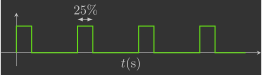

# Identificação dos coeficientes do motor

Nesta secção, você irá determinar experimentalmente os coeficientes do motor elétrico.

---

## Fundamentos teóricos


O PWM ("pulse width modulation") é uma técnica para controlar a potência de um sinal utilizando uma comutação digital. Ao mudar rapidamente o sinal entre o máximo e zero ("on-off"), e variando a fração de tempo que o sinal está no máximo, pode-se controlar a potência transmitida (isto é, modulando a largura do pulso).

{: width="450" style="display: block; margin: auto;" }
{: width="450" style="display: block; margin: auto;" }
{: width="450" style="display: block; margin: auto;" }

Este é o mecanismo utilizado pelo Crazyflie para acionar seus motores. Já [sabemos](../sensors_and_actuators/motors.md) que no código é possível definir um valor real entre `0.0` e `1.0` que corresponde ao sinal PWM do motor. 
    
Você irá implementar uma função que, dada uma velocidade angular desejada $\omega$, determine o sinal PWM correspondente. 

---

## Procedimento experimental

Para medir a velocidade angular da hélice, você pode utilizar um instrumento de medição do número de rotações chamado tacômetro. Para utilizá-lo, você deve fixar um pequeno pedaço de fita refletora em uma das hélices. Certifique-se de usar apenas um pequeno pedaço de fita e aplicar suavemente na hélice, caso contrário você interferirá no fluxo de ar e obterá dados ruins. 

{: width="450" style="display: block; margin: auto;" }

O tacômetro pode detectar quando a tira passa pelo seu feixe de luz, assim, a velocidade de rotação é calculada contando quantas vezes a tira passa em um determinado período de tempo. O tacômetro DT-2234C+ registra a velocidade angular enquanto você pressiona o botão `TEST` e, uma vez que este botão é liberado, ele armazena os valores mínimo, máximo e médio, que você pode conferir apertando o botão `MEM`.
    
{: width="450" style="display: block; margin: auto;" }

Você deve carregar no drone um programa que ligue apenas o motor cuja hélice está com o pedaço de fita refletora com um determinado valor de sinal PWM. Serão levantados dados de velocidade angular da hélice para 10 valores distintos de sinal PWM (`0.1` até `1.0`), e, para cada valor de sinal PWM, você deverá realizar o experimento 3 vezes e tirar uma média. Para facilitar o experimento, você pode controlar o valor do PWM com os botões `Up` e `Down` do Command Based Flight Control através do CFClient.

{: width=100% style="display: block; margin: auto;" }

Crie um arquivo chamado `motor_coeficients.c` dentro da pasta `src/identification` com o seguinte código:

```c title="motor_coeficients.c"
#include "FreeRTOS.h"      // FreeRTOS core definitions (needed for task handling and timing)
#include "task.h"          // FreeRTOS task functions (e.g., vTaskDelay)
#include "supervisor.h"    // Functions to check flight status (e.g., supervisorIsArmed)
#include "commander.h"     // Access to commanded setpoints (e.g., commanderGetSetpoint)
#include "motors.h"        // Low-level motor control interface (e.g., motorsSetRatio)

// Global variables to store the desired setpoint, the current state (not used here) and the computed PWM value.
setpoint_t setpoint;
state_t state;
float pwm;

// Main application
void appMain(void *param)
{
    // Infinite loop (runs forever)
    while (true)
    {
        // Check if the drone is armed (i.e., ready to fly)
        if (supervisorIsArmed())
        {
            // Fetch the latest setpoint from the commander and also fetch the current estimated state (not used here)
            commanderGetSetpoint(&setpoint, &state);

            // Compute a PWM value proportional to the commanded altitude (Z axis position)
            // The altitude command increases in 0.5 m steps, and we want the PWM to increase by 0.1 for each step.
            // Therefore, we divide Z by 5.0 so that: 0.5 m → 0.1 PWM
            pwm = (setpoint.position.z) / 5.0f;
        }
        else
        {
            // If not armed, stop the motor (set PWM to zero)
            pwm = 0.0f;
        }
        // Send the PWM signal to motor M1, scaling it to match the expected range [0, UINT16_MAX]
        motorsSetRatio(MOTOR_M1, pwm * UINT16_MAX);
        // Wait for 100 milliseconds before running the next iteration (10 Hz control loop)
        vTaskDelay(pdMS_TO_TICKS(100));
    }
}
```

As etapas para coletar um dado são as seguintes:

1. Garanta que a bateria do drone está carregada 
2. Prenda o drone na mesa com uma fita crepe
3. Arme o drone apertando o botão `Arm` no CFClient
4. Ligue o motor com um valor específico de sinal PWM com o Command Based Flight Control do CFClient
5. Aponte o tacômetro para a hélice segurando a aproximadamente $30cm$ de distância e, em seguida, pressione o botão `TEST`  
6. Mantenha o botão `TEST` pressionado o tempo todo, certificando-se de que o feixe aponta para onde a faixa refletora passa  
7. Mantenha essa posição por alguns segundos e solte o botão `TEST`  
8. Pressione o botão `MEM` uma vez e espere aparecer a segunda leitura, que corresponde à velocidade máxima (em $rpm$) observada durante o experimento  
9. Anote o número que aparece na tela
10. Repita as etapas 4-9 para outros valores de sinal PWM

Após o experimento, você deverá coletar dados para preencher a tabela abaixo.

| PWM   | N1 (rpm) | N2 (rpm) | N3 (rpm) |
|-------|----------|----------|----------|
| `0.1` |          |          |          |
| `0.2` |          |          |          |
| `0.3` |          |          |          |
| `0.4` |          |          |          |
| `0.5` |          |          |          |
| `0.6` |          |          |          |
| `0.7` |          |          |          |
| `0.8` |          |          |          |
| `0.9` |          |          |          |
| `1.0` |          |          |          |

---

## Análise de dados

Utilizando os dados coletados, você deverá ajustar uma curva que correlacione a velocidade angular das hélice $\omega$ com o sinal PWM correspondente do motor (note que você precisa converter a velocidade angular de $rpm$ para $rad/s$).

{: width=100% style="display: block; margin: auto;" }

Há diversos tipos de funções de ajuste para esta curva (linear, exponencial, polinomial, etc.):
    
$$
    \text{PWM} = f(\omega)
$$

Para definir qual é melhor para este caso, é necessário se aprofundar na dinâmica do sistema. O esquema eletromecânico de um motor elétrico com uma hélice pode ser visto no diagrama abaixo[^1].

[^1]: Embora o Crazyflie utilize um motor elétrico de corrente contínua sem escovas e não com escovas, a equação matemática de ambos é equivalente.

{: width="600" style="display: block; margin: auto;" }


Onde:


- $e_a$ - Tensão de armadura ($V$)
- $i_a$ - Corrente de armadura ($A$)
- $R_a$ - Resistência de armadura ($\Omega$)
- $L_a$ - Indutância de armadura ($H$)
- $e_b$ - Tensão contra-eletromotriz ($V$)
- $\omega$ - Velocidade angular do motor/hélice ($rad/s$)
- $\tau_m$ - Torque do motor ($N.m$)
- $k_d$ - Constante de arrasto da hélice ($N.m.s^2/rad^2$)
- $b$ - Coeficiente de atrito viscoso do motor ($N.m.s/rad$)
- $I$ - Momento de inércia do motor/hélice ($kg.m^2$)

!!! question "Exercício 1"
    Aplique a lei de Kirchoff das tensões no circuito de armadura.
    ??? info "Resposta"
        $$
        \begin{align*}
            \sum_{i=1}^n e_i &= 0 \\
            e_a - R_a i_a - L_a \frac{d}{dt} i_a - e_b &= 0
        \end{align*}
        $$

!!! question "Exercício 2"
    Aplique a 2º lei de Newton em torno do eixo do motor.
    ??? info "Resposta"
        $$
        \begin{align*}
            \sum_{i=1}^n \tau_i &= I \frac{d}{dt} \omega \\
            \tau_m - k_d \omega^2 - b \omega &= I \frac{d}{dt} \omega
        \end{align*}
        $$

Em um motor de corrente contínua, o torque do motor $\tau_m$ é diretamente proporcional à corrente de armadura $i_a$, e a tensão contra-eletromotriz $e_b$ é diretamente proporcional à velocidade angular $\omega$:

$$
\tau_m = K_m i_a 
\qquad
e_b = K_m \omega   
$$

Onde:

- $K_m$ - Constante de torque do motor ($N.m/A$ ou $V.s/rad$).

!!! question "Exercício 3"
    Substitua o torque do motor $\tau_m$ e a tensão contra-eletromotriz $e_b$ nas duas equações diferenciais obtidas anteriormente.
    ??? info "Resposta"
        $$
        \left\{
            \begin{array}{l}
                L_a \dfrac{d}{dt} i_a + R_a i_a + K_m \omega = e_a \\ \\
                I \dfrac{d}{dt} \omega + k_d \omega^2 + b \omega - K_m i_a = 0
            \end{array}
        \right.
        $$

Quando o motor entra em regime, a corrente de armadura $i_a$ e a velocidade angular $\omega$ tornam-se constantes (essa é a definição de ``regime''):

$$
    \dfrac{d}{dt} i_a = 0 \qquad \dfrac{d}{dt} \omega = 0
$$

!!! question "Exercício 4"
    Iguale as derivadas da corrente de armadura $i_a$ e da velocidade angular $\omega$ a zero e isole a corrente de armadura $i_a$ nas duas equações.
    ??? info "Resposta"
        $$
        \begin{align*}
                L_a \cancelto{0}{\dfrac{d}{dt} i_a} + R_a i_a + K_m \omega &= e_a \\
                R_a i_a &= e_a - K_m \omega \\
                i_a &= \dfrac{1}{R_a} e_a - \dfrac{K_m}{R_a} \omega
        \end{align*}
        $$

        $$
        \begin{align*}
            I \cancelto{0}{\dfrac{d}{dt} \omega} + k_d \omega^2 + b \omega - K_m i_a &= 0 \\
            K_m i_a &= k_d \omega^2 + b \omega \\
            i_a &= \dfrac{k_d}{K_m} \omega^2 + \dfrac{b}{K_m} \omega
        \end{align*}
        $$

!!! question "Exercício 5"
    Iguale a corrente de armadura $i_a$ obtida em cada uma das equações e isole a tensão de armadura $e_a$ na equação.
    ??? info "Resposta"
        $$
        \begin{align*}
            \dfrac{1}{R_a} e_a - \dfrac{K_m}{R_a} \omega &= \dfrac{k_d}{K_m} \omega^2 + \dfrac{b}{K_m} \omega\\
            \dfrac{1}{R_a} e_a &= \dfrac{k_d}{K_m} \omega^2 + \dfrac{b}{K_m} \omega + \dfrac{K_m}{R_a} \omega \\
            e_a &= \dfrac{R_a k_d}{K_m} \omega^2 + \dfrac{R_a b + K_m^2}{K_m} \omega
        \end{align*}
        $$

 O sinal PWM é a razão entre a tensão de armadura $e_a$ e a tensão da bateria $e_s$:
    
$$
    \text{PWM} = \frac{e_a}{e_s}
$$

!!! question "Exercício 6"
    Substitua a tensão de armadura $e_a$ na equação anterior e isole o sinal PWM na equação.
    ??? info "Resposta"
        $$
        \begin{align*}
            e_a &= \dfrac{R_a k_d}{K_m} \omega^2 + \dfrac{R_a b + K_m^2}{K_m} \omega \\
            e_s \text{PWM} &= \dfrac{R_a k_d}{K_m} \omega^2 + \dfrac{R_a b + K_m^2}{K_m} \omega \\
            \text{PWM} &= \dfrac{R_a k_d}{K_me_s} \omega^2 + \dfrac{R_a b + K_m^2}{K_me_s} \omega
        \end{align*}
        $$

Você deve ter chegado a:
    
$$
    \text{PWM} =\dfrac{R_a k_d}{K_me_s} \omega^2 + \dfrac{R_a b + K_m^2}{K_me_s} \omega
$$

Como $R_a$, $k_d$, $b$, $K_m$ e $e_s$ são parâmetros constantes, podemos agrupá-los em duas constantes:

$$
    \text{PWM} = \underbrace{\dfrac{R_a k_d}{K_me_s}}_{a_2} \omega^2 + \underbrace{\dfrac{R_a b + K_m^2}{K_me_s}}_{a_1} \omega
$$

Ou seja, o tipo de função mais adequado para realizar esse ajuste de curva é uma função polinomial de 2º grau cujo coeficiente de ordem zero é nulo:

$$
    \text{PWM} = a_2 \omega^2 + a_1 \omega + \cancelto{0}{a_0}	
$$

Dessa forma, ao invés de determinar os valores de cada parâmetro ($R_a$, $k_d$, $b$, $K_m$ e $e_s$), você irá determinar experimentalmente apenas os valores dos coeficientes $a_2$ e $a_1$ (dica: utilize o Curve Fitting Toolbox do MATLAB).

---

## Validação dos resultados

Uma vez determinados os coeficientes $a_2$ e $a_1$, declare os seus valores no código (linhas 10 e 11) e modifique seu programa para que, dada uma velocidade angular $\omega$ comandada (linhas 30 e 35), ele determine o sinal PWM correspondente (linha 41) e envie isso ao motor M1 (linha 50). Note que estamos imprimindo no console o valor de velocidade angular comandada (linha 38) e, para isso, devemos incluir uma biblioteca adicional (linha 6).

```c title="motor_coeficients.c"
#include "FreeRTOS.h"      // FreeRTOS core definitions (needed for task handling and timing)
#include "task.h"          // FreeRTOS task functions (e.g., vTaskDelay)
#include "supervisor.h"    // Functions to check flight status (e.g., supervisorIsArmed)
#include "commander.h"     // Access to commanded setpoints (e.g., commanderGetSetpoint)
#include "motors.h"        // Low-level motor control interface (e.g., motorsSetRatio)
#include "debug.h"         // Debug printing functions (e.g., DEBUG_PRINT)

// Motor coefficients of the quadratic model: PWM = a_2 * omega^2 + a_1 * omega
const float a_2 = 0.0f;
const float a_1 = 0.0f;

// Global variables to store the desired setpoint, the current state (not used here), 
// the computed PWM value, and the desired angular velocity (omega)
setpoint_t setpoint;
state_t state;
float pwm;
float omega;

// Main application
void appMain(void *param)
{
    // Infinite loop (runs forever)
    while (true)
    {
        // Check if the drone is armed (i.e., ready to fly)
        if (supervisorIsArmed())
        {
            // Fetch the latest setpoint from the commander and also fetch the current estimated state (not used here)
            commanderGetSetpoint(&setpoint, &state);

            // Compute an angular velocity value proportional to the commanded altitude (Z axis position)
            // The altitude command increases in 0.5 m steps, and we want the angular velocity to increase 
            // by 200 rad/s for each step. Therefore, we multiply Z by 400.0 so that: 0.5 m → 200 rad/s
            omega = (setpoint.position.z) * 400.0f;

            // Print the computed omega value to the debug console (rounded to nearest integer)
            DEBUG_PRINT("Omega (rad/s): %.0f\n", (double)omega);

            // Convert angular velocity to PWM using the motor model: PWM = a_2 * omega^2 + a_1 * omega
            pwm = a_2 * omega * omega + a_1 * omega;
        }
        else
        {
            // If not armed, stop the motors (set PWM to zero)
            pwm = 0.0f;
        }

        // Send the PWM signal to motors M1, scaling it to match the expected range [0, UINT16_MAX]
        motorsSetRatio(MOTOR_M1, pwm * UINT16_MAX);

        // Wait for 100 milliseconds before running the next iteration (10 Hz control loop)
        vTaskDelay(pdMS_TO_TICKS(100));
    }
}
```

O código acima faz uso do Command Based Flight Control para comandar a velocidade angular $\omega$ em incrementos de $200rad/s$. Você deve testá-lo verificando se a velocidade angular comandada está próxima[^2] da leitura do tacômetro.

[^2]: Ela não vai bater na vírgula, pois fizemos um ajuste de curva. No entanto, essa divergência não será um problema pois ainda vamos fechar a malha de controle em um nível superior.