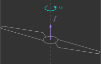
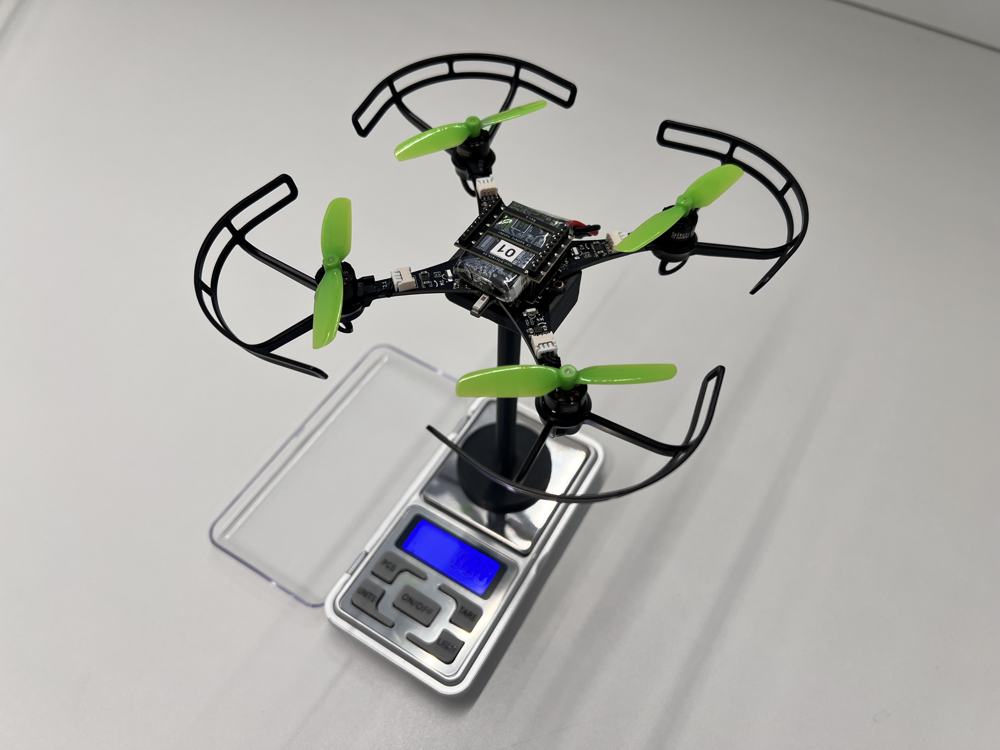

# :material-alpha-l-box-outline: Thrust constant

In this section, you will experimentally determine the propeller thrust constant $k_l$.

---

## Theoretical background

The propellers of a quadcopter act as aerodynamic surfaces, accelerating the airflow through them. This process consumes energy from the batteries and generates both thrust forces and aerodynamic drag torques on the quadcopter. As previously [derived](../fundamentals/aerodynamics.md/#propeller), the thrust force ${\color{var(--c2)}f}$ produced by a propeller is proportional to the square of its angular velocity ${\color{var(--c1)}\omega}$.

{: width="350" style="display: block; margin: auto;" }

$$
    {\color{var(--c2)}f} = k_l {\color{var(--c1)}\omega}^2
$$

Where $k_l$ is the thrust constant ($\text{N.s}^2$).

---

## Experimental procedure

You will measure the thrust force $f$ generated by the propellers using a support fixture (1) that attaches the drone to a scale via a magnet.
{ .annotate }

1. To secure the quadcopter to the fixture, slide it in from the side and fasten it using two screws.

{: width=60% style="display: block; margin: auto;" }

Knowing the reading from the scale, it is possible to determine the thrust force produced by the propellers. You can zero (tare) the scale with the quadcopter attached by pressing the `TARE` button. After that, any thrust generated by the propellers will appear as a negative reading on the scale.

{: width=60% style="display: block; margin: auto;" }

You must upload to the drone a program that spins all four motors at a specified angular velocity. Data will be collected for 10 distinct angular velocity values. For each value, repeat the experiment three times and compute the average measurement.

{: width="100%" style="display: block; margin: auto;" }

To simplify the procedure, you can change the angular velocity using the ++"Up"++ and ++"Down"++ buttons in the Command Based Flight Control, located at the bottom-right corner of the Crazyflie Client.

{: width=40% style="display: block; margin: auto;" }

Create a file named `thrust_constant.c` inside the `src/identification` folder with the following code (1):
{ .annotate }

1. Do not forget to update the motor coefficient values $a_2$ and $a_1$ (lines 8–9) previously estimated [here](../identifications/motor_coeficientes.md).


Follow the steps below to collect the experimental data:

1. Ensure that the drone battery is fully charged  
2. Attach the drone to the fixture and zero the scale by pressing the `T` (tare) button  
3. Arm the drone by pressing the `Arm` button in the CFClient  
4. Set a specific angular velocity $\omega$ using the Command-Based Flight Control  
5. Record the value displayed on the scale  
6. Repeat steps 4–5 for different PWM signal values  

After completing the experiment, collect the data needed to fill in the table below.

| $\omega \, (\mathrm{rad/s})$ | $W_1 \, (\mathrm{g})$ | $W_2 \, (\mathrm{g})$ | $W_3 \, (\mathrm{g})$ |
|------------------|----------|----------|----------|
| $600$  |          |          |          |
| $800$  |          |          |          |
| $1200$ |          |          |          |
| $1400$ |          |          |          |
| $1600$ |          |          |          |
| $1800$ |          |          |          |
| $2000$ |          |          |          |
| $2200$ |          |          |          |
| $2400$ |          |          |          |

---

## Data analysis

Using the collected data, fit a curve relating the angular velocity $\omega$ to the thrust force $f$ generated by a single propeller.

Note that you must:
- Convert the scale readings from grams ($\mathrm{g}$) to newtons ($\mathrm{N}$)
- Divide the measured force by 4, since the total thrust is shared equally by the four propellers

{: width=100% style="display: block; margin: auto;" }

Recall that the thrust force produced by a propeller is proportional to the square of its angular velocity:

$$
    f = k_l \omega^2
$$

Therefore, the most appropriate model for curve fitting is a second-order polynomial with zero constant and linear terms.

Determine the value of the thrust constant $k_l$ from this curve fitting process (hint: use MATLAB’s *Curve Fitting Toolbox*). Record the obtained value, as it will be used in subsequent activities.

---

## Results validation

Compare your experimentally obtained value with the one previously estimated with a ruler in [Exercise 1.4](../fundamentals/aerodynamics.md/#exercise_1_4). The thrust constant $k_l$ is expected to be on the order of magnitude of $10^{-8}\,\text{N·s}^2$.


<!-- ---
title: Constante de sustentação
icon: material/alpha-l-box-outline
---

# :material-alpha-l-box-outline: Constante de sustentação

Nesta secção, você irá determinar experimentalmente a constante de sustentação das hélices $k_l$.

---

## Fundamentos teóricos

As hélices de um quadricoptero atuam como superfícies aerodinâmicas, acelerando o fluxo de ar através delas. Isso consome energia das baterias e produz forças de sustentação e torques de arrasto no quadricoptero. Já [deduzimos](../basic_concepts/aerodynamics.md) que a força de sustentação de uma hélice $f$ é proporcional à velocidade angular da hélice $\omega$ ao quadrado.
    
{: width="350" style="display: block; margin: auto;" }

$$
    \tau = k_l \omega^2
$$

Onde:

- $k_l$ - Constante de sustentação ($N.s^2$)   

---

## Procedimento experimental

Você vai medir a força de de sustentação $f$ das hélices com um suporte(1) que fixa o drone em uma balança através de um imã. 
{ .annotate }

1. Para prender o quadcoptero no suporte, você precisa encaixá-lo pela lateral e depois prender dois parafusos. 

{: width=60% style="display: block; margin: auto;" }

Sabendo a leitura da balança, é possível determinar a força de sustentação das hélices. Você pode zerar a balança com o quadcoptero apertando o botão `TARE`, assim, qualquer força de sustentação que as hélices produzirem vai gerar uma leitura negativa na balança.

{: width=60% style="display: block; margin: auto;" }

Você deve carregar no drone um programa que ligue os quatro motores com um determinado valor de velocidade angular. Serão levantados dados de peso na balança para 10 valores distintos, e, para cada valor de, você deverá realizar o experimento três vezes e tirar uma média. Para facilitar o experimento, você pode controlar o valor da velocidade angular com os botões `Up` e `Down` do Command Based Flight Control através do CFClient.

{: width=100% style="display: block; margin: auto;" }

Crie um arquivo chamado `thrust_constant.c` dentro da pasta `src/identification` com o seguinte código(1):
{ .annotate }

1. Não esqueça de atualizar os valores dos coeficientes dos motores $a_2$ e $a_1$ (linhas 8-9) estimados [anteriormente](../identifications/motor_coeficientes.md).

```c title="thrust_constant.c"
#include "FreeRTOS.h"      // FreeRTOS core definitions (needed for task handling and timing)
#include "task.h"          // FreeRTOS task functions (e.g., vTaskDelay)
#include "supervisor.h"    // Functions to check flight status (e.g., supervisorIsArmed)
#include "commander.h"     // Access to commanded setpoints (e.g., commanderGetSetpoint)
#include "motors.h"        // Low-level motor control interface (e.g., motorsSetRatio)
#include "debug.h"         // Debug printing functions (e.g., DEBUG_PRINT)

// Motor coefficients of the quadratic model: PWM = a_2 * omega^2 + a_1 * omega
const float a_2 = 0.0f;
const float a_1 = 0.0f;

// Global variables to store the desired setpoint, the current state (not used here), 
// the computed PWM value, and the desired angular velocity (omega)
setpoint_t setpoint;
state_t state;
float pwm;
float omega;

// Main application
void appMain(void *param)
{
    // Infinite loop (runs forever)
    while (true)
    {
        // Check if the drone is armed (i.e., ready to fly)
        if (supervisorIsArmed())
        {
            // Fetch the latest setpoint from the commander and also fetch the current estimated state (not used here)
            commanderGetSetpoint(&setpoint, &state);

            // Compute an angular velocity value proportional to the commanded altitude (Z axis position)
            // The altitude command increases in 0.5 m steps, and we want the angular velocity to increase 
            // by 200 rad/s for each step. Therefore, we multiply Z by 400.0 so that: 0.5 m → 200 rad/s
            omega = (setpoint.position.z) * 400.0f;

            // Print the computed omega value to the debug console (rounded to nearest integer)
            DEBUG_PRINT("Omega (rad/s): %.0f\n", (double)omega);

            // Convert angular velocity to PWM using the motor model: PWM = a_2 * omega^2 + a_1 * omega
            pwm = a_2 * omega * omega + a_1 * omega;
        }
        else
        {
            // If not armed, stop the motors (set PWM to zero)
            pwm = 0.0f;
        }

        // Send the PWM signal to all four motors (M1–M4), scaling it to match the expected range [0, UINT16_MAX]
        motorsSetRatio(MOTOR_M1, pwm * UINT16_MAX);
        motorsSetRatio(MOTOR_M2, pwm * UINT16_MAX);
        motorsSetRatio(MOTOR_M3, pwm * UINT16_MAX);
        motorsSetRatio(MOTOR_M4, pwm * UINT16_MAX);

        // Wait for 100 milliseconds before running the next iteration (10 Hz control loop)
        vTaskDelay(pdMS_TO_TICKS(100));
    }
}
```


As etapas para coletar os dados são as seguintes:

1. Garanta que a bateria do drone está carregada 
2. Prenda o drone no dispositivo e zere a balança presionando o botão `T`
3. Arme o drone apertando o botão `Arm` no CFClient
4. Ligue o motor com um valor específico de velocidade angular $\omega$ com o Command Based Flight Control do CFClient
5. Anote o número que aparece na tela
6. Repita as etapas 4-5 para outros valores de sinal PWM

Após o experimento, você deverá coletar dados para preencher a tabela abaixo.

| $\omega \, (rad/s)$ | $W_1 \, (g)$ | $W_2 \, (g)$ | $W_3 \, (g)$ |
|-------|----------|----------|----------|
| $600$ |          |          |          |
| $800$ |          |          |          |
| $1200$ |          |          |          |
| $1400$ |          |          |          |
| $1600$ |          |          |          |
| $1800$ |          |          |          |
| $2000$ |          |          |          |
| $2200$ |          |          |          |
| $2400$ |          |          |          |

---

## Análise de dados

Utilizando os dados coletados, você deverá ajustar uma curva que correlacione a velocidade angular $\omega$ com a força de sustentação $f$ da hélice (note que você precisa converter a a leitura da balança de $g$ para $N$ e dividir por 4, dado que estamos interessados na força de uma única hélice).

{: width=100% style="display: block; margin: auto;" }


Você já sabe que a força de sustentação de uma hélice $f$ é proporcional à velocidade angular da hélice $\omega$ ao quadrado:
    
$$
    f = k_l \omega^2
$$

Ou seja, o tipo de função mais adequado para realizar esse ajuste de curva é uma função polinomial de 2º grau cujos coeficientes de ordem zero e um são nulos. 

Determine o valor de $k_l$ fazendo esse ajuste de curva (dica: utilize o Curve Fitting Toolbox do MATLAB). Anote o valor obtido em algum lugar pois ele será utilizado em breve.

---
    
## Validação dos resultados

Compare o resultado obtido com o [estimado anteriormente](../basic_concepts/aerodynamics.md). É esperado que a constante de sustentação $k_l$ seja da ordem de grandeza de $10^{-8}N.s^2$.  -->