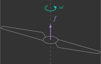
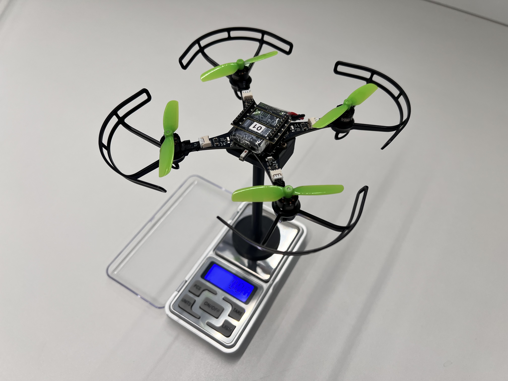
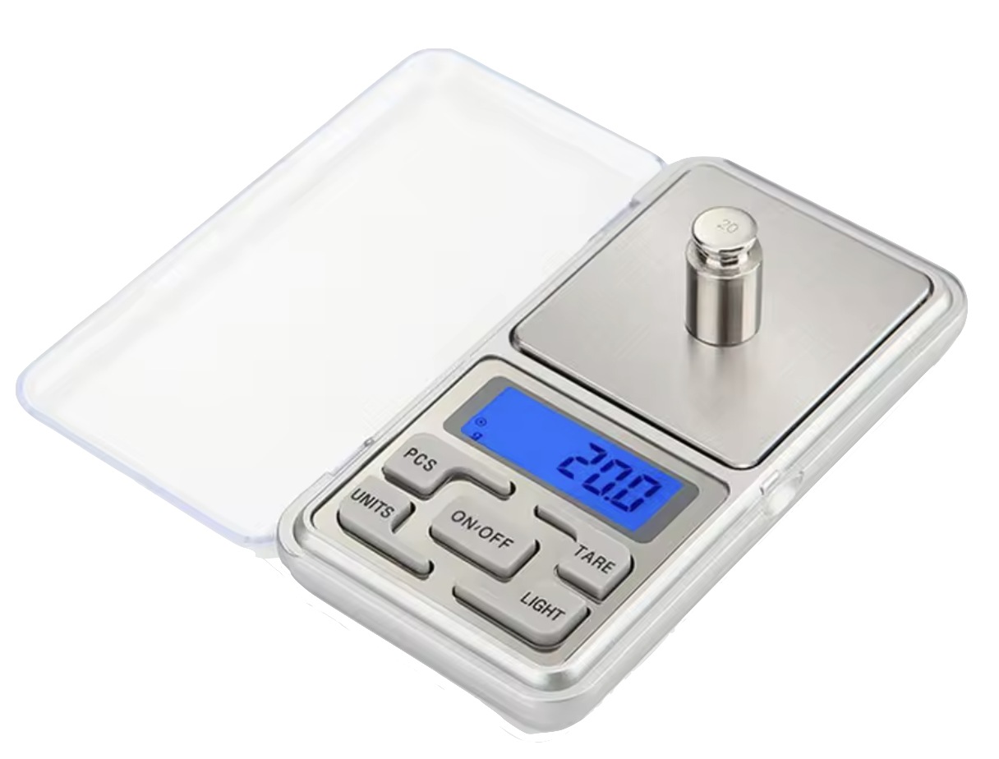
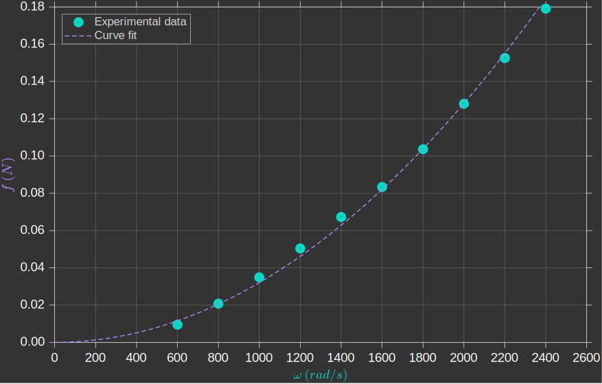

# :material-alpha-t-box-outline: Thrust constant

In this section, you will experimentally determine the propeller thrust constant $k_l$.

---

## Theoretical background

The propellers of a quadcopter act as aerodynamic surfaces, accelerating the airflow through them. This process consumes energy from the batteries and generates both thrust forces and drag torques on the quadcopter. As previously [derived](../fundamentals/aerodynamics.md/#propeller), the thrust force ${\color{var(--c2)}f}$ produced by a propeller is proportional to the square of its angular velocity ${\color{var(--c1)}\omega}$.

{: width="350" style="display: block; margin: auto;" }

$$
    {\color{var(--c2)}f} = k_l {\color{var(--c1)}\omega}^2
$$

Where $k_l$ is the thrust constant ($\text{N.s}^2$).

---

## Experimental procedure

You will measure the thrust force ${\color{var(--c2)}f}$ generated by the propellers using the [thrust stand](../setup/hardware.md/#thrust_stand), a test fixture that holds(1) the quadcopter firmly above a [scale](../setup/hardware.md/#scale), so the vertical force produced by the motors can be measured directly.
{.annotate}

1. To secure the quadcopter, slide it in from the side and fasten it using two screws.

{: width=60% style="display: block; margin: auto;" }

From the scale reading, it is possible to determine the thrust force produced by the propellers. You can zero (tare) the scale with the quadcopter attached by pressing the ++"TARE"++ button. After that, any thrust generated by the propellers will appear as a negative reading on the scale.

{: width=400 style="display: block; margin: auto;" }

You must upload to the drone a program that spins all four motors at a specified angular velocity. Data will be collected for 10 distinct angular velocity values. For each value, repeat the experiment three times and compute the average measurement.

{: width="100%" style="display: block; margin: auto;" }

To simplify the procedure, you can change the angular velocity using the ++"Up"++ and ++"Down"++ buttons in the Command Based Flight Control, located at the bottom-right corner of the Crazyflie Client.

{: width=40% style="display: block; margin: auto;" }

Create a file named `thrust_constant.c` inside the `src/identification` folder with the following code (1):
{ .annotate }

1. Do not forget to update the motor model coefficients $a_2$ and $a_1$ (lines 8–9) with your [estimation](motor_coefficients.md).

```c title="thrust_constant.c" linenums="1"
#include "FreeRTOS.h"      // FreeRTOS core definitions (needed for task handling and timing)
#include "task.h"          // FreeRTOS task functions (e.g., vTaskDelay)
#include "supervisor.h"    // Functions to check flight status (e.g., supervisorIsArmed)
#include "commander.h"     // Access to commanded setpoints (e.g., commanderGetSetpoint)
#include "motors.h"        // Low-level motor control interface (e.g., motorsSetRatio)
#include "debug.h"         // Debug printing functions (e.g., DEBUG_PRINT)

// Motor coefficients of the quadratic model: PWM = a_2 * omega^2 + a_1 * omega
const float a_2 = 0.0f;
const float a_1 = 0.0f;

// Global variables to store the desired setpoint, the current state (not used here), 
// the computed PWM value, and the desired angular velocity (omega)
setpoint_t setpoint;
state_t state;
float pwm;
float omega;

// Main application
void appMain(void *param)
{
    // Infinite loop (runs forever)
    while (true)
    {
        // Check if the drone is armed (i.e., ready to fly)
        if (supervisorIsArmed())
        {
            // Fetch the latest setpoint from the commander and also fetch the current estimated state (not used here)
            commanderGetSetpoint(&setpoint, &state);

            // Compute an angular velocity value proportional to the commanded altitude (Z axis position)
            // The altitude command increases in 0.5 m steps, and we want the angular velocity to increase 
            // by 200 rad/s for each step. Therefore, we multiply Z by 400.0 so that: 0.5 m → 200 rad/s
            omega = (setpoint.position.z) * 400.0f;

            // Print the computed omega value to the debug console (rounded to nearest integer)
            DEBUG_PRINT("Omega (rad/s): %.0f\n", (double)omega);

            // Convert angular velocity to PWM using the motor model: PWM = a_2 * omega^2 + a_1 * omega
            pwm = a_2 * omega * omega + a_1 * omega;
        }
        else
        {
            // If not armed, stop the motors (set PWM to zero)
            pwm = 0.0f;
        }

        // Send the PWM signal to all four motors (M1–M4), scaling it to match the expected range [0, UINT16_MAX]
        motorsSetRatio(MOTOR_M1, pwm * UINT16_MAX);
        motorsSetRatio(MOTOR_M2, pwm * UINT16_MAX);
        motorsSetRatio(MOTOR_M3, pwm * UINT16_MAX);
        motorsSetRatio(MOTOR_M4, pwm * UINT16_MAX);

        // Wait for 100 milliseconds before running the next iteration (10 Hz control loop)
        vTaskDelay(pdMS_TO_TICKS(100));
    }
}
```

Follow the steps below to collect the experimental data:

1. Ensure that the drone battery is fully charged  
2. Attach the drone to the fixture and zero the scale by pressing the ++"T"++ (tare) button  
3. Arm the drone by pressing the ++"Arm"++ button in the Crazyflie Client
4. Set a specific angular velocity using the Command-Based Flight Control  
5. Record the value displayed on the scale  
6. Repeat steps 4–5 for different angular velocities   

After completing the experiment, collect the data needed to fill in the table below.

| ${\color{var(--c1)}\omega}~(\text{rad/s})$ | ${\color{var(--c2)}W_1}~(\text{g})$ | ${\color{var(--c2)}W_2}~(\text{g})$ | ${\color{var(--c2)}W_3}~(\text{g})$ |
|------------------|----------|----------|----------|
| $600$  |          |          |          |
| $800$  |          |          |          |
| $1200$ |          |          |          |
| $1400$ |          |          |          |
| $1600$ |          |          |          |
| $1800$ |          |          |          |
| $2000$ |          |          |          |
| $2200$ |          |          |          |
| $2400$ |          |          |          |

---

## Data analysis

Using the collected data, you should fit a curve relating the angular velocity ${\color{var(--c1)}\omega}$ with the thrust force ${\color{var(--c2)}f}$(1) generated by a single propeller.
{.annotate}

1. Note that you must convert from grams ($\text{g}$) to newtons ($\text{N}$) and also divide by four, since the total thrust is shared equally by the four propellers.

{: width=100% style="display: block; margin: auto;" }

Recall that the thrust force produced by a propeller is proportional to the square of its angular velocity:

$$
    {\color{var(--c2)}f} = k_l {\color{var(--c1)}\omega}^2
$$

Therefore, the most appropriate fitting model is a second-order polynomial whose constant and linear terms are zero. You should experimentally identify the thrust constant $k_l$ from this curve fit(1). Record the obtained value, as it will be used in subsequent activities.
{.annotate} 

1. Tip: use MATLAB’s Curve Fitting Toolbox.

---

## Results validation

Compare your experimentally obtained value with the one previously estimated with a ruler in [Exercise 1.4](../fundamentals/aerodynamics.md/#exercise_1_4). The thrust constant $k_l$ is expected to be on the order of magnitude of $10^{-8}\,\text{N.s}^2$.