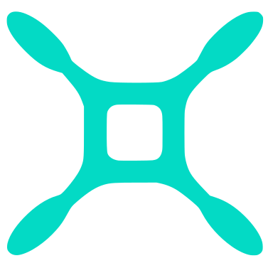

# QuadControl

{ width=25% style="display:block;margin:auto" }

Master **embedded control** in a **100% hands-on** course designed to bridge **theory, programming, and real flight**.

---

## The drone as a laboratory

{ width=40% style="display:block;margin:auto" }

At QuadControl, the star is the [**Bitcraze Crazyflie 2.1 Brushless**](https://www.bitcraze.io/products/crazyflie-2-1-brushless/){target=_blank}: an **open-source micro-drone** built for education and research. You’ll design the **entire estimation and control architecture** — from sensors to motors — and watch your algorithms actually fly.

---

## What you’ll learn

- :material-school-outline:{ .lg .middle } **Flight fundamentals**
  
    ---
    
    Key concepts of **aerodynamics** and **rigid-body dynamics**, explained in a clear, intuitive way and applied to a quadcopter.

- :material-memory:{ .lg .middle } **Embedded programming**
  
    ---
    
    Program an **ARM microcontroller** in **C** using **FreeRTOS** — integrate sensors (IMU, ToF, and optical flow) via **I²C/SPI**, and drive **BLDC motors** through ESCs.

- :material-flask:{ .lg .middle } **Applied control**
  
    ---
    
    From **PID** and **complementary filters** to **LQR** and **Kalman filtering** — explore classical and modern control techniques tested **in real flight**.

- :material-layers-triple-outline:{ .lg .middle } **Layered architecture**
  
    ---
    
    Three control levels with distinct strategies: **attitude** (sensor fusion + P–P), **vertical** (1st/2nd-order observers + PD/PID) and **horizontal** (LQE + LQR = LQG).

- :material-hammer-wrench:{ .lg .middle } **100% practical**
  
    ---
    
    **No simulations** — observe **in real time** how each gain shapes system behavior: stability, overshoot, and response time.

- :material-magnify-scan:{ .lg .middle } **System identification**
  
    ---
    
    Use **custom test rigs** and jigs that constrain motion to specific axes, enabling precise **identification of physical and aerodynamic parameters**.

---

## Watch it in action

  <iframe src="https://www.youtube-nocookie.com/embed/BWKetwaHiyc?si=Z6z0i3ECyBbCU5V8"
          title="QuadControl demo"
          style="position:absolute;top:0;left:0;width:100%;height:100%;border:0"
          allowfullscreen></iframe>

<!-- ---
icon: material/home-outline
title: Início
description: Domine controle embarcado em um curso 100% prático, desenvolvido para conectar teoria, programação e voo real.
---

# QuadControl

{ width=25% style="display:block;margin:auto" }

Domine **controle embarcado** em um curso **100% prático**, desenvolvido para conectar teoria, programação e voo real.

---

## O drone como laboratório

{ width=40% style="display:block;margin:auto" }

No QuadControl, o protagonista é o [**Bitcraze Crazyflie 2.1 Brushless**](https://www.bitcraze.io/products/crazyflie-2-1-brushless/){target=_blank}: um **micro-drone open source** criado para ensino e pesquisa. Com ele, você vai desenvolver toda a **arquitetura de estimação e controle** — dos sensores aos motores — e ver seus algoritmos voarem de verdade.

---

## O que você aprende

- :material-school-outline:{ .lg .middle } **Fundamentos de aeronáutica**
  
    ---
    
    Conceitos essenciais de **aerodinâmica** e **dinâmica de corpo rígido**, explicados de forma didática e aplicados a um quadricoptero.

- :material-memory:{ .lg .middle } **Programação embarcada**
  
    ---
    
    Microcontrolador **ARM** programado em **C** utilizando **FreeRTOS** — integra sensores (IMU, ToF e fluxo óptico) via **I²C/SPI** e comanda os motores (BLDC) com ESCs.

- :material-flask:{ .lg .middle } **Controle aplicado**
  
    ---
    
    Do **PID** e **filtro complementar** ao **LQR** e **Kalman** — diferentes conceitos de controle clássico e moderno testados **em voo**, na planta real.

- :material-layers-triple-outline:{ .lg .middle } **Arquitetura em camadas**
  
    ---
    
    Três níveis de controle com diferentes abordagens: **atitude** (fusão sensorial + P–P), **vertical** (observadores 1ª/2ª ordem + PD/PID) e **horizontal** (LQE + LQR = LQG).

- :material-hammer-wrench:{ .lg .middle } **100% prático**
  
    ---
    
    **Sem simulação**: você observa **na prática** como cada ganho altera o comportamento do sistema — estabilidade, ultrapassagem percentual, tempo de resposta.

- :material-magnify-scan:{ .lg .middle } **Identificação**
  
    ---
    
    **Dispositivos de teste** e suportes físicos que restringem graus de liberdade e permitem **identificar parâmetros** físicos e aerodinâmicos com precisão.

---

## Veja o curso em ação

  <iframe src="https://www.youtube-nocookie.com/embed/BWKetwaHiyc?si=Z6z0i3ECyBbCU5V8"
          title="QuadControl demo"
          style="position:absolute;top:0;left:0;width:100%;height:100%;border:0"
          allowfullscreen></iframe>

 -->

<!-- Enquanto os cursos convencionais abordam apenas sistemas lineares de uma entrada e uma saída, quase sempre em ambiente de simulação, aqui você trabalha com um sistema real, não linear e multivariável: o [Bitcraze Crazyflie 2.1 Brushless](https://www.bitcraze.io/products/crazyflie-2-1-brushless/){target=_blank} — um quadricóptero open source voltado para ensino e pesquisa.

O objetivo é romper a barreira entre teoria e prática, mostrando que é possível compreender e aplicar conceitos avançados de controle de forma simples, didática e acessível. A famosa frase “a teoria na prática é outra” cai por terra aqui.

Diferente da maior parte dos cursos de controle, tudo aqui é feito diretamente na planta final, sem a etapa de simulação.
Você observa na prática como estabilidade, tempo de resposta e saturação são influenciados pelos ganhos de cada controlador e estimador.

Com o apoio de dispositivos especialmente projetados para restringir graus de liberdade e permitir a identificação precisa de parâmetros físicos e aerodinâmicos, o aprendizado deixa de ser teórico e se torna experimental, visual e concreto — exatamente como o controle deve ser. -->

<!-- A arquitetura de controle, que abrange diversos conceitos da teoria de controle clássico e moderno, é organizada em três camadas principais:

!!! question "Controle de atitude"

    Estudamos filtros passa-baixa, passa-alta e o filtro complementar para fusão sensorial. A estabilização é feita com um controlador P–P em cascata, que atua sobre velocidade e deslocamento angular, formando a base da malha mais rápida do sistema.

!!! question "Controle vertical"

    Introduzimos o uso de observadores de estados de 1ª e 2ª ordem para estimar velocidade e posição. Partimos de um controlador PD, que se transforma naturalmente em um PID ao lidar com o erro em regime permanente causado por distúrbios constantes, como a gravidade.

!!! question "Controle horizontal"

    Avançamos para um observador e regulador de estados ótimo. Mostramos que o LQE nada mais é do que um filtro de Kalman linear, enquanto o LQR equivale a um controlador PD com ganhos ideais. Quando utilizados em conjunto, integrando estimação e controle de maneira otimizada, formam o famoso LQG. -->

<!-- ---
template: home.html
title: Início
icon: material/home-outline
hide:
  - navigation
  - toc
title: ""   # deixa o título limpo; o hero vai dominar a página
--- --

<!-- # Bem-vindo!

Este site reúne toda a documentação da eletiva de Drones do Insper — uma espécie de apostila online, cuidadosamente organizada com:

- 📚 Explicações teóricas e fórmulas fundamentais
- 💻 Códigos em C, Python e MATLAB
- 🖼️ Figuras, diagramas e vídeos demonstrativos
- 🛸 Exemplos de aplicações práticas

Nosso objetivo é ensinar conceitos de controle e programação embarcada de forma prática e acessível, usando um quadricoptero real. Explore os tópicos no menu lateral — e boa jornada! 🚀

---

# Sobre a eletiva

Nesta eletiva, os alunos desenvolvem do zero todo o algoritmo de estimação e controle de um quadricóptero — o [Bitcraze Crazyflie 2.1 Brushless](https://www.bitcraze.io/products/crazyflie-2-1-brushless/){target=_blank}.

{: width="400" style="display: block; margin: auto;" }

A jornada começa com os clássicos `led_blink.c` e `hello_world.c`, e termina com o drone voando sozinho. Ao longo do curso, o aluno:

- 🧠 Programa um microcontrolador ARM(1) usando FreeRTOS(2)
- 📡 Trabalha com sensores embarcados (IMU(3), proximidade e fluxo óptico) via I²C(4) e SPI(5)
- 🔧 Controla motores BLDC(6) por meio de ESCs(7)
- 💻 Implementa em C(8) algoritmos de estimação e controle

1. Chips compactos e eficientes, usados como "cérebro" de muitos dispositivos embarcados, como drones, celulares e eletrodomésticos.
2. Sistema operacional leve e em tempo real (Real-Time Operating System), que permite rodar várias tarefas no microcontrolador de forma organizada e com alta precisão de tempo.
3. Unidade de Medição Inercial (Inertial Measurement Unit), composta por acelerômetros e giroscópios, usada para medir a orientação.
4. Protocolo de comunicação digital simples, que conecta sensores ao microcontrolador usando apenas dois fios.
5. Protocolo de comunicação digital mais rápido que o I²C, usado quando há necessidade de maior desempenho mas necessitando de quatro fios.
6. Motores elétrico sem escovas (Brushless DC Motor), mais eficientes e duráveis.
7. Controlador Eletrônico de Velocidade (Electronic Speed Controller), que regula a potência enviada aos motores e faz a comutação eletrônica na frequência correta.
8. Linguagem de programação de baixo nível, muito utilizada em sistemas embarcados.

A avaliação é 100% prática: ao final do curso, o drone deve voar até um dos helipontos, cada um com uma nota associada à sua dificuldade - quanto mais longe ou de difícil acesso o heliponto, maior sua média final na disciplina.

{: width=100% style="display: block; margin: auto;" }

Quer ver um pouco disso na prática? Assista o vídeo abaixo!

  <iframe width="560" height="315" 
          src="https://www.youtube.com/embed/BWKetwaHiyc?si=Z6z0i3ECyBbCU5V8" 
          frameborder="0" 
          allowfullscreen>
  </iframe>

---

-   :material-cog:{ .lg .middle } **Controle de atitude**

    ---

    Estudamos filtros passa-baixa, passa-alta e o filtro complementar para fusão sensorial. A estabilização é feita com um controlador P–P em cascata, que atua sobre velocidade e ângulo, formando a base da malha mais rápida do sistema.

-   :material-power:{ .lg .middle } **Controle vertical**

    ---

    Introduzimos o uso de observadores de estados de 1ª e 2ª ordem para estimar velocidade e posição vertical. Partimos de um controlador PD, que se transforma naturalmente em um PID ao lidar com o erro em regime permanente causado por distúrbios constantes, como a gravidade.

-   :material-school-outline:{ .lg .middle } **Controle horizontal**

    ---

    Avançamos para um observador e regulador de estados ótimo. Mostramos que o LQE nada mais é do que um filtro de Kalman linear, enquanto o LQR equivale a um controlador PD com ganhos ideais. Quando utilizado em conjunto, integrando estimação e controle de maneira otimizada, temos o famoso LQG.

 -->

