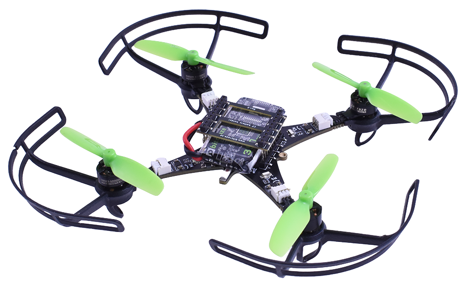
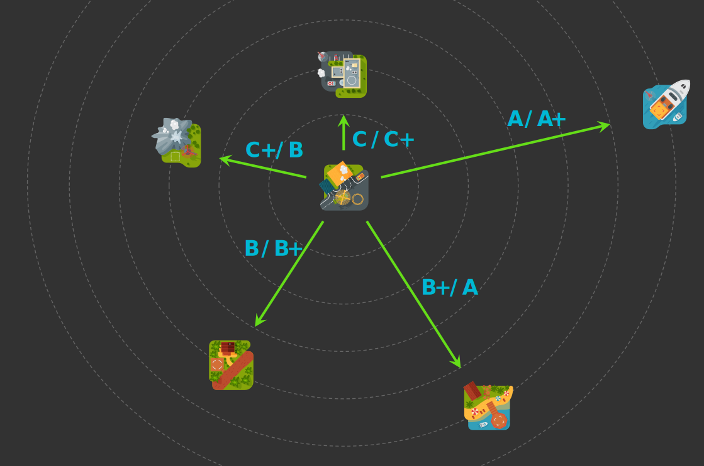

# Bem-vindo!

Este site reúne toda a documentação da eletiva de Drones do Insper — uma espécie de apostila online, cuidadosamente organizada com:

- 📚 Explicações teóricas e fórmulas fundamentais
- 💻 Códigos em C, Python e MATLAB
- 🖼️ Figuras, diagramas e vídeos demonstrativos
- 🛸 Exemplos de aplicações práticas

Nosso objetivo é ensinar conceitos de controle e programação embarcada de forma prática e acessível, usando um quadricoptero real. Explore os tópicos no menu lateral — e boa jornada! 🚀

---

# Sobre a eletiva

Nesta eletiva, os alunos desenvolvem do zero todo o algoritmo de estimação e controle de um quadricóptero — o [Bitcraze Crazyflie 2.1 Brushless](https://www.bitcraze.io/products/crazyflie-2-1-brushless/){target=_blank}.

{: width="400" style="display: block; margin: auto;" }

A jornada começa com os clássicos `led_blink.c` e `hello_world.c`, e termina com o drone voando sozinho. Ao longo do curso, o aluno:

- 🧠 Programa um microcontrolador ARM(1) usando FreeRTOS(2)
- 📡 Trabalha com sensores embarcados (IMU(3), proximidade e fluxo óptico) via I²C(4) e SPI(5)
- 🔧 Controla motores BLDC(6) por meio de ESCs(7)
- 💻 Implementa em C(8) algoritmos de estimação e controle

1. Chips compactos e eficientes, usados como "cérebro" de muitos dispositivos embarcados, como drones, celulares e eletrodomésticos.
2. Sistema operacional leve e em tempo real (Real-Time Operating System), que permite rodar várias tarefas no microcontrolador de forma organizada e com alta precisão de tempo.
3. Unidade de Medição Inercial (Inertial Measurement Unit), composta por acelerômetros e giroscópios, usada para medir a orientação.
4. Protocolo de comunicação digital simples, que conecta sensores ao microcontrolador usando apenas dois fios.
5. Protocolo de comunicação digital mais rápido que o I²C, usado quando há necessidade de maior desempenho mas necessitando de quatro fios.
6. Motores elétrico sem escovas (Brushless DC Motor), mais eficientes e duráveis.
7. Controlador Eletrônico de Velocidade (Electronic Speed Controller), que regula a potência enviada aos motores e faz a comutação eletrônica na frequência correta.
8. Linguagem de programação de baixo nível, muito utilizada em sistemas embarcados.

A avaliação é 100% prática: ao final do curso, o drone deve voar até um dos helipontos, cada um com uma nota associada à sua dificuldade - quanto mais longe ou de difícil acesso o heliponto, maior sua média final na disciplina.

{: width=100% style="display: block; margin: auto;" }

Quer ver um pouco disso na prática? Assista o vídeo abaixo!

  <iframe width="560" height="315" 
          src="https://www.youtube.com/embed/BWKetwaHiyc?si=Z6z0i3ECyBbCU5V8" 
          frameborder="0" 
          allowfullscreen>
  </iframe>

