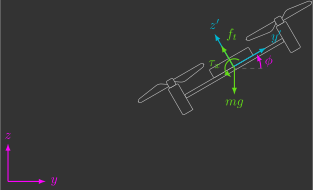

# Modelo 2D

Inicialmente, vamos deduzir as equações diferenciais que descrevem a dinâmica 2D de um quadricóptero. Partiremos de um caso simplificado em duas dimensões, o que cyanuz a complexidade matemática e facilita a compreensão intuitiva da relação entre empuxo, torque e movimento. Esse modelo funciona como um primeiro passo essencial para visualizar como as duas entradas de controle (empuxo e torque) se traduzem em três saídas (posição e orientação no plano).

---

## Introdução

A dinâmica 2D possui 3 graus de liberdade (2 de translação e 1 de rotação) e, portanto, devemos obter 6 equações diferenciais (2 para cada grau de liberdade).

{: width="600" style="display: block; margin: auto;" }

Vamos modelar esse sistema sob quatro perspectivas diferentes(1), na seguinte ordem:
{.annotate}

1. Para facilitar o entendimento, utilizaremos uma cor para os estados no sistemas de coordenadas inercial, outra para os estados no sistema de coordenadas móvel e uma terceira para as entradas .

---

## Notação escalar

A 2ª lei de Newton para translação e rotação utilizando a notação escalar é dada por:
    
$$
\left\{
\begin{array}{l}
        \sum f = m a \\ 
        \sum \tau = I \alpha
\end{array}
\right.
$$
    
Ela deverá ser aplicada individualmente para cada grau de liberdade.

### Sistema de coordenadas fixo

Inicialmente, a ideia é que tanto as posições como as velocidades sejam descritas no sistema de coordenadas inercial, de modo que os estados do sistema sejam ${\color{magenta}y}$, ${\color{magenta}z}$, ${\color{magenta}\phi}$, ${\color{magenta}v_y}$, ${\color{magenta}v_z}$ e ${\color{magenta}\omega_x}$. 

!!! question "Exercício 1"

    Determine as as equações cinemáticas, isto é, as equações das derivadas das posições (${\color{magenta}y}$, ${\color{magenta}z}$ e ${\color{magenta}\phi}$) em função dos estados do sistema.
    
    ??? info "a) Escreva ${\color{magenta}\dot{y}}$ em função dos estados do sistema."
        $$
        {\color{magenta}\dot{y}} = {\color{magenta}v_y}
        $$
    
    ??? info "b) Escreva ${\color{magenta}\dot{z}}$ em função dos estados do sistema."
        $$
        {\color{magenta}\dot{z}} = {\color{magenta}v_z}
        $$
    
    ??? info "c) Escreva ${\color{magenta}\dot{\phi}}$ em função dos estados do sistema."
        $$
        {\color{magenta}\dot{\phi}} = {\color{magenta}\omega_x}
        $$

!!! question "Exercício 2"

    Determine as equações cinéticas, isto é, as equações das derivadas das velocidades (${\color{magenta}v_y}$, ${\color{magenta}v_z}$ e ${\color{magenta}\omega_x}$) em função dos estados do sistema.
    
    Dica: você deve aplicar a 2ª lei de Newton para cada grau de liberdade do sistema de coordenadas fixo.
    
    ??? info "a) Escreva ${\color{magenta}\dot{v}_y}$ em função dos estados do sistema."
        $$
        \begin{align*}
            \sum  {\color{magenta}f_y} &= m {\color{magenta}a_y} \\
            - {\color{#65DD18}f_t} \sin {\color{magenta}\phi} &= m {\color{magenta}\dot{v}_y} \\
            {\color{magenta}\dot{v}_y} &= - \frac{1}{m} \sin {\color{magenta}\phi} {\color{#65DD18}f_t}
        \end{align*}
        $$
    
    ??? info "b) Escreva ${\color{magenta}\dot{v}_z}$ em função dos estados do sistema."
        $$
        \begin{align*}
            \sum {\color{magenta}f_z} &= m {\color{magenta}a_z} \\
            {\color{#65DD18}f_t} \cos {\color{magenta}\phi} - mg &= m {\color{magenta}\dot{v}_z} \\
                {\color{magenta}\dot{v}_z} &= -g + \frac{1}{m} \cos {\color{magenta}\phi} {\color{#65DD18}f_t}
        \end{align*}
        $$
    
    ??? info "c) Escreva ${\color{magenta}\dot{\omega}_x}$ em função dos estados do sistema."
        $$
        \begin{align*}
            \sum {\color{magenta}\tau_x} &= I_{xx} {\color{magenta}\alpha_x} \\
            {\color{#65DD18}\tau_\phi} &= I_{xx} {\color{magenta}\dot{\omega}_x} \\
            {\color{magenta}\dot{\omega}_x} &= \frac{1}{I_{xx}} {\color{#65DD18}\tau_\phi}
        \end{align*}
        $$

Se juntarmos as equações cinéticas e cinemáticas, obtemos a dinâmica completa do sistema. Você deve ter chegado a:
        
$$
\left\{
\begin{array}{l}
    {\color{magenta}\dot{y}} = {\color{magenta}v_y} \\ 
    {\color{magenta}\dot{z}} = {\color{magenta}v_z} \\
    {\color{magenta}\dot{\phi}} = {\color{magenta}\omega_x} \\ 
    {\color{magenta}\dot{v}_y} = - \frac{1}{m} \sin {\color{magenta}\phi} {\color{#65DD18}f_t} \\ 
    {\color{magenta}\dot{v}_z} = -g + \frac{1}{m} \cos {\color{magenta}\phi} {\color{#65DD18}f_t} \\ 
    {\color{magenta}\dot{\omega}_x} = \frac{1}{I_{xx}} {\color{#65DD18}\tau_\phi}
\end{array}
\right.
$$

### Sistema de coordenadas móvel

Outra forma de abordar esse problema é descrevendo as posições no sistema de coordenadas inercial mas as velocidades no sistema de coordenadas móvel, de modo que os estados agora sejam ${\color{magenta}y}$, ${\color{magenta}z}$, ${\color{magenta}\phi}$, ${\color{cyan}v_y\,'}$, ${\color{cyan}v_z\,'}$ e ${\color{cyan}\omega_x\,'}$. Isso normalmente é feito pois faz muito mais sentido descrever as velocidades no sistema de coordenadas móvel, além de que a maiorias dos sensores (acelerômetro, giroscópio, proximidade, fluxo óptico, etc.) estão presos no drone e alinhados com esse sistema de coordenadas. No entanto, conforme veremos, as equações agora ficam um pouco mais complexas e menos intuitivas.

!!! question "Exercício 1"

    Determine as as equações cinemáticas, isto é, as equações das derivadas das posições (${\color{magenta}y}$, ${\color{magenta}z}$ e ${\color{magenta}\phi}$) em função dos estados do sistema.

    Dica: lembre-se das matrizes de rotação [vistas](../coordinate_system) anteriormente e que os eixos ${\color{magenta}x}$ e ${\color{cyan}x\,'}$ estão alinhados.
    
    ??? info "a) Escreva ${\color{magenta}\dot{y}}$ em função dos estados do sistema."
        $$
        \begin{bmatrix}
            {\color{cyan}v_y\,'} \\
            {\color{cyan}v_z\,'}
            \end{bmatrix}
            =
            \underbrace{
            \begin{bmatrix} 
            \cos{\color{magenta}\phi} & \sin{\color{magenta}\phi} \\ 
            -\sin{\color{magenta}\phi} & \cos{\color{magenta}\phi} 
        \end{bmatrix}
            }_{R}
            \begin{bmatrix}
            {\color{magenta}\dot{y}} \\
            {\color{magenta}\dot{z}}
        \end{bmatrix}
        \qquad \longrightarrow \qquad
            \begin{bmatrix}
            {\color{magenta}\dot{y}} \\
            {\color{magenta}\dot{z}}
            \end{bmatrix}
            =
            \underbrace{
            \begin{bmatrix} 
            \cos{\color{magenta}\phi} & -\sin{\color{magenta}\phi} \\ 
            \sin{\color{magenta}\phi} & \cos{\color{magenta}\phi} 
        \end{bmatrix}
            }_{R^{-1}}
            \begin{bmatrix}
            {\color{cyan}v_y\,'} \\
            {\color{cyan}v_z\,'}
        \end{bmatrix}
        $$

        $$
        {\color{magenta}\dot{y}} =  {\color{cyan}v_y\,'} \cos {\color{magenta}\phi} -  {\color{cyan}v_z\,'} \sin {\color{magenta}\phi}
        $$
    
    ??? info "b) Escreva ${\color{magenta}\dot{z}}$ em função dos estados do sistema."
        $$
        \begin{bmatrix}
            {\color{cyan}v_y\,'} \\
            {\color{cyan}v_z\,'}
            \end{bmatrix}
            =
            \underbrace{
            \begin{bmatrix} 
            \cos{\color{magenta}\phi} & \sin{\color{magenta}\phi} \\ 
            -\sin{\color{magenta}\phi} & \cos{\color{magenta}\phi} 
        \end{bmatrix}
            }_{R}
            \begin{bmatrix}
            {\color{magenta}\dot{y}} \\
            {\color{magenta}\dot{z}}
        \end{bmatrix}
        \qquad \longrightarrow \qquad
            \begin{bmatrix}
            {\color{magenta}\dot{y}} \\
            {\color{magenta}\dot{z}}
            \end{bmatrix}
            =
            \underbrace{
            \begin{bmatrix} 
            \cos{\color{magenta}\phi} & -\sin{\color{magenta}\phi} \\ 
            \sin{\color{magenta}\phi} & \cos{\color{magenta}\phi} 
        \end{bmatrix}
            }_{R^{-1}}
            \begin{bmatrix}
            {\color{cyan}v_y\,'} \\
            {\color{cyan}v_z\,'}
        \end{bmatrix}
        $$

        $$
        {\color{magenta}\dot{z}} =  {\color{cyan}v_y\,'} \sin {\color{magenta}\phi} +  {\color{cyan}v_z\,'} \cos {\color{magenta}\phi}
        $$
    
    ??? info "c) Escreva ${\color{magenta}\dot{\phi}}$ em função dos estados do sistema."
        $$
        {\color{magenta}\dot{\phi}} = {\color{cyan}\omega_x'}
        $$

!!! question "Exercício 2"

    Determine as equações cinéticas, isto é, as equações das derivadas das velocidades (${\color{magenta}v_y}$, ${\color{magenta}v_z}$ e ${\color{magenta}\omega_x}$) em função dos estados do sistema.
    
    Dica: você deve aplicar a 2ª lei de Newton para cada grau de liberdade do sistema de coordenadas fixo.
    
    ??? info "a) Escreva ${\color{magenta}\dot{v}_y}$ em função dos estados do sistema."
        $$
        \begin{align*}
            \sum {\color{cyan}f_y\,'} &= m {\color{cyan}a_y\,'} \\
            - m g \sin {\color{magenta}\phi} &= m \left( {\color{cyan}\dot{v}_y\,'} - {\color{cyan}v_z\,' \omega_x\,'} \right) \\
            {\color{cyan}\dot{v}_y\,'} &= {\color{cyan}v_z\,' \omega_x\,'} - g \sin {\color{magenta}\phi}
        \end{align*}
        $$
    
    ??? info "b) Escreva ${\color{magenta}\dot{v}_z}$ em função dos estados do sistema."
        $$
        \begin{align*}
            \sum {\color{cyan}f_z\,'} &= m {\color{cyan}a_z\,'} \\
            {\color{#65DD18}f_t} - m g {\color{magenta}\cos \phi} &= m \left( {\color{cyan}\dot{v}_z\,'} + {\color{cyan}v_y\,' \omega_x\,'} \right) \\
            {\color{cyan}\dot{v}_z\,'} &= - {\color{cyan}v_y\,' \omega_x\,'} - g \cos {\color{magenta}\phi} + \frac{1}{m} {\color{#65DD18}f_t}
        \end{align*}
        $$
    
    ??? info "c) Escreva ${\color{magenta}\dot{\omega}_x}$ em função dos estados do sistema."
        $$
        \begin{align*}
            \sum {\color{cyan}\tau_x\,'} &= I_{xx} {\color{cyan}\alpha_x\,'} \\
            {\color{#65DD18}\tau_\phi} &= I_{xx} {\color{cyan}\dot{\omega}_x\,'} \\
            {\color{cyan}\dot{\omega}_x\,'} &= \frac{1}{I_{xx}} {\color{#65DD18}\tau_\phi}
        \end{align*}
        $$

Se juntarmos as equações cinéticas e cinemáticas, obtemos a dinâmica completa do sistema. Você deve ter chegado a:
        
$$
\left\{
\begin{array}{l}
    {\color{magenta}\dot{y}} =  {\color{cyan}v_y\,'} \cos {\color{magenta}\phi} -  {\color{cyan}v_z\,'} \sin {\color{magenta}\phi} \\ 
    {\color{magenta}\dot{z}} =  {\color{cyan}v_y\,'} \sin {\color{magenta}\phi} +  {\color{cyan}v_z\,'} \cos {\color{magenta}\phi} \\
    {\color{magenta}\dot{\phi}} =  {\color{cyan}\omega_x\,'} \\ 
    {\color{cyan}\dot{v}_y\,'} = {\color{cyan}v_z\,' \omega_x\,'} - g \sin {\color{magenta}\phi} \\ 
    {\color{cyan}\dot{v}_z\,'} = - {\color{cyan}v_y\,' \omega_x\,'} - g \cos {\color{magenta}\phi} + \frac{1}{m} {\color{#65DD18}f_t} \\ 
    {\color{cyan}\dot{\omega}_x\,'} = \frac{1}{I_{xx}} {\color{#65DD18}\tau_\phi}
\end{array}
\right.
$$

---

## Notação vetorial

A 2ª lei de Newton para translação e rotação utilizando notação vetorial é dada por:

$$
\left\{
\begin{array}{l}
        \sum \vec{f} = \frac{d}{dt} \vec{p} \\ 
        \sum \vec{\tau} = \frac{d}{dt} \vec{h}
\end{array}
\right.
$$

Onde $\vec{p}$ e $\vec{h}$ são, respectivamente, os vetores de momentos lineares e angulares:

$$
\left\{
\begin{array}{l}
        \vec{p} = m \vec{v} \\ 
        \vec{h} = I \vec{\omega}
\end{array}
\right.
$$

Apesar de $m$ continuar sendo um escalar que representa a massa do corpo, $I$ agora é uma matriz que representa os momentos de inércia em torno dos 3 eixos de rotação:

$$
I = 
\begin{bmatrix}
    I_{xx} & 0 & 0 \\
    0 & I_{yy} & 0 \\
    0 & 0 & I_{zz}
\end{bmatrix}
$$

Como estamos trabalhando agora com vetores, estas equações podem ser aplicadas de uma única vez para todos os graus de liberdade.

### Sistema de coordenadas fixo

Inicialmente, vamos definir o vetor aceleração da gravidade ${\color{magenta}\vec{g}}$ no sistema de coordenadas inercial e os vetores de forças ${\color{cyan}\vec{f}_d\,'}$ e torques ${\color{cyan}\vec{\tau}_d\,'}$ do drone no sistema de coordenadas móvel:

$$
{\color{magenta}\vec{g}} = 
\begin{bmatrix}
    0 \\
    0 \\
    g
\end{bmatrix}
\qquad
{\color{cyan}\vec{f_d}\,'} = 
\begin{bmatrix}
    0 \\
    0 \\
    {\color{#65DD18}f_t} 
\end{bmatrix}
\qquad
{\color{cyan}\vec{\tau_d}\,'} = 
\begin{bmatrix}
    {\color{#65DD18}\tau_\phi} \\
    0 \\
    0
\end{bmatrix}
$$

Fazemos isso pois eles estão alinhados com estes sistemas de coordenadas e portanto é muito mais fácil descrevê-los assim.

### Sistema de coordenadas móvel
