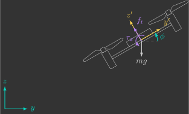
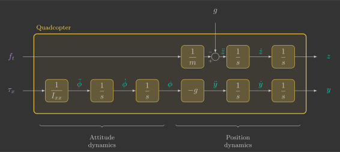

# :material-video-2d: Modelo 2D

Inicialmente, vamos deduzir as equações diferenciais que descrevem a dinâmica 2D de um quadricóptero. Partiremos de um caso simplificado em duas dimensões, o que reduz a complexidade matemática e facilita uma compreensão mais intuitiva. Esse modelo funciona como um primeiro passo essencial para visualizar como as entradas influenciam as saídas.

---

## Introdução

A dinâmica 2D possui 3 graus de liberdade (2 de translação e 1 de rotação) e, portanto, devemos obter 6 equações diferenciais (2 para cada grau de liberdade)(1).
{.annotate}

1. Para facilitar o entendimento, utilizaremos as seguintes cores e notações:
    - ${\color{var(--c1)} x}$ - Estados (sistema de coordenadas inercial)
    - ${\color{var(--c3)} x\,'}$ - Estados (sistema de coordenadas móvel)
    - ${\color{var(--c2)} u}$ - Entradas
    - $m$ - Constantes

{: width="600" style="display: block; margin: auto;" }

Vamos modelar esse sistema sob quatro perspectivas diferentes, na seguinte ordem:

<table class="rotacoes">
  <thead>
    <tr>
      <th>Ordem</th>
      <th>Notação</th>
      <th>Posições</th>
      <th>Velocidades</th>
    </tr>
  </thead>
  <tbody>
    <tr>
      <td>1</td>
      <td rowspan="2">Escalar</td>
      <td>\( y \quad z \quad \phi \)</td>
      <td>\( v_y \quad v_z \quad \omega_x \)</td>
    </tr>
    <tr>
      <td>2</td>
      <td>\( y \quad z \quad \phi \)</td>
      <td>\( v^{'}_y \quad v^{'}_z \quad \omega^{'}_x \)</td>
    </tr>
    <tr>
      <td>3</td>
      <td rowspan="2">Vetorial</td>
      <td>\( y \quad z \quad \phi \)</td>
      <td>\( v_y \quad v_z \quad \omega_x \)</td>
    </tr>
    <tr>
      <td>4</td>
      <td>\( y \quad z \quad \phi \)</td>
      <td>\( v^{'}_y \quad v^{'}_z \quad \omega^{'}_x \)</td>
    </tr>
  </tbody>
</table>

Apesar de ir ficando cada vez mais complicado, quando passarmos para a dinâmica 3D, a quarta (e última) perspectiva acaba sendo a mais simples.

---

## Notação escalar

A 2ª lei de Newton para translação e rotação, utilizando a notação escalar, é dada por:
    
$$
\left\{
\begin{array}{l}
        \sum f = m a \\ 
        \sum \tau = I \alpha
\end{array}
\right.
$$
    
Ela deverá ser aplicada individualmente para cada grau de liberdade.

### Sistema inercial

Inicialmente, a ideia é que tanto as posições como as velocidades sejam descritas no sistema de coordenadas inercial, de modo que os estados do sistema sejam ${\color{var(--c1)}y}$, ${\color{var(--c1)}z}$, ${\color{var(--c1)}\phi}$, ${\color{var(--c1)}v_y}$, ${\color{var(--c1)}v_z}$ e ${\color{var(--c1)}\omega_x}$. 

!!! question "Exercício 1"

    Determine as equações cinemáticas, isto é, as equações das derivadas das posições (${\color{var(--c1)}y}$, ${\color{var(--c1)}z}$ e ${\color{var(--c1)}\phi}$) em função dos estados do sistema.
    
    ??? info "a) Escreva ${\color{var(--c1)}\dot{y}}$ em função dos estados do sistema."
        $$
        {\color{var(--c1)}\dot{y}} = {\color{var(--c1)}v_y}
        $$
    
    ??? info "b) Escreva ${\color{var(--c1)}\dot{z}}$ em função dos estados do sistema."
        $$
        {\color{var(--c1)}\dot{z}} = {\color{var(--c1)}v_z}
        $$
    
    ??? info "c) Escreva ${\color{var(--c1)}\dot{\phi}}$ em função dos estados do sistema."
        $$
        {\color{var(--c1)}\dot{\phi}} = {\color{var(--c1)}\omega_x}
        $$

!!! question "Exercício 2"

    Determine as equações cinéticas, isto é, as equações das derivadas das velocidades (${\color{var(--c1)}v_y}$, ${\color{var(--c1)}v_z}$ e ${\color{var(--c1)}\omega_x}$) em função dos estados do sistema.
    
    Dica: você deve aplicar a 2ª lei de Newton para cada grau de liberdade do sistema de coordenadas inercial.
    
    ??? info "a) Escreva ${\color{var(--c1)}\dot{v}_y}$ em função dos estados do sistema."
        $$
        \begin{align*}
            \sum  {\color{var(--c1)}f_y} &= m {\color{var(--c1)}a_y} \\
            - {\color{var(--c2)}f_t} \sin {\color{var(--c1)}\phi} &= m {\color{var(--c1)}\dot{v}_y} \\
            {\color{var(--c1)}\dot{v}_y} &= - \frac{1}{m} \sin {\color{var(--c1)}\phi} {\color{var(--c2)}f_t}
        \end{align*}
        $$
    
    ??? info "b) Escreva ${\color{var(--c1)}\dot{v}_z}$ em função dos estados do sistema."
        $$
        \begin{align*}
            \sum {\color{var(--c1)}f_z} &= m {\color{var(--c1)}a_z} \\
            {\color{var(--c2)}f_t} \cos {\color{var(--c1)}\phi} - mg &= m {\color{var(--c1)}\dot{v}_z} \\
                {\color{var(--c1)}\dot{v}_z} &= -g + \frac{1}{m} \cos {\color{var(--c1)}\phi} {\color{var(--c2)}f_t}
        \end{align*}
        $$
    
    ??? info "c) Escreva ${\color{var(--c1)}\dot{\omega}_x}$ em função dos estados do sistema."
        $$
        \begin{align*}
            \sum {\color{var(--c1)}\tau_x} &= I_{xx} {\color{var(--c1)}\alpha_x} \\
            {\color{var(--c2)}\tau_x} &= I_{xx} {\color{var(--c1)}\dot{\omega}_x} \\
            {\color{var(--c1)}\dot{\omega}_x} &= \frac{1}{I_{xx}} {\color{var(--c2)}\tau_x}
        \end{align*}
        $$

Se juntarmos as equações cinéticas e cinemáticas, obtemos a dinâmica completa do sistema:
        
$$
\left\{
\begin{array}{l}
    {\color{var(--c1)}\dot{y}} = {\color{var(--c1)}v_y} \\ 
    {\color{var(--c1)}\dot{z}} = {\color{var(--c1)}v_z} \\
    {\color{var(--c1)}\dot{\phi}} = {\color{var(--c1)}\omega_x} \\ 
    {\color{var(--c1)}\dot{v}_y} = - \frac{1}{m} \sin {\color{var(--c1)}\phi} {\color{var(--c2)}f_t} \\ 
    {\color{var(--c1)}\dot{v}_z} = -g + \frac{1}{m} \cos {\color{var(--c1)}\phi} {\color{var(--c2)}f_t} \\ 
    {\color{var(--c1)}\dot{\omega}_x} = \frac{1}{I_{xx}} {\color{var(--c2)}\tau_x}
\end{array}
\right.
$$

### Sistema móvel

Outra forma de abordar esse problema é descrevendo as posições no sistema de coordenadas inercial mas as velocidades no sistema de coordenadas móvel, de modo que os estados agora sejam ${\color{var(--c1)}y}$, ${\color{var(--c1)}z}$, ${\color{var(--c1)}\phi}$, ${\color{var(--c3)}v_y\,'}$, ${\color{var(--c3)}v_z\,'}$ e ${\color{var(--c3)}\omega_x\,'}$. 

Isso normalmente é feito pois faz muito mais sentido descrever as velocidades no sistema de coordenadas fixo no drone, além de que a maioria dos sensores (acelerômetro, giroscópio, proximidade, fluxo óptico, etc.) estão presos nele e alinhados com esse sistema de coordenadas. No entanto, conforme veremos, as equações agora ficam um pouco mais complexas e menos intuitivas.

!!! question "Exercício 3"

    Determine as equações cinemáticas, isto é, as equações das derivadas das posições (${\color{var(--c1)}y}$, ${\color{var(--c1)}z}$ e ${\color{var(--c1)}\phi}$) em função dos estados do sistema.

    Dica: lembre-se das matrizes de rotação [vistas](../coordinate_system) anteriormente e que os eixos ${\color{var(--c1)}x}$ e ${\color{var(--c3)}x\,'}$ estão alinhados.
    
    ??? info "a) Escreva ${\color{var(--c1)}\dot{y}}$ em função dos estados do sistema."
        $$
        \begin{bmatrix}
            {\color{var(--c3)}v_y\,'} \\
            {\color{var(--c3)}v_z\,'}
            \end{bmatrix}
            =
            \underbrace{
            \begin{bmatrix} 
            \cos{\color{var(--c1)}\phi} & \sin{\color{var(--c1)}\phi} \\ 
            -\sin{\color{var(--c1)}\phi} & \cos{\color{var(--c1)}\phi} 
        \end{bmatrix}
            }_{R}
            \begin{bmatrix}
            {\color{var(--c1)}\dot{y}} \\
            {\color{var(--c1)}\dot{z}}
        \end{bmatrix}
        \qquad \longrightarrow \qquad
            \begin{bmatrix}
            {\color{var(--c1)}\dot{y}} \\
            {\color{var(--c1)}\dot{z}}
            \end{bmatrix}
            =
            \underbrace{
            \begin{bmatrix} 
            \cos{\color{var(--c1)}\phi} & -\sin{\color{var(--c1)}\phi} \\ 
            \sin{\color{var(--c1)}\phi} & \cos{\color{var(--c1)}\phi} 
        \end{bmatrix}
            }_{R^{-1}}
            \begin{bmatrix}
            {\color{var(--c3)}v_y\,'} \\
            {\color{var(--c3)}v_z\,'}
        \end{bmatrix}
        $$

        $$
        {\color{var(--c1)}\dot{y}} =  {\color{var(--c3)}v_y\,'} \cos {\color{var(--c1)}\phi} -  {\color{var(--c3)}v_z\,'} \sin {\color{var(--c1)}\phi}
        $$
    
    ??? info "b) Escreva ${\color{var(--c1)}\dot{z}}$ em função dos estados do sistema."
        $$
        \begin{bmatrix}
            {\color{var(--c3)}v_y\,'} \\
            {\color{var(--c3)}v_z\,'}
            \end{bmatrix}
            =
            \underbrace{
            \begin{bmatrix} 
            \cos{\color{var(--c1)}\phi} & \sin{\color{var(--c1)}\phi} \\ 
            -\sin{\color{var(--c1)}\phi} & \cos{\color{var(--c1)}\phi} 
        \end{bmatrix}
            }_{R}
            \begin{bmatrix}
            {\color{var(--c1)}\dot{y}} \\
            {\color{var(--c1)}\dot{z}}
        \end{bmatrix}
        \qquad \longrightarrow \qquad
            \begin{bmatrix}
            {\color{var(--c1)}\dot{y}} \\
            {\color{var(--c1)}\dot{z}}
            \end{bmatrix}
            =
            \underbrace{
            \begin{bmatrix} 
            \cos{\color{var(--c1)}\phi} & -\sin{\color{var(--c1)}\phi} \\ 
            \sin{\color{var(--c1)}\phi} & \cos{\color{var(--c1)}\phi} 
        \end{bmatrix}
            }_{R^{-1}}
            \begin{bmatrix}
            {\color{var(--c3)}v_y\,'} \\
            {\color{var(--c3)}v_z\,'}
        \end{bmatrix}
        $$

        $$
        {\color{var(--c1)}\dot{z}} =  {\color{var(--c3)}v_y\,'} \sin {\color{var(--c1)}\phi} +  {\color{var(--c3)}v_z\,'} \cos {\color{var(--c1)}\phi}
        $$
    
    ??? info "c) Escreva ${\color{var(--c1)}\dot{\phi}}$ em função dos estados do sistema."
        $$
        {\color{var(--c1)}\dot{\phi}} = {\color{var(--c3)}\omega_x\,'}
        $$

!!! question "Exercício 4"

    Determine as equações cinéticas, isto é, as equações das derivadas das velocidades (${\color{var(--c3)}v_y\,'}$, ${\color{var(--c3)}v_z\,'}$ e ${\color{var(--c3)}\omega_x\,'}$) em função dos estados do sistema.
    
    Dica: você deve aplicar a 2ª lei de Newton para cada grau de liberdade do sistema de coordenadas inercial.
    
    ??? info "a) Escreva ${\color{var(--c3)}\dot{v}_y\,'}$ em função dos estados do sistema."
        $$
        \begin{align*}
            \sum {\color{var(--c3)}f_y\,'} &= m {\color{var(--c3)}a_y\,'} \\
            - m g \sin {\color{var(--c1)}\phi} &= m \left( {\color{var(--c3)}\dot{v}_y\,'} - {\color{var(--c3)}v_z\,' \omega_x\,'} \right) \\
            {\color{var(--c3)}\dot{v}_y\,'} &= {\color{var(--c3)}v_z\,' \omega_x\,'} - g \sin {\color{var(--c1)}\phi}
        \end{align*}
        $$
    
    ??? info "b) Escreva ${\color{var(--c3)}\dot{v}_z\,'}$ em função dos estados do sistema."
        $$
        \begin{align*}
            \sum {\color{var(--c3)}f_z\,'} &= m {\color{var(--c3)}a_z\,'} \\
            {\color{var(--c2)}f_t} - m g {\color{var(--c1)}\cos \phi} &= m \left( {\color{var(--c3)}\dot{v}_z\,'} + {\color{var(--c3)}v_y\,' \omega_x\,'} \right) \\
            {\color{var(--c3)}\dot{v}_z\,'} &= - {\color{var(--c3)}v_y\,' \omega_x\,'} - g \cos {\color{var(--c1)}\phi} + \frac{1}{m} {\color{var(--c2)}f_t}
        \end{align*}
        $$
    
    ??? info "c) Escreva ${\color{var(--c3)}\dot{\omega}_x\,'}$ em função dos estados do sistema."
        $$
        \begin{align*}
            \sum {\color{var(--c3)}\tau_x\,'} &= I_{xx} {\color{var(--c3)}\alpha_x\,'} \\
            {\color{var(--c2)}\tau_x} &= I_{xx} {\color{var(--c3)}\dot{\omega}_x\,'} \\
            {\color{var(--c3)}\dot{\omega}_x\,'} &= \frac{1}{I_{xx}} {\color{var(--c2)}\tau_x}
        \end{align*}
        $$

Se juntarmos as equações cinéticas e cinemáticas, obtemos a dinâmica completa do sistema:
        
$$
\left\{
\begin{array}{l}
    {\color{var(--c1)}\dot{y}} =  {\color{var(--c3)}v_y\,'} \cos {\color{var(--c1)}\phi} -  {\color{var(--c3)}v_z\,'} \sin {\color{var(--c1)}\phi} \\ 
    {\color{var(--c1)}\dot{z}} =  {\color{var(--c3)}v_y\,'} \sin {\color{var(--c1)}\phi} +  {\color{var(--c3)}v_z\,'} \cos {\color{var(--c1)}\phi} \\
    {\color{var(--c1)}\dot{\phi}} =  {\color{var(--c3)}\omega_x\,'} \\ 
    {\color{var(--c3)}\dot{v}_y\,'} = {\color{var(--c3)}v_z\,' \omega_x\,'} - g \sin {\color{var(--c1)}\phi} \\ 
    {\color{var(--c3)}\dot{v}_z\,'} = - {\color{var(--c3)}v_y\,' \omega_x\,'} - g \cos {\color{var(--c1)}\phi} + \frac{1}{m} {\color{var(--c2)}f_t} \\ 
    {\color{var(--c3)}\dot{\omega}_x\,'} = \frac{1}{I_{xx}} {\color{var(--c2)}\tau_x}
\end{array}
\right.
$$

Os termos ${\color{var(--c3)}v_z\,' \omega_x\,'}$ e ${\color{var(--c3)}v_y\,' \omega_x\,'}$ correspondem às pseudo-acelerações centrífugas, que surgem ao descrever o movimento no referencial não inercial do drone (sistema de coordenadas móvel).

---

## Notação vetorial

A 2ª lei de Newton para translação e rotação utilizando notação vetorial é dada por:

$$
\left\{
\begin{array}{l}
        \sum \vec{f} = \frac{d}{dt} \vec{p} \\ 
        \sum \vec{\tau} = \frac{d}{dt} \vec{h}
\end{array}
\right.
$$

Onde $\vec{p}$ e $\vec{h}$ são, respectivamente, os vetores de momentos lineares e angulares:

$$
\left\{
\begin{array}{l}
        \vec{p} = m \vec{v} \\ 
        \vec{h} = I \vec{\omega}
\end{array}
\right.
$$

Apesar de $m$ continuar sendo um escalar que representa a massa do corpo, $I$ agora é uma matriz que representa os momentos de inércia em torno dos 3 eixos de rotação:

$$
I = 
\begin{bmatrix}
    I_{xx} & 0 & 0 \\
    0 & I_{yy} & 0 \\
    0 & 0 & I_{zz}
\end{bmatrix}
$$

Como estamos trabalhando agora com vetores, estas equações podem ser aplicadas de uma única vez para todos os graus de liberdade.

### Sistema inercial

Inicialmente, vamos definir o vetor aceleração da gravidade ${\color{var(--c1)}\vec{g}}$ no sistema de coordenadas inercial e os vetores de forças ${\color{var(--c3)}\vec{f}_d\,'}$ e torques ${\color{var(--c3)}\vec{\tau}_d\,'}$ do drone no sistema de coordenadas móvel:

$$
{\color{var(--c1)}\vec{g}} = 
\begin{bmatrix}
    0 \\
    0 \\
    g
\end{bmatrix}
\qquad
{\color{var(--c3)}\vec{f_d}\,'} = 
\begin{bmatrix}
    0 \\
    0 \\
    {\color{var(--c2)}f_t} 
\end{bmatrix}
\qquad
{\color{var(--c3)}\vec{\tau_d}\,'} = 
\begin{bmatrix}
    {\color{var(--c2)}\tau_x} \\
    0 \\
    0
\end{bmatrix}
$$

Fazemos isso pois eles estão alinhados com estes sistemas de coordenadas e portanto é muito mais fácil descrevê-los assim.

!!! question "Exercício 5"

!!! question "Exercício 6"

    Determine as equações cinéticas vetoriais, isto é, as equações das derivadas dos vetores de velocidades (${\color{var(--c1)}\vec{v}}$ e ${\color{var(--c1)}\vec{\omega}}$) em função das somatórias de forças e torques.
    
    ??? info "a) Escreva ${\color{var(--c1)}\dot{\vec{v}}}$ em função de $\sum{\color{var(--c1)}\vec{f}}$."
        $$
        \begin{align*}
            \sum {\color{var(--c1)}\vec{f}} &= \frac{d}{dt} {\color{var(--c1)}\vec{p}} \\
            \sum {\color{var(--c1)}\vec{f}} &= \frac{d}{dt} \left( m {\color{var(--c1)}\vec{v}} \right) \\
            \sum {\color{var(--c1)}\vec{f}} &= m {\color{var(--c1)}\dot{\vec{v}}} \\
            {\color{var(--c1)}\dot{\vec{v}}} &= \frac{1}{m} \sum {\color{var(--c1)}\vec{f}}
        \end{align*}
        $$
    
    ??? info "b) Escreva ${\color{var(--c1)}\dot{\vec{\omega}}}$ em função de $\sum{\color{var(--c1)}\vec{\tau}}$."
        $$
        \begin{align*}
            \sum {\color{var(--c1)}\vec{\tau}} &= \frac{d}{dt} {\color{var(--c1)}\vec{h}} \\
            \sum {\color{var(--c1)}\vec{\tau}} &= \frac{d}{dt} \left( I {\color{var(--c1)}\vec{\omega}} \right) \\
            \sum {\color{var(--c1)}\vec{\tau}} &= I {\color{var(--c1)}\dot{\vec{\omega}}} \\
            {\color{var(--c1)}\dot{\vec{\omega}}} &= I^{-1} \sum {\color{var(--c1)}\vec{\tau}}
        \end{align*}
        $$

Você deve ter chegado a:
                
$$
    \left\{
    \begin{array}{l}
            {\color{var(--c1)}\dot{\vec{v}}} = \frac{1}{m} \sum {\color{var(--c1)}\vec{f}} \\ 
            {\color{var(--c1)}\dot{\vec{\omega}}} = I^{-1} \sum {\color{var(--c1)}\vec{\tau}}
    \end{array}
    \right.
$$

Essas equações são genéricas, ou seja, valem pro movimento de translação e rotação de qualquer corpo rígido, basta substituir o valor das somatórias de forças e torques.

!!! question "Exercício 7"

    Substitua as somatórias de forças e torques definidos inicialmente e determine as equações cinéticas.
        
    Dica: cuidado com os sistemas de coordenadas em que eles estão descritos.
    
    ??? info "a) Escreva ${\color{var(--c1)}\dot{\vec{v}}}$ em função dos estados do sistema."
        $$
        \begin{align*}
            {\color{var(--c1)}\dot{\vec{v}}} &= \frac{1}{m} \sum {\color{var(--c1)}\vec{f}} \\
            {\color{var(--c1)}\dot{\vec{v}}} &= \frac{1}{m} \left( - m {\color{var(--c1)}\vec{g}} + {\color{var(--c1)}\vec{f}_t} \right) \\
            {\color{var(--c1)}\dot{\vec{v}}} &= - {\color{var(--c1)}\vec{g}} + \frac{1}{m} {\color{var(--c1)}\vec{f}_t} \\
            {\color{var(--c1)}\dot{\vec{v}}} &= - {\color{var(--c1)}\vec{g}} + \frac{1}{m} R^T {\color{var(--c3)}\vec{f}_t\,'} \\
            \begin{bmatrix}
                0 \\
                {\color{var(--c1)}\dot{v}_y} \\
                {\color{var(--c1)}\dot{v}_z}
            \end{bmatrix}
            &= -
            \begin{bmatrix}
                0 \\
                0 \\
                g
            \end{bmatrix} 
            + \frac{1}{m}
            \begin{bmatrix}
                1 & 0 & 0 \\
                0 & \cos{\color{var(--c1)}\phi} & -\sin{\color{var(--c1)}\phi} \\
                0 & \sin{\color{var(--c1)}\phi} & \cos{\color{var(--c1)}\phi}
            \end{bmatrix}
            \begin{bmatrix}
                0 \\
                0 \\
                {\color{var(--c2)}f_t}
            \end{bmatrix} \\
            \begin{bmatrix}
                0 \\
                {\color{var(--c1)}\dot{v}_y} \\
                {\color{var(--c1)}\dot{v}_z}
            \end{bmatrix}
            &=
            \begin{bmatrix}
                0 \\
                - \frac{1}{m} \sin{\color{var(--c1)}\phi} {\color{var(--c2)}f_t} \\
                - g + \frac{1}{m} \cos{\color{var(--c1)}\phi} {\color{var(--c2)}f_t}
            \end{bmatrix} 
        \end{align*}  
        $$
    
    ??? info "b) Escreva ${\color{var(--c1)}\dot{\vec{\omega}}}$ em função dos estados do sistema."
        $$
        \begin{align*}
            {\color{var(--c1)}\dot{\vec{\omega}}} &= I^{-1} \sum {\color{var(--c1)}\vec{\tau}} \\
            {\color{var(--c1)}\dot{\vec{\omega}}} &= I^{-1} {\color{var(--c1)}\vec{\tau}_x} \\
            \begin{bmatrix}
                {\color{var(--c1)}\dot{\omega}_x} \\
                0 \\
                0
            \end{bmatrix}
            &= 
            \begin{bmatrix}
                I_{xx} & 0 & 0 \\
                0 & I_{yy} & 0 \\
                0 & 0 & I_{zz}
            \end{bmatrix}^{-1}
            \begin{bmatrix}
                {\color{var(--c2)}\tau_x} \\
                0 \\
                0
            \end{bmatrix} \\
            \begin{bmatrix}
                {\color{var(--c1)}\dot{\omega}_x} \\
                0 \\
                0
            \end{bmatrix}
            &= 
            \begin{bmatrix}
                \frac{1}{I_{xx}} & 0 & 0 \\
                0 & \frac{1}{I_{yy}} & 0 \\
                0 & 0 & \frac{1}{I_{zz}}
            \end{bmatrix}
            \begin{bmatrix}
                {\color{var(--c2)}\tau_x} \\
                0 \\
                0
            \end{bmatrix} \\
            \begin{bmatrix}
                {\color{var(--c1)}\dot{\omega}_x} \\
                0 \\
                0
            \end{bmatrix}
            &= 
            \begin{bmatrix}
                \frac{1}{I_{xx}} {\color{var(--c2)}\tau_x} \\
                0 \\
                0
            \end{bmatrix}
        \end{align*}
        $$

Se juntarmos as equações cinéticas e cinemáticas, obtemos a dinâmica completa do sistema:
        
$$
\left\{
\begin{array}{l}
    {\color{var(--c1)}\dot{y}} = {\color{var(--c1)}v_y} \\ 
    {\color{var(--c1)}\dot{z}} = {\color{var(--c1)}v_z} \\
    {\color{var(--c1)}\dot{\phi}} = {\color{var(--c1)}\omega_x} \\ 
    {\color{var(--c1)}\dot{v}_y} = - \frac{1}{m} \sin {\color{var(--c1)}\phi} {\color{var(--c2)}f_t} \\ 
    {\color{var(--c1)}\dot{v}_z} = -g + \frac{1}{m} \cos {\color{var(--c1)}\phi} {\color{var(--c2)}f_t} \\ 
    {\color{var(--c1)}\dot{\omega}_x} = \frac{1}{I_{xx}} {\color{var(--c2)}\tau_x}
\end{array}
\right.
$$

Note que as equações acima são exatamente iguais às obtidas utilizando a notação escalar. 

### Sistema móvel

Não podemos aplicar a 2ª lei de Newton no sistema de coordenadas móvel pois ele não é um sistema de coordenadas inercial(1):
{.annotate}

1. Que não acelera ou rotaciona.
    
$$
\xcancel{
\left\{
\begin{array}{l}
        \sum {\color{var(--c3)}\vec{f}\,'} = \frac{d}{dt} {\color{var(--c3)}\vec{p}\,'} \\ 
        \sum {\color{var(--c3)}\vec{\tau}\,'} = \frac{d}{dt} {\color{var(--c3)}\vec{h}\,'}
\end{array}
\right.
}
$$

No entanto, é possível aplicar ela no sistema de coordenadas inercial e efetuar algumas transformações para o sistema de coordenadas móvel.

!!! question "Exercício 8"

!!! question "Exercício 9"

    Determine as equações cinéticas vetoriais, isto é, as equações das derivadas dos vetores de velocidades (${\color{var(--c3)}\dot{\vec{v}}\,'}$ e ${\color{var(--c3)}\dot{\vec{\omega}}\,'}$) em função das somatórias de forças e torques(1).
    {.annotate}

    1. O produto vetorial ${\color{var(--c3)}\vec{\omega}\,'} \times$:

        $$
        \begin{align}
            {\color{var(--c3)}\vec{\omega}\,'} \times \vec{v} &= 
            \begin{bmatrix}
            {\color{var(--c3)}\omega_x\,'} \\
            0 \\
            0
            \end{bmatrix} 
            \times
            \begin{bmatrix}
            v_1 \\
            v_2 \\
            v_3
            \end{bmatrix} \\
            {\color{var(--c3)}\vec{\omega}\,'} \times \vec{v} &= 
            \begin{bmatrix}
            0 \\
            - {\color{var(--c3)}\omega_x\,'} v_3 \\
            {\color{var(--c3)}\omega_x\,'} v_2 
            \end{bmatrix}
        \end{align}
        $$

        Também pode ser representado pelo produto de uma matriz anti-simétrica ${\color{var(--c3)}\tilde{\omega}\,'}$:

        $$
        \begin{align}
            {\color{var(--c3)}\tilde{\omega}\,'} \vec{v} &= 
            \begin{bmatrix}
                0 & 0 & 0 \\
                0 & 0 & -{\color{var(--c3)}\omega_x\,'} \\
                0 & {\color{var(--c3)}\omega_x\,'} & 0
            \end{bmatrix}  
            \begin{bmatrix}
            v_1 \\
            v_2 \\
            v_3
            \end{bmatrix} \\
            {\color{var(--c3)}\tilde{\omega}\,'} \vec{v} &= 
            \begin{bmatrix}
            0 \\
            - {\color{var(--c3)}\omega_x\,'} v_3 \\
            {\color{var(--c3)}\omega_x\,'} v_2 
            \end{bmatrix}
        \end{align}
        $$

        Se expandirmos o termo $R \dot{R}^T$:

        $$
        \begin{align}
            R \dot{R}^T &= 
            \begin{bmatrix}
                1 & 0 & 0 \\
                0 & \cos{\color{var(--c1)}\phi} & \sin{\color{var(--c1)}\phi} \\
                0 & -\sin{\color{var(--c1)}\phi} & \cos{\color{var(--c1)}\phi}
            \end{bmatrix}   
            {
            \left(
            \frac{d}{dt}
            \begin{bmatrix}
                1 & 0 & 0 \\
                0 & \cos{\color{var(--c1)}\phi} & \sin{\color{var(--c1)}\phi} \\
                0 & -\sin{\color{var(--c1)}\phi} & \cos{\color{var(--c1)}\phi}
            \end{bmatrix} 
            \right)
            }^{T} \\
            R \dot{R}^T &= 
            \begin{bmatrix}
                1 & 0 & 0 \\
                0 & \cos{\color{var(--c1)}\phi} & \sin{\color{var(--c1)}\phi} \\
                0 & -\sin{\color{var(--c1)}\phi} & \cos{\color{var(--c1)}\phi}
            \end{bmatrix}   
            {
            \begin{bmatrix}
                0 & 0 & 0 \\
                0 & -\sin{\color{var(--c1)}\phi}{\color{var(--c3)}\omega_x\,'} & \cos{\color{var(--c1)}\phi}{\color{var(--c3)}\omega_x\,'} \\
                0 & -\cos{\color{var(--c1)}\phi}{\color{var(--c3)}\omega_x\,'} & -\sin{\color{var(--c1)}\phi}{\color{var(--c3)}\omega_x\,'}
            \end{bmatrix} 
            }^{T} \\
            R \dot{R}^T &= 
            \begin{bmatrix}
                1 & 0 & 0 \\
                0 & \cos{\color{var(--c1)}\phi} & \sin{\color{var(--c1)}\phi} \\
                0 & -\sin{\color{var(--c1)}\phi} & \cos{\color{var(--c1)}\phi}
            \end{bmatrix}   
            \begin{bmatrix}
                0 & 0 & 0 \\
                0 & -\sin{\color{var(--c1)}\phi}{\color{var(--c3)}\omega_x\,'} & -\cos{\color{var(--c1)}\phi}{\color{var(--c3)}\omega_x\,'} \\
                0 & \cos{\color{var(--c1)}\phi}{\color{var(--c3)}\omega_x\,'} & -\sin{\color{var(--c1)}\phi}{\color{var(--c3)}\omega_x\,'}
            \end{bmatrix} \\
            R \dot{R}^T &= 
            \begin{bmatrix}
                0 & 0 & 0 \\
                0 & -\cancel{\cos{\color{var(--c1)}\phi}\sin{\color{var(--c1)}\phi}{\color{var(--c3)}\omega_x\,'}} + \cancel{\sin{\color{var(--c1)}\phi}\cos{\color{var(--c1)}\phi}{\color{var(--c3)}\omega_x\,'}} & -\cos^2{\color{var(--c1)}\phi}{\color{var(--c3)}\omega_x\,'} -\sin^2{\color{var(--c1)}\phi}{\color{var(--c3)}\omega_x\,'}\\
                0 & \sin^2{\color{var(--c1)}\phi}{\color{var(--c3)}\omega_x\,'} + \cos^2{\color{var(--c1)}\phi}{\color{var(--c3)}\omega_x\,'} & \cancel{\sin{\color{var(--c1)}\phi}\cos{\color{var(--c1)}\phi}{\color{var(--c3)}\omega_x\,'}} - \cancel{\cos{\color{var(--c1)}\phi}\sin{\color{var(--c1)}\phi}{\color{var(--c3)}\omega_x\,'}}
            \end{bmatrix}  \\
            R \dot{R}^T &= 
            \begin{bmatrix}
                0 & 0 & 0 \\
                0 & 0 & -{\color{var(--c3)}\omega_x\,'} \cancelto{1}{\left(\cos^2{\color{var(--c1)}\phi} + \sin^2{\color{var(--c1)}\phi} \right)} \\
                0 & {\color{var(--c3)}\omega_x\,'} \cancelto{1}{\left(\sin^2{\color{var(--c1)}\phi} + \cos^2{\color{var(--c1)}\phi} \right)} & 0
            \end{bmatrix} \\
            R \dot{R}^T &= 
            \begin{bmatrix}
                0 & 0 & 0 \\
                0 & 0 & -{\color{var(--c3)}\omega_x\,'} \\
                0 & {\color{var(--c3)}\omega_x\,'} & 0
            \end{bmatrix} 
        \end{align}
        $$

        Concluimos que $R \dot{R}^T = {\color{var(--c3)}\vec{\omega}\,'} \times$.
    
    ??? info "a) Escreva ${\color{var(--c3)}\dot{\vec{v}}\,'}$ em função de $\sum{\color{var(--c3)}\vec{f}\,'}$."
        $$
        \begin{align*}
            \sum {\color{var(--c1)}\vec{f}} &= \frac{d}{dt} {\color{var(--c1)}\vec{p}} \\
            \sum {\color{var(--c1)}\vec{f}} &= \frac{d}{dt} \left( R^T {\color{var(--c3)}\vec{p}\,'} \right) \\
            \sum {\color{var(--c1)}\vec{f}} &= \dot{R}^T {\color{var(--c3)}\vec{p}\,'} + R^T {\color{var(--c3)}\dot{\vec{p}}\,'} \\
            R \sum {\color{var(--c1)}\vec{f}} &= R \dot{R}^T {\color{var(--c3)}\vec{p}\,'} + \cancel{R R^T} {\color{var(--c3)}\dot{\vec{p}}\,'} \\
            \sum R {\color{var(--c1)}\vec{f}} &= {\color{var(--c3)}\vec{\omega}\,'} \times {\color{var(--c3)}\vec{p}\,'} + {\color{var(--c3)}\dot{\vec{p}}\,'} \\
            \sum {\color{var(--c3)}\vec{f}\,'} &= {\color{var(--c3)}\vec{\omega}\,'} \times m {\color{var(--c3)}\vec{v}\,'} + m {\color{var(--c3)}\dot{\vec{v}}\,'} \\
            {\color{var(--c3)}\dot{\vec{v}}\,'} &= - {\color{var(--c3)}\vec{\omega}\,'} \times {\color{var(--c3)}\vec{v}\,'} + \frac{1}{m} \sum {\color{var(--c3)}\vec{f}\,'}
        \end{align*} 
        $$
    
    ??? info "b) Escreva ${\color{var(--c3)}\dot{\vec{\omega}}\,'}$ em função de $\sum{\color{var(--c3)}\vec{\tau}\,'}$."
        $$
        \begin{align*}
            \sum {\color{var(--c1)}\vec{\tau}} &= \frac{d}{dt} {\color{var(--c1)}\vec{h}} \\
            \sum {\color{var(--c1)}\vec{\tau}} &= \frac{d}{dt} \left( R^T {\color{var(--c3)}\vec{h}\,'} \right) \\
            \sum {\color{var(--c1)}\vec{\tau}} &= \dot{R}^T {\color{var(--c3)}\vec{h}\,'} + R^T {\color{var(--c3)}\dot{\vec{h}}\,'} \\
            R \sum {\color{var(--c1)}\vec{\tau}} &= R \dot{R}^T {\color{var(--c3)}\vec{h}\,'} + \cancel{R R^T} {\color{var(--c3)}\dot{\vec{h}}\,'} \\
            \sum R {\color{var(--c1)}\vec{\tau}} &= {\color{var(--c3)}\vec{\omega}\,'} \times {\color{var(--c3)}\vec{h}\,'} + {\color{var(--c3)}\dot{\vec{h}}\,'} \\
            \sum {\color{var(--c3)}\vec{\tau}\,'} &= {\color{var(--c3)}\vec{\omega}\,'} \times I {\color{var(--c3)}\vec{\omega}\,'} + I {\color{var(--c3)}\dot{\vec{\omega}}\,'} \\
            {\color{var(--c3)}\dot{\vec{\omega}}\,'} &= - I^{-1} \left( {\color{var(--c3)}\vec{\omega}\,'} \times I {\color{var(--c3)}\vec{\omega}\,'} \right) + I^{-1} \sum {\color{var(--c3)}\vec{\tau}\,'}
        \end{align*}
        $$

Você deve ter chegado a:

$$
\left\{
\begin{array}{l}
        {\color{var(--c3)}\dot{\vec{v}}\,'} = - {\color{var(--c3)}\vec{\omega}\,'} \times {\color{var(--c3)}\vec{v}\,'} + \frac{1}{m} \sum {\color{var(--c3)}\vec{f}\,'} \\ 
        {\color{var(--c3)}\dot{\vec{\omega}}\,'} = - I^{-1} \left( {\color{var(--c3)}\vec{\omega}\,'} \times I {\color{var(--c3)}\vec{\omega}\,'} \right) + I^{-1} \sum {\color{var(--c3)}\vec{\tau}\,'}
\end{array}
\right.
$$

Essas equações são genéricas, ou seja, valem pro movimento de translação e rotação de qualquer corpo rígido em qualquer sistema de coordenadas (seja ele inercial ou não), basta substituir o valor das somatórias de forças e torques. 

Elas também são chamadas de equações de Newton-Euler, que foi quem generalizou a 2ª lei de Newton de um ponto material em um sistema de coordenadas inercial para um corpo rígido em um sistema de coordenadas não inercial.

!!! question "Exercício 10"

    Substitua as somatórias de forças e torques definidos inicialmente e determine as equações cinéticas.
        
    Dica: cuidado com os sistemas de coordenadas em que eles estão descritos.
    
    ??? info "a) Escreva ${\color{var(--c3)}\dot{\vec{v}}\,'}$ em função dos estados do sistema."
        $$
        \begin{align*}
            {\color{var(--c3)}\dot{\vec{v}}\,'} &= - {\color{var(--c3)}\vec{\omega}\,'} \times {\color{var(--c3)}\vec{v}\,'} + \frac{1}{m} \sum {\color{var(--c3)}\vec{f}\,'} \\ 
            {\color{var(--c3)}\dot{\vec{v}}\,'} &= - {\color{var(--c3)}\vec{\omega}\,'} \times {\color{var(--c3)}\vec{v}\,'} + \frac{1}{m} \left( - m {\color{var(--c3)}\vec{g}\,'} + {\color{var(--c3)}\vec{f}\,'} \right) \\
            {\color{var(--c3)}\dot{\vec{v}}\,'} &= - {\color{var(--c3)}\vec{\omega}\,'} \times {\color{var(--c3)}\vec{v}\,'} - R {\color{var(--c1)}\vec{g}} + \frac{1}{m} {\color{var(--c3)}\vec{f}\,'} \\ 
            \begin{bmatrix}
                0 \\
                {\color{var(--c3)}\dot{v}_y\,'} \\
                {\color{var(--c3)}\dot{v}_z\,'}
            \end{bmatrix}
            &=
            -
            \begin{bmatrix}
                {\color{var(--c3)}\omega_x\,'} \\
                0 \\
                0
            \end{bmatrix}
            \times
            \begin{bmatrix}
                0 \\
                {\color{var(--c3)}v_y\,'} \\
                {\color{var(--c3)}v_z\,'}
            \end{bmatrix}
            -
            \begin{bmatrix}
                1 & 0 & 0 \\
                0 & \cos{\color{var(--c1)}\phi} & \sin{\color{var(--c1)}\phi} \\
                0 & -\sin{\color{var(--c1)}\phi} & \cos{\color{var(--c1)}\phi}
            \end{bmatrix}
            \begin{bmatrix}
                0 \\
                0 \\
                g
            \end{bmatrix}
            + \frac{1}{m}
            \begin{bmatrix}
                0 \\
                0 \\
                {\color{var(--c2)}f_t}
            \end{bmatrix} \\
            \begin{bmatrix}
                0 \\
                {\color{var(--c3)}\dot{v}_y\,'} \\
                {\color{var(--c3)}\dot{v}_z\,'}
            \end{bmatrix}
            &=
            \begin{bmatrix}
                0 \\
                {\color{var(--c3)}\omega_x\,' v_z\,'} - g \sin{\color{var(--c1)}\phi} \\
                -{\color{var(--c3)}\omega_x\,' v_y\,'} - g \cos{\color{var(--c1)}\phi} + \frac{1}{m} {\color{var(--c2)}f_t}
            \end{bmatrix}
        \end{align*}  
        $$
    
    ??? info "b) Escreva ${\color{var(--c3)}\dot{\vec{\omega}}\,'}$ em função dos estados do sistema."
        $$
        \begin{align*}
            {\color{var(--c3)}\dot{\vec{\omega}}\,'} &= - I^{-1} \left( {\color{var(--c3)}\omega\,'} \times I {\color{var(--c3)}\vec{\omega}\,'} \right) + I^{-1} \sum {\color{var(--c3)}\vec{\tau}\,'} \\ 
            {\color{var(--c3)}\dot{\vec{\omega}}\,'} &= - I^{-1} \left( {\color{var(--c3)}\omega\,'} \times I {\color{var(--c3)}\vec{\omega}\,'} \right) + I^{-1} {\color{var(--c3)}\vec{\tau}_x\,'} \\ 
            \begin{bmatrix}
                {\color{var(--c3)}\dot{\omega}_x\,'} \\
                0 \\
                0
            \end{bmatrix}
            &= -
            \begin{bmatrix}
                I_{xx} & 0 & 0 \\
                0 & I_{yy} & 0 \\
                0 & 0 & I_{zz}
            \end{bmatrix}^{-1}
            \left( 
            \begin{bmatrix}
                {\color{var(--c3)}\omega_x\,'} \\
                0 \\
                0
            \end{bmatrix}
            \times
            \begin{bmatrix}
                I_{xx} & 0 & 0 \\
                0 & I_{yy} & 0 \\
                0 & 0 & I_{zz}
            \end{bmatrix}
            \begin{bmatrix}
                {\color{var(--c3)}\omega_x\,'} \\
                0 \\
                0
            \end{bmatrix}
            \right)
            +
            \begin{bmatrix}
                I_{xx} & 0 & 0 \\
                0 & I_{yy} & 0 \\
                0 & 0 & I_{zz}
            \end{bmatrix}^{-1}
            \begin{bmatrix}
                {\color{var(--c2)}\tau_x} \\
                0 \\
                0
            \end{bmatrix} \\
            \begin{bmatrix}
                {\color{var(--c3)}\dot{\omega}_x\,'} \\
                0 \\
                0
            \end{bmatrix}
            &= -
            \begin{bmatrix}
                \frac{1}{I_{xx}} & 0 & 0 \\
                0 & \frac{1}{I_{yy}} & 0 \\
                0 & 0 & \frac{1}{I_{zz}}
            \end{bmatrix}
            \left( 
            \begin{bmatrix}
                {\color{var(--c3)}\omega_x\,'} \\
                0 \\
                0
            \end{bmatrix}
            \times
            \begin{bmatrix}
                I_{xx} {\color{var(--c3)}\omega_x\,'} \\
                0 \\
                0
            \end{bmatrix}
            \right)
            +
            \begin{bmatrix}
                \frac{1}{I_{xx}} & 0 & 0 \\
                0 & \frac{1}{I_{yy}} & 0 \\
                0 & 0 & \frac{1}{I_{zz}}
            \end{bmatrix}
            \begin{bmatrix}
                {\color{var(--c2)}\tau_x} \\
                0 \\
                0
            \end{bmatrix} \\
            \begin{bmatrix}
                {\color{var(--c3)}\dot{\omega}_x\,'} \\
                0 \\
                0
            \end{bmatrix}
            &= 
            \begin{bmatrix}
                \frac{1}{I_{xx}} {\color{var(--c2)}\tau_x} \\
                0 \\
                0
            \end{bmatrix}
        \end{align*}
        $$

Se juntarmos as equações cinéticas e cinemáticas, obtemos a dinâmica completa do sistema:
        
$$
\left\{
\begin{array}{l}
    {\color{var(--c1)}\dot{y}} =  {\color{var(--c3)}v_y\,'} \cos {\color{var(--c1)}\phi} -  {\color{var(--c3)}v_z\,'} \sin {\color{var(--c1)}\phi} \\ 
    {\color{var(--c1)}\dot{z}} =  {\color{var(--c3)}v_y\,'} \sin {\color{var(--c1)}\phi} +  {\color{var(--c3)}v_z\,'} \cos {\color{var(--c1)}\phi} \\
    {\color{var(--c1)}\dot{\phi}} =  {\color{var(--c3)}\omega_x\,'} \\ 
    {\color{var(--c3)}\dot{v}_y\,'} = {\color{var(--c3)}v_z\,' \omega_x\,'} - g \sin {\color{var(--c1)}\phi} \\ 
    {\color{var(--c3)}\dot{v}_z\,'} = - {\color{var(--c3)}v_y\,' \omega_x\,'} - g \cos {\color{var(--c1)}\phi} + \frac{1}{m} {\color{var(--c2)}f_t} \\ 
    {\color{var(--c3)}\dot{\omega}_x\,'} = \frac{1}{I_{xx}} {\color{var(--c2)}\tau_x}
\end{array}
\right.
$$

Note que as equações acima são exatamente iguais às obtidas utilizando a notação escalar. 

---

## Linearização

O sistema obtido é não-linear. Para linearizá-lo, podemos considerar aproximações quando os estados estão bem próximos de suas posições de equilíbrio. Neste caso, funções trigonométricas podem ser aproximadas (ex: $\cos{\color{var(--c1)}\phi} \approx 1$ e $\sin{\color{var(--c1)}\phi} \approx {\color{var(--c1)}\phi}$) (1), assim como o produto entre dois estados (ex: ${\color{var(--c3)}v_z\,' \omega_x\,'} \approx 0$).
{.annotate}

1. Essas aproximações valem apenas para ângulos em radianos menores que $10^{\circ}$.

!!! question "Exercício 11"

    Determine as equações dinâmicas do sistema linearizado.
    
    ??? info "Resposta"
        $$
        \left\{
        \begin{array}{l}
            {\color{var(--c1)}\dot{y}} =  {\color{var(--c3)}v_y\,'} \cancelto{1}{\cos {\color{var(--c1)}\phi}} -  {\color{var(--c3)}v_z\,'} \cancelto{{\color{var(--c1)}\phi}}{\sin {\color{var(--c1)}\phi}} \\ 
            {\color{var(--c1)}\dot{z}} =  {\color{var(--c3)}v_y\,'} \cancelto{{\color{var(--c1)}\phi}}{\sin {\color{var(--c1)}\phi}} +  {\color{var(--c3)}v_z\,'} \cancelto{1}{\cos {\color{var(--c1)}\phi}} \\
            {\color{var(--c1)}\dot{\phi}} =  {\color{var(--c3)}\omega_x\,'} \\ 
            {\color{var(--c3)}\dot{v}_y\,'} = \cancelto{0}{\color{var(--c3)}v_z\,' \omega_x\,'} - g \cancelto{{\color{var(--c1)}\phi}}{\sin {\color{var(--c1)}\phi}} \\ 
            {\color{var(--c3)}\dot{v}_z\,'} = - \cancelto{0}{\color{var(--c3)}v_y\,' \omega_x\,'} - g \cancelto{1}{\cos {\color{var(--c1)}\phi}} + \frac{1}{m} {\color{var(--c2)}f_t} \\ 
            {\color{var(--c3)}\dot{\omega}_x\,'} = \frac{1}{I_{xx}} {\color{var(--c2)}\tau_x}
        \end{array}
        \right.
        \qquad \longrightarrow \qquad
        \left\{
        \begin{array}{l}
            {\color{var(--c1)}\dot{y}} =  {\color{var(--c3)}v_y\,'} - \cancelto{0}{{\color{var(--c3)}v_z\,'} {\color{var(--c1)}\phi}} \\
            {\color{var(--c1)}\dot{z}} =  \cancelto{0}{{\color{var(--c3)}v_y\,'} {\color{var(--c1)}\phi}} + {\color{var(--c3)}v_z\,'} \\
            {\color{var(--c1)}\dot{\phi}} =  {\color{var(--c3)}\omega_x\,'} \\ 
            {\color{var(--c3)}\dot{v}_y\,'} = - g {\color{var(--c1)}\phi} \\ 
            {\color{var(--c3)}\dot{v}_z\,'} = -g + \frac{1}{m} {\color{var(--c2)}f_t} \\ 
            {\color{var(--c3)}\dot{\omega}_x\,'} = \frac{1}{I_{xx}} {\color{var(--c2)}\tau_x}
        \end{array}
        \right.
        \qquad \longrightarrow \qquad
        \left\{
        \begin{array}{l}
            {\color{var(--c1)}\dot{y}} =  {\color{var(--c3)}v_y\,'} \\
            {\color{var(--c1)}\dot{z}} =  {\color{var(--c3)}v_z\,'} \\
            {\color{var(--c1)}\dot{\phi}} =  {\color{var(--c3)}\omega_x\,'} \\ 
            {\color{var(--c3)}\dot{v}_y\,'} = - g {\color{var(--c1)}\phi} \\ 
            {\color{var(--c3)}\dot{v}_z\,'} = -g + \frac{1}{m} {\color{var(--c2)}f_t} \\ 
            {\color{var(--c3)}\dot{\omega}_x\,'} = \frac{1}{I_{xx}} {\color{var(--c2)}\tau_x}
        \end{array}
        \right.
        $$

Você deve ter chegado a:

$$
\left\{
\begin{array}{l}
    {\color{var(--c1)}\dot{y}} =  {\color{var(--c3)}v_y\,'} \\
    {\color{var(--c1)}\dot{z}} =  {\color{var(--c3)}v_z\,'} \\
    {\color{var(--c1)}\dot{\phi}} =  {\color{var(--c3)}\omega_x\,'} \\ 
    {\color{var(--c3)}\dot{v}_y\,'} = - g {\color{var(--c1)}\phi} \\ 
    {\color{var(--c3)}\dot{v}_z\,'} = -g + \frac{1}{m} {\color{var(--c2)}f_t} \\ 
    {\color{var(--c3)}\dot{\omega}_x\,'} = \frac{1}{I_{xx}} {\color{var(--c2)}\tau_x}
\end{array}
\right.    
$$

Apesar lembrar as equações diferenciais obtidas no sistema de coordenadas inercial, ela possui uma diferença muito importante, que aparece exatamente na dinâmica horizontal: a aceleração ${\color{var(--c3)}\dot{v}_y\,'}$ não depende da força ${\color{var(--c2)}f_t}$ mas sim do ângulo ${\color{var(--c1)}\phi}$.

Isso fica evidente ao representarmos as equações diferenciais em um diagrama de blocos:

{: width=100% style="display: block; margin: auto;" }

Observe o seguinte:

- A força ${\color{var(--c2)}f_t}$ integra duas vezes até a posição ${\color{var(--c1)}z}$ (2ª lei de Newton para translação), atuando de forma desacoplada na dinâmica de posição vertical.
- O torque ${\color{var(--c2)}\tau_x}$ integra duas vezes até o ângulo ${\color{var(--c1)}\phi}$ (2ª lei de Newton para rotação), e, integrando mais duas vezes, chega-se a posição ${\color{var(--c1)}y}$. 
- Portanto, de ${\color{var(--c2)}\tau_x}$ a ${\color{var(--c1)}y}$ há um integrador quádruplo, resultado do acoplamento entre a dinâmica de rotação e a dinâmica de posição horizontal. 
- O sinal negativo em $- g$ decorre da convenção de eixos adotada (uma rotação positiva em torqno de ${\color{var(--c1)}x}$ implica em um deslocamento negativo ao longo de ${\color{var(--c1)}y}$).