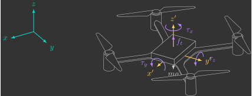
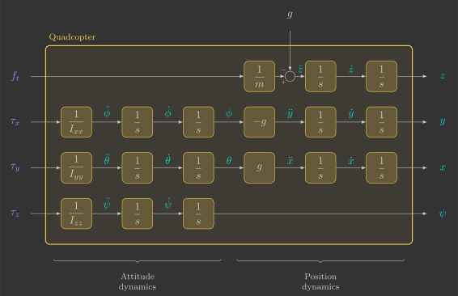

# :material-video-3d: 3D Model

We now derive the differential equations that describe the three-dimensional dynamics of a quadcopter. In this complete model, the drone can translate and rotate freely in space, capturing both the richness and the complexity of the problem. Describing this motion requires vector algebra and rotation matrices, which provide a convenient framework for representing positions, velocities, and orientations in three dimensions.

---

## Introduction

The 3D model has six degrees of freedom (three translational and three rotational). Therefore, we must derive twelve differential equations (two for each degree of freedom)(1).
{.annotate}

1. For clarity, we will use the following colors and notation:
    - ${\color{var(--c1)} x}$ — States (inertial frame)
    - ${\color{var(--c3)} x\,'}$ — States (body-fixed frame)
    - ${\color{var(--c2)} u}$ — Inputs
    - $m$ — Constants

{: width="800" style="display: block; margin: auto;" }

Using vector notation is much simpler than using scalar notation, since the Newton–Euler equations need to be applied only twice, once for translation and once for rotation, instead of six times, once for each degree of freedom.

The positions and Euler angles will be expressed in the inertial frame, while the linear and angular velocities will be expressed in the body-fixed frame. Therefore, the system state vectors are ${\color{var(--c1)}\vec{r}}$, ${\color{var(--c1)}\vec{\delta}}$, ${\color{var(--c3)}\vec{v}\,'}$, and ${\color{var(--c3)}\vec{\omega}\,'}$, where:

$$
{\color{var(--c1)}\vec{r}}
=
\begin{bmatrix}
    {\color{var(--c1)}x} \\
    {\color{var(--c1)}y} \\
    {\color{var(--c1)}z}
\end{bmatrix}
\qquad
{\color{var(--c1)}\vec{\delta}}
=
\begin{bmatrix}
    {\color{var(--c1)}\phi} \\
    {\color{var(--c1)}\theta} \\
    {\color{var(--c1)}\psi}
\end{bmatrix}
\qquad
{\color{var(--c3)}\vec{v}\,'}
=
\begin{bmatrix}
    {\color{var(--c3)}v_x\,'} \\
    {\color{var(--c3)}v_y\,'} \\
    {\color{var(--c3)}v_z\,'}
\end{bmatrix}
\qquad
{\color{var(--c3)}\vec{\omega}\,'}
=
\begin{bmatrix}
    {\color{var(--c3)}\omega_x\,'} \\
    {\color{var(--c3)}\omega_y\,'} \\
    {\color{var(--c3)}\omega_z\,'}
\end{bmatrix}
$$

---

## Cinemática

Já deduzimos a matriz de rotação utilizando os ângulos de Euler:

$$
\begin{bmatrix}
    {\color{var(--c1)}x} \\
    {\color{var(--c1)}y} \\
    {\color{var(--c1)}z} \\
\end{bmatrix}
=
\underbrace{
\begin{bmatrix}
    \cos{\color{var(--c1)}\theta}\cos{\color{var(--c1)}\psi} & \cos{\color{var(--c1)}\theta}\sin{\color{var(--c1)}\psi} & -\sin{\color{var(--c1)}\theta} \\ 
    \sin{\color{var(--c1)}\phi}\sin{\color{var(--c1)}\theta}\cos{\color{var(--c1)}\psi} - \cos{\color{var(--c1)}\phi}\sin{\color{var(--c1)}\psi} & \sin{\color{var(--c1)}\phi}\sin{\color{var(--c1)}\theta}\sin{\color{var(--c1)}\psi} + \cos{\color{var(--c1)}\phi}\cos{\color{var(--c1)}\psi} & \sin{\color{var(--c1)}\phi}\cos{\color{var(--c1)}\theta} \\ 
    \cos{\color{var(--c1)}\phi}\sin{\color{var(--c1)}\theta}\cos{\color{var(--c1)}\psi} + \sin{\color{var(--c1)}\phi}\sin{\color{var(--c1)}\psi} & \cos{\color{var(--c1)}\phi}\sin{\color{var(--c1)}\theta}\sin{\color{var(--c1)}\psi} - \sin{\color{var(--c1)}\phi}\cos{\color{var(--c1)}\psi} & \cos{\color{var(--c1)}\phi}\cos{\color{var(--c1)}\theta} 
\end{bmatrix}
}_{R}
\begin{bmatrix}
    {\color{var(--c3)}x\,'} \\
    {\color{var(--c3)}y\,'} \\
    {\color{var(--c3)}z\,'} \\
\end{bmatrix}
$$

### Translação

!!! question "Exercício 9.1"

    Determine ${\color{var(--c1)}\dot{\vec{r}}}$ em função dos estados do sistema.
    
    ??? info "Resposta"

        $$
        \begin{align*}
            {\color{var(--c1)}\dot{\vec{r}}} &= R^T {\color{var(--c3)}{\vec{v}}\,'} \\
            \begin{bmatrix}
                {\color{var(--c1)}\dot{x}} \\
                {\color{var(--c1)}\dot{y}} \\
                {\color{var(--c1)}\dot{z}} \\
            \end{bmatrix}
            &=
            \begin{bmatrix}
                \cos{\color{var(--c1)}\theta}\cos{\color{var(--c1)}\psi} & \sin{\color{var(--c1)}\phi}\sin{\color{var(--c1)}\theta}\cos{\color{var(--c1)}\psi} - \cos{\color{var(--c1)}\phi}\sin{\color{var(--c1)}\psi} & \cos{\color{var(--c1)}\phi}\sin{\color{var(--c1)}\theta}\cos{\color{var(--c1)}\psi} + \sin{\color{var(--c1)}\phi}\sin{\color{var(--c1)}\psi} \\
                \cos{\color{var(--c1)}\theta}\sin{\color{var(--c1)}\psi} & \sin{\color{var(--c1)}\phi}\sin{\color{var(--c1)}\theta}\sin{\color{var(--c1)}\psi} + \cos{\color{var(--c1)}\phi}\cos{\color{var(--c1)}\psi} & \cos{\color{var(--c1)}\phi}\sin{\color{var(--c1)}\theta}\sin{\color{var(--c1)}\psi} - \sin{\color{var(--c1)}\phi}\cos{\color{var(--c1)}\psi} \\
                -\sin{\color{var(--c1)}\theta} & \sin{\color{var(--c1)}\phi}\cos{\color{var(--c1)}\theta} & \cos{\color{var(--c1)}\phi}\cos{\color{var(--c1)}\theta}
            \end{bmatrix}
            \begin{bmatrix}
                {\color{var(--c3)}v_x\,'} \\
                {\color{var(--c3)}v_y\,'} \\
                {\color{var(--c3)}v_z\,'} \\
            \end{bmatrix} \\
            \begin{bmatrix}
                {\color{var(--c1)}\dot{x}} \\
                {\color{var(--c1)}\dot{y}} \\
                {\color{var(--c1)}\dot{z}} \\
            \end{bmatrix}
            &=
            \begin{bmatrix}
                {\color{var(--c3)}v_x\,'} \cos{\color{var(--c1)}\theta}\cos{\color{var(--c1)}\psi} + {\color{var(--c3)}v_y\,'} \left( \sin{\color{var(--c1)}\phi}\sin{\color{var(--c1)}\theta}\cos{\color{var(--c1)}\psi} - \cos{\color{var(--c1)}\phi}\sin{\color{var(--c1)}\psi} \right) + {\color{var(--c3)}v_z\,'} \left( \cos{\color{var(--c1)}\phi}\sin{\color{var(--c1)}\theta}\cos{\color{var(--c1)}\psi} + \sin{\color{var(--c1)}\phi}\sin{\color{var(--c1)}\psi} \right) \\
                {\color{var(--c3)}v_x\,'} \cos{\color{var(--c1)}\theta}\sin{\color{var(--c1)}\psi} + {\color{var(--c3)}v_y\,'} \left( \sin{\color{var(--c1)}\phi}\sin{\color{var(--c1)}\theta}\sin{\color{var(--c1)}\psi} + \cos{\color{var(--c1)}\phi}\cos{\color{var(--c1)}\psi} \right) + {\color{var(--c3)}v_z\,'} \left( \cos{\color{var(--c1)}\phi}\sin{\color{var(--c1)}\theta}\sin{\color{var(--c1)}\psi} - \sin{\color{var(--c1)}\phi}\cos{\color{var(--c1)}\psi} \right) \\
                - {\color{var(--c3)}v_x\,'} \sin{\color{var(--c1)}\theta} + {\color{var(--c3)}v_y\,'}  \sin{\color{var(--c1)}\phi}\cos{\color{var(--c1)}\theta} + {\color{var(--c3)}v_z\,'}  \cos{\color{var(--c1)}\phi}\cos{\color{var(--c1)}\theta}
            \end{bmatrix}
        \end{align*}
        $$

### Rotação

!!! question "Exercício 9.2"

    Determine ${\color{var(--c1)}\dot{\vec{\delta}}}$ em função dos estados do sistema.
    
    ??? info "Resposta"

        Suponhamos que o referencial móvel esteja em movimento rotacional em torno da origem, cujo vetor velocidade angular ${\color{var(--c3)}\vec{\omega}\,'}$ é dado por:
        
        $$
        {\color{var(--c3)}\vec{\omega}\,'} = 
        \begin{bmatrix}
            {\color{var(--c3)}\omega_x\,'} \\
            {\color{var(--c3)}\omega_y\,'} \\
            {\color{var(--c3)}\omega_z\,'}
        \end{bmatrix}
        $$

        Como o vetor ${\color{var(--c1)}\vec{r}}$ é fixo no sistema de coordenadas inercial, sua derivada temporal, vista pelo sistema inercial, é nula:
        
        $$
            {\color{var(--c1)}\dot{\vec{r}}} = \vec{0}
        $$

        Por outro lado, sua derivada temporal, vista pelo sistema fixo ao corpo, depende do vetor velocidade angular do sistema fixo ao corpo(1):
        {.annotate}

        1. O sinal negativo aparece porque, se o sistema de coordenadas do corpo gira em uma direção, o vetor será visto pelo sistema fixo ao corpo como girando na direção oposta.
                
        $$
        {\color{var(--c3)}\dot{\vec{r}}\,'} = -{\color{var(--c3)}\vec{\omega}\,'}\times{\color{var(--c3)}\vec{r}\,'}
        $$
    
        Outra forma de representar essa equação é:
        
        $$
        {\color{var(--c3)}\dot{\vec{r}}\,'} = -{\color{var(--c3)}\tilde{\omega}\,'}{\color{var(--c3)}\vec{r}\,'}
        $$

        Onde $\tilde{\omega},'$ é a velocidade angular representada como uma matriz antissimétrica correspondente ao seu produto vetorial:
        
        $$
        {\color{var(--c3)}\tilde{\omega}\,'} = {\color{var(--c3)}\vec{\omega}\,'} \times =
        \begin{bmatrix}
            0 & -{\color{var(--c3)}\omega_z\,'} & {\color{var(--c3)}\omega_y\,'} \\
            {\color{var(--c3)}\omega_z\,'} & 0 & -{\color{var(--c3)}\omega_x\,'} \\
            -{\color{var(--c3)}\omega_y\,'} & {\color{var(--c3)}\omega_x\,'} & 0
        \end{bmatrix}
        $$

        Diferenciando a equação anterior e utilizando essa propriedade, obtém-se:
        
        \begin{align}
            {\color{var(--c3)}\dot{\vec{r}}\,'} &= \frac{d}{dt} \left( {\color{var(--c3)}\vec{r}\,'} \right) \nonumber \\
            {\color{var(--c3)}\dot{\vec{r}}\,'} &= \frac{d}{dt} \left( R {\color{var(--c1)}\vec{r}} \right) \nonumber \\ 
            {\color{var(--c3)}\dot{\vec{r}}\,'} &= \dot{R}{\color{var(--c1)}\vec{r}} + R \cancelto{\vec{0}}{{\color{var(--c1)}\dot{\vec{r}}}} \nonumber \\ 
            {\color{var(--c3)}\dot{\vec{r}}\,'} &= \dot{R} \left(R^T {\color{var(--c3)}\vec{r}\,'}\right) \nonumber \\ 
            {\color{var(--c3)}\dot{\vec{r}}\,'} &= \dot{R}R^T {\color{var(--c3)}\vec{r}\,'}
        \end{align}

        Comparando essa equação com a anterior, é possível obter a matriz antissimétrica da velocidade angular em termos da matriz de rotação e sua derivada temporal:
        
        $$ 
        {\color{var(--c3)}\tilde{\omega}\,'} = -\dot{R}R^T 
        $$
        
        Os ângulos de Euler não são um vetor e não podem ser facilmente isolados. Entretanto, substituindo $R$ e $\dot{R}$, as velocidades angulares podem ser escritas em função dos ângulos de Euler e de suas derivadas temporais em notação matricial:
        
        $$
        \begin{bmatrix}
            {\color{var(--c3)}\omega_x\,'} \\
            {\color{var(--c3)}\omega_y\,'} \\
            {\color{var(--c3)}\omega_z\,'}
        \end{bmatrix}
        = 
        \begin{bmatrix}
            1 & 0 & - \sin{\color{var(--c1)}\theta} \\
            0 & \cos{\color{var(--c1)}\phi} & \sin{\color{var(--c1)}\phi}\cos{\color{var(--c1)}\theta} \\
            0 & -\sin{\color{var(--c1)}\phi} & \cos{\color{var(--c1)}\phi}\cos{\color{var(--c1)}\theta} \\
        \end{bmatrix}
        \begin{bmatrix}
            {\color{var(--c1)}\dot{\phi}} \\
            {\color{var(--c1)}\dot{\theta}} \\
            {\color{var(--c1)}\dot{\psi}}
        \end{bmatrix}
        $$
        
        Invertendo a matriz acima, as derivadas temporais dos ângulos de Euler podem ser escritas em função deles próprios e das velocidades angulares:
        
        $$
        \begin{bmatrix}
            {\color{var(--c1)}\dot{\phi}} \\
            {\color{var(--c1)}\dot{\theta}} \\
            {\color{var(--c1)}\dot{\psi}}
        \end{bmatrix}
        = 
        \begin{bmatrix} 
            1 & \sin{\color{var(--c1)}\phi}\tan{\color{var(--c1)}\theta} & \cos{\color{var(--c1)}\phi}\tan{\color{var(--c1)}\theta} \\
            0 & \cos{\color{var(--c1)}\phi} & - \sin{\color{var(--c1)}\phi}\\
            0 & \sin{\color{var(--c1)}\phi}\sec{\color{var(--c1)}\theta} & \cos{\color{var(--c1)}\phi}\sec{\color{var(--c1)}\theta} 
        \end{bmatrix}
        \begin{bmatrix}
            {\color{var(--c3)}\omega_x\,'} \\
            {\color{var(--c3)}\omega_y\,'} \\
            {\color{var(--c3)}\omega_z\,'}
        \end{bmatrix}
        $$

        Esta última equação é a equação cinemática de um corpo rígido utilizando ângulos de Euler com a sequência de rotações $z-y-z$. 

        Como temos alguns termos $\tan{\color{var(--c1)}\theta}$ e $\sec{\color{var(--c1)}\theta}$, podemos colocar o $\frac{1}{\cos{\color{var(--c1)}\theta}}$ em evidência:

        $$
        \begin{bmatrix}
            {\color{var(--c1)}\dot{\phi}} \\
            {\color{var(--c1)}\dot{\theta}} \\
            {\color{var(--c1)}\dot{\psi}}
        \end{bmatrix}
        = 
        \frac{1}{\cos{\color{var(--c1)}\theta}}
        \begin{bmatrix} 
            \cos{\color{var(--c1)}\theta} & \sin{\color{var(--c1)}\phi}\sin{\color{var(--c1)}\theta} & \cos{\color{var(--c1)}\phi}\sin{\color{var(--c1)}\theta} \\
            0 & \cos{\color{var(--c1)}\phi} \cos{\color{var(--c1)}\theta} & - \sin{\color{var(--c1)}\phi} \cos{\color{var(--c1)}\theta} \\
            0 & \sin{\color{var(--c1)}\phi} & \cos{\color{var(--c1)}\phi}
        \end{bmatrix}
        \begin{bmatrix}
            {\color{var(--c3)}\omega_x\,'} \\
            {\color{var(--c3)}\omega_y\,'} \\
            {\color{var(--c3)}\omega_z\,'}
        \end{bmatrix}
        $$
        
        Isso evidencia a singularidade que ocorre quando $\theta = \pm 90^{\circ}$.

---

## Cinética

Já deduzimos as equações de Newton-Euler:
        
$$
\left\{
\begin{array}{l}
        {\color{var(--c3)}\dot{\vec{v}}\,'} = - {\color{var(--c3)}\vec{\omega}\,'} \times {\color{var(--c3)}\vec{v}\,'} + \frac{1}{m} \sum {\color{var(--c3)}\vec{f}\,'} \\ 
        {\color{var(--c3)}\dot{\vec{\omega}}\,'} = - I^{-1} \left( {\color{var(--c3)}\vec{\omega}\,'} \times I {\color{var(--c3)}\vec{\omega}\,'} \right) + I^{-1} \sum {\color{var(--c3)}\vec{\tau}\,'}
\end{array}
\right.
$$

### Translação

O vetor de forças do drone ${\color{var(--c3)}\vec{f}_d\,'}$ é mais fácil de ser escrito no sistema de coordenadas móvel:

$$
{\color{var(--c3)}\vec{f_d}\,'} = 
\begin{bmatrix}
    0 \\
    0 \\
    {\color{var(--c2)}f_t} 
\end{bmatrix}
$$

!!! question "Exercício 9.3"

    Determine ${\color{var(--c3)}\dot{\vec{v}}\,'}$ em função dos estados do sistema.

    Dics: substitua as somatórias de forças $\sum {\color{var(--c3)}\vec{f}\,'}$ na equação de Newton-Euler de translação.
    
    ??? info "Resposta"

        $$
        \begin{align*}
            {\color{var(--c3)}\dot{\vec{v}}\,'} &= - {\color{var(--c3)}\vec{\omega}\,'} \times {\color{var(--c3)}\vec{v}\,'} + \frac{1}{m} \sum {\color{var(--c3)}\vec{f}\,'} \\ 
            {\color{var(--c3)}\dot{\vec{v}}\,'} &= - {\color{var(--c3)}\vec{\omega}\,'} \times {\color{var(--c3)}\vec{v}\,'} + \frac{1}{m} \left( - m {\color{var(--c3)}\vec{g}\,'} + {\color{var(--c3)}\vec{f}_d\,'} \right) \\
            {\color{var(--c3)}\dot{\vec{v}}\,'} &= - {\color{var(--c3)}\vec{\omega}\,'} \times {\color{var(--c3)}\vec{v}\,'} - R {\color{var(--c1)}\vec{g}} + \frac{1}{m} {\color{var(--c3)}\vec{f}_d\,'} \\ 
            \begin{bmatrix}
                {\color{var(--c3)}\dot{v}_x\,'} \\
                {\color{var(--c3)}\dot{v}_y\,'} \\
                {\color{var(--c3)}\dot{v}_z\,'}
            \end{bmatrix}
            &=
            -
            \begin{bmatrix}
                {\color{var(--c3)}\omega_x\,'} \\
                {\color{var(--c3)}\omega_y\,'} \\
                {\color{var(--c3)}\omega_z\,'}
            \end{bmatrix}
            \times
            \begin{bmatrix}
                {\color{var(--c3)}v_x\,'} \\
                {\color{var(--c3)}v_y\,'} \\
                {\color{var(--c3)}v_z\,'}
            \end{bmatrix}
            -
            \begin{bmatrix} 
                    \text{c}{\color{var(--c1)}\theta}\text{c}{\color{var(--c1)}\psi} & \text{c}{\color{var(--c1)}\theta}\text{s}{\color{var(--c1)}\psi} & -\text{s}{\color{var(--c1)}\theta} \\ 
                    - \text{c}{\color{var(--c1)}\phi}\text{s}{\color{var(--c1)}\psi} + \text{s}{\color{var(--c1)}\phi}\text{s}{\color{var(--c1)}\theta}\text{c}{\color{var(--c1)}\psi}  & \text{c}{\color{var(--c1)}\phi}\text{c}{\color{var(--c1)}\psi} + \text{s}{\color{var(--c1)}\phi}\text{s}{\color{var(--c1)}\theta}\text{s}{\color{var(--c1)}\psi} & \text{s}{\color{var(--c1)}\phi}\text{c}{\color{var(--c1)}\theta} \\ 
                    \text{s}{\color{var(--c1)}\phi}\text{s}{\color{var(--c1)}\psi} + \text{c}{\color{var(--c1)}\phi}\text{s}{\color{var(--c1)}\theta}\text{c}{\color{var(--c1)}\psi} & - \text{s}{\color{var(--c1)}\phi}\text{c}{\color{var(--c1)}\psi} + \text{c}{\color{var(--c1)}\phi}\text{s}{\color{var(--c1)}\theta}\text{s}{\color{var(--c1)}\psi}  & \text{c}{\color{var(--c1)}\phi}\text{c}{\color{var(--c1)}\theta} \end{bmatrix}
            \begin{bmatrix}
                0 \\
                0 \\
                g
            \end{bmatrix}
            + \frac{1}{m}
            \begin{bmatrix}
                0 \\
                0 \\
                {\color{var(--c2)}f_t}
            \end{bmatrix} \\
            \begin{bmatrix}
                {\color{var(--c3)}\dot{v}_x\,'} \\
                {\color{var(--c3)}\dot{v}_y\,'} \\
                {\color{var(--c3)}\dot{v}_z\,'}
            \end{bmatrix}
            &=
            \begin{bmatrix}
                - {\color{var(--c3)}\omega_y\,' v_z\,'} + {\color{var(--c3)}\omega_z\,' v_y\,'} + g \sin{\color{var(--c1)}\theta} \\
                - {\color{var(--c3)}\omega_z\,' v_x\,'} + {\color{var(--c3)}\omega_x\,' v_z\,'} - g \sin{\color{var(--c1)}\phi}\cos{\color{var(--c1)}\theta} \\
                - {\color{var(--c3)}\omega_x\,' v_y\,'} + {\color{var(--c3)}\omega_y\,' v_x\,'} - g \cos{\color{var(--c1)}\phi}\cos{\color{var(--c1)}\theta} + \frac{1}{m} {\color{var(--c2)}f_t}
            \end{bmatrix}
        \end{align*}
        $$

### Rotação

O vetor de torques do drone ${\color{var(--c3)}\vec{\tau}_d\,'}$ é mais fácil de ser escrito no sistema de coordenadas móvel:

$$
{\color{var(--c3)}\vec{\tau_d}\,'} = 
\begin{bmatrix}
    {\color{var(--c2)}\tau_x} \\
    0 \\
    0
\end{bmatrix}
$$

!!! question "Exercício 9.4"

    Determine ${\color{var(--c3)}\dot{\vec{\omega}}\,'}$ em função dos estados do sistema.

    Dics: substitua as somatórias de torques $\sum {\color{var(--c3)}\vec{\tau}\,'}$ na equação de Newton-Euler de rotação.
    
    ??? info "Resposta"

        $$
        \begin{align*}
            {\color{var(--c3)}\dot{\vec{\omega}}\,'} &= - I^{-1} \left( {\color{var(--c3)}\omega\,'} \times I {\color{var(--c3)}\vec{\omega}\,'} \right) + I^{-1} \sum {\color{var(--c3)}\vec{\tau}\,'} \\ 
            {\color{var(--c3)}\dot{\vec{\omega}}\,'} &= - I^{-1} \left( {\color{var(--c3)}\omega\,'} \times I {\color{var(--c3)}\vec{\omega}\,'} \right) + I^{-1} {\color{var(--c3)}\vec{\tau}_d\,'} \\ 
            \begin{bmatrix}
                {\color{var(--c3)}\dot{\omega}_x\,'} \\
                {\color{var(--c3)}\dot{\omega}_y\,'} \\
                {\color{var(--c3)}\dot{\omega}_z\,'}
            \end{bmatrix}
            &= -
            \begin{bmatrix}
                I_{xx} & 0 & 0 \\
                0 & I_{yy} & 0 \\
                0 & 0 & I_{zz}
            \end{bmatrix}^{-1}
            \left( 
            \begin{bmatrix}
                {\color{var(--c3)}\omega_x\,'} \\
                {\color{var(--c3)}\omega_y\,'} \\
                {\color{var(--c3)}\omega_z\,'}
            \end{bmatrix}
            \times
            \begin{bmatrix}
                I_{xx} & 0 & 0 \\
                0 & I_{yy} & 0 \\
                0 & 0 & I_{zz}
            \end{bmatrix}
            \begin{bmatrix}
                {\color{var(--c3)}\omega_x\,'} \\
                {\color{var(--c3)}\omega_y\,'} \\
                {\color{var(--c3)}\omega_z\,'}
            \end{bmatrix}
            \right)
            +
            \begin{bmatrix}
                I_{xx} & 0 & 0 \\
                0 & I_{yy} & 0 \\
                0 & 0 & I_{zz}
            \end{bmatrix}^{-1}
            \begin{bmatrix}
                {\color{var(--c2)}\tau_x} \\
                {\color{var(--c2)}\tau_y} \\
                {\color{var(--c2)}\tau_z}
            \end{bmatrix} \\
            \begin{bmatrix}
                {\color{var(--c3)}\dot{\omega}_x\,'} \\
                {\color{var(--c3)}\dot{\omega}_y\,'} \\
                {\color{var(--c3)}\dot{\omega}_z\,'}
            \end{bmatrix}
            &= -
            \begin{bmatrix}
                \frac{1}{I_{xx}} & 0 & 0 \\
                0 & \frac{1}{I_{yy}} & 0 \\
                0 & 0 & \frac{1}{I_{zz}}
            \end{bmatrix}
            \left( 
            \begin{bmatrix}
                {\color{var(--c3)}\omega_x\,'} \\
                {\color{var(--c3)}\omega_y\,'} \\
                {\color{var(--c3)}\omega_z\,'}
            \end{bmatrix}
            \times
            \begin{bmatrix}
                I_{xx} {\color{var(--c3)}\omega_x\,'} \\
                I_{yy} {\color{var(--c3)}\omega_y\,'} \\
                I_{zz} {\color{var(--c3)}\omega_z\,'}
            \end{bmatrix}
            \right)
            +
            \begin{bmatrix}
                \frac{1}{I_{xx}} & 0 & 0 \\
                0 & \frac{1}{I_{yy}} & 0 \\
                0 & 0 & \frac{1}{I_{zz}}
            \end{bmatrix}
            \begin{bmatrix}
                {\color{var(--c2)}\tau_x} \\
                {\color{var(--c2)}\tau_y} \\
                {\color{var(--c2)}\tau_z}
            \end{bmatrix} \\
            \begin{bmatrix}
                {\color{var(--c3)}\dot{\omega}_x\,'} \\
                {\color{var(--c3)}\dot{\omega}_y\,'} \\
                {\color{var(--c3)}\dot{\omega}_z\,'}
            \end{bmatrix}
            &= 
            \begin{bmatrix}
                - \frac{I_{zz}-I_{yy}}{I_{xx}} {\color{var(--c3)}\omega_y\,' \omega_z\,'} + \frac{1}{I_{xx}} {\color{var(--c2)}\tau_x} \\
                - \frac{I_{xx}-I_{zz}}{I_{yy}} {\color{var(--c3)}\omega_x\,' \omega_z\,'} + \frac{1}{I_{yy}} {\color{var(--c2)}\tau_y} \\
                - \frac{I_{yy}-I_{xx}}{I_{zz}} {\color{var(--c3)}\omega_x\,' \omega_y\,'} + \frac{1}{I_{zz}} {\color{var(--c2)}\tau_z}
            \end{bmatrix}
        \end{align*}
        $$

---

## Linearização

Se juntarmos as equações cinemática e cinéticas, obtemos a dinâmica completa do sistema:
        
$$
\left\{
\begin{array}{l}
    {\color{var(--c1)}\dot{x}} = {\color{var(--c3)}v_x\,'} \cos{\color{var(--c1)}\theta}\cos{\color{var(--c1)}\psi} + {\color{var(--c3)}v_y\,'} \left( \sin{\color{var(--c1)}\phi}\sin{\color{var(--c1)}\theta}\cos{\color{var(--c1)}\psi} - \cos{\color{var(--c1)}\phi}\sin{\color{var(--c1)}\psi} \right) + {\color{var(--c3)}v_z\,'} \left( \cos{\color{var(--c1)}\phi}\sin{\color{var(--c1)}\theta}\cos{\color{var(--c1)}\psi} + \sin{\color{var(--c1)}\phi}\sin{\color{var(--c1)}\psi} \right) \\
    {\color{var(--c1)}\dot{y}} = {\color{var(--c3)}v_x\,'} \cos{\color{var(--c1)}\theta}\sin{\color{var(--c1)}\psi} + {\color{var(--c3)}v_y\,'} \left( \sin{\color{var(--c1)}\phi}\sin{\color{var(--c1)}\theta}\sin{\color{var(--c1)}\psi} + \cos{\color{var(--c1)}\phi}\cos{\color{var(--c1)}\psi} \right) + {\color{var(--c3)}v_z\,'} \left( \cos{\color{var(--c1)}\phi}\sin{\color{var(--c1)}\theta}\sin{\color{var(--c1)}\psi} - \sin{\color{var(--c1)}\phi}\cos{\color{var(--c1)}\psi} \right) \\
    {\color{var(--c1)}\dot{z}} = - {\color{var(--c3)}v_x\,'} \sin{\color{var(--c1)}\theta} + {\color{var(--c3)}v_y\,'}  \sin{\color{var(--c1)}\phi}\cos{\color{var(--c1)}\theta} + {\color{var(--c3)}v_z\,'}  \cos{\color{var(--c1)}\phi}\cos{\color{var(--c1)}\theta} \\
    {\color{var(--c1)}\dot{\phi}} = {\color{var(--c3)}\omega_x\,'} + {\color{var(--c3)}\omega_y\,'} \sin{\color{var(--c1)}\phi} \tan{\color{var(--c1)}\theta} + {\color{var(--c3)}\omega_z\,'} \cos{\color{var(--c1)}\phi} \tan{\color{var(--c1)}\theta} \\
    {\color{var(--c1)}\dot{\theta}} = {\color{var(--c3)}\omega_y\,'} \cos{\color{var(--c1)}\phi} - {\color{var(--c3)}\omega_z\,'} \sin{\color{var(--c1)}\phi} \\
    {\color{var(--c1)}\dot{\psi}} = {\color{var(--c3)}\omega_y\,'} \sin{\color{var(--c1)}\phi} \sec{\color{var(--c1)}\theta} + {\color{var(--c3)}\omega_z\,'} \cos{\color{var(--c1)}\phi} \sec{\color{var(--c1)}\theta} \\
        {\color{var(--c3)}\dot{v}_x\,'} =  - {\color{var(--c3)}\omega_y\,' v_z\,'} + {\color{var(--c3)}\omega_z\,' v_y\,'} + g \sin{\color{var(--c1)}\theta} \\
        {\color{var(--c3)}\dot{v}_y\,'} = - {\color{var(--c3)}\omega_z\,' v_x\,'} + {\color{var(--c3)}\omega_x\,' v_z\,'} - g \sin{\color{var(--c1)}\phi}\cos{\color{var(--c1)}\theta} \\
        {\color{var(--c3)}\dot{v}_z\,'} = - {\color{var(--c3)}\omega_x\,' v_y\,'} + {\color{var(--c3)}\omega_y\,' v_x\,'} - g \cos{\color{var(--c1)}\phi}\cos{\color{var(--c1)}\theta} + \frac{1}{m} {\color{var(--c2)}f_t} \\
        {\color{var(--c3)}\dot{\omega}_x\,'} = - \frac{I_{zz}-I_{yy}}{I_{xx}} {\color{var(--c3)}\omega_y\,' \omega_z\,'} + \frac{1}{I_{xx}} {\color{var(--c2)}\tau_x} \\
        {\color{var(--c3)}\dot{\omega}_y\,'} = - \frac{I_{xx}-I_{zz}}{I_{yy}} {\color{var(--c3)}\omega_x\,' \omega_z\,'} + \frac{1}{I_{yy}} {\color{var(--c2)}\tau_\theta} \\
        {\color{var(--c3)}\dot{\omega}_z\,'} = - \frac{I_{yy}-I_{xx}}{I_{zz}} {\color{var(--c3)}\omega_x\,' \omega_y\,'} + \frac{1}{I_{zz}} {\color{var(--c2)}\tau_\psi}
\end{array}
\right.  
$$

As equações acima são completamente não-lineares, o que, além de ser extremamente complexo, foge do escopo do nosso curso.

Para linearizar o sistema, podemos considerar aproximações quando os estados estão bem próximos de suas posições de equilíbrio. Neste caso, funções trigonométricas podem ser aproximadas (ex: $\cos{\color{var(--c1)}\phi} \approx 1$ e $\sin{\color{var(--c1)}\phi} \approx {\color{var(--c1)}\phi}$) (1), assim como o produto entre dois estados (ex: ${\color{var(--c3)}v_z\,' \omega_x\,'} \approx 0$).
{.annotate}

1. Essas aproximações valem apenas para ângulos em radianos menores que $10^{\circ}$.

!!! question "Exercício 9.5"

    Determine as equações dinâmicas do sistema linearizado.
    
    ??? info "Resposta"
        $$
        \left\{
        \begin{array}{l}
            {\color{var(--c1)}\dot{x}} = {\color{var(--c3)}v_x\,'} \cancelto{1}{\cos{\color{var(--c1)}\theta}}\cancelto{1}{\cos{\color{var(--c1)}\psi}} + {\color{var(--c3)}v_y\,'}  \left(\cancelto{{\color{var(--c1)}\phi}}{\sin{\color{var(--c1)}\phi}}\cancelto{{\color{var(--c1)}\theta}}{\sin{\color{var(--c1)}\theta}}\cancelto{1}{\cos{\color{var(--c1)}\psi}} - \cancelto{1}{\cos{\color{var(--c1)}\phi}}\cancelto{{\color{var(--c1)}\psi}}{\sin{\color{var(--c1)}\psi}}\right) + {\color{var(--c3)}v_z\,'} \left( \cancelto{1}{\cos{\color{var(--c1)}\phi}}\cancelto{{\color{var(--c1)}\theta}}{\sin{\color{var(--c1)}\theta}}\cancelto{1}{\cos{\color{var(--c1)}\psi}} + \cancelto{{\color{var(--c1)}\phi}}{\sin{\color{var(--c1)}\phi}}\cancelto{{\color{var(--c1)}\psi}}{\sin{\color{var(--c1)}\psi}}\right) \\
            {\color{var(--c1)}\dot{y}} = {\color{var(--c3)}v_x\,'} \cancelto{1}{\cos{\color{var(--c1)}\theta}}\cancelto{{\color{var(--c1)}\psi}}{\sin{\color{var(--c1)}\psi}} + {\color{var(--c3)}v_y\,'} \left( \cancelto{{\color{var(--c1)}\phi}}{\sin{\color{var(--c1)}\phi}}\cancelto{{\color{var(--c1)}\theta}}{\sin{\color{var(--c1)}\theta}}\cancelto{{\color{var(--c1)}\psi}}{\sin{\color{var(--c1)}\psi}} + \cancelto{1}{\cos{\color{var(--c1)}\phi}}\cancelto{1}{\cos{\color{var(--c1)}\psi}} \right) + {\color{var(--c3)}v_z\,'} \left( \cancelto{1}{\cos{\color{var(--c1)}\phi}}\cancelto{{\color{var(--c1)}\theta}}{\sin{\color{var(--c1)}\theta}}\cancelto{{\color{var(--c1)}\psi}}{\sin{\color{var(--c1)}\psi}} - \cancelto{{\color{var(--c1)}\phi}}{\sin{\color{var(--c1)}\phi}}\cancelto{1}{\cos{\color{var(--c1)}\psi}} \right) \\
            {\color{var(--c1)}\dot{z}} = - {\color{var(--c3)}v_x\,'} \cancelto{{\color{var(--c1)}\theta}}{\sin{\color{var(--c1)}\theta}} + {\color{var(--c3)}v_y\,'} \cancelto{{\color{var(--c1)}\phi}}{\sin{\color{var(--c1)}\phi}}\cancelto{1}{\cos{\color{var(--c1)}\theta}} + {\color{var(--c3)}v_z\,'} \cancelto{1}{\cos{\color{var(--c1)}\phi}}\cancelto{1}{\cos{\color{var(--c1)}\theta}} \\
            {\color{var(--c1)}\dot{\phi}} = {\color{var(--c3)}\omega_x\,'} + {\color{var(--c3)}\omega_y\,'} \cancelto{{\color{var(--c1)}\phi}}{\sin{\color{var(--c1)}\phi}} \cancelto{{\color{var(--c1)}\theta}}{\tan{\color{var(--c1)}\theta}} + {\color{var(--c3)}\omega_z\,'} \cancelto{1}{\cos{\color{var(--c1)}\phi}} \cancelto{{\color{var(--c1)}\theta}}{\tan{\color{var(--c1)}\theta}} \\
            {\color{var(--c1)}\dot{\theta}} = {\color{var(--c3)}\omega_y\,'} \cancelto{1}{\cos{\color{var(--c1)}\phi}} - {\color{var(--c3)}\omega_z\,'} \cancelto{{\color{var(--c1)}\phi}}{\sin{\color{var(--c1)}\phi}} \\
            {\color{var(--c1)}\dot{\psi}} = {\color{var(--c3)}\omega_y\,'} \cancelto{{\color{var(--c1)}\phi}}{\sin{\color{var(--c1)}\phi}} \cancelto{1}{\sec{\color{var(--c1)}\theta}} + {\color{var(--c3)}\omega_z\,'} \cancelto{1}{\cos{\color{var(--c1)}\phi}} \cancelto{1}{\sec{\color{var(--c1)}\theta}} \\
                {\color{var(--c3)}\dot{v}_x\,'} =  - \cancelto{0}{\color{var(--c3)}\omega_y\,' v_z\,'} + \cancelto{0}{\color{var(--c3)}\omega_z\,' v_y\,'} + g \cancelto{{\color{var(--c1)}\theta}}{\sin{\color{var(--c1)}\theta}} \\
                {\color{var(--c3)}\dot{v}_y\,'} = - \cancelto{0}{\color{var(--c3)}\omega_z\,' v_x\,'} + \cancelto{0}{\color{var(--c3)}\omega_x\,' v_z\,'} - g \cancelto{{\color{var(--c1)}\phi}}{\sin{\color{var(--c1)}\phi}}\cancelto{1}{\cos{\color{var(--c1)}\theta}} \\
                {\color{var(--c3)}\dot{v}_z\,'} = - \cancelto{0}{\color{var(--c3)}\omega_x\,' v_y\,'} + \cancelto{0}{\color{var(--c3)}\omega_y\,' v_x\,'} - g \cancelto{1}{\cos{\color{var(--c1)}\phi}}\cancelto{1}{\cos{\color{var(--c1)}\theta}} + \frac{1}{m} {\color{var(--c2)}f_t} \\
                {\color{var(--c3)}\dot{\omega}_x\,'} = - \frac{I_{zz}-I_{yy}}{I_{xx}} \cancelto{0}{\color{var(--c3)}\omega_y\,' \omega_z\,'} + \frac{1}{I_{xx}} {\color{var(--c2)}\tau_x} \\
                {\color{var(--c3)}\dot{\omega}_y\,'} = - \frac{I_{xx}-I_{zz}}{I_{yy}} \cancelto{0}{\color{var(--c3)}\omega_x\,' \omega_z\,'} + \frac{1}{I_{yy}} {\color{var(--c2)}\tau_\theta} \\
                {\color{var(--c3)}\dot{\omega}_z\,'} = - \frac{I_{yy}-I_{xx}}{I_{zz}} \cancelto{0}{\color{var(--c3)}\omega_x\,' \omega_y\,'} + \frac{1}{I_{zz}} {\color{var(--c2)}\tau_\psi}
        \end{array}
        \right. 
        \qquad \longrightarrow \qquad
        \left\{
        \begin{array}{l}
            {\color{var(--c1)}\dot{x}} =  {\color{var(--c3)}v_x\,'} + \cancelto{0}{{\color{var(--c3)}v_y\,'} \left( {\color{var(--c1)}\phi\theta} - {\color{var(--c1)}\psi} \right)} + \cancelto{0}{{\color{var(--c3)}v_z\,'} \left( {\color{var(--c1)}\theta} + {\color{var(--c1)}\phi\psi} \right)} \\
            {\color{var(--c1)}\dot{y}} =  \cancelto{0}{{\color{var(--c3)}v_x\,'}{\color{var(--c1)}\psi}}  + {\color{var(--c3)}v_y\,'} \left( \cancelto{0}{{\color{var(--c1)}\phi\theta\psi}} + 1 \right) +  \cancelto{0}{{\color{var(--c3)}v_z\,'} \left( {\color{var(--c1)}\theta\psi} - {\color{var(--c1)}\phi} \right)} \\
            {\color{var(--c1)}\dot{z}} =  \cancelto{0}{{\color{var(--c3)}v_x\,'}{\color{var(--c1)}\theta}} + \cancelto{0}{{\color{var(--c3)}v_y\,'}{\color{var(--c1)}\phi}} + {\color{var(--c3)}v_z\,'} \\
            {\color{var(--c1)}\dot{\phi}} =  {\color{var(--c3)}\omega_x\,'} +  \cancelto{0}{{\color{var(--c3)}\omega_y\,'}{\color{var(--c1)}\phi\theta}} +  \cancelto{0}{{\color{var(--c3)}\omega_z\,'}{\color{var(--c1)}\theta}} \\ 
            {\color{var(--c1)}\dot{\theta}} =  {\color{var(--c3)}\omega_y\,'} -  \cancelto{0}{{\color{var(--c3)}\omega_z\,'}{\color{var(--c1)}\phi}} \\ 
            {\color{var(--c1)}\dot{\psi}} =  \cancelto{0}{{\color{var(--c3)}\omega_y\,'}{\color{var(--c1)}\phi}} + {\color{var(--c3)}\omega_z\,'} \\ 
            {\color{var(--c3)}\dot{v}_x\,'} = g {\color{var(--c1)}\theta} \\ 
            {\color{var(--c3)}\dot{v}_y\,'} = - g {\color{var(--c1)}\phi} \\ 
            {\color{var(--c3)}\dot{v}_z\,'} = -g + \frac{1}{m} {\color{var(--c2)}f_t} \\ 
            {\color{var(--c3)}\dot{\omega}_x\,'} = \frac{1}{I_{xx}} {\color{var(--c2)}\tau_x} \\
            {\color{var(--c3)}\dot{\omega}_y\,'} = \frac{1}{I_{yy}} {\color{var(--c2)}\tau_y} \\
            {\color{var(--c3)}\dot{\omega}_z\,'} = \frac{1}{I_{zz}} {\color{var(--c2)}\tau_z}
        \end{array}
        \right.  
        \qquad \longrightarrow \qquad
        \left\{
        \begin{array}{l}
            {\color{var(--c1)}\dot{x}} =  {\color{var(--c3)}v_x\,'} \\
            {\color{var(--c1)}\dot{y}} =  {\color{var(--c3)}v_y\,'} \\
            {\color{var(--c1)}\dot{z}} =  {\color{var(--c3)}v_z\,'} \\
            {\color{var(--c1)}\dot{\phi}} =  {\color{var(--c3)}\omega_x\,'} \\ 
            {\color{var(--c1)}\dot{\theta}} =  {\color{var(--c3)}\omega_y\,'} \\ 
            {\color{var(--c1)}\dot{\psi}} =  {\color{var(--c3)}\omega_z\,'} \\ 
            {\color{var(--c3)}\dot{v}_x\,'} = g {\color{var(--c1)}\theta} \\ 
            {\color{var(--c3)}\dot{v}_y\,'} = - g {\color{var(--c1)}\phi} \\ 
            {\color{var(--c3)}\dot{v}_z\,'} = -g + \frac{1}{m} {\color{var(--c2)}f_t} \\ 
            {\color{var(--c3)}\dot{\omega}_x\,'} = \frac{1}{I_{xx}} {\color{var(--c2)}\tau_x} \\
            {\color{var(--c3)}\dot{\omega}_y\,'} = \frac{1}{I_{yy}} {\color{var(--c2)}\tau_y} \\
            {\color{var(--c3)}\dot{\omega}_z\,'} = \frac{1}{I_{zz}} {\color{var(--c2)}\tau_z}
        \end{array}
        \right.    
        $$

Você deve ter chegado a:

$$
\left\{
\begin{array}{l}
    {\color{var(--c1)}\dot{x}} =  {\color{var(--c3)}v_x\,'} \\
    {\color{var(--c1)}\dot{y}} =  {\color{var(--c3)}v_y\,'} \\
    {\color{var(--c1)}\dot{z}} =  {\color{var(--c3)}v_z\,'} \\
    {\color{var(--c1)}\dot{\phi}} =  {\color{var(--c3)}\omega_x\,'} \\ 
    {\color{var(--c1)}\dot{\theta}} =  {\color{var(--c3)}\omega_y\,'} \\ 
    {\color{var(--c1)}\dot{\psi}} =  {\color{var(--c3)}\omega_z\,'} \\ 
    {\color{var(--c3)}\dot{v}_x\,'} = g {\color{var(--c1)}\theta} \\ 
    {\color{var(--c3)}\dot{v}_y\,'} = - g {\color{var(--c1)}\phi} \\ 
    {\color{var(--c3)}\dot{v}_z\,'} = -g + \frac{1}{m} {\color{var(--c2)}f_t} \\ 
    {\color{var(--c3)}\dot{\omega}_x\,'} = \frac{1}{I_{xx}} {\color{var(--c2)}\tau_x} \\
    {\color{var(--c3)}\dot{\omega}_y\,'} = \frac{1}{I_{yy}} {\color{var(--c2)}\tau_y} \\
    {\color{var(--c3)}\dot{\omega}_z\,'} = \frac{1}{I_{zz}} {\color{var(--c2)}\tau_z}
\end{array}
\right.    
$$

Essas equações diferenciais podem ser representadas de forma mais simples em um diagrama de blocos:

{: width=100% style="display: block; margin: auto;" }

Observe o seguinte:

- A força ${\color{var(--c2)}f_t}$ integra duas vezes até a posição ${\color{var(--c1)}z}$ (2ª lei de Newton para translação), atuando de forma desacoplada na dinâmica de posição vertical.
- O torque ${\color{var(--c2)}\tau_x}$ integra duas vezes até o ângulo ${\color{var(--c1)}\phi}$ (2ª lei de Newton para rotação), e, integrando mais duas vezes, chega-se a posição ${\color{var(--c1)}y}$(1). Portanto, de ${\color{var(--c2)}\tau_x}$ a ${\color{var(--c1)}y}$ há um integrador quádruplo, resultado do acoplamento entre a dinâmica de rotação e a dinâmica de posição horizontal. 
    {.annotate}

    1. O sinal negativo em $- g$ decorre da convenção de eixos adotada (uma rotação positiva em torno de ${\color{var(--c1)}x}$ implica em um deslocamento negativo ao longo de ${\color{var(--c1)}y}$).

- O torque ${\color{var(--c2)}\tau_y}$ integra duas vezes até o ângulo ${\color{var(--c1)}\theta}$ (2ª lei de Newton para rotação), e, integrando mais duas vezes, chega-se a posição ${\color{var(--c1)}x}$(1). Portanto, de ${\color{var(--c2)}\tau_y}$ a ${\color{var(--c1)}x}$ há um integrador quádruplo, resultado do acoplamento entre a dinâmica de rotação e a dinâmica de posição horizontal. 
    {.annotate}

    1. O sinal positivo em $g$ decorre da convenção de eixos adotada (uma rotação positiva em torno de ${\color{var(--c1)}y}$ implica em um deslocamento positivo ao longo de ${\color{var(--c1)}x}$).

- O torque ${\color{var(--c2)}\tau_z}$ integra duas vezes até o ângulo ${\color{var(--c1)}\psi}$ (2ª lei de Newton para rotação), atuando de forma desacoplada na dinâmica de rotação de guinagem.

