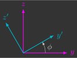

# Sistema de coordenadas

No controle de drones, o uso de sistemas de coordenadas é fundamental para descrever posições e orientações relativas. Alguns exemplos comuns são: a posição do drone em relação ao solo, a orientação da câmera em relação ao drone e a velocidade do drone em relação ao vento.

A escolha do sistema de coordenadas adequado torna muitos cálculos mais simples. Por exemplo, forças e torques aerodinâmicos são mais naturalmente descritos em um sistema de coordenadas móvel (fixo no drone), enquanto a aceleração da gravidade é melhor representada em um sistema de coordenadas inercial (fixo na Terra).

---

## Matriz de rotação

Quando trabalhamos com diferentes sistemas de coordenadas, precisamos de uma forma matemática para descrever a orientação relativa entre eles. Essa função é cumprida pelas matrizes de rotação, que permitem representar rotações tanto no plano (2D) quanto no espaço tridimensional (3D).

### 2D

Ao descrever a posição de um drone, precisamos definir uma referência. Um método geral é utilizar um sistema de coordenadas inercial ${\color{magenta}yz}$ (1).
{.annotate}

1. Fixo na Terra, que não acelera nem rotaciona.

{: width="600" style="display: block; margin: auto;" }

Já para descrever a atitude (orientação) do drone, apenas esse sistema não é suficiente. É necessário introduzir também um sistema de coordenadas móvel ${\color{cyan}y'z'}$ (1).
{.annotate}
    
1. Fixo no drone, que acelera e rotaciona com ele.

{: width="600" style="display: block; margin: auto;" }

A atitude do drone é dada, portanto, pela orientação relativa do sistema móvel ${\color{cyan}y'z'}$ em relação ao sistema inercial ${\color{magenta}yz}$. Essa orientação pode ser representada matematicamente por uma matriz $2 \times 2$ chamada de matrix de rotação $R$:

$$
{\color{cyan}
\begin{bmatrix}
    y' \\
    z'
\end{bmatrix}
}
=
\underbrace{
\begin{bmatrix}
    r_{11} & r_{12} \\
    r_{21} & r_{22}
\end{bmatrix}
}_{R}
{\color{magenta}
\begin{bmatrix}
    y \\
    z
\end{bmatrix}
}
$$

Apesar de possuir quatro elementos, essa matriz pode ser descrita em função de um único parâmetro: o ângulo de rotação $\phi$:

$$
R(\phi)=
\begin{bmatrix}
    r_{11}(\phi) & r_{12}(\phi)\\
    r_{21}(\phi) & r_{22}(\phi)
\end{bmatrix}
$$

!!! question "Exercício 1"

    Considere que o sistema de coordenadas móvel ${\color{cyan}y'z'}$ está rotacionado de um ângulo $\phi$ em relação ao sistema de coordenadas inercial ${\color{magenta}yz}$.

    {: width="200" style="display: block; margin: auto;" }
    
    ??? info "a) Escreva a matriz de rotação em função do ângulo $\phi$." 
        $$
        R(\phi) = 
        \begin{bmatrix} 
            \cos{\phi} & \sin{\phi} \\ 
            -\sin{\phi} & \cos{\phi} 
        \end{bmatrix}
        $$
    
    ??? info "b) Calcule $R(\phi)$ para $\phi = \frac{\pi}{2} \, \text{rad}$ e interprete o resultado."
        $$
        R\left(\frac{\pi}{2}\right) 
        = 
        \begin{bmatrix} 
            \cos{\frac{\pi}{2}} & \sin{\frac{\pi}{2}} \\ 
            -\sin{\frac{\pi}{2}} & \cos{\frac{\pi}{2}} 
        \end{bmatrix} 
        =
        \begin{bmatrix} 
            0 & 1 \\ 
            -1 & 0
        \end{bmatrix}
        $$

        O resultado faz sentido: ao rotacionar $90^{\circ}$, o eixo ${\color{cyan}y'}$ passa a coincidir com ${\color{magenta}z}$, enquanto o eixo ${\color{cyan}z'}$ fica no sentido oposto de ${\color{magenta}y}$.
 
    ??? info "c) Determine o ângulo $\phi$ correspondente à matriz   $R (\phi)= \begin{bmatrix} \frac{\sqrt{2}}{2} & \frac{\sqrt{2}}{2} \\ -\frac{\sqrt{2}}{2} & \frac{\sqrt{2}}{2} \end{bmatrix}$."
    
        $$
        \begin{align*}
            \cos \phi &= \frac{\sqrt{2}}{2} \\
            \phi &= \cos^{-1}\!\left(\frac{\sqrt{2}}{2}\right) \\
            \phi &= \frac{\pi}{4} \;\text{rad} \;\; (45^\circ)
        \end{align*}
        $$

---

### 3D

Assim como no plano, no espaço a atitude do drone também é dada pela atitude relativa do sistema de coordenadas móvel ${\color{cyan}x'y'z'}$ em relação ao sistema de coordenadas inercial ${\color{magenta}xyz}$.

{: width="600" style="display: block; margin: auto;" }

No entanto, como agora estamos lidando com três dimensões, a matriz de rotação $R$ passa a possuir dimensão $3 \times 3$:

$$
{\color{cyan}
\begin{bmatrix}
    x'\\y'\\z'
\end{bmatrix}
}
=
\underbrace{
\begin{bmatrix}
    r_{11} & r_{12} & r_{13}\\
    r_{21} & r_{22} & r_{23}\\
    r_{31} & r_{32} & r_{33}
\end{bmatrix}
}_{R}
{\color{magenta}
\begin{bmatrix}
    x \\
    y \\
    z
\end{bmatrix}
}
$$

De acordo com Leonhard Euler, qualquer atitude no espaço pode ser descrita através de três rotações sucessivas em torno de eixos pré-definidos e mutuamente ortogonais(1). Dessa forma, os nove elementos da matriz de rotação podem ser expressos em função de três parâmetros: os ângulos de Euler $\phi$, $\theta$ e $\psi$:
{.annotate}

1. Formam um ângulo de $90^{\circ}$ entre si.
    
\begin{equation*}
        R({\phi},{\theta},{\psi})
        =
        \begin{bmatrix}
        r_{11}({\phi},{\theta},{\psi}) & r_{12}({\phi},{\theta},{\psi}) & r_{13}({\phi},{\theta},{\psi}) \\
        r_{21}({\phi},{\theta},{\psi}) & r_{22}({\phi},{\theta},{\psi}) & r_{23}({\phi},{\theta},{\psi}) \\
        r_{31}({\phi},{\theta},{\psi}) & r_{32}({\phi},{\theta},{\psi}) & r_{33}({\phi},{\theta},{\psi})
        \end{bmatrix}
\end{equation*}

!!! question "Exercício 2"

    Considere que o sistema de coordenadas móvel ${\color{cyan}x'y'z'}$ está rotacionado de um ângulo $\phi$ em relação ao sistema de coordenadas inercial ${\color{magenta}xyz}$ e em torno do eixo ${\color{magenta}x}$.

    {: width="200" style="display: block; margin: auto;" }
    
    ??? info "a) Escreva a matriz de rotação em função do ângulo $\phi$."
        $$
        R_x(\phi) = 
        \begin{bmatrix} 
            1 & 0 & 0 \\
            0 & \cos\phi & \sin\phi \\ 
            0 & -\sin\phi & \cos\phi 
        \end{bmatrix}
        $$
    
    ??? info "b) Calcule $R_x(\phi)$ para $\phi=\pi \, \text{rad}$ e interprete o resultado."
        $$
        \begin{align*}
            R_x\left(\pi\right) 
            = 
            \begin{bmatrix} 
                1 & 0 & 0 \\
                0 & \cos \pi & \sin \pi \\ 
                0 & -\sin \pi & \cos \pi
            \end{bmatrix} 
            = 
            \begin{bmatrix} 
                1 & 0 & 0 \\
                0 & -1 & 0 \\ 
                0 & 0 & -1
            \end{bmatrix}
        \end{align*}
        $$

        O resultado faz sentido: uma rotação de $180^\circ$ em torno de ${\color{magenta}x}$ inverte os eixos ${\color{magenta}y}$ e ${\color{magenta}z}$, de modo que ${\color{cyan}y'}$ e ${\color{cyan}z'}$ ficam em sentidos opostos a ${\color{magenta}y}$ e ${\color{magenta}z}$, enquanto ${\color{cyan}x'}$ permance alinhado com ${\color{magenta}x}$.

!!! question "Exercício 3"

    Considere que o sistema de coordenadas móvel ${\color{cyan}x'y'z'}$ está rotacionado de um ângulo $\theta$ em relação ao sistema de coordenadas inercial ${\color{magenta}xyz}$ e em torno do eixo ${\color{magenta}y}$.

    {: width="200" style="display: block; margin: auto;" }
    
    ??? info "a) Escreva a matriz de rotação em função do ângulo $\theta$."
        $$
        R_y(\theta) = 
        \begin{bmatrix} 
            \cos\theta & 0 & -\sin\theta \\ 
            0 & 1 & 0 \\ 
            \sin\theta & 0 & \cos\theta
        \end{bmatrix}
        $$
    
    ??? info "b) Calcule $R_y(\theta)$ para $\theta=\tfrac{\pi}{2} \, \text{rad}$ e interprete o resultado."
        $$
        \begin{align*}
            R_y\left(\frac{\pi}{2}\right) 
            = 
            \begin{bmatrix} 
                \cos\frac{\pi}{2} & 0 & -\sin\frac{\pi}{2} \\ 
                0 & 1 & 0 \\ 
                \sin\frac{\pi}{2} & 0 & \cos\frac{\pi}{2}
            \end{bmatrix} 
            = 
            \begin{bmatrix} 
                0 & 0 & -1 \\ 
                0 & 1 & 0 \\ 
                1 & 0 & 0
            \end{bmatrix}
        \end{align*}
        $$

        O resultado faz sentido: ao rotacionar $90^\circ$ em torno de ${\color{magenta}y}$, o eixo ${\color{cyan}x'}$ passa a apontar para o sentido oposto de ${\color{magenta}z}$ e o eixo ${\color{cyan}z'}$ passa a coincidir com ${\color{magenta}x}$, enquanto o eixo ${\color{cyan}y'}$ permance alinhado com ${\color{magenta}y}$.

!!! question "Exercício 4"

    Considere que o sistema de coordenadas móvel ${\color{cyan}x'y'z'}$ está rotacionado de um ângulo $\psi$ em relação ao sistema de coordenadas inercial ${\color{magenta}xyz}$ e em torno do eixo ${\color{magenta}z}$.

    {: width="200" style="display: block; margin: auto;" }
    
    ??? info "a) Escreva a matriz de rotação em função do ângulo $\psi$."
        $$
        R_z(\psi) = 
        \begin{bmatrix} 
            \cos\psi & \sin\psi & 0 \\ 
            -\sin\psi & \cos\psi & 0 \\ 
            0 & 0 & 1
        \end{bmatrix}
        $$
    
    ??? info "b) Calcule $R_z(\psi)$ para $\psi=2\pi \, \text{rad}$ e interprete o resultado."
        $$
        \begin{align*}
            R_z\left(2\pi\right) 
            = 
            \begin{bmatrix}  
                \cos 2\pi & \sin 2\pi & 0 \\ 
                -\sin 2\pi & \cos 2\pi & 0 \\ 
                0 & 0 & 1
            \end{bmatrix} 
            = 
            \begin{bmatrix} 
                1 & 0 & 0 \\
                0 & 1 & 0 \\ 
                0 & 0 & 1
            \end{bmatrix}
        \end{align*}
        $$

        O resultado faz sentido: uma rotação completa de $360^\circ$ em torno de ${\color{magenta}z}$ devolve ${\color{cyan}x'y'z'}$ exatamente a ${\color{magenta}xyz}$, ou seja, todos os eixos voltam a coincidir.

### Propriedades

### Propriedades

Matrizes de rotação possuem algumas propriedades fundamentais:

- Cada linha e cada coluna tem norma unitária (comprimento igual a 1).
- Linhas e colunas são ortogonais entre si (o produto escalar entre elas é zero).
- São matrizes ortonormais (sua inversa é igual à transposta), isto é, $R^{-1} = R^T$.
- Possuem determinante unitário, isto é, $\det (R) = 1$.

!!! question "Exercício 5"

    Considere a matriz de rotação $R$ que relaciona o sistema de coordenadas móvel ${\color{cyan}x'y'z'}$ com o sistema de coordenadas inercial ${\color{magenta}xyz}$:

    $$
    R = 
    \begin{bmatrix} 
        \frac{\sqrt{2}}{2} & \frac{\sqrt{2}}{2} & 0 \\ 
        -\frac{\sqrt{2}}{2} & \frac{\sqrt{2}}{2} & 0 \\ 
        0 & 0 & 1 
    \end{bmatrix}	
    $$
    
    Calcule a matriz de rotação inversa $R^{-1}$, isto é, que relaciona o sistema inercial ${\color{magenta}xyz}$ com o sistema móvel ${\color{cyan}x'y'z'}$.
    
    ??? info "Resposta" 
        $$
        R^{-1} =
        R^{T} =
        \begin{bmatrix} 
            \frac{\sqrt{2}}{2} & -\frac{\sqrt{2}}{2} & 0 \\ 
            \frac{\sqrt{2}}{2} & \frac{\sqrt{2}}{2} & 0 \\ 
            0 & 0 & 1 
        \end{bmatrix}
        $$

---

## Ângulos de Euler

Os ângulos de Euler são um conjunto de três rotações sucessivas em torno de eixos distintos, que permitem levar o sistema de coordenadas inercial ${\color{magenta}xyz}$ até o sistema de coordenadas móvel ${\color{cyan}x'y'z'}$.  

{: width="800" style="display: block; margin: auto;" }

De acordo com a convenção adotada aqui, usamos:

- $\psi$: rotação em torno do eixo ${\color{magenta}z'}$ (*yaw* - guinagem)  
- $\theta$: rotação em torno do eixo ${\color{magenta}y'}$ (*pitch* - inclinação)  
- $\phi$: rotação em torno do eixo ${\color{magenta}x'}$ (*roll* - rolagem)  

A matriz de rotação total é obtida pela composição das três matrizes individuais.  
    
$$
R(\phi,\theta,\psi) = 
\underbrace{
\begin{bmatrix} 
    1 & 0 & 0 \\
    0 & \cos\phi & \sin\phi \\ 
    0 & -\sin\phi & \cos\phi
\end{bmatrix}
}_{R_x(\phi)}
\underbrace{
\begin{bmatrix} 
    \cos\theta & 0 & -\sin\theta \\ 
    0 & 1 & 0 \\ 
    \sin\theta & 0 & \cos\theta 
\end{bmatrix}
}_{R_y(\theta)}
\underbrace{
\begin{bmatrix} 
    \cos\psi & \sin\psi & 0 \\ 
    -\sin\psi & \cos\psi & 0 \\ 
    0 & 0 & 1 
\end{bmatrix}	
}_{R_z(\psi)}
$$
    

!!! note
    Observe que a primeira rotação aplicada, $R_z(\psi)$, aparece mais à direita, enquanto a última rotação, $R_x(\phi)$, aparece mais à esquerda. Isso ocorre porque a multiplicação de matrizes segue a ordem inversa da aplicação das transformações.

!!! question "Exercício 6"

    Determine a matriz de rotação total $R(\phi,\theta,\psi)$ que relaciona o sistema de coordenadas móvel ${\color{cyan}x'y'z'}$ com o sistema de coordenadas inercial ${\color{magenta}xyz}$ em função dos ângulos de Euler $\phi$, $\theta$ e $\psi$.
    
    Dica: utilize o Symbolic Math Toolbox do MATLAB.
    
    ??? info "Resposta" 
        $$
        R (\phi,\theta,\psi) = 
        \begin{bmatrix} \cos\theta\cos\psi & \cos\theta\sin\psi & -\sin\theta \\ 
        - \cos\phi\sin\psi + \sin\phi\sin\theta\cos\psi  & \cos\phi\cos\psi + \sin\phi\sin\theta\sin\psi & \sin\phi\cos\theta \\ 
        \sin\phi\sin\psi + \cos\phi\sin\theta\cos\psi & - \sin\phi\cos\psi + \cos\phi\sin\theta\sin\psi  & \cos\phi\cos\theta 
        \end{bmatrix}
        $$

### Singularidades

Singularidades são pontos nos quais uma variável matemática torna-se indefinida. No caso dos ângulos de Euler, é uma orientação na qual há mais de uma única sequência de rotações possíveis. 

Quando a segunda rotação é igual a $\theta = \frac{\pi}{2}$ rad, a direção dos eixos da primeira (${\color{cyan}z'}$) e terceira (${\color{cyan}x'}$) rotação coincidem, tornando-se impossível discernir os valores de $\psi$ e $\phi$.

Não há acordo sobre a notação (sequência de rotações) utilizada pelos ângulos de Euler. Existe um total de 12 combinações, pois a rotação seguinte deve sempre ocorrer em um eixo distinto da anterior, conforme a tabela abaixo:

<table class="rotacoes">
  <thead>
    <tr>
      <th>Notação</th>
      <th>Eixo da 1ª rotação</th>
      <th>Eixo da 2ª rotação</th>
      <th>Eixo da 3ª rotação</th>
    </tr>
  </thead>
  <tbody>
    <tr>
      <td>\( x\!-\!y\!-\!x \)</td>
      <td rowspan="4">\( x' \)</td>
      <td rowspan="2">\( y' \)</td>
      <td>\( x' \)</td>
    </tr>
    <tr>
      <td>\( x\!-\!y\!-\!z \)</td>
      <td>\( z' \)</td>
    </tr>
    <tr>
      <td>\( x\!-\!z\!-\!x \)</td>
      <td rowspan="2">\( z' \)</td>
      <td>\( x' \)</td>
    </tr>
    <tr>
      <td>\( x\!-\!z\!-\!y \)</td>
      <td>\( y' \)</td>
    </tr>
    <tr>
      <td>\( y\!-\!x\!-\!y \)</td>
      <td rowspan="4">\( y' \)</td>
      <td rowspan="2">\( x' \)</td>
      <td>\( y' \)</td>
    </tr>
    <tr>
      <td>\( y\!-\!x\!-\!z \)</td>
      <td>\( z' \)</td>
    </tr>
    <tr>
      <td>\( y\!-\!z\!-\!y \)</td>
      <td rowspan="2">\( z' \)</td>
      <td>\( y' \)</td>
    </tr>
    <tr>
      <td>\( y\!-\!z\!-\!x \)</td>
      <td>\( x' \)</td>
    </tr>
    <tr>
      <td>\( z\!-\!x\!-\!z \)</td>
      <td rowspan="4">\( z' \)</td>
      <td rowspan="2">\( x' \)</td>
      <td>\( z' \)</td>
    </tr>
    <tr>
      <td>\( z\!-\!x\!-\!y \)</td>
      <td>\( y' \)</td>
    </tr>
    <tr>
      <td>\( z\!-\!y\!-\!z \)</td>
      <td rowspan="2">\( y' \)</td>
      <td>\( z' \)</td>
    </tr>
    <tr>
      <td>\( z\!-\!y\!-\!x \)</td>
      <td>\( x' \)</td>
    </tr>
  </tbody>
</table>

Note que todas as combinações possuem singularidades; a única diferença é o ângulo no qual elas ocorrem:

- Quando o eixo da primeira e terceira rotação são iguais (Ângulos de Euler), as singularidades ocorrem quando a segunda rotação é igual a $0 \, \text{rad}$.
{.annotate}
- Quando o eixo da primeira e terceira rotação são distintos (Ângulos de Tait–Bryan), as singularidades ocorrem quando a segunda rotação é igual a $\frac{\pi}{2} \, \text{rad}$. 
{.annotate}

Como a posição de equilíbrio do drone ocorre quando a segunda rotação é igual a $0 \, \text{rad}$, utiliza-se a notação em que o eixo da primeira e terceira rotação são distintos ($z-y-x$), também conhecido por *yaw*, *pitch* e *roll*(1).  Assim, a singularidade fica distante de ocorrer (apesar de ainda ser uma possibilidade).
{.annotate}

1. Guinagem ($\psi$ no eixo $z$), inclinação ($\theta$ no eixo $y$) e rolagem ($\phi$ no eixo $x$)

Uma alternativa aos ângulos de Euler, que não possuem singularidades, são os quatérnios.