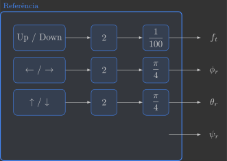
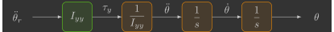
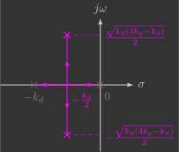

# Controlador de atitude

Nesta secção você irá implementar o controlador de atitude, que comanda os torques $\tau_x$, $\tau_y$ e $\tau_z$ a partir da diferença entre os ângulos de Euler de referência $\phi_r$, $\theta_r$ e $\psi_r$ e estimados $\phi$, $\theta$ e $\psi$.

{: width=100% style="display: block; margin: auto;" }

Para isto, será implementada uma nova função:

- `attitudeController()`

Além de uma alteração em uma função já previamente implementada:

- `reference()`

---

## Implementação

Para começar, copie e cole o arquivo `attitude_estimator.c` e renomeie ele para `attitude_controller.c`.

### Definições

#### Variáveis globais

Declare mais algumas variáveis globais, que são as referências dos ângulos de Euler que entram na função do controlador de atitude.

```c
// System references
float phi_r, theta_r, psi_r; // Euler angles reference [rad]
```

### Loop principal

Inclua no seu loop principal a chamada da função `attitudeController()` entre as funções `attitudeEstimator()` e `mixer()`.

```c hl_lines="10"
// Main application task
void appMain(void *param)
{
    // Infinite loop (runs at 200Hz)
    while (true)
    {
        reference();                  // Read reference setpoints (from Crazyflie Client)
        sensors();                    // Read raw sensor measurements
        attitudeEstimator();          // Estimate orientation (roll/pitch/yaw) from IMU sensor
        attitudeController();         // Compute desired roll/pitch/yaw torques
        mixer();                      // Convert desired force/torques into motor PWM
        actuators();                  // Send commands to motors
        vTaskDelay(pdMS_TO_TICKS(5)); // Loop delay (5 ms)
    }
}
```

### Funções

#### Referência

Os ângulos de Euler de referência $\phi_r$ e $\theta_r$ serão comandados pelo Command Based Flight Control do Crazyflie Client.

{: width=100% style="display: block; margin: auto;" }

Conforme vimos anteriormente: 

- Os botões ++"Up"++ e ++"Down"++ alteram a variável `setpoint.position.z` em incrementos de $0,5$
- Os botões ++"←"++ e ++"→"++ alteram a variável `setpoint.position.y` em incrementos de $0,5$
- Os botões ++"↑"++ e ++"↓"++ alteram a variável `setpoint.position.x` em incrementos de $0,5$

Vamos continuar utilizando os botões `Up` / `Down` para comandar a força total $f_t$ em incrementos de $0,01\,N$, mas agora os botões `↑` / `↓` e `←` / `→` vão comandar, respectivamente, os ângulos de Euler de referência $\theta_r$ e $\phi_r$ em incrementos de $\frac{\pi}{4} \text{rad}$ ($45^{\circ}$). Para tal, precisamos ajustar as escalas da seguinte forma:

{: width=60% style="display: block; margin: auto;" }

Abaixo temos um exemplo de função `reference()` que faz isso:

```c
// Get reference setpoints from commander module
void reference()
{
    // Declare variables that store the most recent setpoint and state from commander
    static setpoint_t setpoint;
    static state_t state;

    // Retrieve the current commanded setpoints and state from commander module
    commanderGetSetpoint(&setpoint, &state);

    // Extract position references from the received setpoint
    ft =  (setpoint.position.z * 2.0f) / 100.0f;      // Thrust force command [N] (maps 0.5m -> 0.01N)
    phi_r = (setpoint.position.y * 2.0f) * pi/4.0f;   // Roll reference command [rad] (maps 0.5m -> pi/4 rad)
    theta_r = (setpoint.position.y * 2.0f) * pi/4.0f; // Pitch reference command [rad] (maps 0.5m -> pi/4 rad)
    psi_r = 0.0f;                                     // Yaw reference command [rad]
}
```

#### Controlador de atitude

A função `attitudeController()` é quem comanda os torques a partir da diferença entre os ângulos de Euler de referência e estimados.

```c
// Compute desired torques
void attitudeController()
{ 
}
```

Para projetar um controlador, precisamos de um modelo da planta que será controlada. Já [vimos](../../../modeling/3d_model.md) que a dinâmica linearizada de um quadricóptero pode ser representada pelo diagrama de blocos abaixo:
    
{: width=100% style="display: block; margin: auto;" }

Como a dinâmica de atitude de cada ângulo está desacoplada, é possível controlar cada um deles individualmente. Toda a técnica de controle explorada aqui será realizada para o ângulo de inclinação $\theta$, e a mesma será replicada depois para os ângulos de rolagem $\phi$ e guinagem $\psi$.
    
A dinâmica de inclinação pode ser representada pelo diagrama de blocos abaixo:

{: width=55% style="display: block; margin: auto;" }

Podemos cancelar o momento de inércia da planta de modo que a variável de controle seja a aceleração angular, conforme abaixo:

{: width=67.5% style="display: block; margin: auto;" }

Isso reduz o sistema a ser controlado a um integrador duplo. Vamos detalhar três possíveis controladores para um sistema como esse, ficando a seu critério qual utilizar:

- Controlador proporcional derivativo (PD)
- Controlador proporcional em cascata (P-P)
- Regulador quadrático linear (LQR)

=== "PD"

    O controlador proporcional derivativo (PD) combina ações proporcional e derivativa para reagir tanto ao erro quanto à sua variação, oferecendo boa resposta e bom amortecimento. É simples de implementar e eficaz para o integrador duplo, mas sua sensibilidade ao ruído na derivada pode limitar o desempenho.

    {: width=100% style="display: block; margin: auto;" }

    ??? question "Definição dos ganhos $k_p$ e $k_d$"

        O diagrama de blocos acima pode ser representado por uma função de transferência do controlador $C(s)$ e outra da planta $G(s)$:

        {: width=95% style="display: block; margin: auto;" }

        ??? info "a) Escreva as funções de transferência do controlador $C(s)$ e da planta $G(s)"
            $$
            C(s) = I_{yy} \left( k_p + k_d s \right)
            \qquad \qquad
            G(s) = \dfrac{1}{I_{yy}s^2}
            $$

        ??? info "b) Determine a função de transferência em malha fechada $T(s)$"
            $$
            \begin{align}
                T(s) &= \dfrac{G(s)C(s)}{1+G(s)C(s)} \\
                T(s) &= \dfrac{\frac{1}{\cancel{I_{yy}}s^2} \cancel{I_{yy}} \left( k_p + k_d s \right)}{1+ \frac{1}{\cancel{I_{yy}}s^2} \cancel{I_{yy}} \left( k_p + k_d s \right)} \\ 
                T(s) &= \dfrac{\frac{k_p + k_d s}{s^2}}{\frac{s^2}{s^2}+\frac{k_p + k_d s}{s^2}} \\  
                T(s) &= \dfrac{\frac{k_p + k_d s}{\cancel{s^2}}}{\frac{s^2 + k_p + k_d s}{\cancel{s^2}}} \\    
                T(s) &= \dfrac{k_d s + k_p}{s^2 + k_d s + k_p}
            \end{align}
            $$

        ??? info "c) Escreva os ganhos $k_p$ e $k_d$ em função da frequência natural $\omega_n$ e do fator de amortecimento $\zeta$ do sistema em malha fechada"
            $$
            T(s) = k \frac{\omega_n^2}{s^2 + 2 \zeta \omega_n s + \omega_n^2}
            \quad \longrightarrow \quad
            \left\{
            \begin{array}{l}
                    k_p = \omega_n^2 \\
                    k_d = 2 \zeta \omega_n 
            \end{array}
            \right.
            $$

        ??? info "d) Calcule os ganhos $k_p$ e $k_d$ para que a dinâmica de atitude do quadricóptero tenha um tempo de acomodação de $0,3s$ e uma ultrapassagem percentual de $0,5\%$"
            $$
            \begin{align}
                \zeta &= \dfrac{|\ln(OS)|}{\sqrt{\ln^2(OS)+\pi^2}} \\
                \zeta &= \dfrac{|\ln(0,005)|}{\sqrt{\ln^2(0,005)+\pi^2}} \\
                \zeta &= 0,86
            \end{align} 
            $$

            $$
            \begin{align}
                k_p &= \omega_n^2 \\
                k_p &= 15,50^2 \\
                k_p &= 240,28
            \end{align}
            $$

            $$
            \begin{align}
                \omega_n &= \dfrac{4}{\zeta T_s} \\
                \omega_n &= \dfrac{4}{0,86 \cdot 0,3} \\
                \omega_n &= 15,50 \text{rad/s}
            \end{align} 
            $$

            $$
            \begin{align}
                k_d &= 2 \zeta \omega_n \\
                k_d &= 2 \cdot 0,86 \cdot 15,50 \\
                k_d &= 26,67
            \end{align}
            $$

        O controlador proporcional derivativo insere um zero no sistema, assim um dos polos da origem vai até o zero e o outro até menos infinito, conforme o diagrama de lugar das raízes abaixo:

        {: width=40% style="display: block; margin: auto;" }  

    Olhando o controlador isoladamente, temos o seguinte diagrama de blocos:

    {: width=65% style="display: block; margin: auto;" }

    Que se traduz nas equações abaixo:

    $$
    \left\{
    \begin{array}{l}
        \theta_e = {\color{var(--c3)}\theta_r} -{\color{var(--c1)}\theta} \\
        {\color{var(--c2)}\tau_y} = I_{yy} \left( k_p \theta_e + k_d \dfrac{d \theta_e}{dt} \right) \\
    \end{array}
    \right.
    $$

    Inclua na função `attitudeController()` duas variáveis locais $k_p$ e $k_d$, que correspondem aos ganhos do controlador, e, em seguida, calcule o torque comandado ${\color{var(--c2)}\tau_y}$(1).
    {.annotate}

    1. O termo derivativo $z_d = \dfrac{d \theta_e}{dt}$ pode ser calculado com uma variável auxiliar conforme exemplo abaixo.

    ```c hl_lines="5 6 9 17"
    // Compute desired torques
    void attitudeController()
    {
        // Controller parameters (settling time of 0.3s and overshoot of 0,05%)
        static const float kp = 
        static const float kd = 

        // Compute angle error
        float theta_e = 

        // Calculate derivative term with auxiliary variable of previous error (static to retain value amoung function calls)
        static float theta_e_prev;
        theta_d = (theta_e-theta_e_prev)/dt;
        theta_e_prev = theta_e;
        
        // Compute desired torque
        ty = 
    }
    ```

=== "P-P"

    O controlador proporcional em cascata (P-P) utiliza duas malhas hierárquicas — uma interna e outra externa — o que melhora a estabilidade e o tempo de resposta. É intuitivo e robusto, mas requer ajuste cuidadoso entre as duas malhas para evitar oscilações.

    {: width=100% style="display: block; margin: auto;" }

    ??? question "Definição dos ganhos $k_p$ e $k_d$"

        O diagrama de blocos acima pode ser representado por duas funções de transferência do controlador $C_1(s)$ e $C_2(s)$ e outras duas da planta $G_1(s)$ e $G_2(s)$:

        {: width=95% style="display: block; margin: auto;" }

        ??? info "a) Escreva as funções de transferência do controlador $C_1(s)$ e $C_2(s)$ e da planta $G_1(s)$ e $G_2(s)$"
            $$                       
            C_1(s) = I_{yy} k_d
            \qquad \qquad
            C_2(s) = k_p
            \qquad \qquad
            G_1(s) = \dfrac{1}{I_{yy}s}
            \qquad \qquad
            G_2(s) = \dfrac{1}{s}
            $$

        ??? info "b) Determine a função de transferência em malha fechada $T_1(s)$"
            $$
            \begin{align}
                T_1(s) &= \dfrac{G_1(s)C_1(s)}{1+G_1(s)C_1(s)} \\
                T_1(s) &= \dfrac{\frac{1}{\cancel{I_{yy}}s} \cancel{I_{yy}}k_d }{1+\frac{1}{\cancel{I_{yy}}s} \cancel{I_{yy}}k_d} \\ 
                T_1(s) &= \dfrac{\frac{k_d}{s}}{\frac{s}{s}+\frac{k_d}{s}} \\ 
                T_1(s) &= \dfrac{\frac{k_d}{\cancel{s}}}{\frac{s + k_d}{\cancel{s}}} \\ 
                T_1(s) &= \dfrac{k_d}{s + k_d}
            \end{align}
            $$

        ??? info "c) Determine a função de transferência em malha fechada $T_2(s)$"
            $$
            \begin{align}
                T_2(s) &= \dfrac{G_2(s)T_1(s)C_2(s)}{1+G_2(s)T_1(s)C_2(s)} \\
                T_2(s) &= \dfrac{\frac{1}{s}\frac{k_d}{s + k_d}k_p}{1+\frac{1}{s}\frac{k_d}{s + k_d}k_p} \\ 
                T_2(s) &= \dfrac{\frac{k_d k_p}{s^2 + k_ds}}{\frac{s^2 + k_ds}{s^2 + k_ds}+\frac{k_d k_p}{s^2 + k_ds}} \\ 
                T_2(s) &= \dfrac{\frac{k_d k_p}{\cancel{s^2 + k_ds}}}{\frac{s^2 + k_ds + k_d k_p}{\cancel{s^2 + k_ds}}} \\ 
                T_2(s) &= \dfrac{k_d k_p}{s^2 + k_d s + k_d k_p}
            \end{align}
            $$

        ??? info "d) Escreva os ganhos $k_p$ e $k_d$ em função da frequência natural $\omega_n$ e do fator de amortecimento $\zeta$ do sistema em malha fechada"
            $$
            T(s) = k \frac{\omega_n^2}{s^2 + 2 \zeta \omega_n s + \omega_n^2}
            \quad \longrightarrow \quad
            \left\{
            \begin{array}{l}
                    k_p = \dfrac{\omega_n}{2\zeta} \\
                    k_d = 2 \zeta \omega_n 
            \end{array}
            \right.
            $$

        ??? info "e) Calcule os ganhos $k_p$ e $k_d$ para que a dinâmica de atitude do quadricóptero tenha um tempo de acomodação de $0,3s$ e uma ultrapassagem percentual de $0,5\%$"
            $$
            \begin{align}
                \zeta &= \dfrac{|\ln(OS)|}{\sqrt{\ln^2(OS)+\pi^2}} \\
                \zeta &= \dfrac{|\ln(0,005)|}{\sqrt{\ln^2(0,005)+\pi^2}} \\
                \zeta &= 0,86
            \end{align} 
            $$

            $$
            \begin{align}
                k_p &= \frac{\omega_n}{2\zeta} \\
                k_p &= \frac{15,50}{2\cdot0,86} \\
                k_p &= 9,01
            \end{align}
            $$

            $$
            \begin{align}
                \omega_n &= \dfrac{4}{\zeta T_s} \\
                \omega_n &= \dfrac{4}{0,86 \cdot 0,3} \\
                \omega_n &= 15,50 \text{rad/s}
            \end{align} 
            $$

            $$
            \begin{align}
                k_d &= 2 \zeta \omega_n \\
                k_d &= 2 \cdot 0,86 \cdot 15,50 \\
                k_d &= 26,67
            \end{align}
            $$

        O ganho $k_d$ determina a localização do polo da malha de controle interna:

        {: width=32% style="display: block; margin: auto;" }
        
        Já o ganho $k_p$ determina a localização dos polos da malha de controle externa:

        {: width=40% style="display: block; margin: auto;" }

        Caso o ganho $k_d$ seja suficientemente maior ($>5\times$) que o ganho $k_p$ , o polo em $-k_d$ é desprezível e a malha de controle externa se comporta como um sistema de 1ª ordem cuja constante de tempo é dada apenas pelo polo em $-k_p$:

        {: width=45% style="display: block; margin: auto;" }

        A ideia de um controlador em cascata é projetar malhas de controle sucessivamente mais lentas de modo que as malhas internas possam ser aproximadas a um ganho unitário constante. No entanto, é preciso tomar cuidado. Se o ganho da malha de controle interna for muito alto, isso pode gerar saturação dos atuadores.

        ??? info "f) Calcule os ganhos $k_p$ e $k_d$ para que o a dinâmica de atitude do quadricóptero tenha um tempo de acomodação de $0,3s$ e que o polo mais rápido seja desprezível"

            $$
            \begin{align}
                \tau &= \dfrac{T_s}{4} \\
                \tau &= \dfrac{0,3}{4} \\
                \tau &= 0,075
            \end{align}
            $$

            $$
            \begin{align}
                k_p &= \dfrac{1}{\tau} \\
                k_p &= \dfrac{1}{0,075} \\
                k_p &= 13,33
            \end{align}
            $$

            $$
            \begin{align}
                k_d &= 5 k_p \\
                k_d &= 5 \cdot 13,33 \\
                k_d &= 66,65
            \end{align} 
            $$

    Olhando o controlador isoladamente, temos o seguinte diagrama de blocos:

    {: width=65% style="display: block; margin: auto;" }

    Que se traduz na equação abaixo(1):
    {.annotate}

    1. No sistema linearizado temos que ${\color{var(--c1)}\dot{\theta}} = {\color{var(--c1)}\omega_y}$

    $$
    {\color{var(--c2)}\tau_y} = I_{yy} \left( k_d \left( k_p \left( {\color{var(--c3)}\theta_r} - {\color{var(--c1)}\theta} \right)  - {\color{var(--c1)}\omega_y} \right)  \right) 
    $$

    Inclua na função `attitudeController()` duas variáveis locais $k_p$ e $k_d$, que correspondem aos ganhos do controlador, e, em seguida, calcule o torque comandado ${\color{var(--c2)}\tau_y}$.

    ```c hl_lines="5 6 9"
    // Compute desired torques
    void attitudeController()
    {
        // Controller parameters (settling time of 0.3s and overshoot of 0,05%)
        static const float kp = 
        static const float kd = 

        // Compute desired torque
        ty = 
    }
    ```

=== "LQR"

    O regulador quadrático linear (LQR) realimenta todas as variáveis do sistema e permite posicionar os polos em locais desejados do plano complexo, atendendo diretamente aos requisitos dinâmicos de desempenho. É o mais simples e preciso dos três em termos de sintonia e resposta, mas exige domínio do formalismo de espaço de estados.


    {: width=100% style="display: block; margin: auto;" }

    ??? question "Definição dos ganhos $k_p$ e $k_d$"

        A dinâmica de atitude pode ser representada pelo seguinte sistema de equações diferenciais:

        $$
        \left\{
        \begin{array}{l}
            \begin{bmatrix}
            \dot{\theta} \\
            \ddot{\theta}
            \end{bmatrix}
            =
            \begin{bmatrix}
                0 & 1 \\
                0 & 0 
            \end{bmatrix}
            \begin{bmatrix}
                \theta \\
                \dot{\theta}
            \end{bmatrix}
            +
            \begin{bmatrix}
                0 \\
                \frac{1}{I_{yy}}
            \end{bmatrix}
            \tau_{\theta} \\ \\
            \theta = 
            \begin{bmatrix}
                1 & 0
            \end{bmatrix}
            \begin{bmatrix}
                \theta \\
                \dot{\theta}
            \end{bmatrix}
        \end{array}
        \right.
        $$

        Ou através da representação no espaço dos estados:
        
        {: width=90% style="display: block; margin: auto;" }
    
        Onde: 
        
        $$
        u = \tau_{\theta}
        \qquad
        x = 
        \begin{bmatrix}
            \theta \\
            \dot{\theta}
        \end{bmatrix}
        \qquad
        y = \theta
        \qquad
        A = 
        \begin{bmatrix}
            0 & 1 \\
            0 & 0 
        \end{bmatrix}
        \qquad
        B = 
        \begin{bmatrix}
            0 \\
            \frac{1}{I_{yy}}
        \end{bmatrix}
        \qquad
        C = 
        \begin{bmatrix}
            1 & 0 
        \end{bmatrix}
        $$

        Um regulador de estados consiste em realimentar todos os estados do sistema simultaneamente ao invés de apenas a saída(1), conforme o diagrama de blocos abaixo:
        {.annotate}

        1. Para fazer uma analogia entre controle por realimentação do estados (controle moderno) e controle por realimentação da saída (controle clássico), vamos considerar um médico tratando um doente com febre alta:
        
            - Se o médico tratar o doente segundo os conceitos de controle clássico, ele vai medir a temperatura do paciente e vai dar um remédio para abaixar a febre quando ela estiver alta e não fazer nada quando a febre estiver baixa.
            - Se o médico tratar o doente segundo os conceitos de controle moderno, ele vai examinar o paciente, identificar a causa da febre e dar um remédio para a doença e não para a febre (ou seja, o médico vai tratar a doença eliminando a causa da febre e não somente o sintoma da doença).

            O grande problema do controle por realimentação dos estados é exigir que os estados do sistema estejam disponíveis para serem realimentados, ou seja, é necessário medir todos os estados do sistema ou pelo menos estimá-los.

        {: width=90% style="display: block; margin: auto;" }

        Onde:

        $$
        x_r = 
        \begin{bmatrix}
            \theta_r \\
            \dot{\theta}_r
        \end{bmatrix}
        \qquad
        K = I_{yy}
        \begin{bmatrix}
            k_p & k_d 
        \end{bmatrix}
        $$

        Como estamos aplicando um realimentação de estados do tipo:

        $$
            u = K \left( x_r - x \right)
        $$

        A dinâmica em malha fechada fica:

        $$
        \begin{align}
            \dot{x} &= Ax + Bu \\
            \dot{x} &= Ax + BK(x_r - x) \\
            \dot{x} &= \underbrace{(A-BK)}_{A_{mf}}x + \underbrace{BK}_{B_{mf}}x_r
        \end{align}
        $$
            
        ??? info "a) Determine a matriz de transmissão dos estados em malha fechada $A_{mf}$"
            $$
            \begin{align}
                A_{mf} &= A - BK \\
                A_{mf} &= 
                \begin{bmatrix}
                    0 & 1 \\
                    0 & 0 
                \end{bmatrix}
                - 
                \begin{bmatrix}
                    0 \\
                    \frac{1}{\cancel{I_{yy}}}
                \end{bmatrix}
                \cancel{I_{yy}}
                \begin{bmatrix}
                    k_p & k_d
                \end{bmatrix} \\
                A_{mf} &= 
                \begin{bmatrix}
                    0 & 1 \\
                    0 & 0 
                \end{bmatrix}
                - 
                \begin{bmatrix}
                    0 & 0 \\
                    k_p & k_d 
                \end{bmatrix} \\
                A_{mf} &= 
                \begin{bmatrix}
                    0 & 1 \\
                    -k_p & -k_d 
                \end{bmatrix}
            \end{align} 
            $$

        ??? info "b) Determine o polinômio característica do sistema em malha fechada $p(s) = \det \left( sI - A_{mf} \right)$"
            $$
            \begin{align}
                p(s) &= \det \left( sI - A_{mf} \right) \\
                p(s) &=  \det \left( s
                \begin{bmatrix}
                    1 & 0 \\
                    0 & 1 
                \end{bmatrix}
                - 
                \begin{bmatrix}
                    0 & 1 \\
                    -k_p & -k_d 
                \end{bmatrix}
                \right) \\
                p(s) &=  \det
                \begin{bmatrix}
                    s & -1 \\
                    k_p & s+k_d 
                \end{bmatrix} \\
                p(s) &=  s \left( s + K_k \right) - k_p \left( -1 \right) \\
                p(s) &= s^2 + k_d s + k_p 
            \end{align} 
            $$

        ??? info "c) Escreva os ganhos $k_p$ e $k_d$ em função da frequência natural $\omega_n$ e do fator de amortecimento $\zeta$ do sistema em malha fechada"
            $$
            p(s) = s^2 + 2 \zeta \omega_n s + \omega_n^2 
            \quad \longrightarrow \quad
            \left\{
            \begin{array}{l}
                    k_p = \omega_n^2 \\
                    k_d = 2 \zeta \omega_n 
            \end{array}
            \right.
            $$

        ??? info "d) Calcule os ganhos $k_p$ e $k_d$ para que a dinâmica de atitude do quadricóptero tenha um tempo de acomodação de $0,3s$ e uma ultrapassagem percentual de $0,5\%$"
            $$
            \begin{align}
                \zeta &= \dfrac{|\ln(OS)|}{\sqrt{\ln^2(OS)+\pi^2}} \\
                \zeta &= \dfrac{|\ln(0,005)|}{\sqrt{\ln^2(0,005)+\pi^2}} \\
                \zeta &= 0,86
            \end{align} 
            $$

            $$
            \begin{align}
                k_p &= \omega_n^2 \\
                k_p &= 15,50^2 \\
                k_p &= 240,28
            \end{align}
            $$

            $$
            \begin{align}
                \omega_n &= \dfrac{4}{\zeta T_s} \\
                \omega_n &= \dfrac{4}{0,86 \cdot 0,3} \\
                \omega_n &= 15,50 \text{rad/s}
            \end{align} 
            $$

            $$
            \begin{align}
                k_d &= 2 \zeta \omega_n \\
                k_d &= 2 \cdot 0,86 \cdot 15,50 \\
                k_d &= 26,67
            \end{align}
            $$
            
    Olhando o controlador isoladamente, temos o seguinte diagrama de blocos:

    {: width=65% style="display: block; margin: auto;" }

    Que se traduz na equação abaixo(1):
    {.annotate}

    1. No sistema linearizado temos que ${\color{var(--c1)}\dot{\theta}} = {\color{var(--c1)}\omega_y}$. Além disso, como o objetivo é deixar o quadricóptero estacionário, a velocidade angular de referência ${\color{var(--c3)}\dot{\theta}_r}$ pode ser assumida como sendo zero, o que reduz o segundo termo:

        $$
        k_d \left( \cancelto{0}{{\color{var(--c3)}\dot{\theta}_r}} - {\color{var(--c1)}\dot{\theta}} \right) = - k_d  {\color{var(--c1)}\omega_y}
        $$

    $$
    {\color{var(--c2)}\tau_y} = I_{yy} \left( k_p \left( {\color{var(--c3)}\theta_r} - {\color{var(--c1)}\theta} \right) - k_d  {\color{var(--c1)}\omega_y} \right) 
    $$

    Inclua na função `attitudeController()` duas variáveis locais $k_p$ e $k_d$, que correspondem aos ganhos do controlador, e, em seguida, calcule o torque comandado ${\color{var(--c2)}\tau_y}$.

    ```c hl_lines="5 6 9"
    // Compute desired torques
    void attitudeController()
    {
        // Controller parameters (settling time of 0.3s and overshoot of 0,05%)
        static const float kp = 
        static const float kd = 

        // Compute desired torque
        ty = 
    }
    ```  

Note que, ao invés de realimentar os ângulos e velocidades angulares reais, você está realimentando os ângulos e velocidades angulares estimados. Ou seja, você está supondo que o estimador de atitude desenvolvido [anteriormente](../estimator/attitude_estimator.md) é perfeito. Isso é chamado de "observed-based control" e é um método muito típico para estruturar sistemas de controle.      

---

## Validação

Para validar o seu controlador você irá realizar dois experimentos. Em ambos os experimentos você deve colocar um pequeno valor de força de empuxo $f_t$.

### Controle de um grau de liberdade

O primeiro experimento consiste em controlar o drone em apenas um grau de liberdade. Você irá utilizar um dispositivo criado especificamente para isso, que restringe todos os graus de liberdade do drone deixando apenas o ângulo de inclinação $\theta$ livre.

{: width=60% style="display: block; margin: auto;" }

Para testar o controlador você pode aplicar distúrbios no quadricóptero (dando um "tapinha" na parta inferior de seus motores) e verificar se o mesmo retorna ao ângulo de referência $\theta_r=0^{\circ}$. Você pode também alterar o ângulo de referência para, por exemplo, $\theta_r=45^{\circ}$, através do Crazyflie Client, e ver se o quadricoptero se inclina sozinho.

### Controle de três graus de liberdade

O outro experimento consiste em controlar o drone em três graus de liberdade. No entanto, como os módulos dos controladores vertical e horizontal ainda não foram implementados, você irá realizar isso através de uma queda livre controlada. 
        
Altere a função `attitudeController()` de modo que ela comande não só o torque $\tau_y$ como também os torques $\tau_x$ e $\tau_z$(1).
{.annotate}

1. Por conta da simetria do drone, você deve utilizar os mesmos ganhos $k_p$ e $k_d$ para o ângulo de rolagem $\phi$ e inclinação $\theta$. No entanto, para o ângulo de guinagem $\psi$, recomenda-se utilizar um ganho $k_p$ 4x menor e um ganho $k_d$ 2x menor, que corresponde à mesma ultrapassagem percentual de $0,5\%$ mas a um tempo de acomodação 2x maior ($0,3s \rightarrow 0,6s$). 

```c hl_lines="9 11"
// Compute desired torques
void attitudeController()
{
    // Controller parameters (settling time of 0.3s and overshoot of 0,05%)
    static const float kp = 
    static const float kd = 

    // Compute desired torques
    tx = 
    ty = 
    tz = 
}
```  

Segure o quadricóptero a uma distância de aproximadamente $50\text{cm}$ do chão e, assim que os motores começarem a girar, solte ele. Ele deverá cair devagar (comparado a uma queda livre) e sem rotacionar em torno de nenhum eixo.

