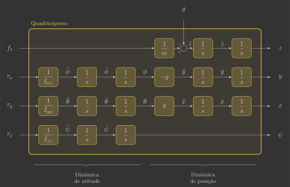

# Controlador vertical

Nesta secção você irá implementar o controlador vertical, que comanda a força de empuxo ${\color{var(--c2)}f_t}$ a partir da diferença entre a posição vertical de referência ${\color{var(--c3)}z_r}$ e estimada ${\color{var(--c1)}z}$.

{: width=100% style="display: block; margin: auto;" }

Para isto, será implementada uma nova função:

- `verticalController()`

Além de uma alteração em uma função já previamente implementada:

- `reference()`

---

## Implementação

Para começar, copie e cole o arquivo `vertical_estimator.c` e renomeie ele para `vertical_controller.c`.

### Definições

#### Variáveis globais

Declare mais uma variável global, que corresponde à posição vertical de referência ${\color{var(--c3)}z_r}$.

```c hl_lines="21"
// Actuators
float pwm1, pwm2, pwm3, pwm4; // Motors PWM

// Sensors
float ax, ay, az;             // Accelerometer [m/s^2]
float gx, gy, gz;             // Gyroscope [rad/s]
float d;                      // Range [m]

// System inputs
float ft;                    // Thrust force [N]
float tx, ty, tz;            // Roll, pitch and yaw torques [N.m]

// System states
float phi, theta, psi;       // Euler angles [rad]
float wx, wy, wz;            // Angular velocities [rad/s]
float z;                     // Vertical position [m]
float vz;                    // Vertical velocity [m/s]

// System references
float phi_r, theta_r, psi_r; // Euler angles reference [rad]
float z_r                    // Vertical position reference [m]
```

### Loop principal

Inclua a chamada da função `verticalController()` no loop principal.

```c hl_lines="11"
// Main application task
void appMain(void *param)
{
    // Infinite loop (runs at 200Hz)
    while (true)
    {
        reference();                  // Read reference setpoints (from Crazyflie Client)
        sensors();                    // Read raw sensor measurements
        attitudeEstimator();          // Estimate orientation (roll/pitch/yaw) from IMU sensor
        verticalEstimator();          // Estimate vertical position/velocity from range sensor
        verticalController();         // Compute desired thrust force
        attitudeController();         // Compute desired roll/pitch/yaw torques
        mixer();                      // Convert desired force/torques into motor PWM
        actuators();                  // Send commands to motors
        vTaskDelay(pdMS_TO_TICKS(5)); // Loop delay (5 ms)
    }
}
```

### Funções

#### Referência

A posição vertical de referência ${\color{var(--c3)}z_r}$ será comandada pelo Command Based Flight Control do Crazyflie Client utilizando os botões ++"Up"++ e ++"Down"++.

{: width=60% style="display: block; margin: auto;" }

Modifique a função `reference()` para que a posição vertical de referência ${\color{var(--c3)}z_r}$ seja definida pela variável `setpoint.position.z`.

```c hl_lines="12"
// Get reference setpoints from commander module
void reference()
{
    // Declare variables that store the most recent setpoint and state from commander
    static setpoint_t setpoint;
    static state_t state;

    // Retrieve the current commanded setpoints and state from commander module
    commanderGetSetpoint(&setpoint, &state);

    // Extract position references from the received setpoint
    z_r = setpoint.position.z;                        // Z position reference [m]
    phi_r = (setpoint.position.y * 2.0f) * pi/4.0f;   // Roll reference command [rad] (maps 0.5m -> pi/4 rad)
    theta_r = (setpoint.position.y * 2.0f) * pi/4.0f; // Pitch reference command [rad] (maps 0.5m -> pi/4 rad)
    psi_r = 0.0f;                                     // Yaw reference command [rad]
}
```

#### Controlador vertical

A função `verticalController()` é quem comanda a força de empuxo ${\color{var(--c2)}f_t}$ a partir da diferença entre a posição vertical de referência ${\color{var(--c3)}z_r}$ e estimada ${\color{var(--c1)}z}$.

```c
// Compute desired thrust force
void verticalController()
{ 
}
```

Já [vimos](../../../modeling/3d_model.md) que a dinâmica linearizada de um quadricóptero pode ser representada pelo diagrama de blocos abaixo:
    
{: width=100% style="display: block; margin: auto;" }
    
A dinâmica de posição vertical é descrita pela seguinte parte:

{: width=65% style="display: block; margin: auto;" }

Podemos cancelar a massa e a aceleração da gravidade de modo que a variável de controle seja a aceleração vertical:

{: width=85% style="display: block; margin: auto;" }

Isso reduz o sistema a ser controlado a um integrador duplo, exatamente como fizemos com o controlador de atitude. No entanto, agora temos um problema adicional: como estamos somando o termo da aceleração da gravidade (diferentemente da massa que está sendo multiplicada), caso ele seja um pouco diferente do real, não acontecerá um cancelamento exato e o sistema possuirá erro em regime permanente. Para resolver esse problema, podemos incluir um integrador no controlador.

=== "PID"

    O controlador proporcional integral derivativo (PID) adiciona à estrutura proporcional derivativo um termo integral que acumula o erro ao longo do tempo, eliminando o erro estacionário. A ação proporcional e derivativa garantem resposta rápida e amortecida, enquanto a integral corrige desvios persistentes. É versátil e eficaz para o integrador duplo, mas o termo integral exige cuidado para evitar oscilações de baixa frequência (windup) e lentidão na resposta.

    {: width=100% style="display: block; margin: auto;" }

    Olhando o controlador isoladamente, temos o seguinte diagrama de blocos:

    {: width=65% style="display: block; margin: auto;" }

    Que se traduz nas equações abaixo:

    $$
    \left\{
    \begin{array}{l}
        z_e = {\color{var(--c3)}z_r} - {\color{var(--c1)}z} \\
        {\color{var(--c2)}f_t} = m \left( g + \left( k_p z_e + k_d \dfrac{d z_e}{dt}  + k_i \displaystyle\int z_e dt \right) \right)
    \end{array}
    \right.
    $$


    Inclua na função `attitudeController()` duas variáveis locais $k_p$ e $k_d$, que correspondem aos ganhos do controlador, e, em seguida, calcule o torque comandado ${\color{var(--c2)}f_t}$ seguindo as equações acima.

    ```c hl_lines="5 6 12-15 21"
    // Compute desired torques
    void attitudeController()
    {
        // Controller parameters (settling time of 0.3s and overshoot of 0,05%)
        static const float kp = 
        static const float kd = 

        // Last error (static to retain value amoung function calls)
        static float theta_e_last;

        // Compute angular aceleration reference
        float theta_e = 
        float theta_dot_e =
        float theta_ddot_r =
        float tau_x =
        
        // Update last error for next call
        theta_e_last = theta_e;

        // Compute desired torque
        ty = 
    }
    ```

=== "PI-P"

    O controlador proporcional em cascata com ação integral (PI-P) na malha externa combina uma malha interna proporcional com uma malha externa proporcional com ação integral. A malha interna garante resposta rápida e amortecida, enquanto o termo integral na malha externa elimina o erro estacionário de posição. Essa configuração equilibra desempenho e simplicidade, oferecendo boa robustez sem exigir integrações redundantes, mas requer sintonia coordenada entre as duas malhas.

    {: width=100% style="display: block; margin: auto;" }

    Olhando o controlador isoladamente, temos o seguinte diagrama de blocos:

    {: width=65% style="display: block; margin: auto;" }

    Que se traduz nas equações abaixo:

    $$
    \left\{
    \begin{array}{l}
        \dot{z}_r = k_p ( {\color{var(--c3)}z_r} - {\color{var(--c1)}z} ) \\
        \ddot{z}_r = k_d ( \dot{z}_r - {\color{var(--c1)}\dot{z}} ) \\
        {\color{var(--c2)}f_t} = m ( g + \ddot{z}_r )
    \end{array}
    \right.
    $$

    Inclua na função `attitudeController()` duas variáveis locais $k_p$ e $k_d$, que correspondem aos ganhos do controlador, e, em seguida, calcule o torque comandado ${\color{var(--c2)}f_t}$ seguindo as equações acima.

    ```c hl_lines="5 6 9 10 13"
    // Compute desired torques
    void attitudeController()
    {
        // Controller parameters (settling time of 0.3s and overshoot of 0,05%)
        static const float kp = 
        static const float kd = 

        // Compute angular aceleration reference
        float theta_dot_r = 
        float theta_ddot_r =

        // Compute desired torque
        ty = 
    }
    ```

=== "LQI"

    O regulador de estados com ação integral estende o regulador de estados tradicional adicionando uma variável que integra o erro de saída ao vetor de estados. Isso permite eliminar o erro estacionário sem perder as vantagens do controle por realimentação completa. A estrutura resultante combina desempenho dinâmico ajustável — por meio do posicionamento dos polos — com precisão em regime permanente. É uma solução elegante e sistemática, mas requer modelagem ampliada e cálculo de ganhos por métodos de espaço de estados, como o posicionamento de polos ou o LQI.

    {: width=100% style="display: block; margin: auto;" }

    Olhando o controlador isoladamente, temos o seguinte diagrama de blocos(1):
    {.annotate}

    1. No sistema linearizado temos que ${\color{var(--c3)}\dot{z}_r} = {\color{var(--c3)}v_{z_r}}$ e ${\color{var(--c1)}\dot{z}} = {\color{var(--c1)}v_z}$.

    {: width=65% style="display: block; margin: auto;" }

    Que se traduz na equação abaixo(1):
    {.annotate}

    1. Como o objetivo é deixar o quadricóptero estacionário, a velocidade angular de referência ${\color{var(--c3)}v_{z_r}}$ pode ser assumida como sendo zero, o que reduz um dos termos:

        $$
        k_d \left( \cancelto{0}{{\color{var(--c3)}v_{z_r}}} - {\color{var(--c1)}\dot{z}} \right) = - k_d  {\color{var(--c1)}v_z}
        $$

    $$
    \left\{
    \begin{array}{l}
        z_e = {\color{var(--c3)}z_r} - {\color{var(--c1)}z} \\
        {\color{var(--c2)}f_t} = m \left( g + \left( k_p z_e + k_i \displaystyle\int z_e dt - k_d {\color{var(--c1)}v_z} \right) \right)
    \end{array}
    \right.
    $$

    Inclua na função `verticalController()` três variáveis locais $k_p$, $k_d$ e $k_i$, que correspondem aos ganhos do controlador, e, em seguida, calcule a força comandada ${\color{var(--c2)}f_t}$(1).
    {.annotate}

    1. A termo integral do erro $z_{e_{int}} = \displaystyle\int z_e dt$ pode ser calculado com uma variável auxiliar conforme exemplo abaixo.

    ```c hl_lines="5-7 10 17"
    // Compute desired thrust force
    void verticalController()
    {
        // Controller parameters (settling time of 0.3s and overshoot of 0,05%)
        static const float kp = 
        static const float kd = 
        static const float ki = 

        // Compute angle error
        float z_e = 

        // Calculate integral term (static to retain value amoung function calls)
        static float z_e_int;
        z_e_int += z_e*dt;

        // Compute desired force
        ft = 
    }
    ``` 