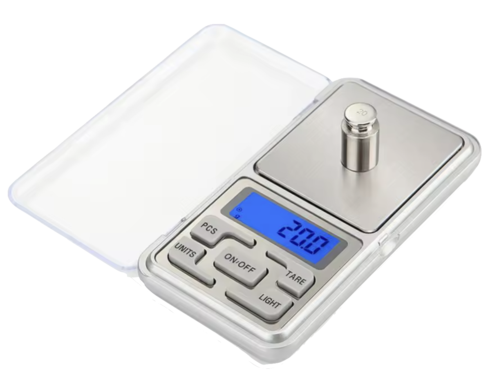

# :material-quadcopter: Hardware

This section brings together all the hardware used in the course: the Bitcraze components that form the core of the system, the test fixtures used for controlled experiments, and the measurement tools that allow you to measure and validate the drone’s physical behavior. 

The goal is to make sure you know exactly what you need and have everything ready before moving on.

---

## Bitcraze Components

[Bitcraze](https://bitcraze.io){target=_blank} offers an entire ecosystem of drones, radios and expansion decks, but for this course you only need three of them(1). These devices form the drone you will program, communicate with and fly throughout the course.
{.annotate}

1. These three components are also available as a complete bundle from Bitcraze: the [STEM Bundle – Crazyflie 2.1 Brushless](https://store.bitcraze.io/collections/bundles/products/stem-bundle-crazyflie-2-1-brushless){target=_blank}.  

### Crazyflie 2.1 Brushless

{: width="400" style="display: block; margin: auto;" }

The [Crazyflie 2.1 Brushless](https://store.bitcraze.io/products/crazyflie-2-1-brushless){target=_blank} is the core of the system: an open-source minidrone built around a printed circuit board (PCB) frame. It is compact, robust and equipped with:

- ARM Cortex-M4 processor (168 MHz)  
- BLDC motors (08028-10000KV)  
- BLDC motor controllers (5A ESCs)  
- Integrated IMU (BMI088)

Released recently, the brushless version brings significantly more power and durability compared to earlier models.

---

### Crazyradio 2.0

{: width="250" style="display: block; margin: auto;" }

The [Crazyradio 2.0](https://store.bitcraze.io/products/crazyradio-2-0){target=_blank} is the USB dongle that enables wireless communication between your computer and the drone. It allows you to:

- Upload firmware  
- Send real-time control commands  
- Receive telemetry data  

It connects directly over USB and works seamlessly with Bitcraze’s official tools.

---

### Flow Deck v2

{: width="150" style="display: block; margin: auto;" }

The [Flow Deck v2](https://store.bitcraze.io/collections/decks/products/flow-deck-v2){target=_blank} is a small expansion board mounted underneath the drone. It adds two essential sensors for autonomous flight:

- Time-of-Flight distance sensor (VL53L1X)  
- Optical-flow sensor (PMW3901)

Together, they allow the drone to measure its altitude above the ground and estimate horizontal motion relative to the floor, which is crucial for position estimation(1).
{.annotate}

1. Bitcraze also provides three absolute [positioning systems](https://www.bitcraze.io/documentation/system/positioning/){target=_blank}: the Lighthouse Positioning System, the Loco Positioning System and Motion Capture Positioning. The Flow Deck v2, however, offers relative positioning and does not rely on external infrastructure such as base stations, anchors or motion-capture cameras, which makes the entire positioning process self-contained on the drone.

---

## Test Fixtures

The test fixtures are 3D printed structures used to study the drone under controlled motion. Each one constrains specific degrees of freedom so you can isolate thrust, yaw or pitch behavior without risking the drone. All STL files are provided, and you can manufacture every fixture yourself to build the full setup at home.

### Thrust Stand

<model-viewer src="../images/thrust_stand.glb"
    disable-zoom
    camera-controls
    auto-rotate
    style="width: 100%; max-width: 600px; height: 350px; margin: auto;">
</model-viewer>

**STL files**

[ :material-download: Thrust Stand](files/thrust_stand.stl){ .md-button }

The thrust stand holds the drone firmly above a scale so the vertical force produced by the motors can be measured directly. It can be manufactured on any 3D printer, but there are also two M2 brass inserts(1) and one neodymium magnet(2) that must be purchased separately and installed.
{.annotate}

1. Outer diameter: 3.2mm / Length: 3mm
2. Diameter: 20mm / Length: 2mm

### Yaw Rotation Rig

<model-viewer src="../images/yaw_rotation_rig.glb"
    disable-zoom
    camera-controls
    auto-rotate
    style="width: 100%; max-width: 600px; height: 200px; margin: auto;">
</model-viewer>

**STL files**

[ :material-download: Yaw Rig (Base) ](files/yaw_rig_base.stl){ .md-button }
[ :material-download: Yaw Rig (Mount) ](files/yaw_rig_mount.stl){ .md-button }

The yaw rotation rig constrains every degree of freedom except rotation around its vertical axis. The base and mount can be manufactured on any 3D printer, but there are also two M2 brass inserts(1), one steel axis(2) and one bearing(3) that must be purchased separately and installed.
{.annotate}

1. Outer diameter: 3.2mm / Length: 3mm
2. Diameter: 4mm / Length: 23mm
3. Inner diameter: 4mm / Outer diameter: 10mm / Length: 4mm

### Pitch Rotation Rig

<model-viewer src="../images/pitch_rotation_rig.glb"
    disable-zoom
    camera-controls
    auto-rotate
    style="width: 100%; max-width: 600px; height: 600px; margin: auto;">
</model-viewer>

**STL files**

[ :material-download: Pitch Rig (Base) ](files/pitch_rig_base.stl){ .md-button }
[ :material-download: Pitch Rig (Mount) ](files/pitch_rig_mount.stl){ .md-button }
[ :material-download: Pitch Rig (Cap) ](files/pitch_rig_cap.stl){ .md-button }

The pitch rotation rig constrains every degree of freedom except rotation around its lateral axis. The base, mount and cap can be manufactured on any 3D printer, but there are also two M2 brass inserts(1), two steel axis(2) and two bearings(3) that must be purchased separately and installed.
{.annotate}

1. Outer diameter: 3.2mm / Length: 3mm
2. Diameter: 4mm / Length: 55mm
3. Inner diameter: 4mm / Outer diameter: 10mm / Length: 4mm

---

## Measurement Tools

The measurement tools listed here are used to capture key physical quantities during the experiments, such as motor speed and propeller thrust. Links to affordable [AliExpress](https://aliexpress.com/){target=_blank} options are provided for convenience, but any equivalent instrument that performs the same function will work just as well.

### Tachometer

{: width="300" style="display: block; margin: auto;" }

The [UAN10034](https://aliexpress.com/item/1005007466650764.html?spm=a2g0o.order_list.order_list_main.14.3db2caa4D5rDCi&gatewayAdapt=glo2bra){target=_blank} tachometer is used to measure the rotational speed of each motor. This reading is essential for identifying the thrust and drag coefficients, validating the motor model and checking whether the motor responds linearly to changes in PWM or commanded angular velocity. 

### Scale

{: width="400" style="display: block; margin: auto;" }

The [MH-500](https://aliexpress.com/item/1005009694813506.html?spm=a2g0o.productlist.main.7.3b1b70acdrgjc1&algo_pvid=99f3226a-38b7-422b-a01d-3c779e16e935&algo_exp_id=99f3226a-38b7-422b-a01d-3c779e16e935-6&pdp_ext_f=%7B%22order%22%3A%228539%22%2C%22spu_best_type%22%3A%22service%22%2C%22eval%22%3A%221%22%2C%22fromPage%22%3A%22search%22%7D&pdp_npi=6%40dis%21BRL%2138.75%2118.60%21%21%2146.43%2122.29%21%40210325a917679814995746317ea1c3%2112000049878895282%21sea%21BR%212806959985%21X%211%210%21n_tag%3A-29919%3Bd%3A3670ffc3%3Bm03_new_user%3A-29895&curPageLogUid=vDsE15HBtpoi&utparam-url=scene%3Asearch%7Cquery_from%3A%7Cx_object_id%3A1005009694813506%7C_p_origin_prod%3A){target=_blank} scale is used to measure the vertical force generated by the drone when mounted on the thrust stand. Since thrust acts directly against gravity, the scale reading provides an immediate measurement of total thrust for a given motor speed. This is the key instrument for building thrust curves. 

